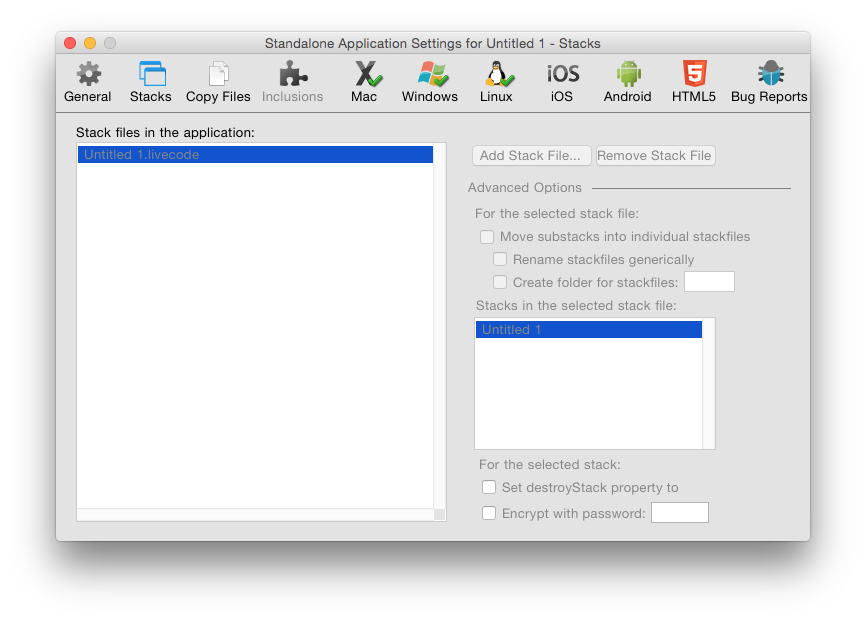
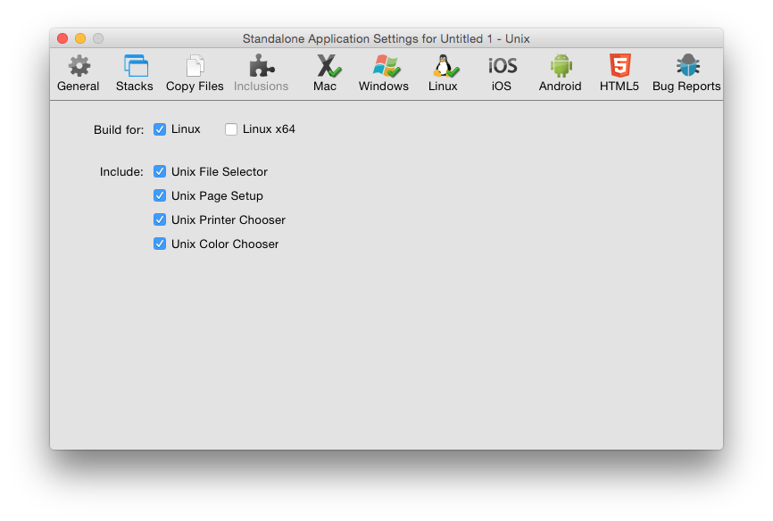

# Deploying Your Application

## Introduction

With LiveCode, it is easy to deploy your application to anyone.

Using the standalone building capability in LiveCode you can create a native 
application for each operating system you want to support. Users who do not have LiveCode 
can run these applications like any other application they download and install. 
Standalone applications can have their own identity as true applications, include
icons, document associations and more.

## Building a Standalone Application

When you have finished your LiveCode application and what to distribute it you can build 
it into a standalone application. These applications do not require users to have LiveCode.
All of LiveCode's feature set is available for use in a standalone application, with the 
exception that you cannot set scripts on objects.

The builder itself will let you build standalone applications for any platform it supports, 
from any platform it supports with the exception that iOS standalones must be
built on Mac OS X. For example you can build a Windows standalone on a Mac OS X
machine. However, you may wish to check that your application looks and behaves correctly 
on each platform you intend to support. Please note it is inherently harder to debug an 
application that has been built as a standalone, so you should test your application as 
thoroughly as possible before building it.

Related lessons:

* [Building Standalone Applications](http://lessons.livecode.com/m/4603/l/44282-building-standalone-applications)
* [How do I Develop Cross-Platform in LiveCode?](http://lessons.livecode.com/m/4069/l/28092-how-do-i-develop-cross-platform-in-livecode)

### Step by step

Deploying an app to standalone is straightforward:

1) Open your stack in the LiveCode IDE

2) Select **File → Standalone Application Settings...** from the menu bar

3) Select the settings for your app

4) Make sure that checkboxes for each platform you wish to build for are checked

5) Close the standalone settings window

6) Select **File → Save as Standalone Application...** from the menu bar

Your application will be packaged up and placed in the selected output folder.

### Standalone Applications Settings

The Standalone Applications Setting dialog allows you to create settings for your 
standalone application. This dialog can be found in the File menu. The settings you enter 
are applied to the current front most editable stack and are saved with the stack. This 
means you only need to enter the settings once for each application you create. The same 
settings will apply if you do another build in the future.

Related lessons:

* [The Standalone Application Settings](http://lessons.livecode.com/m/4603/l/685074-the-standalone-application-settings)

#### General Settings

Figure 1 – Standalone Settings – General Tab

| &nbsp;| &nbsp;|
|-------------------------|---------------------------------------------------------------------------------------------------------------------------------------------------------------------------------------------------------------------------------------------------------------------------------------------------------------------|
| **Mode Selector**       | Choose between the different standalone application settings screens.                                                                                                                                                                                                                                               |
| **Standalone Name**     | Set the name of your standalone application. This should be the name you want your finished application to have. Don’t include a file extension (.exe on Windows or .app on Mac OS X) as the standalone builder can create standalones for multiple platforms and will add the appropriate extension automatically. |
| **Inclusions Selector** | Choose the components you want to include in a standalone. You may either choose to search for required inclusions automatically, or manually select the components you want to include.                                                                                                                            |

**Search for Inclusions**

This is the default option. When selected, LiveCode will search your application stack file 
(main stack and sub stacks) to attempt to determine what components your application uses. 
It will then include those items.

**Select Inclusions for the Standalone Applications**

Select this option if you want to specify the components to include manually. You may wish 
to use this option if your application dynamically loads components that cannot be searched 
at this point automatically, or if you know exactly what components your application uses 
and wish to speed up the standalone building process by skipping the automatic search step.

It is important that you choose to include all the components that your application uses 
or it may fail. If you do not include your own custom error reporting or LiveCode’s 
standalone error reporting dialog (discussed below) such failure may be silent – i.e. an 
operation in your standalone will simply cease working without displaying anything to the 
user.                                                                                                                                                                                                                                                                                                                                                                                                                                                                                                                                                                                                                                                                                                                                                                                                                                                                                                                                                                                                                                     |

| &nbsp;| &nbsp;|
|----------------------------------------------|----------------------------------------------------------------------------------------------------------------------------------------------------------------------------------------------------------------------------------------------------|
| **Profiles Settings**                        | Choose between the Property Profile settings options. You only need to alter settings in this area if you have used Property Profiles (see the section on *Property Profiles* in Chapter 4, Builder a User Interface above)                        |
| **Remove all profiles**                      | Removes all profiles and builds the standalone using the currently active profile on each object. Select this option if you don't need to change profile in the standalone and want to save disk space by removing extraneous profile information. |
| **Set all objects to profile**               | Set all objects to a specific profile then remove the profile data from objects.                                                                                                                                                                   |
| **Include profiles and the profile library** | Include the profile library and allow switching between profiles in the standalone application. You can choose whether to include specific profiles or all profiles.                                                                               |

#### Including Additional Stacks

Figure 2 – Standalone Settings – Stacks Tab

| &nbsp;| &nbsp;|
|------------------------------------------|-----------------------------------------------------------------------------------------------------------------------------------------------------------------------------------------------------------------------------------------------------------------------------------------------------------------|
| **Stack Files**                          | Use this section to add additional stack files to your application. Any stacks you add to this section will be added to the `stackFiles`property of the main stack of your standalone. This means that any scripts within your standalone application will be able to locate and reference these stacks by name. |
| **Advanced Options**                     | Use this section to control exactly how multiple stack files are managed in your standalone.                                                                                                                                                                                                                    |
| **Move substacks into individual files** | If you select this option, each of the sub stacks in the stack files you select will be moved into their own individual file, located in the data folder or within the application bundle of your standalone.                                                                                                   |
| **Rename stackfiles generically**        | Renames each sub stack file using a number on disk (instead of using the name of the sub stack). Select this option if you do not want the names you have selected for stacks to be visible to the end user in the filing system.                                                                               |
| **Create folder for stackfiles**         | Creates a folder and places the stack files into that folder, instead of storing them at the same level as the standalone executable. All references in the `stackFiles`property will refer to this folder using a relative path so the stacks can still be located by the standalone application.               |
| **Individual stack options**             | Select a stack file on the left then an individual stack from within the file to set options on that stack.                                                                                                                                                                                                     |
| **Set destroyStack to true**             | Set this option if you want the selected stack file to be removed from memory when it is closed. This option is useful if you are loading large stacks into memory and want them to be removed when they are closed.                                                                                            |
| **Encrypt with password**                | Secures the scripts within the selected stack file with a password. This provides a basic level of encryption that prevents someone from casually reading the scripts in the stack by opening the file in a binary file viewer.                                                                                 |

> **Note:** A stack file directly attached to a standalone application cannot have changes
saved to it. This stack is bound directly to the executable file that runs. The OS locks 
an executable file while it is running. If you want to save changes in your standalone 
application, split your stack up until multiple files. A common technique is to create a 
"splash screen" stack that contains a welcome screen and then loads the stacks that make 
up the rest of your application. These stacks are referenced as `stackFiles`on this pane 
in the standalone settings screen. It is thus possible to automatically update these 
component stacks, or to save changes to them. You may also want to consider creating 
preference files in the appropriate location on your end user's system (see the 
`specialFolderPath`function and query/setRegistry functions for more information).

> **Note:** Adding additional stacks to the stacks tab is not supported for iOS,
Android or HTML5 standalones. Additional stacks may be included via the Copy
Files tab.

#### Including Additional Files

Figure 3 – Standalone Settings – Copy Files

| &nbsp;| &nbsp;|
|----------------------------------------|------------------------------------------------------------------------------------------------------------------------------------------------------------------------------------------------------------------------------------------------------------------------|
| **Non-stack files in the application** | List other files to be included in the standalone. Use this feature to include help documents, read me files and other resources that you want to include with your standalone each time you build.                                                                    |
| **Copy Referenced Files**              | Loops over all image and player objects in stacks and copies any files referenced in the `fileName`property of these objects into the standalone. Then automatically sets the `fileName`property to reference these files in the standalone using referenced file paths. |
| **Destination folder**                 | Create a subfolder within your standalone to copy the image and movie files to.                                                                                                                                                                                        |

#### Including Additional Resources 

Figure 4 – Standalone Settings – Inclusions

The list of resources available to select for inclusion in a standalone
application are a combination of currently installed LiveCode Builder
extensions, externals and database drivers (both built-in and those 
found in user folders), and built-in resources and script libraries.

The following built-in resources are available by default:

| &nbsp;| &nbsp;|
|----------------------|-------------------------------------------------------------------------------------------------------------------------------------------------------------------------------------------------------------------------------------------------------------------------------------------------------------------------------------------------------------------------------------------------------------------------------------------------------------------------------------------------------------------------------------------------------------------------------------------------|
| **Ask Dialog**       | This option is required if any of your scripts use the "ask" or "ask password" commands. The standalone builder will copy the stack "ask dialog" from the IDE into your standalone as a sub stack. The standalone builder makes a copy of your stack before adding resources to it as part of the build process, so your original stack is unaltered.                                                                                                                                                                                                                                           |
| **Answer Dialog**    | This option is required if any of your scripts use the "answer" command. Note that this only applies to the dialog form of the command. The answer file / printer / color / effect / folder / page setup / printer and record forms of the command do *not* require this option. The standalone builder will copy the stack "answer dialog" into your standalone.                                                                                                                                                                                                                               |
| **Browser**   	   | This option is required if your application uses the embedded browser or any `revBrowser` command.                                                                                                                                                                                                                                                                                                                                                                                                                                                                                              |
| **Browser (CEF)**    | This option is required if your application uses the embedded CEF browser or any `revBrowser` command.                                                                                                                                                                                                                                                                                                                                                                                                                                                                                          |
| **Brushes**          | This option is required if your application uses any of LiveCode's brush cursors. It is not required if your application does not make use of the painting commands. It copies the stack "brushes" into your standalone.                                                                                                                                                                                                                                                                                                                                                                        |
| **Cursors**          | This option is required if your application uses any of LiveCode's cursors. It is not required if your application only uses OS cursors. It copies the stack "cursors" into your standalone.                                                                                                                                                                                                                                                                                                                                                                                                    |
| **Database**         | This option is required if your application uses database access or any `revDatabase` command.                                                                                                                                                                                                                                                                                                                                                                                                                                                                                                  |
| **Magnify**		   | This option is required if your application uses the magnify palette.                                                                                                                                                                                                                                                                                                                                                                                                                                                                                                                           |
| **PDF Printer**      | This option is required if your application uses the "open printing to pdf" command.                                                                                                                                                                                                                                                                                                                                                                                                                                                                                                            |
| **Print Dialog**     | This option is required if your application uses LiveCode's built-in print or page setup dialogs (e.g. for use on Linux without GTK installed). It is not required if you only display the system printer and page setup dialogs. It copies the stack "print dialog" and "page setup" into your standalone.                                                                                                                                                                                                                                                                                     |
| **SSL & Encryption** | This option is required if your application uses any SSL or encryption related commands                                                                                                                                                                                                                                                                                                                                                                                                                                                                                                         |
| **XML**              | This option is required if your application uses any `revXML` commands                                                                                                                                                                                                                                                                                                                                                                                                                                                                                                                          |

The following script libraries are available by default:

| Library Name | Automatic inclusion condition |
|----------------------|----------------------------------------------------------------------|
| **Animation** 	   | This library is unsupported.                                         |
| **DataGrid**         | DataGrid object.                                                     |
| **Geometry**         | Geometry properties or commands.                                     |
| **Internet**         | Internet access, including URL, ftp & POST                           |
| **Printing**         | `revPrintField`, `revShowPrintDialog` and `revPrintText`             |
| **Zip**              | All `revZip` commands (but not required for `compress`/`decompress`) |
| **Speech**           | `revSpeak` and revSpeechVoices                                       |
| **Table**            | Use of the table object                                              |
| **XMLRPC**           | Any `revXMLRPC` commands                                             |

The following database drivers are available by default:

- ODBC
- MySQL
- SQLite
- PostgreSQL

#### Mac Deployment

Figure 5 – Standalone Settings – Mac

| &nbsp;| &nbsp;|
|-----------------------------------------------------------------|-------------------------------------------------------------------------------------------------------------------------------------------------------------------------------------------------------------------------------------------------------------------------------------------------------------------------------------------------------------------------------------------------------------------------------|
| **Build for Mac OS X 32-bit**                                   | Build a standalone that includes a 32 bit slice.                                                                                                                                                                                                                                                                                                                                                                              |
| **Build for Mac OS X 64-bit**                                   | Build a standalone that includes a 64 bit slice.                                                                                                                                                                                                                                                                                                                                                                              |
| **Application Icon**                                            | Choose an application icon to represent the application in the Finder. The icon should be in icns format.                                                                                                                                                                                                                                                                                                                     |
| **Document Icon**                                               | Choose a document icon to represent your application's documents in the Finder. The icon should be in icns format.                                                                                                                                                                                                                                                                                                            |
| **Icons for ask / answer dialogs**                              | Choose an icon to display whenever you use the ask or answer commands to display a dialog. On Mac OS X, the convention is that these dialogs should display your application icon. The icon should be stored in your stack as an image, or selected from LiveCode's built-in icons. If you have used a built-in icon, be sure to select the relevant inclusion on the General tab (if you are selecting inclusions manually). |
| **PLIST – enter information and have LiveCode write the PLIST** | Have LiveCode fill out the PLIST for your application automatically. The PLIST is a settings file stored in XML format stored as part of every Mac OS X application. It contains information about the application, including its name, version number, copyright notice and document associations. Having LiveCode create this file for you is the recommended option. For more information about PLISTs consult [Apple's developer documentation](http://developer.apple.com/documentation/Darwin/Reference/ManPages/man5/plist.5.html)|
| **Choose a file to import into the application bundle**         | Choose to import a PLIST file instead of having LiveCode create one. Select this option if you have created your own highly customized PLIST that you want to use for your application in each build you create.                                                                                                                                                                                                              |
| **Short version / long version**                                | The version information to be included with your standalone.                                                                                                                                                                                                                                                                                                                                                                  |
| **Get info string**                                             | The visible text displayed in your application's Get Info window by the Finder.                                                                                                                                                                                                                                                                                                                                               |
| **Copyright notice**                                            | The copyright notice for your application.                                                                                                                                                                                                                                                                                                                                                                                    |
| **Bundle identifier**                                           | A unique identifier for your application used by Mac OS X to identify your application.                                                                                                                                                                                                                                                                                                                                       |

Related lessons:

* [Signing and Uploading apps to the Mac App Store](http://lessons.livecode.com/m/4071/l/876834-signing-and-uploading-apps-to-the-mac-app-store)

#### Windows Deployment

Figure 6 – Standalone Settings – Windows

| &nbsp;| &nbsp;|
|--------------------------------|----------------------------------------------------------------------------------------------------------------------------------------------------------------------------------------------------------------------------------------------------------------------------------|
| **Build for Windows x86**      | Build a 32-bit standalone for the Microsoft Windows OS.                                                                                                                                                                                                                                 |
| **Build for Windows x86_64**   | Build a 64-bit standalone for the Microsoft Windows OS.                                                                                                                                                                                                                                 |
| **Application icon**           | Choose an application icon to represent the application in Windows. The icon should be in .ico format.                                                                                                                                                                           |
| **Document icon**              | Choose a document icon to represent your application's documents in Windows. The icon should be in .ico format.                                                                                                                                                                  |
| **Version information**        | The version information to be stored as part of your application and displayed in the Windows property inspector and dialogs.                                                                                                                                                    |
| **UAC Execution Level**        | Select the user account control level that applies to your application. For more information, consult [MSDN](https://msdn.microsoft.com/en-us/library/bb384608.aspx)                                                                                                             |

#### Linux Deployment

Figure 7 – Standalone Settings – Linux

| &nbsp;| &nbsp;|
|---------------------------------|--------------------------------------------------------------------------------------------------------------------------------------------------------------------------------------------------------------------------------------------------------------|
| **Build for Linux**             | Build a standalone for 32-bit Linux                                                                                                                                                                                                                          |
| **Build for Linux x64**         | Build a standalone for 64-bit Linux                                                                                                                                                                                                                          |
| **Include**                     | Select built-in LiveCode dialogs to include. These dialogs are useful if your application may be run on a system that does not include these dialogs as part of the OS. You do not need to include these dialogs if you are running a recent version of GTK. |

#### iOS Deployment

Figure 8 – Standalone Settings – iOS Basic Settings

| &nbsp;| &nbsp;|
|---------------------------------|-----------------------------------------------------------------------------------------------------------------------------------------------------------------------------------------------------------------------|
| **Build for iOS iPod, iPhone and iPad**             | Build a standalone iOS iPod, iPhone and iPad                                                                                                                                                      |
| **Build for iOS iPod and iPhone**                   | Build a standalone iOS iPod and iPhone                                                                                                                                                            |
| **Build for iOS iPad**                              | Build a standalone iOS iPad                                                                                                                                                                       |
| **Minimum version**                                 | Choose the minimum version of iOS that your application should run on                                                                                                                             |
| **Build 32-bit slice only**                         | Only include the 32 bit slice in the standalone instead of both the 32 bit and 64 bit slice                                                                                                       |
| **Display Name**                                    | The name of the application                                                                                                                                                                       |
| **Version**                                         | The version number of the application                                                                                                                                                             |
| **Beta version**                                    | Enable Test Flight distribution                                                                                                                                                                   |
| **Build No.**                                       | The build number of the application                                                                                                                                                               |
| **Internal App ID**                                 | The application identifier for your application. This should begin with a reverse domain name of a domain you own.                                                                                |
| **Profile**                                         | The provisioning profile to sign the application with.                                                                                                                                            |
| **iPhone Status Bar**                               | Choose whether to show or hide the status bar while the application is running on iPhone                                                                                                          |
| **iPad Status Bar**                                 | Choose whether to show or hide the status bar while the application is running on iPad                                                                                                            |
| **Status Bar Style**                                | Set the style of the status bar while the application is running                                                                                                                                  |
| **iPhone Initial Orientation**                      | Set the orientation on iPhone of the application on the screen when it initialy starts                                                                                                            |
| **iPad Supported Initial Orientation**              | Set the possible orientations on iPad of the application on the screen when it initialy starts                                                                                                    |
| **Custom URL Scheme**                               | Add a custom url scheme to the application so that it will launch when a url is opened that uses the scheme                                                                                       |
| **Mapping file**                                    | Set a font name mapping file which should contain lines of `<mapped name>=<PostScript name>`                                                                                                      |
| **Telephony**                                       | Choose whether telephony is required, prohibited or not applicable in order for the application to function                                                                                       |
| **Peer-Peer**                                       | Choose whether peer to peer is required, prohibited or not applicable in order for the application to function                                                                                    |
| **SMS**                                             | Choose whether SMS is required, prohibited or not applicable in order for the application to function                                                                                             |
| **Still Camera**                                    | Choose whether a still camera is required, prohibited or not applicable in order for the application to function                                                                                  |
| **Auto-focus Camera**                               | Choose whether an auto-focus camera is required, prohibited or not applicable in order for the application to function                                                                            |
| **Front-facing Camera**                             | Choose whether a front-facing camera is required, prohibited or not applicable in order for the application to function                                                                           |
| **Accelerometer**                                   | Choose whether an accelerometer is required, prohibited or not applicable in order for the application to function                                                                                |
| **Location Services**                               | Choose whether location services is required, prohibited or not applicable in order for the application to function                                                                               |
| **GPS**                                             | Choose whether GPS is required, prohibited or not applicable in order for the application to function                                                                                             |
| **Magnetometer**                                    | Choose whether a magnetometer is required, prohibited or not applicable in order for the application to function                                                                                  |
| **Microphone**                                      | Choose whether a microphone is required, prohibited or not applicable in order for the application to function                                                                                    |
| **Game-Kit**                                        | Choose whether Game-Kit is required, prohibited or not applicable in order for the application to function                                                                                        |
| **WiFi**                                            | Choose whether WiFi is required, prohibited or not applicable in order for the application to function                                                                                            |
| **Magnetometer**                                    | Choose whether a magnetometer is required, prohibited or not applicable in order for the application to function                                                                                  |
| **OpenGL ES 1.1**                                   | Choose whether OpenGL ES 1.1 is required, prohibited or not applicable in order for the application to function                                                                                   |
| **OpenGL ES 2.0**                                   | Choose whether OpenGL ES 2.0 is required, prohibited or not applicable in order for the application to function                                                                                   |

Figure 9 – Standalone Settings – iOS Requirements

| &nbsp;| &nbsp;|
|---------------------------------------------|-----------------------------------------------------------------------------------------------------------------------------------------------------------------------------------------------------------|
| **Location Authorization Type**             | Choose whether to authorize location services for just when the application is in use or for background use also                                                                                          |
| **Persistent WiFi**                         | Indicate the application requires persistent WiFi in order to function                                                                                                                                    |
| **File Sharing**                            | Indicate the application uses file sharing                                                                                                                                                                |
| **Local Notifications**                     | Indicate the application sends local notifications                                                                                                                                                        |
| **Push Notifications**                      | Indicate the application sends push notifications                                                                                                                                                         |
| **Disable ATS**                             | Disabling ATS allows your application to load insecure websites (not recommended).                                                                                                                        |
| **Enable Background Execution**             | By default LiveCode applications will exit when the user suspends them. This option allows the applications to remain open while in the background.                                                       |
| **Background Audio**                        | Enable if the application plays audio while in the background.                                                                                                                                            |
| **Location Update**                         | Enable if the application recieves location updates while in the background.                                                                                                                              |
| **VoIP**                                    | Enable if the application handles VoIP calls while in the background.                                                                                                                                     |
| **Newsstand Downloads**                     | Enable if the application recieves newsstand downloads while in the background.                                                                                                                           |
| **External Accessory Communication**        | Enable if the application communicates with external accessories while in the background.                                                                                                                 |
| **Use Bluetooth Low Energy Accessories**    | Enable if the application communicates with bluetooth low energy accessories while in the background.                                                                                                     |
| **Acts as Bluetooth Low Energy Accessory**  | Enable if the application acts as a bluetooth low energy accessory while in the background.                                                                                                               |
| **Background Fetch**                        | Enable if the application fetches data while in the background.                                                                                                                                           |
| **Remote Notifications**                    | Enable if the application handles remote notifications while in the background.                                                                                                                           |
| **App URL Query Whitelist**                 | Specify a list of url schemes the application needs to query to determine if there is an application on the device capable of handling the scheme.                                                        |

Figure 10 – Standalone Settings – iOS Icons

| &nbsp;| &nbsp;|
|---------------------------------|--------------------------------------------------------------------------------------------------------------------------------------------------------------------------------------------------------------------------------------------------------------|
| **Prerendered Icon**            | Indicate the icons are prerendered for display                                                                                                                                                                                                               |
| **AppStore**                    | Choose a 1024x1024 pixel png image                                                                                                                                                                                                                           |
| **iPhone**                      | Choose a 57x57 pixel png image                                                                                                                                                                                                                               |
| **Hi-Res iPhone**               | Choose a 114x114 pixel png image                                                                                                                                                                                                                             |
| **iOS 7 Hi-Res iPhone**         | Choose a 120x120 pixel png image                                                                                                                                                                                                                             |
| **iPhone 6 Plus**               | Choose a 160x160 pixel png image                                                                                                                                                                                                                             |
| **iPhone X**                    | Choose a 180x180 pixel png image                                                                                                                                                                                                                             |
| **iPad**                        | Choose a 72x72 pixel png image                                                                                                                                                                                                                               |
| **Hi-Res iPad**                 | Choose a 144x144 pixel png image                                                                                                                                                                                                                             |
| **iOS 7 iPad**                  | Choose a 76x76 pixel png image                                                                                                                                                                                                                               |
| **iOS 7 Hi-Res iPad**           | Choose a 152x152 pixel png image                                                                                                                                                                                                                             |
| **iPad Pro 12.9**               | Choose a 167x167 pixel png image                                                                                                                                                                                                                             |

Figure 11 – Standalone Settings – iOS Splash

| &nbsp;| &nbsp;|
|---------------------------------|--------------------------------------------------------------------------------------------------------------------------------------------------------------------------------------------------------------------------------------------------------------|
| **iPhone**                      | Choose a 320x480 pixel png image                                                                                                                                                                                                                           |
| **Hi-Res iPhone**               | Choose a 640x960 pixel png image                                                                                                                                                                                                                           |
| **4 inch iPhone**               | Choose a 640x1136 pixel png image                                                                                                                                                                                                                           |
| **iPhone 6/7/8**                | Choose a 750x1334 pixel png image                                                                                                                                                                                                                           |
| **iPhone 6/7/8+ Portrait**      | Choose a 1242x2208 pixel png image                                                                                                                                                                                                                           |
| **iPhone 6/7/8+ Lscape**        | Choose a 2208x1242 pixel png image                                                                                                                                                                                                                           |
| **iPhone X/XS Portrait**        | Choose a 1125x2436 pixel png image                                                                                                                                                                                                                           |
| **iPhone X/XS Lscape**          | Choose a 2436x1125 pixel png image                                                                                                                                                                                                                           |
| **iPhone XR Portrait**          | Choose a 828x1792 pixel png image                                                                                                                                                                                                                           |
| **iPhone XR Lscape**            | Choose a 1792x828 pixel png image                                                                                                                                                                                                                           |
| **iPhone XSMAX Portrait**       | Choose a 1242x2688 pixel png image                                                                                                                                                                                                                           |
| **iPhone XSMAX Lscape**         | Choose a 2688x1242 pixel png image                                                                                                                                                                                                                           |
| **iPad Portrait**               | Choose a 768x1024 pixel png image                                                                                                                                                                                                                           |
| **iPad Lscape**                 | Choose a 1024x768 pixel png image                                                                                                                                                                                                                           |
| **Hi-Res iPad Portrait**        | Choose a 1536x2048 pixel png image                                                                                                                                                                                                                           |
| **Hi-Res iPad Lscape**          | Choose a 2048x1536 pixel png image                                                                                                                                                                                                                           |
| **iPad Pro 12.9 Portrait**      | Choose a 2048x2732 pixel png image                                                                                                                                                                                                                           |
| **iPad Pro 12.9 Lscape**        | Choose a 2732x2048 pixel png image                                                                                                                                                                                                                           |

Related lessons:

* [How do I Become an iOS Developer?](http://lessons.livecode.com/m/4069/l/565715-how-do-i-become-an-ios-developer)
* [How do I build an iOS application?](http://lessons.livecode.com/m/4069/l/565713-how-do-i-build-an-ios-application)

#### Android Deployment

Figure 12 – Standalone Settings – Android

| &nbsp;| &nbsp;|
|---------------------------------|---------------------------------------------------------------------------------------------------------------------------------------------------------------------------------------------------------------------------------------|
| **Build for Android armv7**     | Include armv7 binaries in the Android standalone                                                                                                                                                                                      |
| **Build for Android arm64**     | Include arm64 binaries in the Android standalone                                                                                                                                                                                      |
| **Build for Android x86**       | Include x86 binaries in the Android standalone                                                                                                                                                                                        |
| **Build for Android x86_64**    | Include x86_64 binaries in the Android standalone                                                                                                                                                                                     |
| **Label**                       | The application name                                                                                                                                                                                                                  |
| **Identifier**                  | The application identifier for your application. This should begin with a reverse domain name of a domain you own.                                                                                                                    |
| **Version Name**                | The version number of your application                                                                                                                                                                                                |
| **Version Code**                | The build number of your application                                                                                                                                                                                                  |
| **Icon**                        | The application icon                                                                                                                                                                                                                  |
| **Splash**                      | The application splash screen (applicable to the Educational Personal license only)                                                                                                                                                   |
| **Signing**                     | Choose to sign for development, with your own key or not to sign.                                                                                                                                                                     |
| **Key**                         | Choose a Java keystore file to sign with.                                                                                                                                                                                             |
| **Install Location**            | Allow installation onto external storage.                                                                                                                                                                                             |
| **Custom URL Scheme**           | Add a custom url scheme to the application so that it will launch when a url is opened that uses the scheme.                                                                                                                          |
| **Push Sender ID**              | The project number from Google's Cloud Messaging API. See the [How do I use Push Notifications with Android?](http://lessons.livecode.com/m/4069/l/59312-how-do-i-use-push-notifications-with-android) lesson.                        |
| **Status Bar Icon**             | The icon shown in the status bar for a notification                                                                                                                                                                                   |
| **Hardware Accelerated**        | Enable hardware acceleration of the application                                                                                                                                                                                       |
| **Initial Orientation**         | The orientation on the device when the application initially launches                                                                                                                                                                 |
| **Status Bar**                  | Set the visibility of the status bar                                                                                                                                                                                                  |
| **In App Purchasing**           | Specify the store used for the in-app purchasing API                                                                                                                                                                                  |
| **Minimum Android Version**     | Choose the minimum version of Android the application should run on                                                                                                                                                                   |
| **Camera**                      | Choose whether a camera is required, prohibited or not applicable in order for the application to function                                                                                                                            |
| **Camera Autofocus**            | Choose whether camera autofocus is required, prohibited or not applicable in order for the application to function                                                                                                                    |
| **Camera Flash**                | Choose whether a camera flash is required, prohibited or not applicable in order for the application to function                                                                                                                      |
| **Front Camera**                | Choose whether a front camera is required, prohibited or not applicable in order for the application to function                                                                                                                      |
| **Accelerometer**               | Choose whether an accelerometer is required, prohibited or not applicable in order for the application to function                                                                                                                    |
| **Telephony**                   | Choose whether telephony is required, prohibited or not applicable in order for the application to function                                                                                                                           |
| **Telephony CDMA**              | Choose whether CDMA telephony is required, prohibited or not applicable in order for the application to function                                                                                                                      |
| **Telephony GSM**               | Choose whether GSM telephony is required, prohibited or not applicable in order for the application to function                                                                                                                       |
| **Fake Touch**                  | Choose whether fake touch is required, prohibited or not applicable in order for the application to function                                                                                                                          |
| **Touchscreen**                 | Choose whether a touchscreen is required, prohibited or not applicable in order for the application to function                                                                                                                       |
| **Multitouch**                  | Choose whether multitouch is required, prohibited or not applicable in order for the application to function                                                                                                                          |
| **Multitouch Distinct**         | Choose whether multitouch distinct is required, prohibited or not applicable in order for the application to function                                                                                                                 |
| **Multitouch Jazzhand**         | Choose whether multitouch jazzhand is required, prohibited or not applicable in order for the application to function                                                                                                                 |
| **Write External Storage**      | Request permission to write to external storage                                                                                                                                                                                       |
| **Internet**                    | Request permission to for internet access                                                                                                                                                                                             |
| **Camera**                      | Request permission to access the camera                                                                                                                                                                                               |
| **Read Contacts**               | Request permission to read the user's contact data                                                                                                                                                                                    |
| **Write Contacts**              | Request permission to write to the user's contact data                                                                                                                                                                                |
| **NFC Tag Reading**             | Request permission to read NFC tags                                                                                                                                                                                                   |
| **Fine Location**               | Request permission to access the device's fine location                                                                                                                                                                               |
| **Course Location**             | Request permission to access the device's course location                                                                                                                                                                             |
| **Vibration**                   | Request permission to vibrate the device                                                                                                                                                                                              |
| **Idle Timer**                  | Request permission for the idle timer                                                                                                                                                                                                 |
| **Ad Support**                  | Request permission for ad support                                                                                                                                                                                                     |

Related lessons:

* [LiveCode and Android Studio](http://lessons.livecode.com/m/4069/l/985962-livecode-and-android-studio)
* [The Basics: How do I Create Hello World on Android?](http://lessons.livecode.com/m/4069/l/27733-the-basics-how-do-i-create-hello-world-on-android)

#### HTML5 Deployment

Figure 13 – Standalone Settings – HTML5

| &nbsp;| &nbsp;|
|---------------------------------|-------------------------------------------------------------------------------------------------------------------------------------------------------------------------------------------------------------------------------------------------------|
| **Build for HTML5**             | Build a standalone for HTML5                                                                                                                                                                                                                          |

Almost every Internet-connected device has a web browser.  If your application
can run in a browser, your app can be used anywhere and by anyone, without any
need to download or install it.

Related lessons:

* [How Do I Put My First App On the Web](http://lessons.livecode.com/m/4071/l/800867-how-do-i-put-my-first-app-on-the-web)

##### Supported browsers

The following browsers are supported:

* [Mozilla Firefox](https://www.mozilla.org/firefox/new/) 40.0 (or newer)
* [Google Chrome](https://www.google.com/chrome/) 44 (or newer)
* [Safari for Mac](https://support.apple.com/HT204416) 9.0 (or newer)

##### HTML5 engine features

The HTML5 engine in this release of LiveCode has a limited range of features.
You can:

* deploy single or multiple stack applications with embedded resources. Stacks
other than the main stack will open in their own floating container windows.
* use most of the engine's built-in controls and graphics capabilities.
* read and write temporary files in a special virtual filesystem (which is
erased when the user navigates away from the page)
* use LiveCode Builder widgets and extensions
* interact with JavaScript code in the web page using `do 

##### Engine download

The engine is quite a large JavaScript file, so it's downloaded asynchronously
in order to let the rest of the page finish loading and start being displayed.

Quite straightforwardly:

    

Make sure to replace `<version>` as appropriate.

##### Bringing it all together

Here's the complete skeleton web page for an HTML5 standalone:

    <html>
       <body>
          

             <canvas style="border: 0px none;" id="canvas" oncontextmenu="event.preventDefault()"></canvas>
          

         
        
      </body>
    </html>

##### Advanced: Speeding up engine download

Currently, the engine files are almost 30 MB, which is a lot to download before
the engine can start.  It is possible to speed up the download by enabling
deflate compression in the web server configuration.

Enabling deflate compression reduces the total download size to around 6.3 MB.
It's recommended to pre-compress the engine with `gzip`, and then configure your
web server to serve the pre-compressed files.

* For the Apache web server, configure `mod_deflate` to serve [pre-compressed content](https://httpd.apache.org/docs/2.4/mod/mod_deflate.html#precompressed)
* For the NGINX web server, add [`gzip_static on;`](https://www.nginx.com/resources/admin-guide/compression-and-decompression/#send)
to your configuration.

##### Advanced: Customizing the Module object

There are a number of LiveCode-specific `Module` attributes that you can modify
to affect how the engine behaves:

* `Module.livecodeStandalone`: the filename of the standalone archive (default
`standalone.zip`)
* `Module.livecodeStandalonePrefixURL`: Prepended to the standalone archive
filename to construct its full URL (default empty)
* `Module.livecodeStandaloneRequest`: If you assign a network request to this
attribute (before the engine runs), then it will use that request for the
standalone archive instead of automatically starting a download for you. This
means that you can, in your HTML, fire off a request for the standalone before
the engine script actually arrives.  For this to work, the network request
should be an `XMLHttpRequest` with its `responseType` set to `arraybuffer`.

See also Emscripten's [Module object documentation](https://kripken.github.io/emscripten-site/docs/api_reference/module.html).

#### Bug Reports

Figure 14 – Standalone Settings – Bug Reports

| &nbsp;| &nbsp;|
|---------------------------------------|--------------------------------------------------------------------------------------------------------------------------------------------------------------------------------------------------------------------------------------------------------------------------------------------------------------------------------------------------------------------------------------------|
| **Include Error Reporting Dialog**    | Include an error reporting stack in your standalone. You should select this option if you are testing your application and want details of any errors in your standalone, or if you have not included your own error reporting routines in your stacks.                                                                                                                                    |
| **htmlText for dialog**               | The text to display to the user in the dialog that comes up when an error is encountered. This text should be in LiveCode-compatible HTML format. Create and format the text in a LiveCode field then copy the field's HTMLText property.                                                                                                                                                  |
| **Dialog icon**                       | The icon to display in the error dialog. This should be stored as an image in your stack.                                                                                                                                                                                                                                                                                                  |
| **Allow user to enter comments**      | Display a box for the user to give you more information. This information will be included in the report.                                                                                                                                                                                                                                                                                  |
| **Allow user to save report to file** | Allow the user to save the report to a file. Select this option if you want users to save an error report and send it to you.                                                                                                                                                                                                                                                              |
| **Allow user to email report**        | Allow the user to email the report. Select this option if you want the user to be able to send you or your technical support department details of the error. This option loads up the system default email client and populates the email with the contents of the error report and the user's comments. The To: field is sent to the email address specified in the email address field. |

## Testing Your Application

Testing an app is straightforward:

1) Open your stack in the LiveCode IDE

2) Select **File → Standalone Application Settings...** from the menu bar

3) Select the settings for your app

4) Make sure that checkboxes for each platform you wish to build for are checked
as the chosen platforms will govern which test targets are available.

5) Close the standalone settings window

6) Choose **Development → Test Target → _Your Target_** from the menu bar to
select the target to test deployment to

7) Click the **Test** button or choose **Development → Test** from the menu bar

8) The standalone will be built and deployed to the target and launched. In
LiveCode Business Edition the remote debugger will detect any execution errors
and present them.

> **Note:** iOS devices connected via USB are detected as test targets in
LiveCode Business Edition and apps will be installed on them, however, the will
not be automatically launched.

