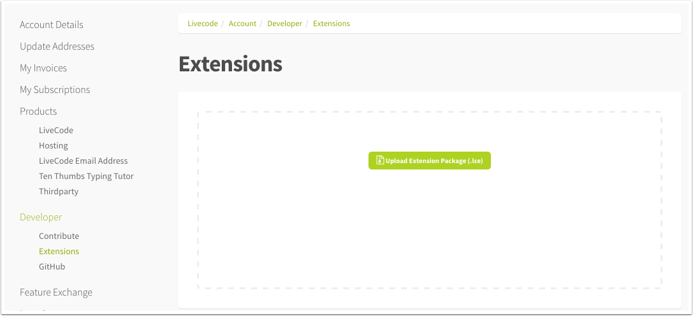

# Extending LiveCode

## Introduction

LiveCode has a simple way to extend the functionality or control set of 
your app using separately compiled modules. This guide will take you 
through the process of installing and using these new widgets and 
libraries and for the adventurous among you, provide a guide to building 
and sharing your own extensions. 

## LiveCode Builder Extensions

To make it possible to create extensions and plug them into the LiveCode 
engine we've created a new flavor of our language called ***LiveCode 
Builder***. LiveCode Builder looks a lot like LiveCode Script so should 
feel familiar for any seasoned LiveCode developer. There is lots of new 
syntax which exposes parts of the LiveCode engine that were only 
previously available to those who were skilled c/c++ developers.

To learn more about LiveCode Builder and creating extensions, read on.

> *Warning:* It is important to stress right at the start that 
> ***no aspect of LiveCode Builder should be considered final***. 
> ***Every piece of syntax in LiveCode Builder is subject to change***.

### Creating LiveCode Builder Extensions

The IDE provides an "Extension Builder" tool to help make development 
and packaging of extensions as easy as possible. 

> **Note:** LiveCode Builder is a different flavor of LiveCode so it is 
> not possible to edit LiveCode Builder scripts in the main LiveCode 
> Script IDE.

### Extension Builder

Open the "Extension Builder" from the tools menu:

	Tools > Extension Builder


1. Shows the currently selected extension. 
2. Data that the builder was able to parse from the directory such as icons, resources, API's the user guides.
3. Console: Shows status, error and log messages.
4. Test: Creates a stack, compiles the extensions and creates an instance.
5. Script: Opens the lcb script in an external default editor.
6. Install: Installs the extension into the IDE
7. Uninstall: Uninstalls the extension from the IDE
8. Package: Creates a .lce package which can uploaded to the extension store. It is placed in the extension directory

> **Note:** A great way to get started is to tweak the script of one of 
> our widget examples.

Using the selection dropdown (1), you can select the extension you wish 
to develop or click the "open" icon in the header back to locate an 
extension you've not loaded before. 

### Create your own simple widget
The main difference between widgets and libraries is that a widget draws 
to a pre-existing canvas. Apart from that, the authoring process is much 
the same for both extension types.

#### Create a .lcb file
We recommend using the Atom text editor, available at https://atom.io/. 
A LiveCode package is available which provides some colorization as well 
as indentation. 
If you prefer to use TextWrangler, there is a colorizing script 
[here](https://github.com/livecode/livecode/tree/develop/contrib/TextWrangler). 
It should be placed in /Application Support/TextWrangler/Language Modules/

Start by creating a plain text file in a new directory and save it to 
disk with the extension "lcb":

	/Desktop/widgettest/main.lcb

> **Note:** The extension builder currently relies on there being only 
> one main module file in a given directory.	

#### Declare Type and Identifier
Start by declaring the type of extension, either "widget" or "library" 
followed by your identifier (See "Select A Developer ID" below).

	widget community.livecode.beaumont.pinkCircle
	   ## Code for your widget
	end widget

This is the unique identifier by which your extension will be referred 
to by the LiveCode Engine.

> **Note:** All LiveCode authored widgets are in the application package 
> at /Tools/Extensions/. To play with one of these extensions we 
> recommend copying the folder from the application package to your 
> desktop and loading it from there. Changing the extension identifier 
> in the source code will ensure it doesn't conflict with the existing 
> extension.

#### Declare Metadata
Next, provide metadata to help LiveCode display your widget correctly 
in the IDE and in the online portal.

	widget community.livecode.beaumont.pinkCircle

	metadata title is "My Pink Circle"
	metadata author is "Benjamin Beaumont"
	metadata version is "1.0.0"
	metadata platforms is "desktop,mobile"

	end widget

> **Note:** If the module makes use of external code that is only
> available on specific Operating Systems or Platforms, use the "os"
> and/or "platforms" metadata keys. The values are the same as can be
> found in the LiveCode Documentation Format Reference. This data will
> also appear in the dictionary.

#### Importing libraries
The LiveCode builder syntax is broken down into **modules**. There are 3 
classes of module:

Type|Description
---|---
Default|These modules are part of LiveCode builder and are included by default. Their syntax is always available to you as a LiveCode developer.
Optional|These modules are created and distributed by LiveCode Ltd and must be imported by the extension developer in order to make use of their syntax.
Custom|These modules are created and distributed through the online portal and must be imported by the extension developer in order to make use of their syntax.

LiveCode builder contains the following modules:

Module|Type|Description
---|---|---
com.livecode.canvas|Optional|Provides the syntax and types for 2D drawing allowing developers to draw to a canvas. Required if creating a widget.
com.livecode.widget|Optional|Contains syntax specific to widget building such as "my width" and "the mouse position".
com.livecode.engine|Optional|Contains syntax for all extension building such as "dispatch" and "log".
com.livecode.arithmetic|Default|Contains syntax for basic mathematical operations.
com.livecode.array|Default|Contains syntax for operations on arrays.
com.livecode.assert|Default|Contains syntax for making assertions about program state.
com.livecode.binary|Default|Contains syntax for operations on binary data.
com.livecode.bitwise|Default|Contains syntax for bitwise logical operators.
com.livecode.byte|Default|Contains syntax for operations on byte chunks.
com.livecode.char|Default|Contains syntax for operations on char chunks.
com.livecode.codeunit|Default|Contains syntax for operations on codeunit chunks.
com.livecode.date|Default|Contains syntax for accessing the date and time.
com.livecode.file|Default|Contains syntax for file I/O operations.
com.livecode.foreign|Default|Provides the type bindings for foreign types.
com.livecode.java|Default|Provides helper functions and types for interfacing with Java.
com.livecode.list|Default|Contains syntax for operations on lists.
com.livecode.logic|Default|Contains syntax for logical operators.
com.livecode.math|Default|Contains syntax for mathematical operations.
com.livecode.mathfoundation|Default|Contains syntax for foundational mathematical operations.
com.livecode.objc|Default|Provides helper functions and types for interfacing with Objective-C.
com.livecode.sort|Default|Contains syntax for sorting operations.
com.livecode.stream|Default|Contains syntax for stream I/O operations.
com.livecode.string|Default|Contains syntax for operations on strings.
com.livecode.system|Default|Contains syntax for accessing system information.
com.livecode.type|Default|Contains syntax for general operations on types.
com.livecode.typeconvert|Default|Contains syntax for conversions between types.
com.livecode.unittest|Default|Contains syntax for unit testing LiveCode Builder programs.

> **Warning!** Module names are subject to change.

The LiveCode dictionary has a full list of all available syntax as 
well as the module each belongs to. As a general rule we recommend 
importing all three optional modules whenever developing widgets.

	widget community.livecode.beaumont.pinkCircle

	use com.livecode.canvas
	use com.livecode.widget
	use com.livecode.engine

	metadata title is "My Pink Circle"
	metadata author is "Benjamin Beaumont"
	metadata version is "1.0.0"

	end widget

#### Core Handlers

There are several core handlers that any widget developer should 
implement:

Handler|Description
------|------
OnPaint|The *OnPaint* message is sent to your widget whenever LiveCode requires it to redraw. The performance of your widget is tied primarily to this handler and should be kept as efficient as possible.
OnCreate|The *OnCreate* message is sent to your widget when it is first created by LiveCode. This can be used to initialise default data and where applicable, reduce the burden for calculating constants etc in the onPaint handler.
OnGeometryChanged| The *OnGeometryChanged* message is sent when the control is changed in size.
OnSave| The *OnSave* message is sent when your widget is about to be destroyed and enables the widget to save data set on the widget.
OnLoad| The *OnLoad* message is sent when your widget is created and enables the widget to retrieve data saved on the widget.

In the first instance we are going to create a widget with no settable 
properties, just using the `OnPaint` handler.

	widget community.livecode.beaumont.pinkCircle

	metadata title is "My Pink Circle"
	metadata author is "Benjamin Beaumont"
	metadata version is "1.0.0"

	public handler OnPaint()
	   // Draw widget
	end handler

	end widget


#### Draw a Pink Circle

	widget community.livecode.beaumont.pinkCircle

	metadata title is "My Pink Circle"
	metadata author is "Benjamin Beaumont"
	metadata version is "1.0.0"

	use com.livecode.canvas

	public handler OnPaint()
	   // Create a path with a radius of half the width of the canvas
	   variable tCirclePath as Path
	   put circle path centered at point [my width / 2, my height / 2] with radius (my width/2) into tCirclePath
	   
	   // Set the paint that will be used to fill the circle to a solid
	   // pink color
	   set the paint of this canvas to solid paint with color [1, 0, 1]
	   
	   // Fill the path
	   fill tCirclePath on this canvas
	end handler

	end widget

#### Test the Code

Now open the extension builder stack as shown above and click on the 
folder icon at the top right to load your ***.lcb*** file into the 
builder.


Click test. Your widget should be displayed on the new stack. If you 
can't see it, check behind the extension stack.

#### Properties
In order to make a widget useful to end users it is likely that you'll 
want to expose properties that allow them to specify how your widget 
should behave. 

To specify a property you must provide a name and the method to get and 
set the property.

	property <name> get <variable/handler> set <variable/handler>

The simplest properties to get/set are numbers or strings. So lets 
create a `circleMargin` property that allows users to define a margin.

	property circleMargin get mMargin set setMargin

In the above example, when the **circleMargin** property is requested, 
the variable `mMargin` is returned; when the property is set, the 
handler **setMargin** is called. To have a property linked directly to 
the value of a variable, simply provide the variable name. There will be
no other side effects - notably, a redraw will not automatically be 
triggered in the case that a variable name is used for a setter. To 
process the value coming from and going into LiveCode Script, or to add 
side-effects when getting and setting properties, provide handler names. 
In our case we're defining a setter for the **circleMargin** property 
because we need to trigger a redraw when it is set.

	private variable mMargin as Real

We'll define a member variable to store the value for the margin. 
LiveCode Builder is typed so you must also specify the type of your 
variable. Remember, the canvas you are drawing to has subpixel precision 
so our margin is a real number rather than an integer. For a full list 
of types available in LiveCode Builder please see the Typing section of 
the language specification guide. 

We also suggest a naming convention for variables in the section on 
variable and case sensitivity.

Finally we have to implement our `setMargin` handler.

	public handler setMargin(in pMargin as Real) returns nothing
		put pMargin into mMargin
		redraw all
	end handler

Implementing the "setter" ourselves provides us with a little more 
flexibility. In this case when the property is set we want our pink 
circle to immediately redraw to reflect the property change. We do this 
by calling "redraw all".

To test the property click "test" and from the message box set the 
property.

	set the cicleMargin of widget 1 to 15

**Full Example**

	widget community.livecode.beaumont.pinkCircle

	metadata title is "My Pink Circle"
	metadata author is "Benjamin Beaumont"
	metadata version is "1.0.0"

	use com.livecode.canvas
	use com.livecode.widget
	use com.livecode.engine

	// Properties
	property circleMargin get mMargin set setMargin

	// Local variables
	private variable mMargin as Real

	public handler onCreate() 
		put 0 into mMargin
	end handler

	public handler OnPaint()
	   // Create a path with a radius of half the width of the canvas
	   variable tCirclePath as Path
	   put circle path centered at point [my width / 2, my height / 2] with radius (my width/2) into tCirclePath
	   
	   // Set the paint that will be used to fill the circle to a solid
	   // pink color
	   set the paint of this canvas to solid paint with color [1, 0, 1]
	   
	   // Fill the path
	   fill tCirclePath on this canvas
	end handler

	public handler setMargin(in pMargin as Real)
		put pMargin into mMargin
		redraw all
	end handler
	
	end widget

#### Loading and Saving widget data
When a stack containing a widget is saved, the widget's *OnSave* 
handler is called by the engine. The *OnSave* handler has an array out 
parameter - you can fill this array with whatever widget data is needed
to reconstruct the widget. LiveCode saves this data along with instances 
of the widget in the stack file.

	public handler OnSave(out rProperties as Array)
		put the empty array into rProperties
	
		put mMargin into rProperties["margin"]
	
		return rProperties
	end handler

This same array is passed as a parameter to an *OnLoad* handler which is
called when the stack the widget is on is loaded.

	public handler OnLoad(in pProperties as Array)
		put pProperties["margin"] into mMargin
	end handler

#### Understanding Error Messages
Clicking on the "test" button causes the extension builder to compile 
your source code file (***.lcb***) and produce a compiled module file 
(***.lcm***). If an error is encountered it is output in the "console" 
section of the builder:

	Error: <source path>: <line number>: <char number>: <error message>

* *source path* - The path the .lcb file that is being compiled
* *line number* - The line number in the script on which the error occurred.
* *char number* - The character number on which the error occurred. 
* *error message* - The description of the error.

#### LiveCode Builder API
To start creating more complex widgets see the LiveCode Builder api in the documentation 
stack in the IDE.


1. Open the dictionary (and stay in the 'API' tab)
2. Click the drop-down button
3. Choose the "LiveCode Builder" API
4. The list of all the syntax available

### Hello World library
A extension library is written in much the same way as the above widget. 
The only difference is that all the public handlers implemented are 
inserted into the message path when the extension is loaded.

For example, here is a simple library with one handler which simply 
returns the string "Hello World!":

	library community.livecode.elanorb.helloworld

	metadata title is "Hello World Library"  
	metadata author is "Elanor Buchanan"  
	metadata version is "1.0.0"

	public handler sayHello()
	 return "Hello World!"  
	end handler

	end library

Once this is compiled and loaded, the sayHello handler would be in the 
message path, before the backscripts. LiveCode Builder library handlers 
can be invoked in both command and function form:

	sayHello
	put the result -- outputs "Hello World!"
	
	put sayHello() -- outputs "Hello World!"

### Loading and Creating Widgets Manually
To load a compiled module file call:

	load extension <filepath.lcm>

To create a widget from script call:

	create widget <name> as <identifier>

e.g.

	create widget "myWidget" as "com.livecode.extensions.waddingham.clock" 
	
### Extensions Course

See the online [extensions course](https://livecode.com/topic/introduction-2/) for a thorough
introduction to LiveCode Builder, complete with examples. The following
extension examples are worked through:
* Hello World library
* Extended Hello World library
* Rotated Text widget
* Extended Rotated Text widget
* Pie Chart widget
* Modifying the Line Graph widget
		
### Canvas API

If you are drawing to the widget canvas in the `OnPaint` handler (as 
opposed to [wrapping native views](#using-native-views-for-widgets)) it 
is a good idea to familiarise yourself with the canvas API. It provides
a set of operations for creating, measuring, transforming and drawing 
paths and text.

#### Using path objects

Paths corresponding to standard shapes can be created using the various
path 'constructors':

* Line: `line path from mFrom to mTo`
* Rectangle: `rectangle path of mRect`
* Circle: `circle path centered at mCenter with radius mRadius`
* Ellips: `ellipse path centered at mPoint with radii mRadii`
* Rounded Rectangle: `rounded rectangle path of mRect with (radius mRadius | radii mRadii )`
* Arc: `arc path centered at mCenter with [ radius mRadius | radii mRadii ] from mStartAngle to mEndAngle`
* Sector: `sector path centered at mCenter with [ radius mRadius | radii mRadii ] from mStartAngle to mEndAngle`
* Segment: `segment path centered at mCenter with [ radius mRadius | radii mRadii ] from mStartAngle to mEndAngle`
* List of points: `( polygon | polyline ) path with points mPoints`

To create a path using the path operations, start with an empty path 
object:

	// Create a new empty path
	variable tPath as Path
	put the empty path into tPath
	
Then use the canvas path syntax to build the path. Simple paths with no
subpaths (i.e. ones you can draw without lifting the pencil), can be created using the following operations:

* Line: `line to mPoint on mPath`
* Arc: `arc through mThrough to mTo with radius mRadius on mPath`
* Curve: `curve through mThroughA [ then mThroughB ] to mTo on mPath`
* Elliptic arc:`arc to mEnd with radii mRadii rotated by mAngle [ taking ( largest | smallest ) ( clockwise | anticlockwise ) route ] on mPath`
* Close path: `close path on mPath`

Paths made up of disjoint subpaths (i.e. ones you need to lift the 
pencil for) can be created using the move operation:

* Move: `move to mPoint on mPath`

For example, to create a path consisting of a pair of parallel lines:

	public handler OnPaint()
	   // Create a new empty path
	   variable tPath as Path
	   put the empty path into tPath

	   // Begin a new subpath of tPath
	   move to point [50, 50] on tPath

	   // Add a line to tPath
	   line to point [100, 50] on tPath

	   // Begin a new subpath of tPath
	   move to point [50, 100] on tPath

	   // Add a line to tPath
	   line to point [100, 100] on tPath

	   stroke tPath on this canvas
	end handler


The following example illustrates how the parameters to elliptic arcs 
work. Take the ellipse with horizontal radius 50 and vertical radius 25. 
The red and green arcs start from the same point; the red is the 
smallest clockwise route to a given point, the green is the largest 
anticlockwise route. Together they make up the whole ellipse:

	public handler OnPaint()
	   variable tSmallest as Path
	   put the empty path into tSmallest

	   // Start at [50, 50]
	   move to point [50, 50] on tSmallest

	   // Continue path with an arc to 100, 25
	   arc to point [100, 25] with radii [50, 25] rotated by 0 taking smallest clockwise route on tSmallest

	   variable tLargest as Path
	   put the empty path into tLargest

	   // Start at [50, 50]
	   move to point [50, 50] on tLargest

	   // Continue path with an arc to 100, 25
	   arc to point [100, 25] with radii [50, 25] rotated by 0 taking largest anticlockwise route on tLargest

	   set the paint of this canvas to solid paint with color [255,0,0]
	   stroke tSmallest on this canvas

	   set the paint of this canvas to solid paint with color [0,255,0]
	   stroke tLargest on this canvas
	end handler


Paths may also be created using SVG instructions, for example:

	public handler OnPaint()
		variable tPath as Path
	   put path "M10,10 L50,100 Q100,100 100,50 C75,50 50,25 50,10z" into tPath
	   stroke tPath on this canvas
	end handler

Produces the following:


#### Rendering text

There is essentially only one piece of syntax for rendering text:

	fill text mText at (mPoint | mAlignment of mRect) on mCanvas
	
for example, a widget that simply displays its name at its center would
have the following `OnPaint` handler:

	public handler OnPaint()
	   fill text my name at center of my bounds on this canvas
	end handler

Text can be measured using the 

	measure mText on mCanvas
	
syntax. This can be used for example to do text wrapping, by calculating
the widths of successive chunks of text and inserting line breaks where
appropriate.

#### Transformations

Both Path objects and canvases can be transformed using the standard
affine transforms - either using the specific translate, rotate or scale
syntax, or arbitrary transform matrices.

### Composed Widgets
Widgets can either be 'host' widgets, as in the previous example, 
created when a widget is directly embedded in a stack, or 'child' 
widgets which are created when a widget is  used as a child widget 
within another widget.
The syntax for composed widgets is included in the com.livecode.widget 
module.

#### A simple composed widget
This composed widget example composes the clock widget and the selector 
widget, to create a version of the clock widget with adjustable time 
zone.

The label at the top of the widget reflects which portion of the widget 
the mouse is over.

	widget com.livecode.extensions.example.simplecomposed

	use com.livecode.canvas
	use com.livecode.widget

	metadata title is "Simple Composed Widget"
	metadata author is "LiveCode"
	metadata version is "1.0.0"

	private variable mInsideChild as String
	private variable mInside as Boolean

	private variable mSelector as Widget
	private variable mClock as Widget

	public handler OnCreate()
		put false into mInside
		put the empty string into mInsideChild

		put a new widget "com.livecode.extensions.livecode.selector" into mSelector
		set property "numSelections" of mSelector to 6
		set annotation "Name" of mSelector to "Selector"

		put a new widget "com.livecode.extensions.livecode.clock" into mClock
		set annotation "Name" of mClock to "Clock"

		place mSelector
		place mClock
	end handler
	
	end widget

Notice that Widget is a variable type. This widget stores references to 
its child widgets in private variables. In the `OnCreate` handler, the 
widget objects are created, stored in the private variables and 
'placed'. Child widgets can be stored as variables and 
manipulated without actually being drawn to a canvas if they are 
unplaced.
Properties implemented by child widgets can be got and set using the 
`property <propName> of <child widget>` syntax.
Placing a widget ensures that they are drawn, in placement order. 
Setting an annotation of a child widget assigns it a tag so that when an 
unknown child widget is returned by an operator, its annotation can be 
used to identify it.

	public handler OnMouseEnter()
		put true into mInside
	
		if the target is not nothing then
			put annotation "Name" of the target into mInsideChild
		end if

		redraw all
	end handler

	public handler OnMouseLeave()
		if the target is not nothing then
			put the empty string into mInsideChild
		end if

		put false into mInside

		redraw all
	end handler

In the *OnMouseEnter* and *OnMouseLeave* handlers, *the target* is used 
to obtain a reference to the child widget that triggered the 
*OnMouseEnter* and *OnMouseLeave* events, and the previously assigned 
annotation put into the `mInsideChild` variable, which in turn 
is rendered to the canvas in the *OnPaint* handler.

	public handler OnPaint()
		set the paint of this canvas to solid paint with color [0.75, 0.75, 0.75]
		fill rectangle path of my bounds on this canvas
	
		if mInside then
			set the paint of this canvas to solid paint with color [1.0, 0.0, 0.0]
			set the stroke width of this canvas to 4.0
			stroke rectangle path of my bounds on this canvas
		end if
	
		if mInsideChild is not the empty string then
			set the paint of this canvas to solid paint with color [0.0, 0.0, 0.0]
			fill text mInsideChild at top of my bounds on this canvas
		end if
	end handler

The rectangle of each child widget is controlled using the following syntax:
* ```the rectangle of <widget>``` - Enables manipulation of the rectangle property of a child widget.
* ```the width of <widget>``` - Enables manipulation of the width property of a child widget.
* ```the height of <widget>``` - Enables manipulation of the height property of a child widget.
* ```the location of <widget>``` - Enables manipulation of the location property of a child widget.

	public handler OnGeometryChanged()
		set the rectangle of mSelector to rectangle [ 0, 20, my width, 50 ]
		set the rectangle of mClock to rectangle [ 0, 50, my width, my height ]
	end handler

Finally, messages posted by child widgets can be handled in the direct 
parent by handling the appropriate message (prepending 'On'). For 
example, the selector widget posts *optionChanged* when one of its 
numbers is selected. This is handled by this composed widget example in 
an *OnOptionChanged* handler.

	public handler OnOptionChanged(in pIndex)
		set property "timeZone" of mClock to pIndex - 1
	end handler

### Using native APIs for libraries

One of the most powerful features of LiveCode Builder is the foreign 
function interface (FFI). It can be used to access native APIs on all 
supported platforms.

The fundamental concept involved in using the FFI is the foreign handler 
binding. This is a string containing information about the native 
functionality that is being bound to.

The format of the binding string varies slightly depending on the 
language of the foreign handler - for a complete specification, see the
LiveCode Builder Language Reference.

#### C

In order to bind to C functions from a dynamic library, there is one 
essential thing to know: the signature of the function. 

>**Note:** On Windows, it is also necessary to find out the calling 
> convention of the function. In the majority of cases if binding to 
> functions in the Windows API, the calling convention will be 
> `stdcall`.

The declared types of the foreign handler must match the signature, so
that the FFI call can be computed correctly. For example, to bind to the 
`atof` C standard library function that converts a C-string to a double,

	double atof(const char *str)

We could use:

	foreign handler C_AToF(in pString as ZStringNative) returns CDouble \
		binds to "atof"

See the [Language Reference](https://github.com/livecode/livecode/blob/develop/docs/guides/LiveCode%20Builder%20Language%20Reference.md#the-c-binding-string) 
for more information on C binding strings. 

##### Callbacks

When used in the context of a foreign handler definition, a foreign
handler type will cause automatic bridging of the LCB handler to a C
function pointer which can be called directly by the native code.

The function pointers created in this fashion have lifetime
equivalent to that of the calling context. In particular, for
widgets they will last as long as the widget does, for all other
module types they will last as long as the module is loaded.

For example, suppose you have the following function in `myLib`:

void qsort(void *base, size_t nitems, size_t size, int (*compar)(const void *, const void*))

	void c_function_with_callback(void* p_context, bool(*func)(void* p_context))

This can be bound to using the following:

	public foreign handler type CallbackType(in pContext as Pointer) returns CBool
	
	foreign handler CFunctionWithCallback(in pContext as Pointer, in pHandler as CallbackType) returns nothing \
		binds to "myLib>c_function_with_callback"	
	
	handler MyCallback(in pContext as Pointer) returns CBool
		...
		
		return true
	end handler
		
	handler CallCFunctionWithCallback(in pContext as Pointer)
		CFunctionWithCallback(pContext, MyCallback)
	end handler

##### Using compiled libraries

Extensions can include compiled libraries on which they depend. The
libraries must be compiled for each platform and architecture they are
required on and placed folders named with a platform ID in the extension
code folder. The platform ID folder names are in the form:

    <architecture>-<platform>[-<options>]

See the [platform ID](https://github.com/livecode/livecode/blob/develop/docs/development/platform-id.md)
specification for more details.

###### Dynamic Linking

On all platforms with the exception of iOS devices only dynamically linked
libraries are supported. Static linking is not yet supported in iOS simulator
builds. On iOS 8+ devices dynamically linked frameworks (`.framework`) are
supported.

###### Static Code Libraries for iOS Device Builds

Static libraries and frameworks for iOS must be compiled into a lcext object.
Use the [build-module-lcext-ios.sh shell script](https://github.com/livecode/livecode/blob/develop/tools/build-module-lcext-ios.sh)
as an example of how to do so.

The script has the following inputs in order:

- The path to the module compiled to C++ with using `lc-compile` with the
`--forcebuiltins --outputauxc OUTPUTFILE` options. The output file inclues both
the module and shims for any C foreign bindings. Use a `.cpp` extension so the
compiler treats the file correctly.
- The deps file which is a text file listing required dependencies when linking
the object where each line is in the form `{library | [weak-]framework} <name>`
- Lcext output file path (must use the lcext extesion).
- The full name of the module. For example, `com.livecode.library.timezone`.
- The output file path for the ios module. This should be named `module.lcm` and
be next to the lcext object in the code folder. This is a dummy module we include
in standalones that is just the name to be loaded as the actual module code is
already linked into the executable.
- one or more full paths to static libraries. If linking a static framework the
static library is located at `<name>.framework/<name>`

###### Java and Android Libraries

Libraries to load on android (`.jar` & `.aar`) may be placed in the code
folder `jvm-android`. 

Java libraries to load on all platforms supporting Java may be placed in the
code folder `jvm`.

###### Example Directory Structure

    module.lcm
    manifest.xml
    api.lcdoc
    library.lcb
    resources/image.png
    code/universal-mac/library.dylib
    code/x86-win/library.dll
    code/x86-linux/library.so
    code/x86_64-linux/library.so
    code/armv6-android/library.so
    code/jvm-android/library.aar
    code/jvm/library.jar
    code/universal-ios-iphoneos11.4/library.lcext
    code/universal-ios-iphoneos11.4/module.lcm
    code/universal-ios-iphonesimulator11.4/library.dylib

#### Java

Java bindings are currently supported on Android, Mac and Linux. On 
desktop platforms the IDE will attempt to find the correct setting for
the `JAVA_HOME` environment variable. As this can vary from distro to
distro on Linux, this may fail - in this case ensure you set `JAVA_HOME` 
in script or using the message box. 

##### Java Platform API

On any of the supported platforms, it is possible to bind to methods and
fields of classes in the Java Platform API.

For example, take the [java.util.UUID class](https://docs.oracle.com/javase/7/docs/api/java/util/UUID.html) . 
Here is a simple library which uses this class to return a new 
pseudo-randomly generated UUID as a string:

	// The following comment block forms the top-level documentation of
	// this library
	/**
	This library allows the creation of a UUID using the Java Platform
	API. 
	*/
	library com.livecode.library.javauuid

	metadata title is "Java UUID"
	metadata author is "LiveCode"
	metadata version is "1.0.0"
	
	// Bind to the static randomUUID() method of the java.util.UUID class
	__safe foreign handler JNI_RandomUUID() returns JObject \
		binds to "java:java.util.UUID>randomUUID()Ljava/util/UUID;!static"
		
	// Bind to the toString() instance method of the java.util.UUID class
	__safe foreign handler JNI_UUIDToString(in pUUID as JObject) returns JString \
		binds to "java:java.util.UUID>toString()Ljava/lang/String;"

	// Library public handler - this will be accessible from LiveCode
	// when this library is loaded. The following comment block will
	// be used to generate the documentation
	/**
	Returns a new random UUID.
	
	Returns (String): 
	The string representation of a type 4 (pseudo randomly generated) 
	UUID.
	*/
	public handler GetRandomUUIDJava() returns String
	    // Call the static randomUUID method to return an instance of 
	    // the UUID class
		variable tUUID as JObject
		put JNI_RandomUUID() into tUUID
		
		// Call the toString method on the UUID instance to obtain the 
		// (java) string representation of the UUID
		variable tUUIDString as JString
		put JNI_UUIDToString(tUUID) into tUUIDString
		
		// Convert to a LiveCode String and return
		return StringFromJString(tUUIDString)
	end handler

	end library

### Other binding examples

* Binding to a class constructor with no parameters:

	__safe foreign handler CreateJavaObject() returns JObject binds to "java:java.lang.Object>new()"

* Binding to a class constructor with parameters:

	__safe foreign handler CreateJavaString(in pBytes as JByteArray) returns JString binds to "java:java.lang.String>new([B)"

* Binding to a class instance method

	__safe foreign handler JavaStringIsEmpty(in pString as JString) returns JBoolean binds to "java:java.lang.String>isEmpty()Z"
	
* Binding to a class static method

	__safe foreign handler CallJavaAdd(in pLeft as JInt, in pRight as JInt) returns JInt binds to "java:java.lang.Math>addExact(JJ)J!static"

* Binding to a class field

	__safe foreign handler JavaCalendarSetTime(in pCalendar as JObject, in pTime as JLong) returns nothing binds to "java:java.util.Calendar>set.time(J)"
	__safe foreign handler JavaCalendarGetTime(in pCalendar as JObject) returns JLong binds to "java:java.util.Calendar>get.time()J"

* Binding to a class constant

	__safe foreign handler GetJavaPi() returns JDouble binds to "java:java.lang.Math>get.PI()D!static"

##### Android API

On Android it is possible to access the standard platform APIs using
Java FFI.

https://github.com/livecode/livecode/blob/develop/extensions/libraries/toast/toast.lcb

##### Third-party libraries

The standalone builder will look for .jar files in the `code/jvm` folder
of an extension package and load them automatically on startup of a
standalone. Due to the way things currently work, testing extensions 
with jar files in the IDE is not supported. However it can be done by 
setting the CLASSPATH environment variable before the Java Virtual
Machine is initialized. See [Custom Java classes](#custom-java-classes) 
for an example of how to do this.

For android, the possibilities for including third-party libraries 
expands substantially. The `code/jvm-android` folder of an extension 
package can contain .jar and .aar files, and obviously the .jar files
can make use of the Android API.

Classes in .jar files (either included directly, or within .aar 
packages) can be accessed using Java FFI in exactly the same way as
classes in the Android API.

.aar packages can also contain resources and AndroidManifest.xml files - 
these are merged with the manifest and resources generated by LiveCode
when building an Android application.

##### Custom Java classes

As .jar file code resources are supported, you can write and compile 
custom Java classes for use with an LCB extension. 

Assuming the current folder is the root of an extension, consider the 
following java code, in a file 
java/com/livecode/library/helloworldjava/HelloWorld.java:

	package com.livecode.library.helloworldjava;

	public class HelloWorld 
	{
		public static String sayHello()
		{
			return "Hello World!"
		}
	}

This can be compiled and packaged using java command-line tools:

	javac java/com/livecode/library/helloworldjava/HelloWorld.java
	jar cvf code/jvm/HelloWorld.jar -C java .

Now there should be a HelloWorld.jar file in the appropriate location 
relative to the extension.

In helloworld.lcb,

	library com.livecode.library.helloworldjava

	use com.livecode.foreign
	use com.livecode.java
	
	__safe foreign handler JNI_SayHello() returns JString \
		binds to "java:com.livecode.library.helloworldjava.HelloWorld>sayHello()Ljava/lang/String;"
		
	public handler SayHello() returns String
		return StringFromJString(JNI_SayHello())
	end handler
	
	end library

A standalone including this extension would be able to execute the 
script

	answer SayHello() 
	
to pop up an answer dialog with the text "Hello World!". Obviously that 
is a rather circuitous route when you can already do 

	answer "Hello World!"
	
but it does open up a lot of possibilities for interoperation with Java
libraries.

One such application would be the ability to record .wav files on 
Android. The MediaPlayer class does not come equipped with this 
functionality. 

This can be compiled and packaged using java command-line tools, 
ensuring the appropriate android.jar is included in the dependencies 
(here we assume the location of the android toolchain is standard and
the android-23 platform is downloaded):

	javac -cp ~/android/toolchain/android-sdk/platforms/android-23/android.jar java/src/com/livecode/library/androidwavrecorder/ExtAudioRecorder.java
	
	jar cvf code/jvm-android/AndroidWavRecorder.jar -C java/src .

Now there should be a AndroiWavRecorder.jar file in the appropriate 
location relative to the extension. 

#### Objective-C

The types used in Objective-C foreign handler declarations are the usual 
C types, plus a few special ones for handling Obj-C `id` objects. These
are:

* `ObjcId` - an id with no implicit action on its reference count
* `ObjcRetainedId` - an id which is expected to already have been retained. (i.e. the caller or callee expects to receive it with +1 ref count)
* `ObjcAutoreleasedId` - an id which has been placed in the innermost autorelease pool before being returned to the caller

The `ObjcObject` type is a wrapper round the raw `ObjcId` types, which 
manages the lifetime of the obj-c object it contains. It should 
generally be used when using obj-c objects within LCB.

Objective-C binding strings mirror as closely as possible the structure 
of method declarations in Objective-C. For example, the class 
`NSSpeechSynthesizer` has methods

	- (id)initWithVoice:(NSString *)voice;
	- (BOOL)startSpeakingString:(NSString *)string;

In order to create an instance of the class, we first use the superclass 
`NSObject`'s

	+ (id)alloc;

method to allocate an instance, and then call `initWithVoice:` on it:

	foreign handler Objc_NSSpeechSynthesizerAlloc() returns ObjcRetainedId \
		binds to "objc:NSSpeechSynthesizer.+alloc"
		
The `+` indicates this is a class method, i.e. we don't require an 
instance of the class to call the method. 

	foreign handler Objc_NSSpeechSynthesizerInitWithVoice(in pSynthesizer as ObjcRetainedId, in pVoice as optional ObjcId) returns optional ObjcRetainedId \
		binds to "objc:NSSpeechSynthesizer.-initWithVoice:"
		
The `-` here indicates this is an instance method, i.e. we require an 
instance of the class to call the method. This is always the first 
parameter. We can then create and initialize an NSSpeechSynthesizer 
using the following. We pass `nothing` to `initWithVoice:` to use the
default voice.

	handler CreateSpeechSynthesizer() returns ObjcObject
		variable tSynthesizer as ObjcObject
		put Objc_NSSpeechSynthesizerAlloc() into tSynthesizer
		
		return Objc_NSSpeechSynthesizerInitWithVoice(tSynthesizer, \
			nothing)
	end handler

To speak, we would bind to the `startSpeakingString:` method:

	foreign handler Objc_NSSpeechSynthesizerStartSpeaking(in pSynthesizer as ObjcId, in pString as ObjcId) returns CBool \
		binds to "objc:NSSpeechSynthesizer.-startSpeakingString:"
	
Then expose a public library handler to enable calls from LiveCode.

	private variable mSynthesizer as optional ObjcObject
	public handler SynthesizeSpeech(in pString as String) returns Boolean
		if mSynthesizer is nothing then
			put CreateSpeechSynthesizer() into mSynthesizer
		end if
		
		Objc_NSSpeechSynthesizerStartSpeaking(mSynthesizer, \
			StringToNSString(pString))
	end handler

##### Callbacks

Callbacks are usually handled by creating delegates. A class delegate 
handles the events associated with that class and marshalls the 
callback message.

Objective-C delegate objects with LCB implementations of protocol 
methods can be created using the `CreateObjcDelegate` and 
`CreateObjcInformalDelegate` handlers, provided by the com.livecode.objc 
module.

In order to create a delegate to handle a particular protocol method, 
pass in the protocol name as the first argument and the mapping from 
method names to LCB handlers as the second argument. For example, to 
create a selectionChanged message for an `NSTextView`, we need to create 
a handler

	private handler DidChangeSelection(in pNotification as ObjcObject) returns nothing
		post "selectionChanged"
	end handler

and create a `NSTextViewDelegate`:

	variable tDelegate as optional ObjcObject
	put CreateObjcDelegate( \
		"NSTextViewDelegate", \ 	
		{"textViewDidChangeSelection:": DidChangeSelection}, \
		) into tDelegate
	if tDelegate is not nothing then
		put tDelegate into mTextViewDelegate
	end if
	
Optionally, a context parameter can be passed in at delegate creation
time:

	put CreateObjcDelegateWithContext( \
		"NSTextViewDelegate", \ 	
		{"textViewDidChangeSelection:": DidChangeSelectionContext}, \
		tContext) into tDelegate
		
	if tDelegate is not nothing then
		put tDelegate into mTextViewDelegate
	end if

In this case the context variable will be passed as first argument of 
the corresponding LCB callback:

	private handler DidChangeSelectionContext(in pContext, in pNotification as ObjcObject) returns nothing
		post "selectionChanged" with [pContext]
	end handler

Some protocols consist of purely optional methods. In this case the 
information about the protocol's methods are not available from the 	
objective-c runtime API. For this eventuality there are also handlers
`CreateObjcInformalDelegate` and `CreateObjcInformalDelegateWithContext`.

These handlers take a list of foreign handlers as their first argument
instead of a protocol name. The foreign handlers' information is used to
resolve incoming selectors so that the desired LCB callback is called. 
For example the `NSSoundDelegate` protocol has only one method, and it 
is optional, 

	- (void)sound:(NSSound *)sound didFinishPlaying:(BOOL)aBool;

So in order to create an `NSSoundDelegate`, we need to create a list of
foreign handlers, in this case just the following:

	foreign handler NSSoundDidFinishPlaying(in pSound as ObjcId, in pDidFinish as CSChar) binds to "objc:.-sound:didFinishPlaying:"
	
and create the informal delegate
	
	handler DidSoundFinish(in pSound as ObjcId, in pDidFinish as Boolean) returns nothing
		if pDidFinish then
			post "soundFinished"
		end if
	end handler
	
	foreign handler Objc_SetSoundDelegate(in pSound as ObjcId, in pDelegate as ObjcId) returns nothing \
		binds to "objc:NSSound.-setDelegate:"
	...
	
	variable tDelegate as optional ObjcObject
	put CreateObjcInformalDelegate( \
		[NSSoundDidFinishPlaying], \ 	
		{"textViewDidChangeSelection:": DidChangeSelection}) \
		into tDelegate
	end if
	if tDelegate is not nothing then
		put tDelegate into mSoundDelegate
		Objc_SetSoundDelegate(tSound, tDelegate)
	end if

> *Note:* Delegate properties are usually 'assigned' rather than 
> 'retained', so it is necessary to store them in module variables 
> until they are no longer needed. Generally the pattern required is
> as follows:

	handler OnOpen()
		-- Create native view and set native layer
		-- Set native view delegate property
		-- Store view and delegate in module vars
	end handler

	handler OnClose()
		-- Set native view delegate property to nothing
		-- Put nothing into view and delegate module vars
		-- Set native layer to nothing
	end handler

For our speech synthesizer example, suppose we want to post a message 
when the speaking is finished. In NSSpeechSynthesizer.h, we can see the
definition of the `NSSpeechSynthesizerDelegate`:

	@protocol NSSpeechSynthesizerDelegate <NSObject>
	@optional
	- (void)speechSynthesizer:(NSSpeechSynthesizer *)sender didFinishSpeaking:(BOOL)finishedSpeaking;
	...
	
The first thing to note is that the protocol methods are all optional.
This means that we have to use an informal delegate. To attach an LCB 
handler to the didFinishSpeaking event, we need to define both the 
foreign handler that binds to the protocol method and the LCB handler 
that should be called. Again this is an instance method of the delegate 
class, so the first parameter will be the delegate itself. 

Again since the protocol method is optional, it will not be found if we
bind to 
`NSSpeechSynthesizerDelegate.-speechSynthesizer:didFinishSpeaking:`, so 
it is necessary to use dynamic binding for the foreign handler (i.e. 
simply omitting the class in the binding string):

	foreign handler Objc_SpeechSynthesizerDidFinishSpeaking(in pSynthesizerDelegate as ObjcId, in pSynthesizer as ObjcId, in pFinished as CBool) returns nothing \
		binds to "objc:.-speechSynthesizer:didFinishSpeaking:"

	handler OnDidFinishSpeaking(in pSynthesizerDelegate as ObjcId, in pSynthesizer as ObjcId, in pFinished as CBool) returns nothing
		post "finishedSpeaking"
	end handler
	
	foreign handler Objc_SpeechSynthesizerSetDelegate(in pSynthesizer as ObjcId, in pDelegate as ObjcId) returns nothing \
		binds to "objc:NSSpeechSynthesizer.-setDelegate:"
	
	handler SetSpeechSynthesizerDelegate()
		variable tDelegate as ObjcObject
		put CreateObjcInformalDelegate( \
			[Objc_SpeechSynthesizerDidFinishSpeaking], \
			{ "speechSynthesizer:didFinishSpeaking:": \
              OnDidFinishSpeaking }) into tDelegate
              
        Objc_SpeechSynthesizerSetDelegate(mSynthesizer, tDelegate)
	end handler
	
### Using native views for widgets

The key piece of syntax for creating widgets that hook into native view 
objects is `my native layer`:

	set my native layer to tView
	
The `tView` object is different on each platform, as is the method of 
specifying LCB handlers for native view event callbacks. We will use the
example of a native button on each platform to illustrate this, where
possible.

The native layer should be created and destroyed every time the card
the widget is on is opened and closed respectively. Therefore the 
pattern that should be adopted when writing a native widget is to use
the `OnOpen` and `OnClose` messages as follows:

	private variable mNativeLayer as optional Pointer
	handler OnOpen()
		put CreateNativeLayer() into mNativeLayer
		set my native layer to mNativeLayer
	end handler
		
	handler OnClose()
		set my native layer to nothing
		put nothing into mNativeLayer
	end handler

When using a native layer, a widget's `OnPaint` handler is not called.
However it is recommended to provide some sort of placeholder `OnPaint`
method to represent the widget when the native layer is not supported
on the current platform.

#### Android

##### Native view

Native views on Android are classes derived from android.view.View. 
The Android button widget's native layer is an instance of the 
`android.widget.Button` class:

	↳	android.view.View
		↳	android.widget.TextView
			↳	android.widget.Button

The following snippet shows how to bind to the button constructor and 
set the native layer:

	// Bind to Android engine methods in order to fetch the application
	// Context
	__safe foreign handler _JNI_GetAndroidEngine() returns JObject \
		binds to "java:com.runrev.android.Engine>getEngine()Lcom/runrev/android/Engine;!static"
	__safe foreign handler _JNI_GetEngineContext(in pEngine as JObject) returns JObject \
		binds to "java:android.view.View>getContext()Landroid/content/Context;"

	// Bind to the android.widget.Button constructor
	__safe foreign handler _JNI_ButtonNew(in pContext as JObject) returns JObject \
		binds to "java:android.widget.Button>new(Landroid/content/Context;)?ui"

	// Store a reference to the native view
	private variable mNativeView as optional JObject
	
	handler CreateNativeLayer() returns Pointer
		// Fetch the application Context
		variable tContext as JObject
		put _JNI_GetEngineContext(_JNI_GetAndroidEngine()) into tContext
		
		// Create an instance of the android.widget.Button class
		put _JNI_ButtonNew(tContext) into mNativeView
		
		return PointerFromJObject(mNativeView)
	end handler
	
	handler SetNativeLayer()
		set my native layer to CreateNativeLayer()
	end handler
	
View objects on Android always require the application Context in their
constructors.

View objects should always be created on the UI thread.

##### Event handlers

A button widget is obviously not complete without an action callback. We
want a message to be received by the widget object in LiveCode whenever
the native view is clicked. 

On Android, the general procedure is to attach a `Listener` to an 
object. In Java, `Listener`s are classes which implement a specified set
of callback methods defined in that listener's interface. The general 
method of defining [interface callbacks on Android](#interface-proxy-callbacks)
is used to create listeners with LCB handler callbacks. 

The following snippet shows how to attach an `OnClickListener` to the 
Button instance:

	// Define handler type for button click callback. This matches
	// the android.view.View.OnClickListener's 
	// 		abstract void onClick(View v)
	// method.
	handler type ClickCallback(in pView as JObject) returns nothing
	
	// Bind to the interface proxy method. Since there is only one 
	// method to be implemented for the OnClickListener interface,
	// we just pass in a handler of the appropriate type.
	__safe foreign handler _JNI_OnClickListener(in pHandler as ClickCallback) returns JObject \
		binds to "java:android.view.View$OnClickListener>interface()"
		
	// Bind to the method used to set the OnClickListener on the
	// Button object.
	__safe foreign handler _JNI_SetOnClickListener(in pButton as JObject, in pListener as JObject) returns nothing \
		binds to "java:android.view.View>setOnClickListener(Landroid/view/View$OnClickListener;)V?ui"
	
	// Actual handler (of type ClickCallback) that will be called
	// when the button is clicked
	handler OnButtonClick(in pView as JObject) returns nothing
		// The widget object in LiveCode will receive the posted message
		post "mouseUp"
		
		// Ensure the engine thread is notified of a pending event
		MCEngineRunloopBreakWait()
	end handler
	
	// Store the OnClickListener object in a private variable
	private variable mOnClickListener as optional JObject
	
	// Set the OnClickListener
	handler SetOnClickListener(in pButton as JObject) returns nothing
		// Pass the OnButtonClick handler in the call to create a 
		// listener
		put _JNI_OnClickListener(OnButtonClick) into mOnClickListener
		
		// Set the OnClickListener on a Button instance
		_JNI_SetOnClickListener(pButton, mOnClickListener)
	end handler

Sometimes listener interfaces have multiple callback methods, for 
different events. In this case, you must pass an array mapping callback 
method names to handlers so that the correct handler is called for each
event. This can also be done with single-method interfaces, and indeed
is the recommended style to use as it will continue to work even if
additional callback methods are added to the interface in subsequent 
API levels.

Switching to this style would require two small tweaks to the above code:

	// Bind to the interface proxy method.
	__safe foreign handler _JNI_OnClickListener(in pMapping as Array) returns JObject \
		binds to "java:android.view.View$OnClickListener>interface()"

	...
	
	// Set the OnClickListener
	handler SetOnClickListener(in pButtonView as JObject) returns nothing
		// Map the OnButtonClick handler to the onClick method
		put _JNI_OnClickListener({"onClick":OnButtonClick}) \
			into mOnClickListener
		
		// Set the OnClickListener on a Button instance
		_JNI_SetOnClickListener(pButtonView, mOnClickListener)
	end handler		

##### Hooking up properties

Properties of Android native views can be set using methods of the view 
(or one of its parent classes). For example, to hook up the enabled 
property of the button, we bind to the `setEnabled` method of the parent
`TextView` class:

	__safe foreign handler _JNI_SetTextViewEnabled(in pView as JObject, in pValue as JBoolean) returns nothing \
		binds to "java:android.view.View>setEnabled(Z)V?ui"

	handler SetEnabled(in pButtonView as Pointer)
		_JNI_SetTextViewEnabled(pButtonView, my enabled)
	end handler
	
#### iOS

##### Native view

Native views on iOS are classes derived from UIView. The iOS button 
widget's native layer is an instance of the 
`UIButton` class.

The following snippet shows how to bind to the button constructor and 
set the native layer:

	// Define an alias for CULong
	private type NSUInteger is CULong
	
	// Bind to the UIButton class method buttonWithType:
	private foreign handler ObjC_UIButtonButtonWithType(in pType as NSUInteger) returns ObjcId binds to "objc:UIButton.+buttonWithType:?ui"

	// For a standard push button we need the type to be 
	// UIButtonTypeSystem, which is 1
	constant UIButtonTypeSystem is 1
	
	// Store a reference to the native view
	private variable mNativeView as optional ObjcObject
	unsafe handler CreateNativeLayer() returns Pointer
		// Create an instance of the UIButton class
		variable tButtonInstance as ObjcObject
		put ObjC_UIButtonButtonWithType(UIButtonTypeSystem) \
			into mNativeView
		
		// Return the pointer
		return PointerFromObjcObject(mNativeView)
	end handler
	
	handler SetNativeLayer()
		set my native layer to CreateNativeLayer()
	end handler
	
##### Event handlers

Views on iOS relay information about user interactions using either the 
[target-action paradigm](https://developer.apple.com/library/content/documentation/General/Conceptual/Devpedia-CocoaApp/TargetAction.html) 
or [delegation](https://developer.apple.com/library/content/documentation/General/Conceptual/DevPedia-CocoaCore/Delegation.html)

In general, simple widgets will use the target-action paradigm. In 
general, refer to the documentation for the particular class you are 
wrapping. According to the `UIButton` [API](https://developer.apple.com/documentation/uikit/uibutton), in the
section 'Responding to Button Taps', the `UIButton` class uses the 
target-action paradigm.

So, we can post a message to the widget script object in response to 
the click action as follows:

	// Bind to the UIButton addTarget:action:forControlEvents: method
	private foreign handler ObjC_UIButtonAddTargetActionForControlEvents(in pObj as ObjcId, in pTarget as ObjcId, in pAction as UIntPtr, in pControlEvents as NSUInteger) returns nothing binds to "objc:UIButton.-addTarget:action:forControlEvents:?ui"
	
	// Actual handler that will be called when the button is clicked
	handler OnButtonClick(in pSender as ObjcObject, in pContext as optional any) returns nothing
		// The widget object in LiveCode will receive the posted message
		post "mouseUp"
		
		// Ensure the engine thread is notified of a pending event
		MCEngineRunloopBreakWait()
	end handler
	
	// Store the action proxy object in a private variable
	private variable mButtonProxy as optional ObjcObject
	
	// The push button action type is UIControlEventTouchUpInside,
	// which is 1 << 6. Constants cannot be evaluated expressions, so
	// just define the bit shift
	constant UIControlEventTouchUpInsideBit is 6
	
	// Add the target action
	unsafe handler AddTargetAction(in pButtonView as ObjcObject) returns nothing
		// Create a proxy for the button object. This will receive the 
		// button events and call the provided callback handler
		put ObjcProxyGetTarget(OnButtonClick, nothing) into mButtonProxy

		// Add the target-action to the button view
    	ObjC_UIButtonAddTargetActionForControlEvents(pButtonView, \
    		mButtonProxy, ObjcProxyGetAction(), \
    		1 shifted left by UIControlEventTouchUpInsideBit bitwise)
	end handler

More complex views on iOS require creation of delegates. For example, 
there are several different user interactions possible with then 
`UITextField` view. In order to handle these interactions, we create
a `UITextFieldDelegate` - see the [API](https://developer.apple.com/documentation/uikit/uitextfielddelegate?language=objc)
for the list of events that can be handled. 

In this example we hook up `openField` and `textChanged` messages:

	// Bind to the text field's delegate property setter
	private foriegn handler Objc_SetTextFieldDelegate(in pTextField as ObjcId, in pDelegate as ObjcId) returns nothing \
		binds to "objc:UITextField.-setDelegate:?ui"

	// Handler to be called when the field is opened
	handler OnOpenField(in pField as ObjcId) returns nothing
		// The widget object in LiveCode will receive the posted message
		post "openField"
		
		// Ensure the engine thread is notified of a pending event
		MCEngineRunloopBreakWait()
	end handler	
	
	// Define the NSRange type, one of the parameters in the 
	// textFieldShouldChangeCharactersInRange method
	public foreign type NSRange binds to "MCAggregateTypeInfo:ff"
	
	// Handler to be called when the field text is changed
	handler OnTextChanged(in pField as ObjcId, in pRange as NSRange, in pReplacement as ObjcId) returns CBool
		// The widget object in LiveCode will receive the posted message
		post "textChanged"
		
		// Ensure the engine thread is notified of a pending event
		MCEngineRunloopBreakWait()
		
		// Allow the text to be changed
		return true
	end handler		
	
	// Store the delegate in a private variable
	private variable mTextFieldDelegate as optional ObjcObject
	
	// Set the delegate
	unsafe handler SetTextFieldDelegate(in pTextFieldView as ObjcObject) returns nothing
		// Create a delegate mapping the textFieldDidBeginEditing: 
		// method to OnOpenField, and the 
		// textFieldShouldChangeCharactersInRange: method to 
		// OnTextChanged
		
		// First define the mapping
		variable tMapping as Array
		put { "textFieldDidBeginEditing:": OnOpenField, \
			  "textField:shouldChangeCharactersInRange:replacementString:": \
			  OnTextChanged } into tMapping
		
		put CreateObjcDelegate("UITextFieldDelegate", tMapping) \
			into mTextFieldDelegate
			
		Objc_TextFieldSetDelegate(pTextFieldView, mTextFieldDelegate)
	end handler

##### Hooking up properties

Properties of iOS native views can be set using methods of the view (or
one of its parent classes). For example, to hook up the enabled 
property:

	foreign handler ObjC_UIButtonSetEnabled(in pObj as ObjcId, in pEnabled as CBool) returns nothing \
		binds to "objc:UIButton.-setEnabled:?ui"

	handler SetEnabled(in pButtonView as Pointer)
		ObjC_UIButtonSetEnabled(pButtonView, my enabled)
	end handler

#### Mac

Native views on Mac are classes derived from NSView. The Mac button 
widget's native layer is an instance of the 
`NSButton` class.

The following snippet shows how to bind to the button constructor and 
set the native layer:

	// Define an alias for CULong
	private type NSUInteger is CULong

	// Bind to the NSButton class method to allocate a new NSButton
	private foreign handler ObjC_NSButtonAlloc() returns ObjcRetainedId binds to "objc:NSButton.+alloc"
	
	// Bind to the NSButton instance method to initialize an NSButton
	private foreign handler ObjC_NSButtonInit(in pObj as ObjcId) returns ObjcId binds to "objc:NSButton.-init"
	
	// Bind to NSButton instance methods setButtonType:, setBezelStyle:,
	// and -setBordered:
	private foreign handler ObjC_NSButtonSetButtonType(in pObj as ObjcId, in pStyle as NSUInteger) returns nothing binds to "objc:NSButton.-setButtonType:"
	private foreign handler ObjC_NSButtonSetBezelStyle(in pObj as ObjcId, in pStyle as NSUInteger) returns nothing binds to "objc:NSButton.-setBezelStyle:"
	private foreign handler ObjC_NSButtonSetBordered(in pObj as ObjcId, in pBordered as CBool) returns nothing binds to "objc:NSButton.-setBordered:"

	// For a standard push button we need:
	// buttonType to be NSMomentaryPushInButton = 7
	// bezelStyle to be NSRoundedBezelStyle = 1
	constant kNSMomentaryPushInButton is 7
	constant kNSRoundedBezelStyle is 1
	
	// Store a reference to the native view
	private variable mNativeView as optional ObjcObject
	
	unsafe handler CreateNativeLayer() returns Pointer
		// Create an instance of the NSButton class
		variable tButtonInstance as ObjcObject
		put ObjC_NSButtonInit(ObjC_NSButtonAlloc()) into mNativeView
		
		// Set the properties we need for a push button
		ObjC_NSButtonSetButtonType(mNativeView, kNSMomentaryPushInButton)
		ObjC_NSButtonSetBezelStyle(mNativeView, kNSRoundedBezelStyle)
		ObjC_NSButtonSetBordered(mNativeView, true)		

		// Return the pointer
		return PointerFromObjcObject(mNativeView)
	end handler
	
	handler SetNativeLayer()
		set my native layer to CreateNativeLayer()
	end handler

Views on Mac relay information about user interactions using either the 
[target-action paradigm](https://developer.apple.com/library/content/documentation/General/Conceptual/Devpedia-CocoaApp/TargetAction.html) 
or [delegation](https://developer.apple.com/library/content/documentation/General/Conceptual/DevPedia-CocoaCore/Delegation.html)

In general, simple widgets will use the target-action paradigm. In 
general, refer to the documentation for the particular class you are 
wrapping. The `NSButton` uses the target-action paradigm.

So, we can post a message to the widget script object in response to 
the click action as follows:


	private foreign handler ObjC_NSButtonSetTarget(in pObj as ObjcId, in pTarget as ObjcId) returns nothing binds to "objc:NSButton.-setTarget:"
	private foreign handler ObjC_NSButtonSetAction(in pObj as ObjcId, in pAction as UIntPtr) returns nothing binds to "objc:NSButton.-setAction:"

	// Actual handler that will be called when the button is clicked
	handler OnButtonClick(in pSender as ObjcObject, in pContext as optional any) returns nothing
		// The widget object in LiveCode will receive the posted message
		post "mouseUp"
		
		// Ensure the engine thread is notified of a pending event
		MCEngineRunloopBreakWait()
	end handler

	// Store the action proxy object in a private variable
	private variable mButtonProxy as optional ObjcObject

	// Add the target action
	unsafe handler AddTargetAction(in pButtonView as ObjcObject) returns nothing	
		put ObjcProxyGetTarget(OnButtonClick, nothing) \
			into mButtonProxy
		ObjC_NSButtonSetTarget(pButtonView, mButtonProxy)
		ObjC_NSButtonSetAction(pButtonView, ObjcProxyGetAction())
	end handler

More complex views on Mac require creation of delegates. See the 
discussion of delegates on iOS for more information.

##### Hooking up properties

Properties of Mac native views can be set using methods of the view (or
one of its parent classes). For example, to hook up the enabled 
property:

	foreign handler ObjC_NSButtonSetEnabled(in pObj as ObjcId, in pEnabled as CBool) returns nothing \
		binds to "objc:NSButton.-setEnabled:"

	handler SetEnabled(in pButtonView as Pointer)
		ObjC_NSButtonSetEnabled(pButtonView, my enabled)
	end handler

#### Windows

> **Important:** It is not yet possible to write a fully functional
> native widget on Windows, as there is no method to capture events on
> the native view and pass them back to LiveCode Builder. This will be
> addressed in future releases.

##### Native view

Native views on Windows are HWNDs. The `CreateWindowEx` function is used
to create HWNDs with specified properties. See the 
[API documentation](https://msdn.microsoft.com/en-us/library/windows/desktop/ms632680(v=vs.85%29.aspx) 
for details on the parameters taken by `CreateWindowEx`.

The following snippet shows how to bind to `CreateWindowEx`, and use it 
to set the native layer to a button HWND:

	// Alias the types used in native calls
	public type DWORD is CULong
	public type WIDESTRING is ZStringUTF16
	public type HINSTANCE is Pointer
	public type HMENU is Pointer
	public type HWND is Pointer

	// Bind to the CreateWindowEx function. It is defined in the 
	// user32.dll library (hence `user32>` in the binding string). 
	// The CreateWindowEx function definition is preceded by the WINAPI 
	// macro, which means it uses the stdcall calling convention (hence
	// `!stdcall` in the binding string)
	foreign handler CreateWindow(in pEx as DWORD, \
		in pString as WIDESTRING, in pLabel as WIDESTRING, \
		in pStyle as DWORD, in pX as CInt, in pY as CInt, \
		in pWidth as CInt, in pHeight as CInt, in pParent as HWND, \
		in pMenu as optional HMENU, in pInstance as optional HINSTANCE, \
		in pParam as optional Pointer) \
		returns HWND binds to "user32>CreateWindowExW!stdcall"

	private variable mNativeView as optional Pointer

	// Constants for the CreateWindow style parameter. We construct the
	// DWORD by taking the bitwise or of the styles that aree 
	// appropriate.
	
	// BS_DEFPUSHBUTTON is the push button style constant
	constant BS_DEFPUSHBUTTON is 1
	
	// WS_CHILD is the child window style constant. If this is not used
	// then `CreateWindowEx` creates a new main window.
	constant WS_CHILD is 1073807361
	
	// CreateWindowEx requires the parent view pointer to be passed in
	unsafe handler CreateNativeView(in pParentView as Pointer)
		// Compute the style DWORD
		variable tStyle as DWORD
		put WS_CHILD bitwise or BS_DEFPUSHBUTTON into tStyle
		
		// Pass in the predefined BUTTON window class
		variable tWindowClass as String
		put "BUTTON" into tWindowClass
		
		// Call CreateWindow, with empty/default values for all other
		// parameters
		put CreateWindow(0, tWindowClass, "", tStyle, 0, 0, 0, 0, \
			pParentView, nothing, nothing, nothing) \
			into mNativeView
	
		return mNativeView
	end handler

	unsafe handler SetNativeLayer()
		// Get the parent view pointer
		variable tParentView as Pointer
		MCWidgetGetMyStackNativeView(tParentView)		
	
		set my native layer to CreateNativeLayer(tParentView)
	end handler


##### Event handlers

As the general callback method has not yet been implemented on Windows,  
unfortunately widgets that require user interaction are not yet 
possible. However, native widgets can be written that have only 
properties and no user interaction, such as a progress indicator or
label field.

##### Hooking up properties

Properties of Windows native views can be set using functions in the 
user32 dll. For example, to hook up the enabled property of a Windows button:

	foreign handler EnableWindow(in pView as Pointer, in pEnable as CInt) \
		returns CInt binds to "user32>EnableWindow!stdcall"

	handler SetEnabled(in pButtonView as Pointer)
		EnableWindow(pButtonView, my enabled)
	end handler

#### Linux

> **Important:** It is not yet possible to write a fully functional
> native widget on Linux, as there are some issues with event handling
> and focus. This will be addressed in future releases.

##### Native view

Native views on Linux are `GtkPlug`s. A `GtkSocket` is used internally 
to render the view from the process in which it is running. In most
instances you will want to embed a `GtkWidget` in a `GtkPlug`.

The following snippet shows how to bind to `gtk_button_new_with_label`, 
and use it to set the native layer to a suitable gtk plug id:

	// Bind to various useful functions in libgtk. We need to create a
	// GTK plug, and GTK button, add the button to the plug and then
	// show them. 
	foreign handler GTK_PlugNew(in pType as CUInt) returns Pointer \
		binds to "c:libgtk-x11-2.0.so>gtk_plug_new"
		
	foreign handler GTK_ButtonNewWithLabel(in pLabel as ZStringNative) returns Pointer binds to \
		"c:libgtk-x11-2.0.so>gtk_button_new_with_label"
	
	foreign handler GTK_ContainerAdd(in pContainer as Pointer, in pWidget as Pointer) returns nothing \
		binds to "c:libgtk-x11-2.0.so>gtk_container_add"
		
	foreign handler GTK_WidgetShow(in pWidget as Pointer) returns nothing binds to \
		"c:libgtk-x11-2.0.so>gtk_widget_show"
		
	// The actual native layer will be set to the plug id
	foreign handler GTK_PlugGetId(in pPlug as Pointer) returns Pointer \
		binds to "c:libgtk-x11-2.0.so>gtk_plug_get_id"		

	// Store references to both the plug and button
	private variable mPlug as optional Pointer
	private variable mNativeView as optional Pointer

	unsafe handler CreateNativeView() returns Pointer
		// Create a new default plug
		put GTK_PlugNew(0) into mPlug

		// Create a button with empty label
		put GTK_ButtonNewWithLabel("") into mNativeView

		// Add the button to the plug
		GTK_ContainerAdd(mPlug, mNativeView)

		// Ensure both button and plug are visible
		GTK_WidgetShow(mNativeView)
		GTK_WidgetShow(mPlug)
		
		// Return the plug window id
		return GTK_PlugGetId(mPlug)
	end handler
	
	unsafe handler SetNativeLayer()
		set my native layer to CreateNativeLayer()
	end handler

##### Event handlers

Event callbacks are pretty simple on Linux, as you can pass a (foreign)
handler into `g_signal_connect_data` directly:

	// Define the callback foreign handler type
	public foreign handler type ClickCallback(in pWidget as Pointer, in pContext as optional Pointer) returns nothing

	// Bind to g_signal_connect_data to connect a foreign handler to 
	// a gtk signal
	foreign handler GTK_SignalConnect(in pObj as Pointer, in pEvent as ZStringNative, \
		in pHandler as ClickCallback, in pData as optional Pointer, \
		in pNotify as optional Pointer, in pFlags as CUInt) returns CULong \
		binds to "c:libgtk-x11-2.0.so>g_signal_connect_data"
	
	// Actual handler that will be called when the button is clicked
	handler OnButtonClick(in pWidget as Pointer, in pContext as optional Pointer) returns nothing
		// The widget object in LiveCode will receive the posted message
		post "mouseUp"
	end handler

	unsafe handler SignalConnect(in pButtonView as Pointer) returns nothing
	// Connect the foreign handler to the clicked signal. All other
	// parameters are empty/default
	GTK_SignalConnect(pButtonView, "clicked", OnButtonClick, \
		nothing, nothing, 0)
	end handler

##### Hooking up properties

Properties of Linux native views can be set using the GTK Widget API.
For example, to hook up the enabled property of a Linux button (called
_sensitive_ in the GTK API:

	foreign handler GTK_WidgetSetSensitive(in pWidget as Pointer, in pValue as CBool) returns nothing \
		binds to "c:libgtk-x11-2.0.so>gtk_widget_set_sensitive"

	handler SetEnabled(in pButtonView as Pointer)
		GTK_WidgetSetSensitive(pButtonView, my enabled)
	end handler

#### HTML5

##### Native view

Native views on HTML5 are document elements, which can be created by
evaluating JavaScript and returning the element.

The following snippet shows how to evaluate JavaScript using the 
`EvalJavaScript` handler from the emscripten module to create a new
button element, and set the native layer of the widget.

	// Store the button element pointer
	private variable mNativeView as optional Pointer
	
	handler CreateNativeView() returns Pointer
		// Create an HTML5 button using JavaScript
		put EvalJavaScript("document.createElement('button')") \
			into mNativeView

		return PointerFromJSObject(mNativeView)
	end handler

	handler SetNativeLayer() returns nothing
		set my native layer to CreateNativeView()
	end handler

##### Event handlers

Event handlers can be attached to native views again by evaluating 
JavaScript:

	// Utility function for adding an event listener
	handler AddJSEventHandler(in pElement as JSObject, in pEvent as String, in pHandler as JSObject)
	EvalJavaScriptWithArguments("arguments[0].addEventListener(arguments[1], arguments[2]);", [pElement, pEvent, pHandler])
	end handler

	// Actual handler that will be called when the button is clicked
	handler OnJSClick(pEvent as JSObject) returns nothing
		// The widget object in LiveCode will receive the posted message
		post "mouseUp"
	end handler
	
	// Store a reference to the JS handler
	private variable mOnClickHandler as optional Pointer
	
	handler AttachEventHandler(in pButtonView as Pointer)
		// Get a JS function that wraps the LCB callback
		put HandlerAsJSFunction(OnJSClick) into mOnClickHandler
		
		// Add the handler to the button for the click event
		AddJSEventHandler(pButtonView, "click", mOnClickHandler)	
	end handler

##### Hooking up properties

On HTML5, properties of the native view are manipulated by evaluating
JavaScript. For example, the enabled of the HTML5 button can be 
implemented as follows:

	handler SetEnabled(in pButtonView as JSObject)
		// Set button enabled using JavaScript
		EvalJavaScriptWithArguments( \
			"arguments[0].disabled=arguments[1];", \ 
			[pButtonView, not my enabled])
	end handler

## The extension package
The extension package is a zip file (with extension `.lce`) which, in 
addition to the actual compiled lcb file, contains various other 
components related to the extension: icons, documentation, guides, a 
manifest, sample stacks, extension resources and native code.

Packages can be uploaded to the extensions store to be shared with other
users of LiveCode.

### Documenting Your Extension

Extensions can provide an API (Dictionary) and User Guide as part of the 
installed package. They are installed and viewable through the LiveCode 
Dictionary stack.

**API (Dictionary)**


1. Open the documentation stack from the menubar
2. API chooser - Choose which API to view. By default, LiveCode 8.0 comes with the LiveCode Script API and the new LiveCode Builder API. Any extension that contains an API is displayed here.
3. Category Filter - Click on the tags to filter the API entries. 
4. Search Filter - Enter a text string to filter the API entries by a specific search string
5. History - Move back and forward through your API navigation history
6. Entry List - Select the entry to display from this list
7. Entry - The entry describing the syntax

**User Guide**


1. Click on the "Guide" tab at the top of the documentation stack
2. Select the guide you wish to view

#### Adding API Markup
Any extension can include an API. To do so, either add a file called 
*api.lcdoc* to your widget folder alongside the other widget files or 
markup your source code inline.

Marking up your scripts is simple and follows a similar model to other 
documentation formats.

Consider the following handler

	public handler myHandler(in pString as String, in pNumber as Number)
	   # Code 
	end handler

To add an entry to the API for this handler, place a formatted comment 
above the handler definition:

	/**
	Summary: Use this handler to do an action
	
	Parameters:
	pString: This parameter does x
	pNumber: This parameter does y
	
	Description:
	# Markdown Title
	Here is a full description in markdown for how this function works.		
	Once again, any GitHub flavoured markdown is accepted.
	*/
	public handler myHandler(in pString as String, in pNumber as Number)
	   # Code 
	end handler

The LiveCode API parser will combine the comment items with other data 
pulled directly from your handler definition such as name, type and some 
parameter details.

For a full list of acceptable documentation elements please see the 
LiveCode Documentation Format guide.

> **Important:** Documentation is only added to the LiveCode dictionary 
> when an extension is installed in the IDE.

#### Adding a User Guide
Any extension can include a user guide. To do so, add a markdown file 
called *guide.md* to your widget folder alongside the other widget 
files.

All GitHub flavoured markdown is accepted.

### Packaging Extensions
Packaging extensions is easy. Simply open the "Extension Builder" stack:

	Tools > Extension Builder

Load your ***.lcb*** file and click "Build Package". A new file will 
appears in the same directory as your main file with the extension 
***.lce***. This is your final package file ready for upload to the 
extensions portal.

#### Package requirements
A valid package can be built from a minimum set of files:

	widget.lcb // Widget source file
	support/icon.png // 20x40 png image
	support/icon@extra-high.png // 40x80 png image

## The Extension Store

Once you have created and packaged your extension you can make it 
available to the LiveCode Community via the 
[Extension Store](https://livecode.com/products/extensions), in the 
[widgets](https://livecode.com/products/widgets/) section.

### Registering as an Extension Developer

The first step is to 
[register](https://livecode.com/account/developer/register) as an 
Extension Developer.

- Log in to your LiveCode Account
- Select the Register option under the Developer section


LiveCode Extensions must have unique identifiers. These identifiers use 
reverse domain notation.

You can sign up on this page for a LiveCode Community Developer ID. 
Having a developer ID will allow you to use extension identifiers of the
form: `community.livecode.developerID.extensionName`.

Choose the Developer ID you want to use here. If your chosen ID is 
already in use you will be asked to choose a different one.

### Uploading Extensions to the Store

To upload a packaged extension to the store log in to your LiveCode 
account and go to the 
[Extensions](https://livecode.com/account/developer/extensions) section 
of the Developer area.

Any extensions you have uploaded will be shown here, and you have the 
option to add new extensions.

- Click the "Add New Extension" button (if available)
- Drag your packaged extension (`.lce`) file into the upload area
- When the extension has uploaded it will appear in your list



### Activating your Extension

When an extension is first uploaded it is not active so will not show in 
the Extension Store.

To activate your extension click "activate" under Status. At this stage 
you will be warned if any information is missing and you can add it by 
clicking the "Edit" button.


Once your extension is activated its status will change to "Active".

### The Extension Store in the Extension Manager

You can view and downlaod extensions via the Extension Store. To see the 
extensions that are available to download open the Extension Manager 
from the LiveCode Tools menu and select the "Store" tab.


You can also download extensions from the [Widget 
Store](https://livecode.com/products/widgets/) on the LiveCode website 
then install the downloaded extension using the Extension Manager.

## Other ways to extend the Built-in Capabilities

There are many other ways to extend LiveCode. This section explains how 
to run shell commands, start other applications, read and write to 
processes, execute AppleScript, VBScript, send and respond to 
AppleEvents and communicate between multiple LiveCode-based 
processes. It also tells you where to get information to create external 
commands and functions (code written in lower level languages).

### Communicating with other process and applications

#### Reading and writing to the command shell

Use the **shell** function to run shell commands and return the result. 
The following example displays a directory listing on Mac OS X:

	answer shell("ls")

And this example stores a directory listing in a variable on Windows:

	put shell("dir") into tDirectory

On Windows systems you can prevent a terminal window from being 
displayed by setting the **hideConsoleWindows** global property to true.

You can choose a different shell program by setting the **shellPath** global property. By 
default this is set to "/bin/sh" on Mac OS X and Linux and "command.com" on Windows.

> **Tip:** The shell function blocks LiveCode until it is completed. If 
> you want to run a shell command in the background, write the shell 
> script to a text file then execute it 
> with the `launch`command.

#### Launching other applications

Use the **launch** command to launch other applications, documents or URLs. To launch an 
application, supply the full path to the application. The following example opens a text 
document with TextEdit on OS X:

	launch "/Users/someuser/Desktop/text document.rtf" with "/Applications/TextEdit.app"

> **Tip:** To get the path to an application, use the `answer file` 
> command to select the application then copy it into your script. Run 
> this in the message box: 

	`answer file "Select an application"; put it`

To open a document with the application it is associated with use the 
**launch document** command.

	launch document "C:/My document.pdf"

To open a URL in the default web browser, use the **launch URL** 
command.

	launch URL "<http://www.livecode.com/>"

For more information on launching URLs and details on how to render web 
pages within LiveCode, see the Transferring Information guide.

#### Closing another application

Use the **kill process** command to send a signal to another 
application, to close it or to force it to exit. For more details, see 
the LiveCode Dictionary.

#### Communicating with other processes

Use the **open process** command to open an application or process you 
want to read and write data from. You can then read from the process 
with the **read from process** command and write to it with the **write 
to process** command. To close a process you have opened, use the 
**close process** command. The **openProcesses** returns a list of 
processes you have opened and the **openProcessIDs** returns the process 
IDs of each one. For more details see the *LiveCode Dictionary*.

#### Using AppleScript and VBScript (Open Scripting Architecture or 
Windows Scripting Host)

To execute commands using AppleScript on Mac OS or VBScript on Windows, 
use the **do as** command. **do as** also allows you to use any other 
*Open Scripting Architecture* languages on Mac OS or languages installed 
into the *Windows Scripting Host* on Windows. To retrieve a list of the 
available installed languages, use the **alternateLanguages**.

For example, to execute an AppleScript that brings the Finder on OS X to 
the front, enter the following into a field:

*tell application "Finder"*
*activate*
*end tell*

Then run:

	do field 1 as "appleScript"

To retrieve a result from commands executed using `do as`, use `the 
result` function. Any error message will also be returned in `the 
result`. The following example displays `the result` of an addition 
performed using VBScript:

	do "result = 1 + 1" as "vbscript"
	answer the result

For more information on the do as command, see the LiveCode Dictionary.

#### AppleEvents

To send an AppleEvent, use the **send to program** command.

If LiveCode receives an AppleEvent it will send an **appleEvent** 
message to the current card. Intercept this message to perform actions 
such as handling a request to quit your application or opening a 
document. The following example shows how you could handle a request to 
quit:

	on appleEvent pClass, pID, pSender
		if pClass & pID is "aevtquit" then
		-- call a function that prompts the user to save changes
		put checkSaveChanges() into tOkToQuit
		-- returns false if the user presses "cancel"
		if tOkToQuit is true then quit
		else exit appleEvent
		end if
	end appleEvent

To retrive additional information passed with the appleEvent use the 
**request appleEvent data** command. The following example shows how you 
could handle a request to open a stack:

	on appleEvent pClass, pID, pSender
		--appleEvent sent when stack is opened from the finder
		if pClass & pID is " aevtodoc " then
			-- get the file path(s)
			request AppleEvent data
			put it into tFilesList
			repeat for each line l in tFilesList
				go stack l
			end repeat
		end if
	end appleEvent

For more details see the *LiveCode Dictionary*.

#### Using Local sockets

If you want to communicate between local applications a common technique 
that can be used without code changes on all the platforms LiveCode 
supports, is to open a local socket and communicate using that. You 
should choose a port number that is not used by a standard protocol – 
typically a high number.

This technique is commonly used when you want to create multiple 
programs that run independently but communicate with each other. It is a 
viable technique for running background tasks and provides a 
straightforward way to create an application that behaves as if threaded 
– i.e. with benefits of multiple threads. You can design your 
application such that additional instances can be launched to perform 
processing, data transfer or other intensive activities. Modern OSes 
will allocate each application to an appropriate processor core. By 
using socket messaging to communicate with each one you can keep your 
main application's user interface responsive and display status 
information. The following example shows you how to open a socket to the 
local machine:

	open socket to "127.0.0.1:10000" with message gotConnection

A detailed discussion of how to create a protocol using sockets can be 
found in the Transferring Information guide.

> **Tip:** To simplify communication between multiple LiveCode programs, 
> consider writing a simple library that sends and receives a handler 
> name together with parameter data. To call a handler in the other 
> LiveCode program, send the handler name and data to the library. The 
> library will send the data over a socket. In the receiving program 
> intercept the incoming data from the socket and use it to call the 
> appropriate message with the parameter data received.

## Externals – code written in lower level languages

LiveCode provides an external interface which allows you to extend it 
using a lower level language (often C). For example, if you have 
preexisting code that performs processing in a lower level language, you 
can write a user interface in LiveCode and then call this library by 
writing a simple wrapper around it using LiveCode's externals interface. 
LiveCode supports transmitting data to and from externals, as well as 
drawing into image objects within LiveCode windows, manipulating the 
player object, and more.

> **Important:** Much of what is provided by the externals API is now 
> supported by the foreign function interface in LiveCode Builder, 
> where it is not necessary to write any glue code in C. Whilst the 
> externals interface is still supported, LCB is now the recommended way 
> to wrap native code for LiveCode.

> **Note:** Some aspects of the built in functionality are supplied in 
> the form of externals. These include the SSL library, the database 
> library, the revBrowser library, zip library and XML libraries. These 
> libraries can be included in a standalone application, or excluded if 
> they are not needed – saving disk space.

### The Externals SDK

Occasionally LiveCode Builder may not be what you need to create your extension. We provide a legacy developer kit for writing externals in C++ which includes documentation and examples. 

The following newsletter articles will help you get started:

* [External Writing for the Uninitiated – Part 1](http://newsletters.livecode.com/november/issue13/newsletter5.php)

* [External Writing for the Uninitiated – Part 2](http://newsletters.livecode.com/november/issue14/newsletter3.php)

* [Writing Externals for Linux with 2.9 or later](http://newsletters.livecode.com/october/issue34/newsletter1.php)
