# LiveCode Data Grid

## Introduction

### What is the Data Grid?

The LiveCode Data Grid enables you to integrate powerful tables and
forms into your projects. Data grids combine LiveCode groups and
behaviors to provide you with a simple, yet flexible means of displaying
your data in just about any way you want.

#### A Data Grid Table

The table style of a data grid allows you to display your data in a
modern looking table complete with headers, sorting, column alignment
and more. By default a data grid table will use a LiveCode field to
each column of each row. If you need to customize a column with graphics
you can define your own templates for each column. A custom template can
be any LiveCode control such as a graphic or group.

#### A Data Grid Form

The form style of a data grid (1) is similar to a list field (2) in
LiveCode in that it allows you to display records from a data source
(text file, database, XML, etc.) that the user can select.

The difference is that the data grid uses a group as a template for each
record. This means that for each record you display you can create rich
user interfaces using menus, images, etc.

The data grid form is also very fast as it only draws the records that
are currently visible on the screen. This means you can display large
records sets without slow performance.

Because the data grid form is so easy to use it is not only limited to
displaying lots of records. Any list where you want a rich UI and
complete control over layout and processing of engine events can benefit
from being displayed using a data grid form.

### Can You Show Me Some Examples?

Of course we can! The areas of the screenshots highlighted in blue are 
instances of the data grid control.

#### Data Grid Table

#### Data Grid Forms

### How Do I Create My First Data Grid Table?

This lesson will show you how to create a bare bones data grid table.
Data grid tables are useful when you need to display rows of data in
structured columns.

#### Locate Data Grid on Tools Palette

#### Drag Data Grid Onto Card

#### Populate Data Grid Using The Property Inspector

Data Grid tables display data in columns that you can customize the look
of. You don't have to worry about customization right now though because
a Data Grid table can display plain text just fine. Let's test it out.

As with all controls in LiveCode you can open the Data Grid's **Property Inspector** 
three ways.

Select the data grid in question and then:

1. Go to the **Object** menu and select the **Object Inspector** item
2. Right (central) click on the data grid and select **Property Inspector** from 
the popup
3. Double click on the data grid itself.

So, open the **Property Inspector** for the data grid you have just dragged onto 
the card.

1. Switch to the **Contents** pane of the **Property Inspector**. 
2. Type or paste some tab delimited text into the field. Click out of 
the field or press ***cntrl-return*** to save the text you entered.

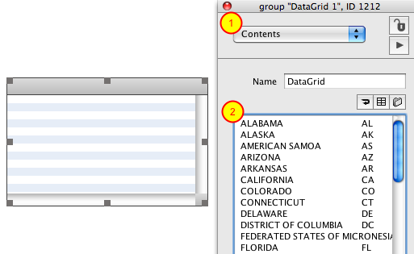

The tab delimited text you entered in the field will appear as columns
in the data grid (1). The **Property Inspector** automatically creates a
column in the Data Grid for each column in the text you provide (2).

#### Customizing Columns

Now that you've populated a Data Grid Table with some data let's look at
the columns in the Data Grid.

Normally when you work with a Data Grid Table you will create columns in
the **Property Inspector** in advance using the "+" button (1). Seeing as
the columns needed already exist you can go through and rename 
*Col 1* to *state* and *Col 2* to *code* (2).

Note that a label for the columns (3) has also been assigned . Labels are useful
for customizing the column labels in the Data Grid Table.

#### Populate Data Grid Using dgText Property

Now that you have defined your columns let's look at how to populate a
Data Grid Table by setting the **dgText** property. Here is an example
handler (with comments) that you can place in a button.

>**Note:** Verify that the name of your data grid matches the name used 
> in the code below otherwise an error will occur when you try to run 
> it.

    on mouseUp
      ### Create tab delimited data.
      ### Note that first line has name of columns.
      ### Providing names tells Data Grid how to map
      ### data to appropriate columns.
      put "state" & tab & "code" & cr & \
      "ALABAMA" & tab & "AL" & cr & \
      "ALASKA" & tab & "AK" into theText
      ### Let Data Grid know that first line has column names
      put true into firstLineContainsColumnNames
      set the dgText [ firstLineContainsColumnNames ] of group "DataGrid" to theText
    end mouseUp

Executing the above code would give you the following result in the Data 
Grid table.

#### Populating the Data Grid Using dgData Property

Here is an example of populating the Data Grid Table by setting the
**dgData** property to an array. The end result is the same as the previous
step.

>**Note:** Verify that the name of your data grid matches the name used 
> in the code below otherwise an error will occur when you try to run 
> it.

    on mouseup
      ### Create a nested array.
      ### Array key names in the 2nd dimension
      ### dictate values for individual columns
      put "ALABAMA" into theDataA[1]["state"]
      put "AL" into theDataA[1]["code"]
      put "ALASKA" into theDataA[2]["state"]
      put "AK" into theDataA[2]["code"]
      set the dgData of group "DataGrid" to theDataA
    end mouseUp
    
### How Do I Create My First Data Grid Form?

This lesson will show you how to create a bare bones data grid form.
Data grid forms are useful when you need a less rigid layout than
columns in a table provide. A data grid form gives you complete control
over the look and feel of each record you display.

#### Locate Data Grid on Tools Palette

#### Drag Data Grid Onto Card

#### Change Style to "Form"

Select the Data Grid and open the LiveCode **Property Inspector**. Change
the style to **form**.

#### Add Some Text

Now you can assign some text to the data grid. By default a data grid
will render some basic data without you having to customize the row
template. To assign some text:

1. Switch to the Contents pane of the **Property Inspector**. (1)

2. Type or paste some line delimited text into the field. (2)

#### Result

That's it! The data you entered in the field will appear in the data
grid. Now you are ready to customize the look and feel of your records
by modifying the row template.

You should note that while you can assign line delimited text to a data
grid form, the data grid really works with multi-dimensional arrays
under the hood. By using arrays you can store and display all different
kinds of data in a data grid. Being able to assign the **Contents** property is
merely a convenience.

### Example: Creating a List of People

This lesson provides a low level detail, step-by-step example of creating a
custom data grid form. Download the attached sample stack to see
the scripts.

#### Attached Files

[datagrid_sampler.zip](http://lessons.livecode.com/s/lessons/files/13?lesson_id=7305)

#### What You Will Create

This is the data grid that you will create. Each row displays a name, a
title and an image.

#### Add Data Grid to Card

To begin, drag a data grid from the **Tools palette** onto your card.

#### Change Data Grid Style

Select the data grid and from the **Basic Properties** pane of the
**Property Inspector** change the style of the data grid to **Form.**

#### The Data That Is Going to Be Displayed in Each Row

Now you are going to design the row template for the data grid form. The
row template dictates how each record in the data grid will be
displayed.

Before you start editing the row template you need to know about the
data that will be displayed each row. This screenshot shows an excerpt
from the code that populates the data grid using a multi-dimensional
array (look in the card script of the example stack). Each row will have
access to the data stored in the *FirstName*, *LastName*, *Title* and
*ImageURL* keys of the array.

You are now going to add UI controls to the row template in order to
display the data for each of these keys.

#### Edit the Row Template

With the data grid selected, click on the **Row Template** button in the
**Property Inspector** to open the card containing row template controls.

#### Edit the Row Template Group

In order to customize the look you need to edit the contents of the
template group.

1. Make sure the **Edit** tool is selected.
2. Make sure that **Select Grouped** IS NOT active.
3. Select the row template group.
4. Click **Edit Group** in the LiveCode toolbar.

#### Rename Label Field

The default template group has a field named *Label*. Click on the left
side of the gray rectangle to select it.(1)

Open the **Property Inspector** for this field and from the **Basic** pane (2) change
the name of the field to *Name* (2). Switch to the **Contents** pane and assign 
*Name* as the content (3).

#### Make Name Field Bold

With the *Name* field still selected go the **Text Formatting** pane of the 
**Property Inspector** (1) and  change the **Style** to **Bold**(2).

#### Add Title Field

Drag a label field from the Tools palette (1).

 
Name it *Title* (2) and assign *Title* to the content (3).

#### Change Text Alignment

Change the text alignment of the field to the left side using the **Text
Formatting** pane of the **Property Inspector**.

#### Add an Image and Resize the Background Graphic

Now drag an image object into the group using the **Tools palette** (1).
With the image selected, select the **Position** pane on the **Property Inspector** 
(2) and set the **width** and **height** of the image to 48 pixels (3). 
Also check the **Lock size and position** checkbox (4) so that any image is scaled to 
fit within these bounds.

Finally, select the **Background** graphic (5) and resize it so that it frames the other 
controls. In the example stack the **width** of the graphic is 214 and the **height** is 56.

#### Stop Editing the Row Template Group

You are now done adding the UI objects to the row template group. From
the **Object** menu (1), select **Stop Editing Group**. You can then **Close** and 
**Save** the **row template**

#### Edit the Row Behavior

Now that you have designed the controls for each row you need to write
the script that will move data into the controls and position them on
the screen.

Click on the **Edit Script** button in the **Property Inspector** under **Row Behavior**
to begin editing the row behavior script.

#### The FillInData Message

In the script that opens when you click the Row Behavior button you will
find a command named **FillInData**. This is where you move data from
the pDataArray parameter into the controls you created.

*pDataArray* is an array with the keys *FirstName*, *LastName*, *Name* and
*Title*. The code that moves the values from the array into the UI
controls is pretty straightforward.

1. Assign the values of the *FirstName* and *LastName* keys to the *Name* field.
2. Assign the value of the *Title* key to the *Title* field.
3. Assign the value of the *Image URL* key to the **filename** property of the image control.

You don't need to worry about positioning any of your controls in the
**FillInData** command. You just need to write the code that assigns the
data to the UI controls.

***Copy & Paste***

	on FillInData pDataArray
	--This message is sent when the Data Grid needs to populate
	-- this template with the data from a record. pDataArray is an
	-- an array containing the records data.
	-- You do not need to resize any of your template's controls in
	-- this message. All resizing should be handled in resizeControl.
	-- Example:
	set the text of field "Name" of me to pDataArray["LastName"] & \
	    comma & space & pDataArray["FirstName"]
	set the text of field "Title" of me to pDataArray["Title"]
	set the filename of image "image" of me to pDataArray["Image URL"]
	end FillInData

#### The LayoutControl Message

The **LayoutControl** message is where you position all of your
controls. For this template you begin by positioning the image (1). Next
you extend the *Name* and *Title* fields to the edge of the image (2).
Finally you resize the *Background* graphic to fill the entire row
rectangle.

***Copy & Paste***

    on LayoutControl pControlRect
      local theFieldRect,theRect
      -- This message is sent when you should layout your template's controls.
      -- This is where you resize the 'Background' graphic, resize fields and
      -- position objects.
      -- The first thing you should do is capture 'the rect of me'.
      -- For fixed height data grid forms you can use items 1 through 4 of the rect as
      -- boundaries for laying out your controls.
      -- For variable height data grid forms you can use items 1 through 3 of the rect as
      -- boundaries.
      -- Example:
      set the right of image "image" of me to item 3 of pControlRect - 5
      put the left of image "image" of me into theLeft
      put the rect of field "name" of me into theRect
      put theLeft - 10 into item 3 of theRect
      set the rect of field "Name" of me to theRect
      put the rect of field "title" of me into theRect
      put theLeft - 10 into item 3 of theRect
      set the rect of field "Title" of me to theRect
      set the rect of graphic "Background" of me to pControlRect
    end LayoutControl

#### Set the Data of the Control

This is an example of a handler that populates the data grid with data
by setting the **dgData** property. The **dgData** property accepts a
multi-dimensional array. The first dimensions is an integer representing
the row. The second dimension are the key/values you want to pass to
each row.

You can find this handler in the card script of the example stack.

***Copy & Paste***

    command uiPopulatePeople
      put "images/" into theImageFolder
      put "Lucky" into theDataA[1]["FirstName"]
      put "Day" into theDataA[1]["LastName"]
      put "Three Amigo" into theDataA[1]["Title"]
      put theImageFolder & "monkey.jpg" into theDataA[1]["Image URL"]
      put "Dusty" into theDataA[2]["FirstName"]
      put "Bottoms" into theDataA[2]["LastName"]
      put "Three Amigo" into theDataA[2]["Title"]
      put theImageFolder & "monkey.jpg" into theDataA[2]["Image URL"]
      put "Ned" into theDataA[3]["FirstName"]
      put "Nederlander" into theDataA[3]["LastName"]
      put "Three Amigo" into theDataA[3]["Title"]
      put theImageFolder & "monkey.jpg" into theDataA[3]["Image URL"]
      put "Jane" into theDataA[4]["FirstName"]
      put "Blue" into theDataA[4]["LastName"]
      put "Secret Agent" into theDataA[4]["Title"]
      put theImageFolder & "monkey.jpg" into theDataA[4]["Image URL"]
      put "Jefferson" into theDataA[5]["FirstName"]
      put "Blue" into theDataA[5]["LastName"]
      put "Secret Agent" into theDataA[5]["Title"]
      put theImageFolder & "monkey.jpg" into theDataA[5]["Image URL"]
      lock screen
      set the dgData of group "DataGrid 1" to theDataA
      ### Hilite first row
      set the dgHilitedLines of group "DataGrid 1" to 1
      unlock screen
    end uiPopulatePeople
   
It is called by a button placed on the card **Populate Data Grid** with script

    on Mouseup
      uiPopulatePeople
    end Mouseup
    

#### The Result

After calling the **uiPopulatePeople** command the Data Grid should look
something like this (1).

Once you have set the **dgData** property you can refresh the data grid to
see any of the changes made to the row template. You can send the
**ResetList** message to the data grid, or press the **Refresh Data
Grid** button on the Basic Properties pane of the **Property Inspector** (2)
to redraw the data using the updated template.

#### Troubleshooting: Row Height

By default a data grid uses a fixed height for each row. If you have not
set the row height the first time you populate the data grid with data
then the value that is current for the data grid may not be suitable. 

You can change the height of the row template by updating the 
**row height** in the **Property Inspector**.(1)

Alternatively you could also simply uncheck the **Empty row height** property.(2)

## Data Grid Fundamentals

### What Is This "Data Grid Templates" Stack That Appeared in My Project?

A data grid relies on record templates (forms) and column templates
(tables) to display data. These templates are merely LiveCode controls
that will be used to visualize your data. In order to manage these
controls the LiveCode IDE creates a stack named Data Grid Templates the
first time you add a data grid to a card in your stack.

#### Data Grid Templates Stack

Open the **Project Browser** (from the **Tools** menu) and expand your stack by 
clicking on the "+" sign. Here you will see the newly created **Data Grid 
Templates** stack.
 

This stack (1) contains a single card (2) for each data grid you add to a stack.
Each card contains the template(s) and behaviors that the data grid will
use to display the data.

#### Data Grid Templates Card Contents

This screenshot shows some controls that might appear on a Data Grid
Templates card. The **Row Template** (1) is the group that contains either
all of the controls for a form or the **column templates** for a
table. The IDE assigns the **Row Template** group to the **dgProps
["row template"]** property of the data grid.

The **Behavior Script** button is assigned as the behavior to the **Row
Template** group and is used for data grid forms. This script controls
how data is inserted into the **Row Template** controls and how those
controls are positioned.

#### Opening the Data Grid Templates Stack

The LiveCode IDE makes it easy to locate your templates in the Data Grid
Templates stack. Simply select the data grid control and click the **Row
Template...** button (1) in the **Data Grid** (2) pane of the
inspector.

The card containing the template(s) for the selected data grid will open.

### What Is a Row Template?

The reason a data grid can be customized is because it uses "templates"
to represent data. A template is merely a Livecode group that will be
copied and used to draw your data on the screen. When working with data
grid forms we refer to this group as a "Row Template".  

#### Row Template

The **Row Template** is a Livecode group control. This group represents
a single record in the data that you are displaying in a data grid form.
This group can contain any Livecode control and the look and layout are
entirely controlled by you.

#### How a Record Template Is Used

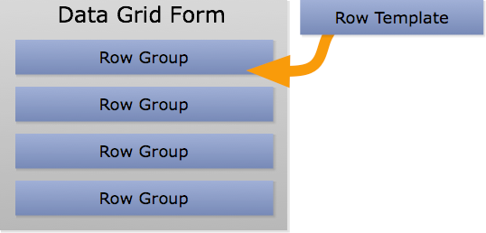

When the data grid form displays your data it copies the **Row
Template** into itself. It makes just enough copies to cover the visible
area and then inserts data into these copies of the **Row Template**. As
the user uses the scrollbar to scroll through the data the same copies
are used but new data is inserted. This means that the data grid form is
never drawing more records than the user can actually see which means
the data grid is fast.

### What Is a Column Template?

Like data grid forms, data grid tables also use templates. The
difference is that when working with a table you create a template to
represent each column rather than a template to represent each row. We
refer to these templates as **Column Templates**. A **column template** is
similar to a **row template**. One difference is that a **column template**
is not limited to being a group. You can use a field for a template, a
graphic, a button, etc.

#### How a Column Template Is Used

When your data is drawn into a data grid table each **column template** is
copied into the data grid as many times as necessary in order to fill
the visible area. Data is then inserted into these templates as the user
scrolls.

### How Do I Populate a Data Grid With Data?

There are a couple of ways you can assign data to a data grid. This lesson
will show you how.

#### Use The Property Inspector

You can use the Contents pane of the **Property Inspector** to quickly
assign data to a data grid. This does not provide as many options as
setting the properties mentioned below but it will get you up and
running quickly.

1. Switch to the **Contents** pane of the **Property Inspector**.
2. Enter some tab delimited text into the field.

When you use the **Property Inspector** to assign data to the data grid the
**Property Inspector** sets the **dgText** property of the data grid.

#### Set the dgText Property

The data grid works with arrays behind the scenes but in the interest of
making life easier there is a **dgText** property. The syntax is as follows:

    set the dgText [ pFirstLineContainsHeaders ] of group "Data Grid" to pText

*pText* is assumed to be a collection of data where each row is
delimited by the return character and each item is delimited by a tab.
You can map each item of each line in *pText* to a particular key in an
array (and thus a table column) by passing in true for
**pFirstLineContainsHeaders**. If true then the data grid will extract the
first line of *pText* and match the values for existing internal key/column
names. The default value for **pFirstLineContainsHeaders** is false.

If you set the **dgText** of a **data grid table** then all data will be
imported and assigned to the appropriate column depending on the value
of **pFirstLineContainsHeaders**. Normally you should set this property to
**true** and provide the header that maps each item of each line to a
specific column. 

>**Note:** that if **pFirstLineContainsHeaders** is true then the named columns 
>must ***already*** exist in your data grid table in order to be displayed. Setting 
>**pFirstLineContainsHeaders** to **true** does not create the headers for you.

If **pFirstLineContainsHeaders** is false then the **columns** property of the
data grid is used for mapping. For example, the first item of a line of
*pText* would be assigned to the column that appears on the first line
in the **columns** property of the data grid. If line 1 of *pText*
contains more items than there are columns in the table then new columns
are added. Any new columns are named "Col 1", "Col 2", etc.

If you set the **dgText** property of a **data grid form** then the data
will be imported but it is up to you to modify your **Row Template
Behavior** to display the imported data correctly. If
**pFirstLineContainsHeaders** is **false** then each item of each line in
*pText* will be named "Label X" (where X is the item number) in the
array that is passed to **FillInData**.

#### Set the dgData Property

The **dgData** property of a data grid is a multi-dimensional array and is
the actual format that the data grid works with under the hood. The data
grid expects the first dimension of the array to be integers. The number
of keys in the first dimension represents the number of records being
displayed in the data grid. Here is an example with five records:

	theDataA[1]

	theDataA[2]

	theDataA[3]

	theDataA[4]

	theDataA[5]

You then store all of your custom data in the second dimension. The
following is how you would display five records, each with a **Name**
property:

	theDataA[1]["Name"]

	theDataA[2]["Name"]

	theDataA[3]["Name"]

	theDataA[4]["Name"]

	theDataA[5]["Name"]

In the example code above there are 5 records, each with a **FirstName**,
**LastName** and **Title** property. Your templates will have access to
these properties when the time comes to draw the data on the screen.

>**Important:** if you are using a data grid table then a key in the
> array must match the name of a column in the table in order for that variable (column)
>to be displayed. So if you have a column named *Image URL* in your table you
> must have a corresponding key named *Image URL*:

	theDataA[1]["Image URL"]

### How Do I Customize a Form's Row Template?

When you drop a data grid from the **Tools palette** onto a card a record
template is created for you automatically.  This template will display
line delimited text but you will most likely want to customize the
template. This lesson will show you how to begin customizing the
template to meet your needs.

#### Reveal the Row Template

Select the data grid (1) and open the **Property Inspector** (2). Click on the **Row
Template...** button (3) to open the card that the data grid's template is
on.

The template for the data grid will open. You can now edit the controls
within the **Row Template** group in order to customize the look and
feel according to your needs.

#### Example of a Customized Template

Here is an example of a customized template. A *Name* (1) and *Title*
field (2) have been added as well as a control for displaying a picture of the person
(3).

#### Edit Behavior

After customizing the controls in your template you need to update the
**behavior** associated with the template. The behavior script is where
you tell the data grid what data goes in which controls as well as how
to position the controls.

Click the **Edit Script...** button to open the behavior script.

#### Edit the Behavior Script

The default behavior script contains comments explaining what to do in
each handler. The **FillInData** message is where you will move data from a
record into a LiveCode control. To do this you assign keys of *pDataArray*
(1) to a control (2).

Note that the first parameter passed to **FillInData** is an array
representing the current row being displayed. Also note how this is
different than the first parameter passed to **FillInData** for a
**column template** which is the value of the column.

>**Important:** Make sure that you always refer to controls in the
> template using ***of me*** (3). Since multiple copies of the template will
> be made you will have multiple controls with the same names. Using ***of me*** 
>removes any ambiguity and ensures that data is displayed in the
> correct control.

#### An Example of a Customized Behavior

This is an example of a behavior that has been customized. The **dgData** of
the data grid this template is associated with looks like this:

	theDataA[1]["FirstName"]

	theDataA[1]["LastName"]

	theDataA[1]["Title"]

	theDataA[2]["FirstName"]

	theDataA[2]["LastName"]

	theDataA[2]["Title"]

When filling in the data the *FirstName* and *LastName* values are 
placed into a *Name* field (1) and the *Title* value into a *Title* field (2).

This example also shows how to use **LayoutControl** to layout your **row
template**. Notice how the rectangle of the **row template** is captured at the
beginning (3) and then used to position all of the other elements (4).

### How Do I Customize a Table's Columns?

A **column template** is nothing more than a LiveCode control that is named
after a column in your table. This control is located in the **row
template** group for your data grid. This lesson will discuss how to
create templates for columns in a data grid table.

#### Use Property Inspector to Create a Column Template

In the **Property Inspector**, select the column you would like to customize
(1). Click the "+" button at the bottom of the pane to create a **column
template** (2).

#### Edit the Row Template Group

In order to customize the look you need to edit the contents of the
template group. Select it (1) and click **Edit Group** (2) in the LiveCode
toolbar.

#### Edit Column Group

Now select the column group (1) and click **Edit Group** again (2). At
this point you can customize what controls appear in the column template.

#### A Column Template

In this example there are three controls for three different
columns in the data grid table.

** A field named *Time* that formats data into a time format (1) (Just rename the field that 
is included in the row template by default).
** A group named *My Rating*. This group has some widgets that display images of a star. (2)
** A button named *Genre* that offers different Genre selections. (3)

Here is what those controls look like in the **Project Browser**. Notice
how all of the controls are located in the **Row Template** group.

#### Supporting Controls

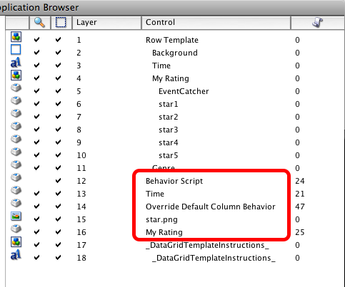

The controls created (*Time* field, *Genre* button and *My Rating*
group) each have behaviors associated with them. These were created automatically 
and are stored in appropriately named buttons.

#### Behavior Example

Here is what the **FillInData** handler looks like for the *My Rating* column (as 
stored in the **My Rating Behaviour** button). *pData* (1) contains the value of the *My 
Rating* column for the row being displayed. 

Note how this parameter differs than the parameter sent to **FillInData** for a 
**row template**. For a **row template** the parameter passed in is an array.

You then use that value to determine how many stars to display (2).

#### Result

Here is what the table looks like now that the custom column templates have been 
defined. The table found controls named *Genre*, *Time* and *My
Rating* in the record template group so those were used to render the
data for those three columns.

## Working With Data Grids (Forms & Tables)

### How Do I Determine the Selected Line?

#### The dgHilitedLines Property

You can get the selected line or lines of a data grid using the **dgHilitedLines**
 property.

#### Determining the Line in a Row's Behavior

If we need to determine the line number of a row's behavior script we
can access the **dgLine** property of the row template. The data grid
automatically assigns the **dgLine** and the **dgIndex** property when
displaying the row.

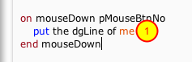

>**Note:** that the use of ***of me*** (1) can be used because the **mouseDown**
handler is in the **row template** group behavior script (which is as if the
script were in the **row template** group itself). If you were to put the
**mouseDown** handler in the script of a button that was located in the row
template group then you would have to use ***of the dgControl of me***
instead.

### How Do I Get Data Associated With a Row or Column?

This lesson will show you how to get the array of data associated with a
row in a Data Grid form as well as how to get the data associated with a
row's column in a Data Grid table.

To get the array of data from a Data Grid you can use one of the
following properties:

• the **dgDataOfIndex**

• the **dgDataOfLine**

Both properties return the array associated with a row in the Data Grid,
they just allow you to target the row differently. **dgDataOfLine** allows
you to target the row in the order it appears visually in the Data Grid.
**dgDataOfIndex** allows you to target a row based on the internal index
number that the Data Grid uses to identify the row. This value does not
change, even if you change the sort order for the Data Grid.

If you just need a particular column from a row then you can use one of
the following functions:

• **GetDataOfIndex**()

• **GetDataOfLine**()

Both of these functions return the value associated with a particular
key, or column, for a row.

Let's look at some examples of how to use these properties and
functions.

#### Getting Data Associated With the Selected Row

If you want to get the data associated with the selected row use the
**dgHilitedLines** property. The value of that property can be used in
conjunction with the **dgDataOfLine** property. Here is an example of a
script that could be placed in a button. The Data Grid group script is
NOT in the message path for this example:

    on mouseUp pBtnNum
      if pBtnNum is 1 then
        put the dgHilitedLines of group "DataGrid 1" into theLine
        put the dgDataOfLine[theLine] of group "DataGrid 1" into theDataA
        ## theDataA is now an array variable.
        ## In the case of the Data Grid pictured above the keys of the 
        ## array are id, FirstName, LastName and Title.
        ## This answer dialog will display: Dusty Bottoms
        answer theDataA["FirstName"] && theDataA["LastName"]
      end if
    end mouseUp

Now let's assume that you only want to get the **id** value for the
selected row without fetching the entire array. You can use
**GetDataOfLine** to accomplish this. You need to keep in mind that
**GetDataOfLine** (and **GetDataOfIndex**) is a function defined for a Data
Grid. That means that the Data Grid group ***MUST*** be in the message path.
If the Data Grid group is not in the message path you would need to use
the **call** command.

To illustrate how to use **GetDataOfLine** let's look at how you could
define your own custom property for a Data Grid. The following code
defines a **uSelectedID** custom property that returns the **id** of the
selected row. This code would be placed in the Data Grid group script.

    getProp uSelectedID
      put the dgHilitedLines of me into theLine
      return GetDataOfLine(theLine, "id")
    end uSelectedID

You can now access this custom property from any script in your
application:

    put the uSelectedID of group "DataGrid" into theSelectedID

#### Getting Data When the Selection Changes

When the user makes a new selection in a Data Grid the **selectionChanged**
message is sent to the Data Grid. The following **selectionChanged** message
could appear in the script of your Data Grid group:

    -- example that would be placed in the data grid script.
    on selectionChanged pHilitedIndex, pPrevHilitedIndex
      put the dgDataOfIndex [ pHilitedIndex ] of me into theDataA
      ## Now call handler in card script that loads info for selected person.
      uiViewRecordOfID theDataA["id"]
    end selectionChanged

#### Getting Data in a Row Behavior

If you want to get the data in a **row behavior** script you can use the
**dgIndex** or **dgLine** custom properties of the row control. Here is an
example that could be used in a Data Grid's **form** behavior script:

    ##Data Grid Row behavior script
    
    on mouseUp pMouseBtnNum
      if pMouseBtnNum is 1 then
        ## the dgIndex is a custom property of this row.
        ## the dgControl is a custom property of the data grid itself.
        put the dgDataOfIndex[ the dgIndex of me] of the dgControl of me into theDataA
        uiViewRecordOfID theDataA["id"]
      end if
    end mouseUp

If you wanted to move this same **mouseUp** code into the Data Grid script
itself then you would change the ***me*** references to ***target*** and add a
check to ensure that the user clicked on a row. This example also uses
**GetDataOfIndex** rather than **dgDataOfIndex** to show an alternative.

    ##Data Grid Form Example: Data Grid Script
    
    on mouseUp pMouseBtnNum
      if pMouseBtnNum is 1 then
        ## the dgIndex is a custom property of the row.
        put the dgIndex of the target into theIndexThatWasClickedOn
        if theIndexThatWasClickedOn is not empty then
          put GetDataOfIndex(theIndexThatWasClickedOn, "id") into theID
          uiViewRecordOfID theID
        end if
      end if
    end mouseUp

#### Getting Data in a Column Behavior

If you want to get the data in a column behavior script you can use the
**dgIndex** or **dgLine** and **dgColumn** custom properties of the column control.
Here is an example that could be used in a Data Grid column behavior
script:

***Data Grid Table Example: Column Behavior***

    on mouseUp pMouseBtnNum
      if pMouseBtnNum is 1 then
      ## the dgIndex is a custom property of the row.
      ## the dgColumn is a custom property of the column.
        put GetDataOfIndex(the dgIndex of me, the dgColumn of me) into theColumnValue
        ## Do something with column value..
      end if
    end mouseUp

If you wanted to move this same **mouseUp** code into the Data Grid script
itself then you would change the ***me*** references to ***target*** and add a
check to ensure that the user clicked on a column:

***Data Grid Table Example: Data Grid Script***

    on mouseUp pMouseBtnNum
      if pMouseBtnNum is 1 then
        ## the dgIndex is a custom property of the row.
        ## the dgColumn is a custom property of the column.
        put the dgColumn of the target into theColumn
        if theColumn is not empty then ## User clicked on a column
          put GetDataOfIndex(the dgIndex of the target, theColumn) into theColumnValue
          ## Do something with column value..
        end if
      end if
    end mouseUp

### How Do I Add a Row of Data to an Existing Data Grid?

Sometimes you may want to add a row of data to a Data Grid without
having to set the **dgData** or **dgText** property. You can add a single row of
data by calling the **AddData** or **AddLine** commands of a Data Grid.

#### Using AddData

To use **AddData** you create an array containing the values for the new
row. Here is an example of how to add a new row and have it appear as
line 1 in a Data Grid. 

>**Note:** This example script resides outside of the Data
>Grid group script so **AddData** is not in the message path. This is why the
>dispatch command is used.

    put "First Name" into theDataA["FirstName"]
    put "Last Name" into theDataA["LastName"]
    put "Title" into theDataA["Title"]
    put  1 into theLineNo
    dispatch "AddData" to group "DataGrid" with theDataA, theLineNo
    put the result into theNewIndex -- integer if successful, error string otherwise

#### Using AddLine

To use **AddLine** you create a tab delimited string of text containing
the values for the new row. You also need to tell the Data Grid the
names of the columns that the data should map to. Here is an example of
how to add a new row and have it appear as the last line in a Data Grid.

    put "First Name" & tab & "Last Name" & tab & "Title" into theRowData
    put "FirstName" & cr & "LastName" & cr & "Title" into theDataColumns
    put the dgNumberOfLines of me + 1 into theLineNo
    AddLine theRowData, theDataColumns, theLineNo

>**Note:** This example script resides inside the Data Grid group script so 
>**AddLine** is in the message path.

#### Scrolling Data Into View and Getting the Data Control

After you add the data to the Data Grid you may want to scroll the new
row into view. You can call **ScrollIndexIntoView** or
**ScrollLineIntoView** to do this.

    ScrollIndexIntoView theNewIndex

or

    ScrollLineIntoView theLineNo

### How Do I Update Data in a Row?

This lesson will show you how to update data in a row.

#### Updating a Row's Data and Refresh Data Grid Automatically

You can update data in a row by setting the **dgDataOfIndex** or
**dgDataOfLine** properties. You can set either property to an array
containing the values for the row.

    put "New First Name" into theDataA["FirstName"]
    put "New Last Name" into theDataA["LastName"]
    put "New Title" into theDataA["Title"]
    set the dgDataOfIndex[ the dgHilitedIndex of group "DataGrid" ] \
         of group "DataGrid" to theDataA

The data grid will now refresh with the new data you assigned to the
highlighted index.

#### Updating a Row's Data Without Refreshing the Data Grid

If you want to update the data in a row without automatically refreshing
the data grid then you can use **SetDataOfIndex**. You can then use the
**RefreshList** command to redraw the data grid.

Example that sets all values at once:

    put "New First Name" into theDataA["FirstName"]
    put "New Last Name" into theDataA["LastName"]
    put "New Title" into theDataA["Title"]
    dispatch "SetDataOfIndex" to group "DataGrid" \
    with the dgHilitedIndex of group "DataGrid", empty, theDataA
    dispatch "RefreshIndex" to group "DataGrid" with the \
        dgHilitedIndex of group "DataGrid"

Example that sets individual keys of the row one at a time:

    dispatch "SetDataOfIndex" to group "DataGrid" with the \
        dgHilitedIndex of group "DataGrid", "FirstName", "New First Name"
    dispatch "SetDataOfIndex" to group "DataGrid" with the \
        dgHilitedIndex of group "DataGrid", "LastName", "New Last Name"
    dispatch "SetDataOfIndex" to group "DataGrid" with the \
        dgHilitedIndex of group "DataGrid", "Title", "New Title"
    dispatch "RefreshIndex" to group "DataGrid" with the \
        dgHilitedIndex of group "DataGrid"

### How Do I Clear Data From a Data Grid?

Clearing the data out of a Data Grid is as easy as setting the **dgData**
(or **dgText**) of the Data Grid to **empty**.

    set the dgData of group "DataGrid" to empty

### How Do I Add a mouseDown Event to the Data Grid Without Breaking It?

This lesson will show you how you to write your own **mouseDown** event in a
Data Grid without breaking the default Data Grid behavior. You need to
know how to do this when showing a contextual menu or if during the
**mouseDown** event you want to use the data in the row the user clicked on.

When you add a **mouseDown** handler to a Data Grid you are intercepting a
message that the Data Grid normally handles. Doing so changes the
behavior of the Data Grid and you need to take that into account when
coding your **mouseDown** handler.

#### What Doesn't Work

If you were to place the following code in your Data Grid script you
would not get the result you were expecting. The reason is that the
line that was clicked on would not be selected until after your popup
menu was displayed. Why? Because the Data Grid behavior script processes
**mouseDown** AFTER the **mouseDown** handler you have defined in the Data Grid 
script itself.

    on mouseDown pMouseBtnNum
      if pMouseBtnNum is 3 then
        ## Oops! Line that user clicked on has not been selected since
        ## Data Grid has not processed mouseDown yet. Contextual
        ## menu won't target proper line.
        popup button "MyContextualMenu"
      end if
      pass mouseDown
    end mouseDown

#### What Does Work: dgMouseDown

In order to work around this the Data Grid wraps all **mouseDown**
functionality in a handler named **dgMouseDown**. You can call this
handler in your code in order to get the expected results.

The following examples show how you can define a **mouseDown** handler in a
Data Grid script.  In the examples the line the user clicks on will be
selected before the custom **mouseDown** code executes. Note that the **mouseDown** 
message is not passed after calling **dgMouseDown**. This would only repeat the
call to **dgMouseDown** which is not the desired behavior.

***Example: Contextual Menu***

    on mouseDown pMouseBtnNum
      ## Let Data Grid process mouseDown and select row that was clicked on
      dgMouseDown pMouseBtnNum
      ## Now contextual menu will act on the proper line.
      if pMouseBtnNum is 3 then
        popup button "MyContextualMenu"
      end if
      ## Don't pass mouseDown
    end mouseDown

***Example: Getting Value From Cell Clicked On (Data Grid table)***

    on mouseDown pMouseBtnNum
      ## Let Data Grid process mouseDown and select row that was clicked on
      dgMouseDown pMouseBtnNum
      ## Get value of column clicked on. The column name can be accessed in the
      ## dgColumn custom property of the column control (the target).
      put GetDataOfIndex(the dgHilitedIndexes of me, the dgColumn of the target) into \
          theColumnValue
      ## Don't pass mouseDown
    end mouseDown

### How Can I Store an Option Menu Value When the User Makes a Selection?

This lesson will demonstrate how to update the data associated with a
row in a data grid when the user makes a selection from an option menu.

#### Example Data Grid

Here is the data grid we will be working with. *Col 2* has been given the name *Rating* 
and has been customized with an **option menu**. What we are going to do is update the
data associated with a row to reflect the selection the user makes in
the **option menu**.

#### Edit Column Behavior

We need to customize the column behavior. From the **Columns** pane (1)
in the **Property Inspector** select the *Rating* column (2) and then click the **Column
Behavior** button (3).

#### FillInData

In the **FillInData** handler we are setting the **menuhistory** based on
the value of *pData* that is passed in. As there is only a single button in the 
*Rating* column template, it can be referreed to as ***button 1 of me***.

#### menuPick

A **menuPick** handler needs to be added to the column behavior script in
order to accomplish the goal. When the user makes a selection from the
option menu the **menuPick** message is sent by the engine. The **SetDataOfIndex** 
command to can then update the value for the column.
The parameters for **SetDataOfIndex** are the **index**, the **column name** and
the **new value**. Since the above script is in a column behavior we can use
the **dgIndex of me** (1) for the **index** and the **dgColumn of me** (2) for the
**column name**.

#### The Behavior in Action

Here is what the data grid's internal array looks like before making a
menu selection.

After making a selection for row 2 (1) the internal value was updated (2).

### How Do I Refresh a Data Grid After Making Changes to a Template Through Script?

The command **ResetList** redraws a data grid after having copied in fresh copies of any 
templates. Here is an example of how you might use it.

    ## Get reference to group that serves as row template for data grid
    put the dgProps["row template"] of group "DataGrid" into theRowTemplate
    
    ## For tables get reference to custom template for column
    put the long id of group "My Column" of theRowTemplate into theColTemplate
    
    ## Make any updates to template
    set the text of button 1 of theColTemplate to "New Option1" & cr & "New Option 2"
    
    ## Refresh the data grid
    dispatch "ResetList" to group "DataGrid"

Or you can simply issue it from the message box.

### How Do I Use a Template in Multiple Data Grids?

If your application needs to use the same style of data grid in multiple
places in your project then you can easily share the same row template
between multiple data grids. This lesson will show you how.

#### Create First Data Grid

The first step is to create your first data grid and customize the
template (1). The data grid property that determines the **Row
Template** that is used to draw the data grid is **dgProps["row
template"]**. The message box shows a query for this property
in order to get a reference to the data grids row template (2).

#### Create Other Data Grids

Now you can add other data grids to your project. Here the second data grid is added to 
the same stack as the first. After adding the data grid you can set the **dgProps["row 
template"]** property to the **long id** of the first data grid's **row template**. 

>You can also see that the **Row Behavior** for *datagrid 2* is listed as coming 
>from the same template card as for the original *DataGrid 1* which was 
>obtained in the previous step.

Alternatively you could also do the following: (here we are setting the properties 
of a data grid in a second stack)

    set the dgProps["row template"] of group "DataGrid 1" of stack "Untitled 1"\
     to the dgProps["row template"] of group "DataGrid 1" of stack "my program"
    

>**Note:** The LiveCode IDE creates a card in the **Data Grid Template XXX**
> stack with a **row template** every time you drag a data grid on to a card.
> You may want to delete this card if you aren't going to be using that
> template.

#### Result

See how the **Row Behavior** script (1) correctly identifies the template from the first 
stack (**Data Grid Sampler**) and how this indeed does contain the **Row Template** (2) 
being used in the second stack.

### How Can I See What the Data Grid's Internal Array Currently Looks Like?

#### Using PrintKeys

A data grid has a helper command that will print off the first line of
each key in the internal data array. If you need to quickly see what the
internal array looks like just send **PrintKeys** to the data grid.
This will print the array in the message box.

>**Note:** You should not rely on **PrintKeys** for anything other than taking 
> a quick peek at the array. It only prints the first line of each key so 
> it is not a 100% accurate view of the data.

### How Do I Get Aggregate Values for Columns?

This lesson will show you how to add a custom property to a data grid
that returns the aggregate value of a column. Usually this would be used
with data grid tables but works equally as well with data grid forms.

#### Add a getProp to Your Data Grid Script

The simplest way to calculate aggregate values is to add a **getProp**
handler to your data grid script. In this example a custom
property called **uSumOfColumn** (1) has been defined. Passing it a column name (2)
returns the sum of all rows of that column (3).

#### Using the Custom Property

Here is an example of using the custom property. When clicking on the
button (1) the text of another field (in this case "sum") is set to the **uSumOfColumn**
custom property (2).

#### The Result

Here the result has been put into the *Sum* field.

### How Do I Determine if the Data Grid Has Focus?

You can determine if the data grid has focus by performing the following
check:

    if the long id of group "DataGrid" is in the long id of the focusedobject then
    ## Data grid has focus
    end if

### How Do I Export Data From a Data Grid?

This lesson will show you how to get data out of a data grid.

#### The Example Data Grid

The data will be exported from a data grid that looks like this.

#### The Handler for Populating Data Grid

    command uiPopulatePeople
       put "images/" into theImageFolder
       
       put "Lucky" into theDataA[1]["FirstName"]
       put "Day" into theDataA[1]["LastName"]
       put "Three Amigo" into theDataA[1]["Title"]
       put theImageFolder & "monkey.jpg" into theDataA[1]["Image URL"]
       
       put "Dusty" into theDataA[2]["FirstName"]
       put "Bottoms" into theDataA[2]["LastName"]
       put "Three Amigo" into theDataA[2]["Title"]
       put theImageFolder & "monkey.jpg" into theDataA[2]["Image URL"]
       
       put "Ned" into theDataA[3]["FirstName"]
       put "Nederlander" into theDataA[3]["LastName"]
       put "Three Amigo" into theDataA[3]["Title"]
       put theImageFolder & "monkey.jpg" into theDataA[3]["Image URL"]
       
       put "Jane" into theDataA[4]["FirstName"]
       put "Blue" into theDataA[4]["LastName"]
       put "Secret Agent" into theDataA[4]["Title"]
       put theImageFolder & "monkey.jpg" into theDataA[4]["Image URL"]
       
       put "Jefferson" into theDataA[5]["FirstName"]
       put "Blue" into theDataA[5]["LastName"]
       put "Secret Agent" into theDataA[5]["Title"]
       put theImageFolder & "monkey.jpg" into theDataA[5]["Image URL"]
       
      lock screen
      set the dgData of group "DataGrid 1" to theData
      
      ## Hilite first row
      set the dgHilitedLines of group "DataGrid 1" to 1
      unlock screen
    end uiPopulatePeople
    
This is the code that was used to populate the data grid. This shows you
the keys that each record has (*FirstName*, *LastName*, *Title* and *Image URL*).

#### Export Handler

     command uiExportData
       ## Export data to XML
       
       ## Get Data Grid Array
       put the dgData of group "DataGrid 1" into theDataA
       
       ## Get indexes in proper order
       put the dgIndexes of group "DataGrid 1" into theIndexes
       
       ## Prefix XML
       put "<people>" & cr into theXML
       
       ## Loop through data, putting into XML format
       repeat for each item theIndex in theIndexes
          put "<person>" & cr after theXML
          put "<first_name>" & theDataA[theIndex]["FirstName"] & "</first_name>" & cr after theXML
          put "<last_name>" & theDataA[theIndex]["LastName"] & "</last_name>" & cr after theXML
          put "<title>" & theDataA[theIndex]["Title"] & "</title>" & cr after theXML
          put "</person>" & cr after theXML
        end repeat
       
        ## Close root XML tag
        put "</people>" after theXML
        
        put theXML
     end uiExportData

This is an example of how to get data out of a data grid. Begin by
getting the **dgData** array and the **dgIndexes**. The indexes are a comma
delimited list of the keys of the **dgData** in the proper order.

After you have the array and the ordered list of indexes you can loop
through each record in the array. In this example the data is just wrapped in XML tags.

#### Example Output

This is what the output for this example looks like in the message box.

### How Do I Work With Checkboxes in a Data Grid?

This lesson will demonstrate how to associate the hilite state of a
checkbox in a data grid with a row value in the data grid.

***Attached Files***

[Checkbox_Example.livecode](http://lessons.livecode.com/s/lessons/files/303?lesson_id=26382)

#### Adding a Checkbox to a Form

Before you begin, drag a data grid onto a stack and set the style to 
**Form** using the **Property Inspector**.

Click the **Row Template** button to open the template for the data grid.

#### Edit Row Template Group

Now that the card with the data grid row template is visible, open the
**Project Browser** selecting the **Tools > Project Browser**
menu option.

Select the card with your template (it should be the second card under
the Data Grid Templates stack) (1). Next, double-click  the **Row Template**
group on the card (2). Doing so will select the group on the card (3).

Now select the **Object > Edit Group** menu option. This will put the
group in edit mode which will allow you to drag controls from the tools
palette into the group.

#### Add a Checkbox

From the **tools palette**, drag a **checkbox** onto the card and place it in
the upper-left corner. The button will appear in the list of controls in
the **Project Browser**.

#### Edit Checkbox Properties

Open the button's Property Inspector, select the **Position** pane and change the 
**height** to 21. Set the **left** and **top** properties to 0.

#### Delete the Label Field
 
Now that you have added the checkbox button you no longer need the
*Label* field in the row template. We will do this using the **Project Browser**

>**Note:** You need to stop editing the group before returning to the **Project 
>Browser** in order for it to correctly update. Click on the card area under the 
>**checkbox** and then click the **Stop Editing** button on the **Toolbar**. 

>You may also need to **collapse** the card **tree** in the **Project Browser** 
>window and reopen it to force the update to the **Project Browser** display.

In the **Project Browser** select the *Label* field and delete it by pressing the 
***delete***  key on the keyboard.

You will be asked to confirm you wish to delete this object. Check that it is identifying 
the correct object to delete, and then click **OK**.

After deleting the field you should have only the *Background* graphic and the
*Check* checkbox in the **Row Template** group.

#### Edit Row Behavior

Next you need to edit the **Row Behavior** in order to take into account
the new checkbox control.
 

Click the **Edit Script** button.

#### Edit the FillInData Handler
 

In the **FillInData** Handler you need to remove references to the *Label*
field and add code for the *Check* button. The code will set the
**label** of the checkbox to the **label** property of the data grid row.
It will set the **hilited** property to the **checked** property of the
row.

***Copy & Paste***

    on FillInData pDataArray
      -- This message is sent when the Data Grid needs to populate
      -- this template with the data from a record. pDataArray is an
      -- an array containing the records data.
      -- You do not need to resize any of your template's controls in
      -- this message. All resizing should be handled in resizeControl.
      set the label of button "Check" of me to pDataArray["label"]
      set the hilited of button "Check" of me to pDataArray["checked"]
    end FillInData

#### Update LayoutControl and ResetData

The **LayoutControl** and **ResetData** handlers also have references to the *Label* field 
which no longer exists. Update both of those handlers with references to the *Check* button.

***Copy & Paste***

    on LayoutControl pControlRect
      local theFieldRect
      -- This message is sent when you should layout your 
      -- template's controls.
      -- This is where you resize the 'Background' graphic, 
      -- resize fields and position objects.
      -- For fixed height data grid forms you can use items 1 
      -- through 4 of pControlRect as boundaries for laying 
      -- out your controls.
      -- For variable height data grid forms you can use 
      -- items 1 through 3 of pControlRect as boundaries,
      -- expanding the height of your control as needed.
      -- Example:
      put the rect of button "Check" of me into theFieldRect
      put item 3 of pControlRect - 5 into item 3 of theFieldRect
      set the rect of button "Check" of me to theFieldRect
      set the rect of graphic "Background" of me to pControlRect
    end LayoutControl
    
    on ResetData
      -- Sent when data is being emptied because the control is 
      -- no longer being used to display data
      set the text of button "Check" of me to empty
      set the hilite of button "Check" of me to false
    end ResetData

#### Update Data Grid Row Value When User Changes Checkbox State

When the user clicks on the checkbox the hilited state will change. You
need to update the row data in the data grid when this happens so that
the **dgData** array properly represents what is being seen in the
interface. You can do this in the **mouseUp** handler of the behavior
script.

During **mouseUp** the hilited state of the checkbox has been changed and so
it is safe to save the value. You just need to call **SetDataOfLine** and
pass in **the hilite of the target** (the target being the checkbox
button).

Add the following to the behavior script. Make sure and compile the
script afterwards.

***Copy & Paste***

    on mouseUp pMouseBtnNum
      if pMouseBtnNum is 1 then
      ## did they click on the checkbox?
        if the short name of the target is "Check" then
          ## Update internal value in data grid
          SetDataOfLine the dgLine of me, "checked", the hilite \
               of the target
        end if
      end if
    end mouseUp

#### Populate the Data Grid

You have now finished configuring the Data Grid so it is time to test.
Add a button to the stack and name it **Populate grid**.

With the **Edit tool** active, ***right-click*** on the button and select **Edit
Script.**

Add a simple script that will populate the data grid with two rows. Each
has the **label** and **checked** properties that were referenced in the
behavior script earlier.

Paste this script to the button script.

***Copy & Paste***

    on mouseUp
      put "Line 1" into theDataA[1]["label"]
      put "true" into theDataA[1]["checked"]
      put "Line 2" into theDataA[2]["label"]
      put "false" into theDataA[2]["checked"]
      set the dgData of group "DataGrid 1" to theDataA
    end mouseUp

#### Test

After compiling the script, click on the **Populate Grid** button. The
card should now look similar to this.

Try it out. If you click on a checkbox in line 1 it should uncheck. Click on it again 
to check it.

#### Checking/Unchecking All Checkboxes in a Data Grid
 
When working with lists that have checkboxes it is nice to include the
option to check or uncheck all of the items in the list. Let's look at
how to do that.

Add a button to the card and name it **Check/Uncheck**.

Edit the script of the button.

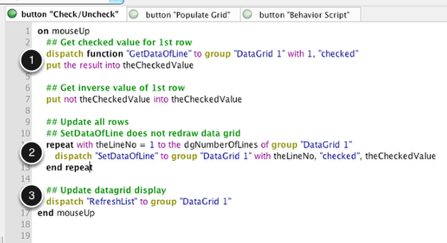

The code for checking/unchecking all items in the list isn't too
complicated. Here is how the logic is broken up:

1. Use the *checked* value of row 1 to decide what to set all of the other rows 
to. Get the current value of row 1 and toggle it.
2. Loop through all lines of the data grid, setting the value of the **checked** property 
of each row to the new value. Use **SetDataOfLine** as this command will not 
redraw the data grid each time it is called.
3. Finally refresh the data grid so that the new row values are used to display each row.

***Copy & Paste***

    on mouseUp
    ## Get Checked Value for 1st Row ##
      dispatch function "GetDataOfLine" to group "DataGrid 1" with \
          1,"checked"
      put the result into theCheckedValue
      
    ## Get inverse value of 1st row
      put not theCheckedValue into theCheckedValue
      
    ## Update all rows
    ## SetDataOfLine does not redraw data grid
      repeat with theLineNo = 1 to the dgNumberOfLines of \
          group "DataGrid 1"
        dispatch "SetDataOfLine" to group "DataGrid 1" with \
              theLineNo, "checked", theCheckedValue
      end repeat
      
    ## Update datagrid display
      dispatch "RefreshList" to group "DataGrid 1"
    end mouseUp
   

#### Test

Click the **Check/Uncheck** button to test. You should see the
checkboxes toggle between the checked and unchecked state.

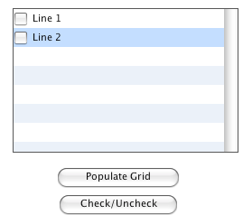

If you get the **dgData** or **dgText** property of the data grid then you will
see the proper values for the *checked* state of each row.

## Working With Data Grid Tables
 
### How Do I Change Column Alignment?
 
#### Using the Property Inspector
 
Select the data grid and open the **Property Inspector**. Navigate to the
**Columns** pane (1), select the column you want to modify (2), and
change the **alignment** (3).

#### Using Script
 

You can change the **alignment** by setting the **dgColumnAlignment** for a 
column.

    set the dgColumnAlignment["Name"] of group "DataGrid" to "left"

### How Do I Sort by a Column?

#### Using the Property Inspector

Select the data grid and open the **Property Inspector**. Navigate to the
**Columns** pane (1), select the column you want to modify (2), and
check the **Sort by column** checkbox (3). You can then adjust the sort 
options as you see fit.

#### Using Script

You can sort by column setting the **dgProp["sort by column"]** property of
the data grid to the name of the column you want to sort by.

    set the dgProps["sort by column"] of group "DataGrid" to "Name"
 

Similarly you can change other properties related to the sort by script too.

### How Do I Resize Columns?

#### Using the Property Inspector

Select the data grid and open the **Property Inspector**. Navigate to the
**Columns** pane (1), select the column you want to modify (2), and set the
**width** of the column using the **Width** text entry field (3).

#### Using Script
 
You can set the size of a column by setting the **dgColumnWidth** property
for the column to an integer.

    set the dgColumnWidth["Name"] of group "DataGrid" to 150

### How Do I Override the Default Behavior for Rendering Data to a Cell?

By default, a data grid table uses a single field object for each cell
in a table and assigns the **text** property of that field to the cell's
data. This lesson will show you how to quickly create your own script
that determines how data is rendered in the default table cell. This can
be useful for rendering HTML and unicode text, trailing off text that is
too wide for a column or for coloring particular cells.

#### Begin With a Data Grid Table
 

#### Create a Button

The **default column behavior** property can be set to a button. The
script of the button will be used to fill in each cell in the table.

Drag a button onto the card and name it **My Default Column Behavior.**

#### Set the Script of the Button
 

When creating your own **default column behavior** it is a good idea to
start with the script that the data grid itself uses as the default. You can copy
the data grid default script easily enough by selecting the button (1)
and executing the following statement in the **Message Box** (2):

>Careful of continuation character " \\"

    set the script of selobj() to the script of button "Default Column" \
        of stack "revDataGridLibrary"

#### Customize Behavior

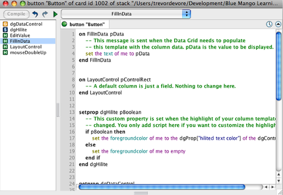

Now this behavior can be customized. Here is what the default behavior looks like.

>**Important:** If you decide to write a default behaviour script from scratch make 
>sure to include the **dgDataControl** getProp handler. This is required in order for the 
>data grid to work properly.

    getprop dgDataControl
       -- Required by library so that it can locate the control.
       return the long ID of me
    end dgDataControl

#### Set 'Default Column Behavior' Property
 

Now you can set the **default column behavior** property of the data
grid. Select the button (1) and execute the following in the **Message Box**
(2):
>**Note:** Careful of continuation character " \\"

    set the dgProps["default column behavior"] of group "DataGrid 1" \
       to the long id of selobj()

Now it is time to customize your script!

#### Example: Truncate Tail
 

The following example will show you how to truncate the tail end of every
cell whose content is too wide to fit. The data grid provides a helper
command named **TruncateTail** that takes the **short id** of a field and a
string that signifies the text is being truncated. A call to
**TruncateTail** has been added to the **FillInData** and **LayoutControl** handlers so
that cell contents are truncated when drawn or when a column is resized.

>**Note:** **TruncateTail** works fairly well for most cases but can cause
>visual lag if there are lots of cells being displayed that use
>**TruncateTail**. You should test your data and table to make sure it
>performs adequately for your needs.

>**Quick Tip:** You can determine the name of the column that is being
>rendered by checking the **dgColumn** property. You could use this
>property if you only wanted to truncate the text in certain columns:

    switch the dgColumn of me
      case "Col 1"
      case "Col 2"
      TruncateTail the short id of me, "..."
      break
    end switch

#### Refresh

To see the results, click the **Refresh Data Grid** button in the
Property Inspector (1). Notice how cell contents are no truncated as
needed (2).

#### Example: Coloring Cells
 

This example will dim any cell that is empty. Since the
default cell consists of a single field object this can be accomplished by setting the 
field's **opaque** to **true**, setting the **backgroundcolor** and changing the **blendlevel**.

#### Result

Deleting some entries in the data and click on the **Refresh Data Grid** 
button to see the result

### How Do I Determine if a User Clicks in the Table Header?
 
This lesson will show you how to determine if the user clicked in the
header of a Data Grid table by showing you how to use the
**dgHeaderControl** and **dgHeader** properties of the target control that was
clicked on.

#### The Table Header
 

A Data Grid table has a header where the column names are displayed (1).
When a user clicks in the header with the mouse the **dgHeader** of the
target returns the **long id** of the group control that contains all of the
header controls.

When the user clicks on a column header (2) the **dgHeaderControl** of the
target returns the **long id** of the group control that contains all of the
column header controls.

####Example

Here is some sample code that prints off the **dgHeaderControl** and
**dgHeader** properties when the user clicks on a Data Grid. Place
this script in the Data Grid script.

***Copy & Paste***

    on mouseDown pBtnNum
      put "Column header control:" && the dgHeaderControl of the target \
      & cr & cr & "Header control:" && the dgHeader of the target
    end mouseDown

After adding the script to the Data Grid the value of the
**dgHeaderControl** and **dgHeader** properties are displayed in the **Message
box**. In this example both properties return the **long id** of a control (1)
because the click was on a column header (2) (*State* in this case.)

In the following example only the **dgHeader** property returns the **long id** of a
control (1) because even though the click was in the table header it was not on a column
header (2).

### How Do I Display a Contextual Menu When the User Clicks on a Column Header?
 
####Overview

This lesson will show you how to display a contextual menu (1) when the
user clicks on a column header in a Data Grid table (2).

####The Code

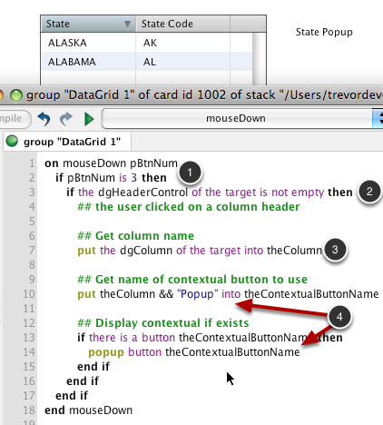

Here is some LiveScript code that will display a contextual menu.
The code is located in the Data Grid's script.

A contextual menu is displayed when during the **mouseDown** message when
the user clicks with the right mouse button (1).

To determine if the user clicked on a column header you can check
whether or not the **dgHeaderControl** property of the control that was
clicked on (**the target**) is empty (2). If the property is not empty then
you know that the user clicked on a column header.

Once you know that the user clicked on a column header you can display
the contextual menu. In this example the name of the column that
was clicked on (3) is appended to "Popup" in order to get the name (*State Popup*) of
the popup button to display (4).

***Copy & Paste***

    on mouseDown pBtnNum
      ## Let Data Grid process mouseDown
      dgMouseDown pBtnNum
      if pBtnNum is 3 then
        if the dgHeaderControl of the target is not empty then
          ## the user clicked on a column header
          ## Get column name
          put the dgColumn of the target into theColumn
          ## Get name of contextual button to use
          put theColumn && "Popup" into theContextualButtonName
          ## Display contextual if exists
          if there is a button theContextualButtonName then
            popup button theContextualButtonName
          end if
        end if
      end if
    end mouseDown
    

####The Result

Now when a ***right-click*** occurs on the State column the *State Popup* popup
button is displayed as a contextual menu.

### What if I Need to Work With htmlText or rtfText?
 
By default all table columns will have their **text** property assigned. If
you need to work with htmltext or rtftext then you need to provide your own
behavior for the table columns.

#### Option 1: Set the dgProp["Default Column Behavior"] Property
 
The simplest way to change the default behavior of table columns is to
set the **dgProp["default column behavior"]** property of the data grid. You
set this property to a **button id** whose script contains the behavior you
would like the columns to have. Doing this overrides the default
behavior provided by a button on the **revDataGridLibrary** stack.

    set the dgProp["default column behavior"] of group "DataGrid" to the long id\
     of button "My Custom Column Behavior" of stack "MyStack"

Here is an example of a **FillInData** command that takes a column value
encoded as UTF-8 and sets the **unicodetext** of the column field.
   

>**Important:** If you decide to write your own default behaviour script make 
sure to include the **dgDataControl** getProp handler. This is required in order for the 
data grid to work properly.

    getprop dgDataControl
       -- Required by library so that it can locate the control.
       return the long ID of me
    end dgDataControl

To see the default column script the data grid uses enter the following
in the **Message box**:

    edit script of button "Default Column" of stack "revDataGridLibrary"

#### Option 2: Create a Custom Column Template
 
Alternatively you can create your own custom column template for a
particular column. This allows you complete control over the look and
feel of the column. See section [How Do I Customize A Table's Columns?](#how-do-i-customize-a-table's-columns)

### How Do I Display Line Numbers in a Table?
 
This lesson will show you how to dynamically display line numbers in
your data grid table.

####The Table

Here is the table to display line numbers in.

####Add Line Number Column

Select the data grid and open its **Property Inspector**. Select the **Columns**
pane (1) and add a column using the "+" button (2). Rename the column
**Line Number** (3).

####Reorder and Create Column Template

Use the up arrow (1) to move the **Line Number** column to the top of the
list.

Create a template for this column by clicking on the "+" button at the
bottom of the **Property Inspector** (2).

####Edit Line Number Group

After creating the column template the card with the template group will
open. As you can see a group called **Line Number**, corresponding to the column's name, 
has been created and within that group is a single field object.

We do not need to actually do anything to the template so simply **close** and **save** it when 
prompted.

####Edit Column Behavior

Now all that is left is to define the behavior for this column. Go back to
the **Columns** pane of the data grid's **Property Inspector** and click the 
**Column Behavior...** button (1) to open its script editor.

####Edit Behavior Script

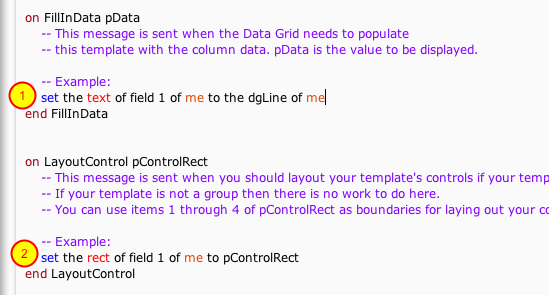

There isn't much to do here. In **FillInData** you just want to (1):

    set the text of field 1 of me to the dgLine of me . 

The **dgLine** is a property of a **row template** and this will display the line number 
for the current line. In **LayoutControl** you just need to ensure the rect of the field 
fills the entire cell (2).

####Refresh Data Grid

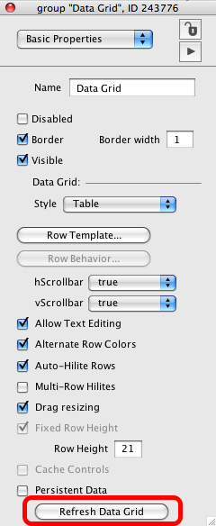

In the **Property Inspector** click the Refresh Data Grid button.

####The Result

Now the line numbers appear in the table.

####But How Do I Set the dgText Then?

You may be wondering how you would set the **dgText** property of this data
grid since we have added a **Line Number** column as the first column in
the table.

When you set the **dgText** of a data grid you can pass a parameter
specifying whether or not the first line of text contains the names of
the columns that the data should map to. Just pass in true and prepend
the column names to your data like this:

    put "State" & tab & "State Code" into theColNames
    set the dgText [true] of group "Data Grid" to theColNames & cr & theData

### How Do I Customize Column Sorting?

This lesson will demonstrate how to customize sorting for columns by
handling the **SortDataGridColumn** message that is sent when the user
clicks on a column.

####A Data Grid Table

The goal is to customize when happens when this table is sorted by the
**Line Number** column.

####The Data Grid Group Script

A Data Grid calls a built in handler **SortDataGridColumn** whenever the **dgProps
["sort by column"]** property is set. This includes when the user clicks on a column header
to sort that column. By placing a modified version of the **SortDataGridColumn** in the 
data grid's script this message can be captured and the behavior modified.

Place the following in the script for the data grid.

***Copy & Paste***

    on SortDataGridColumn pColumn
      switch pColumn
      case "Line Number"
         ## ReverseSort is a helper provided by the Data Grid.
         ## It merely reverses the current sort.
         ReverseSort pColumn ## pass in column so header is hilited
         break
      case "State Code"
         ## Just provided as an example of how to prevent the user
         ## sorting on a column. In this case the "State Code" column.
         ## We accomplish this by NOT passing the message.
         break
      default
         ## For all other cases, pass the message  so that the data grid
         ## will be sorted based on column settings.
         pass sortDataGridColumn
      end switch
    end SortDataGridColumn

The way the custom **SortDataGridColumn** handler works is simple. Passing the message will
cause the data grid to use its default column sorting routines. (1) Set this as 
the **Default** case.

Not passing the message prevents the data grid from performing it own sorting
(2) and (3).

In this example, clicking on the **Line Number** column will just reverse whatever 
current sort exists. This is done by calling **ReverseSort**, a built-in data grid helper 
that reverses whatever the current sort order is. (2)

####The Result

Clicking on the **Line Number** column (1) now reverses the sort.

####Custom Sort Example

Here is another example of a custom sort. Try it out and see if you can determine 
what it does.

    ## Place in Data Grid script.
    ## This example shows how to perform a custom sort of data. This is similar
    ## to the internal routine that the data grid uses.
    on SortDataGridColumn pColumn
      ## Begin by building a list of lines with two items (tab delimited)
      ## The first item is the index of each record stored in the data grid.
      ## The second item is the key you are going to sort on.
      put the dgData of me into theDataA
      repeat for each key theIndex in theDataA
        put theIndex & tab & theDataA[theIndex][pColumn] & cr after theData
      end repeat
      delete the last char of theData
      set the itemdelimiter to tab
      ## perform sort. Lookup the current sort direction for this column
      ## and use that as sort direction
      put the dgColumnSortDirection[pColumn] of me into theSortDirection
      if theSortDirection is "ascending" then
        sort lines of theData ascending by item 2 to -1 of each	#
      else
        sort lines of theData descending by item 2 to -1 of each
      end if
      ## Rebuild the order of indexes in the data grid
      put empty into theIndexSequencing
      repeat for each line theLine in theData
        put item 1 of theLine & comma after theIndexSequencing
      end repeat
      delete the last char of theIndexSequencing
      ## Set the dgIndexes property to new order
      set the dgIndexes of me to theIndexSequencing
      ## Tell data grid to hilite column
      HiliteAndStoreSortByColumn pColumn
    end SortDataGridColumn

### How Do I Disable Column Sorting?

This lesson will show you how to disable column sorting in a Data Grid
table.

####Sort By No Column

Notice in our example, the **State** column header is hilighted and there is a sorting 
arrow indicating an ascending sort.

To begin, set the **sort by column** property to empty.
This will remove any column sorting that might be active.

    set the dgProp["sort by column"] of group "DataGrid 1" to empty

Just copy and paste the above into the **Message box** to execute it.

Your table headers should now appear the same, with no highlights or
sorting arrow.

####Edit Data Grid Script

Edit the Data Grid group script by ***right clicking*** on the Data Grid and
selecting **Edit Script.**

####Add SortDataGridColumn Handler

When the user clicks on a table column header the **SortDataGridColumn**
message is sent to the Data Grid. Intercepting this message and not
passing it effectively disables sorting. For more information
about how **SortDataGridColumn** works see [How Do I Customize Column Sorting?](#how-do-i-customize-column-sorting).

Add the following code to your Data Grid group script and compile.

***Copy & Paste***

    on SortDataGridColumn pColumn
    end SortDataGridColumn

Now when you click on the table header the data will not be sorted.

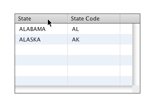

>**Note:** Once you add the **SortDataGridColumn** handler to a Data Grid setting
>the **dgProp["sort by column"]** property will no longer do anything. If you
>need to set the **sort by column** property later on you would need to
>remove the **SortDataGridColumn** handler from the script, or at least **pass**
>the message.

### How Do I Perform an Action After the User Sorts a Data Grid?
 
This lesson will show you how to modify a data grid script so that you
can perform an action whenever a data grid is sorted.

####Add SortDataGridColumn To Data Grid Group Script

You can customize what happens when a data grid is sort by adding a
**SortDataGridColumn** handler to your data grid's script. For more
information about howSortDataGridColum works please see the lesson
[How Do I Customize Column Sorting?](#how-do-i-customize-column-sorting).

In order to perform an action AFTER the sort has been applied you simply
need to call the handler the Data Grid behavior uses to sort but NOT
pass the **SortDataGridColumn** handler. Doing so sorts the data just like
the Data Grid would and then perform any additional actions you would
like.

    ## Place in Data Grid script. 
      on SortDataGridColumn pColumn
    ## Call Data Grid sort routine by hand
      SortByColumn pColumn
       ## Now data has been sorted, do whatever you need to do.
        -- my code
        .....
        .....
        
       ## DON'T PASS the "SortDataGridColumn" message!
    end SortDataGridColumn

### How Do I Align Decimals in a Column?

This lesson will show you how to create a custom column template that
provides decimal alignment. You can 
[download the stack]([http://www.bluemangolearning.com/download/revolution/tools/datagrid_decimal_align.zip]) 
used to create this lesson.

####Create a Data Grid Table

####Add Some Data

Here a couple of rows of decimal numbers have been added to experiment with.

####Create Column Template

Select the **Columns** pane (1) in the **Property Inspector** and click the
**Add custom column behavior** button (2). This will create a custom
column template and behavior script.

Notice how the **Column Behavior...** button has become enabled.

####Edit Column Template

When you create a custom template for a column a new group, named after
the column, is added to the data grid's **row template**.

Here you see the **Project Browser** with the template for the Data Grid expanded
showing the group for this column (*Col 1*) with a field *\_ColumnData_* to hold the 
column's data.

####Edit Column Template Group

Double-click on the column group in the **Project Browser** (1). This will select it on the 
template card (2) and then click the **Edit Group** button (3) to edit the contents of the 
column group.

Be sure to double-click on the **group** icon and not the group's name. Double-clicking on 
the object's name will simply allow you to edit the name, which is not what is wanted.

####Create 3 Fields

A column that aligns decimals in the center of the column, and is
editable if the user double-clicks on the cell, is achieved by creating
three fields.

Since the column template group already had a field named
*\_ColumnData_* double-click this name (in the **Project Browser**) and rename 
it to *Leftvalue* (1). Open the **Property Inspector** for this field and set its 
**textalign** to **right**. **Duplicate** the *Leftvalue* field and name it *Rightvalue* (2). 
Set the its **textalign** to **right** too. Finally **Duplicate** this
field and **rename** the duplicate to **ForEditing** (3). The text of
this field should be empty. Make sure that the **ForEditing** field has a
higher layer than *Leftvalue* or *Rightvalue*.

Don't worry too much about positioning as the fields will be resized and
repositioned when drawn in the data grid.

Click on the card background of the editing template and then the **Stop Editing** button 
and **close** and **save** the window.

####Edit Column Behavior

Now that the objects we need to display the column data have been created 
its time to tell the column what to do when it is drawn. Return to the
**Property Inspector** for the data grid and from the **Columns** pane (1) 
click the **Column Behavior   ** button (2). This will open the behavior 
script for the column.

####Update FillInData

The decimal number is going to be displayed by assigning the left side
of the decimal to the *Leftvalue* field and the right side of the
decimal to the *Rightvalue* field.

    set the itemdelimiter to "."   
    set the text of field "Leftvalue" of me to max(0, item 1 of pData)&"."
    set the text of field "Rightvalue" of me to max(0, item 2 of pData)

####Update LayoutControl

The left and right fields are now resized so that each takes up half of the available
width to align the decimal in the center of the cell(1). Finally we resize the 
**ForEditing** field to take up the entire cell width(2). This is the field that the user 
can double-click on to edit the cell contents.

    put the rect of field "Leftvalue" of me into theRect   
    put item 1 of pControlRect into item 1 of theRect
    put item 1 of pControlRect + \
      round((item 3 of pcontrolRect - item 1 of pControlRect) / 2) \
      into item 3 of theRect
    set the rect of field "Leftvalue" of me to theRect
    
    put the rect of field "Rightvalue" of me into theRect2
    put item 3 of theRect into item 1 of theRect2
    put item 3 of pControlRect into item 3 of theRect2
    set the rect of field "Rightvalue" of me to theRect2
    
    set the rect of field "ForEditing" of me to pControlRect

####Update EditValue

**EditValue** is the handler that is called by the data grid to edit
a cell value. Usually this is because the user double-clicked on the
cell or tabbed into the cell.

**EditFieldText** displays, by default, the **htmltext** of the field you are editing. This 
default can be overriden by setting the **dgTemplateFieldEditor[text
|htmltext|rtftext|unicodetext|utf8text]** of the data grid. Here
 the dgTemplateFieldEditor["text"] of the data grid is set to **text**(1). Of course the 
*ForEditing* field has no text in it by default and the 
"left" and "right" field values need to be combined as documented in the handler.

Also, if the user double-clicks on this cell they actually double-click 
on the **ForEditing** field (as it has the higher layer) and it is thus 
***the target*** (2)

    command EditValue
      ## Assign text the the editor will have when it opens
      ## We combine the left and right field values. 
      Set the dgTemplateFieldEditor["text"] of the dgControl of me to \
         the text of field "Leftvalue" of me & the text of field "Rightvalue" of me
      ## The "ForEditing" field is what the user actually clicked on. 
      ## This is the "target"
      EditFieldText the long ID of field 1 of the target, the \
          dgIndex of me, the dgColumn of me
    end EditValue

####Refresh Data Grid

Now that the necessary changes have been made 
refresh the data grid so that it redraws with the new template controls. 
From the **Basic Properties** pane of the inspector palette
click the **Refresh Data Grid** button. Alternatively you can send
**ResetList** to the data grid.

    send "resetList" to group "datagrid 1"

####Test

The decimals all appear in the center of the cell.
Double-clicking brings up an editing field as shown here.
Finally the decimal remains in the center of the cell if the column is resized.

### How Can I Colorize Individual Lines in a Table?
 
This lesson will show you how to change the color of individual lines in
a Data Grid table. Before you begin this lesson you will need to read
the lesson [How Do I Override the Default Behavior for Rendering Data
to a Cell?](#how-do-i-override-the-default-behavior-for-rendering-data-to-a-cell)

####Attached Files

[Color_Individual_Line_in_Table.rev](http://lessons.livecode.com/s/lessons/files/101?lesson_id=7332)

#### Coloring a Single Line
 

In this example we are going to modify the basic example created in the lesson mentioned 
above so that it colors a row red if the row's **line has error property** is **true**.

By clicking on the **Toggle Line 3 Color** button the color of line 3
turns red. The code in the button extracts the data for line 3 from the
data grid, toggles the **line has error** property and reassigns the new
data to line 3.

    on mouseUp pMouseBtnNo
      put the dgDataOfLine[3] of group "DataGrid 1" into theDataA
      put not theDataA["line has error"] into theDataA["line has error"]
      set the dgDataOfLine[3] of group "DataGrid 1" to theDataA
    end mouseUp

Now let's look at what the default custom column behavior looks like for
this data grid.

####The Default Custom Column Behavior

Here is the relevant code from the default custom column behavior for this
data grid. The key addition to the code is the **SetForeGroundColor**
handler. This handler checks the value of the  **line has error** column
for this row (using **GetDataOfIndex**) and if it is true then changes the
cell to red. Since each cell in this row has the same value for **line
has error** the entire row appears red.

    on FillInData pData
      -- This message is sent when the Data Grid needs to populate
      -- this template with the column data. pData is the value to be displayed.
      set the text of me to pData
      SetForeGroundColor
    end FillInData
    
    on LayoutControl pControlRect
      -- A default column is just a field.
    end LayoutControl
    
    setprop dgHilite pBoolean
      -- This custom property is set when the highlight of your column template has
      -- changed. You only add script here if you want to customize the highlight.
      if pBoolean then
        set the foregroundcolor of me to the dgProp["hilited text color"] of the dgControl of me
      else
        SetForeGroundColor
      end if
    end dgHilite
    
    private command SetForeGroundColor
      if GetDataOfIndex(the dgIndex of me, "line has error") then
        set the textcolor of me to red
      else
        set the textcolor of me to black
      end if
    end SetForeGroundColor

## Working With Data Grid Forms

### How Do I Create a Form With Variable Line Heights?

This lesson will show you how to create a data grid form with variable
height lines by modifying the default data grid **Row Template** and
**Row Behavior**.

#### Turn Off "Empty row height"
 

To begin, turn off **Empty row height** for your data grid form in
the **Property Inspector**.

####Edit Row Template

Open the card that has the row template group by clicking the **Row
Template** button.

####Turn Off dontWrap Property

The default row template for a data grid has a single field that
displays data. With **Select Grouped** turned on (1) select the field
(2). Using the **Property Inspector** turn off **dontWrap** (3). You can now
close the stack.

####Edit Row Behavior

Return to the Property Inspector for your data grid. Edit the **Row
Behavior** by clicking on **Edit Script** button.

####Script Field to Resize to Fit Height

Only a few modifications are needed to make to the default
**LayoutControl** handler resize the field to fit the height.

The default **LayoutControl** handler resizes the field to fill the
available width (1). After that is done you then need to resize the
field to fill the **formattedHeight** (2). Finally, adjust the rect
of the Background graphic to take into account the new field height (3).

     on LayoutControl pControlRect
      local theFieldRect
       ## Expand the field to fill the available width
       put the rect of field "Label" of me into theFieldRect
       put item 3 of pControlRect - 5 into item 3 of theFieldRect
       set the rect of field "Label" of me to theFieldRect
    
       ## Now resize the field to fit its content
       put item 2 of theFieldRect \
            + the formattedheight of field "Label" of me - \
            the bottommargin  of field "Label" of me \
            into item 4 of theFieldRect
       set the rect of field "Label" of me to theFieldRect
    
       ## Now update the bounding rect to match total the height
       ## you want this row to have (note there is an additional 4
       ## pixels added to the bottom
       put item 4 of theFieldRect + 4 into item 4 of pControlRect
    
      set the rect of graphic "Background" of me to pControlRect
    end LayoutControl

####Refresh Data Grid Contents

You can now refresh the data grid contents to see the new behavior.

Notice how each line is resized to fit all of the text.

### How Do I Sort Records by a Specific Key's Values?
 
You can sort the rows of a data grid form using the **SortDataByKey** command. 

Let's look at an example.

####Example

This card has a data grid and an option menu. The option menu contains
three values that you can sort by: *First Name*, *Last Name* and
*Title*.

####Option Menu Code

The code to perform the sort is pretty straight forward.

1. Determine which array key of the data grid form to sort by. This will be one the 
keys created when the data was assigned to the **dgData**. If you used the **dgText** 
property then the key will be "Label 1" or "Label 2", etc.
2. Determine the sort type, direction and whether or not the sort is case sensitive.
3. Call the **SortDataByKey** command.

***Copy & Paste***

     on menuPick pItemName
      switch pItemName
        case "First Name"
          put  "FirstName" into theKey
          break
        case "Last Name"
          put  "LastName" into theKey
          break
        case "Title"
          put  "Title" into theKey
          break
      end switch
      
      put "international" into theSortType
      put "ascending" into theDirection
      put "false" into isCaseSensitive
      dispatch "SortDataByKey" to group "Datagrid 1" with \
           theKey, theSortType, theDirection, isCaseSensitive
    end menuPick

####The Result

Here is what the sort looks like after selecting *First Name* and after selecting 
*Last Name*.

### How Do I Create Rows That Can Expand/Contract?
 
This lesson will show you how to make a Data Grid form with rows that
expand and contract when clicking on an arrow.

#### Attached Files

[ExpandingRow.rev](http://lessons.livecode.com/s/lessons/files/45?lesson_id=9850)

####Expanding and Contracting Rows

This is what the example stack looks like. By default all of the rows
are contracted and only show names.

Clicking on the arrow next to a name expands the row to show the
description of the person.

####Setting the Data Grid Properties

To create a Data Grid form with rows that expand/contact you need to
turn off **fixed control height** in the data grid's **Property Inspector**.

>**Note**: To turn off the property using script you set the
>**dgProp["fixed row height"]** property to **false**.

####Updating the Row Behavior Script

In order to get expanding rows working a couple of
things need to be taken into account in the **Row Behavior Script.**

The **FillInData** handler should show or hide controls as
necessary. The example stack stores the expanded state of each row in
the **expanded** key.

In the **LayoutControl** handler the position of
the controls and background graphic based on whether or not the row is
expanded or contracted are adjusted . Since the **fixed row height** property is set to
**false** the Data Grid computes the total height of the data based on the
height of each row after calling **LayoutControl**.

When the user clicks on the arrow the example stack updates the
**expanded** key in the row's data and then redraws the row. Using 
**SetDataOfIndex** in conjunction with **RefreshIndex** is the most efficient
way to do this.

**pDataArray["expanded"]** is a boolean which determines the state of the row.

    the short name of the target is "ArrowContracted"

is an expression that evaluates to **true** or **false** depending on the target. 
If the *ArrowContracted* graphic is visible 
and thus clicked on, the expression evaluates to **true** which in turn sets the row to 
be in its **expanded** state as per the **FillnData** handler.

Thus this little snippet effectively toggles the state of the row.

### How Can I Speed Up Drawing When "Fixed Row Height" Is False?
 
When you set the **dgProp["fixed row height"]** property of a Data Grid to
**false** the Data Grid must draw all records in order to determine the
total height. That means that **FillInData** and **LayoutControl** are called
for every record in the Data Grid. This can be time intensive depending
on the amount of data.

This lesson will show you a technique that can speed up the calculation
of the total height of the data in situations where the rows can only
have heights of ***known*** values.

#### CalculateFormattedHeight
 
When the Data Grid loops through the data to calculate the height the
message **CalculateFormattedHeight** will be sent to the **Row Template**.
If your Row Behavior handles this message then the Data Grid will use
the integer value that you return rather than calling **FillInData** and
**LayoutControl**.

Here is an example that uses **CalculateFormattedHeight** to return the
height of a row based on whether or not the row is expanded. Just place
the **CalculateFormattedHeight** handler in your Row Behavior script.

    on CalculateFormattedHeight pDataArray
      if pDataArray["expanded"] then
        return 74
      else
        return 20
      end if
    end CalculateFormattedHeight
    
    on FillInData pDataArray
    ...
    end FillInData

## Using the Built-in Field Editor

### How Do I Open a Table Cell for Editing?

By default a table cell can be edited if the user double-clicks on the
cell. This tutorial explains what goes on in the default column behavior
so you can customize behavior if you would like.

>**Note:** The default column behavior is stored in button "Default Column"
>of stack "**revDataGridLibrary**". 
>See [How Do I Override the Default Behavior for Rendering Data to a Cell?](#how-do-i-override-the-default-behavior-for-rendering-data-to-a-cell)

#### What You Need to Know
 
In order to edit the columns of a data grid table you need to know about
the following:

1. The **EditFieldText** command
2. The **EditValue** message
3. The **EditKey** and **EditKeyOfIndex** commands
4. The **CloseFieldEditor** command which can be sent as a result of calling **EditFieldText**.

Read up on the entries for **EditFieldText**, **EditValue**,
**EditCell**/**EditCellOfIndex** in the API section of the Dictionary.

####EditFieldText

The **EditFieldText** command will create an editor for a field that you
specify. The default column behavior calls this command with three
parameters so that data is automatically saved after the user finishes
editing.

####EditValue

**EditValue** is the message that is sent to a row when a request to edit a
field's contents has been made. The default column behavior calls
**EditFieldText** when this message is received.

####EditCell and EditCellOfIndex

There are two commands that will open a cell for editing. They are
**EditCell** and **EditCellOfIndex**. Each takes the name of the column
you want to edit and the line or index you want to edit. Here are two
example scripts showing how you could use these commands in the script
of a data grid.

    put "FirstName" into theColumn
    put the dgHilitedLine of me into theLineNo
    EditCell theColumn, theLineNo
    
    put "FirstName" into theColumn
    put the dgHilitedIndex of me into theIndex
    EditCellOfIndex theColumn, theIndex

Either of the above calls will trigger the **EditValue** message.
    
    on EditValue
      ## Example of opening a field editor for the targeted column.
      ## Since I'm passing in parameters 2 and 3 any changes will 
      ## automatically be saved to the dgData.
      EditFieldText the long id of me, the dgIndex of me, the dgColumn of me
    end EditValue
 

#### CloseFieldEditor

If the user changes any content in the field editor this message will be
sent to the field targeted in the first parameter sent to **EditFieldText**.
Read the API docs for **EditFieldText** which discusses this message.

Example of storing value in **dgData** in **CloseFieldEditor**. This would be
required if you only passed in one parameter to **EditFieldText**.

    on CloseFieldEditor pFieldEditor
      put the dgIndex of me into theIndex
      put the dgDataOfIndex[theIndex] of the dgControl of me into theDataA
      put the text of pFieldEditor into theDataA[the dgColumn of me]
      set the dgDataOfIndex[theIndex] of the dgControl of me to theDataA
    end CloseFieldEditor

### How Can the User Edit Field Content in a Data Grid Form?

The data grid commands for creating an editor for a particular field in
a row template. This lesson will show you how to use them.

####What You Need to Know

In order to edit field contents in a data grid form you need to know
about the following:

1. The **EditFieldText** command
2. The **EditValue** message
3. The **EditKey** and **EditKeyOfIndex** commands

Read up on the entries for **EditFieldText**, **EditValue** and
**EditKey**/**EditKeyOfIndex** in the API documentation.

####EditFieldText

The **EditFieldText** command will create an editor for a field that you
specify. You can use this command to create a field editor for a field in
your row template.

####EditValue

**EditValue** is the message that is sent to a row when a request to edit a
fields contents has been made. You can call **EditFieldText** from within
a handler for this message to begin an editing operation.

####EditKey and EditKeyOfIndex

**EditKey** and **EditKeyOfIndex** will trigger the **EditValue** message in a row.
Each takes the name of the key you want to edit and the line or index
you want to edit. Here are two example scripts showing how you could use
these commands in the script of a data grid.

Placed in script of row template behavior

    on mouseDown pBtnNum
      if pBtnNum is 1 then
      ## Did the user click on the FirstName field?
        if the short name of the target is "FirstName" then
          put "FirstName" into theKey
          put the dgHilitedLine of me into theLineNo
          EditKey theKey, theLineNo
        end if
      end if
    end mouseDown
    
    on mouseDown pBtnNum
      if pBtnNum is 1 then
      ## Did the user click on the FirstName field?
        if the short name of the target is "FirstName" then
          put "FirstName" into theKey
          put the dgHilitedIndex of me into theIndex
          EditKeyOfIndex theKey, theIndex
        end if
      end if
    end mouseDown

Either of the above calls will trigger the **EditValue** message. The
**EditValue** can be thought of as a central message where you can open a
field for editing text. A handler for this message is where you will call
EditFieldText.

    on EditValue pKey
      ## Example of opening a field editor for the field displaying 
      ## the value for pKey
      ## Since we are passing in parameters 2 and 3 any changes 
      ## will automatically be saved to the dgData.
      ## 'me' is the Data Grid in this case.
      EditFieldText the long id of field pKey of me, the \
         dgHilitedIndex of me, pKey
    end EditValue

#### CloseFieldEditor

If the user changes any content in the field editor this message will be
sent to the field targeted in the first parameter sent to **EditFieldText**.
Read the API docs for **EditFieldText** which discusses this message.

Here is an example of storing the new value in the **dgData** of the Data
Grid in the **CloseFieldEditor** handler. Manually storing the value would
be required if you only passed in one parameter to **EditFieldText**.

This example script would be in the **Row Behavior** script as it uses the
**dgIndex of me** property.

    on CloseFieldEditor pFieldEditor
      ## 'me' is the row control
      put the dgIndex of me into theIndex
      put the dgDataOfIndex[theIndex] of the dgControl of me into theDataA
      put the text of pFieldEditor into theDataA[the dgColumn] of me
      set the dgDataOfIndex[theIndex] of the dgControl of me to theDataA
    end CloseFieldEditor

### How Can I Edit the Text as UTF-8, UTF-16 or HTML?

The default Data Grid behavior when editing cell contents is to use the
**text** property of the cell as the default value to be edited. This
lesson will show you how to provide a specific value for the Data Grid
to use as the value to edit.

The technique described requires that you create a custom column
behavior as outlined in the lesson [How Do I Override the Default Behavior For Rendering Data to a Cell ](#how-do-i-override-the-default-behavior-for-rendering-data-to-a-cell).

####The Default Behavior

Assume you have a column in your table that displays text with some
styling. In this example the last name in column 2 for **some** entries is italic.

We can accomplish this by using the formatting information contained in the data.

However, when you edit the content of the cell the formatting is lost.
This is because the Data Grid edits the **text** property of the field by
default.

####Changing the Default Value For the Editor

You can change the default value of that the field editor uses by
setting a value of the **dgTemplateFieldEditor** property of the Data Grid.
You set the property before calling **EditFieldText**.

For example, if you wanted to display the **italic** text for editing you
could set the dgTemplateFieldEditor["htmltext"] property to the htmltext
of the column being edited:

    set the dgTemplateFieldEditor["htmltext"] of the dgControl of me to the htmltext of me

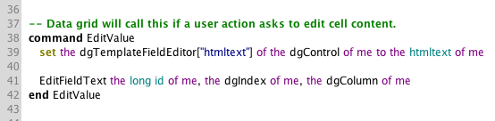

Other properties you can set include **rtftext**, **text**, **unicodetext**
and **utf8text**.

#### The Result
 

Here is the result of using the example code above in the custom column
behavior. Notice how the text being edited is bold.

### How Can I Select the Text in the Edit Field When It Opens?
 
The default Data Grid behavior when editing cell contents is to put the
cursor at the end of the field. This lesson will show how to tell
the Data Grid that all of the cell text should be selected.

The technique described requires a custom column
behavior as outlined in the lesson [How Do I Override the Default Behavior For Rendering Data to a Cell ](#how-do-i-override-the-default-behavior-for-rendering-data-to-a-cell).

#### The Default Behavior#### 
 

By default the Data Grid will place the insertion point at the end of the text of a
 cell when you start editing a value.

#### Selecting The Text#### 
 

You can tell the Data Grid to select all of the text by setting a
special custom property called **dgTemplateFieldEditor**. If you set the
**dgTemplateFieldEditor["select text"]** of the Data Grid to **true** then the
data Grid will select the cell text.

#### An Example Script#### 

    ## Select all text before opening
    set the dgTemplateFieldEditor["select text"] of the dgControl of me to true

Add this line of text to the **EditValue** handler in a custom
column behavior. Just place the code right before the call to
**EditFieldText**.

### How Do I Save Changes the User Makes in an Editor Field to an External Data Source?

#### When Calling EditFieldText With 3 Parameters (Simpler)

When calling **EditFieldText** with all three parameters (which is what a
data grid column does by default) the data grid will automatically save
the text that the user enters in the **dgData** array. That means that all
you need to do is save the text of the editor field to your external
data source in the **CloseFieldEditor** handler. Note that if you save
anything other than the text of **pFieldEditor** then your data source will
not match the **dgData** value.

Here is an example script that goes in the Data Grid group script. 

    ## An example that saves
    on CloseFieldEditor pFieldEditor
      put the dgColumn of the target into theColumnBeingEdited
      put the text of pFieldEditor into theNewText
      ## Save data to database using command I defined
      put "Person" into theTable
      ## Get the unique id of the row in the database we want to edit
      put GetDataOfIndex(the dgIndex of the target, "id") into theRowID
      SaveDataToDatabase theTable, theRowID, theColumnBeingEdited, theNewText
    end CloseFieldEditor
    

#### When Calling EditFieldText With 1 Parameter (More Flexible)

If you are working with data grid forms or decide to override the
default behavior for data grid columns then you will make the call to
**EditFieldText** yourself. For complete control over what gets saved
you only pass in 1 parameter to **EditFieldText**. By passing in 1
parameter you are responsible for saving any changes to **dgData**.

Assume you made the following call in a data grid form:

    EditFieldText the long id of field "Name" of me
    
A **CloseFieldEditor** message would still be sent when the user changes the contents
of the field but would need to contain code for saving the changes to
the **dgData** array.

Here is an example script that goes in the Data Grid group script.

    ## CloseFieldEditor placed in data grid script
    on CloseFieldEditor pFieldEditor
      put the dgColumn of the target into theColumnBeingEdited
      ## Store UTF8 text
      put unidecode(the unicodetext of pFieldEditor, "UTF8") into theNewText
      ## Save data to database using command I defined
      put "Person" into theTable
      ## Get the unique id of the row in the database we want to edit
      put GetDataOfIndex(the dgIndex of the target, "id") into theRowID
      SaveDataToDatabase theTable, theRowID, theColumnBeingEdited, theNewText
      ## Update dgData.
      ## Setting dgDataOfIndex will refresh the data grid display as well as update dgData
      put the dgDataOfIndex[ the dgIndex of the target] of me into theDataA
      put theNewText into theDataA[theColumnBeingEdited]
      set the dgDataOfIndex[the dgIndex of the target] of me to theDataA
    end CloseFieldEditor

### How Can I Customize the Field Editor Behavior?

By default the Data Grid field editor allows users to enter data and
save it back to the Data Grid. If you need data entry to behave
differently you can assign your own behavior script to the field editor
before it opens. This lesson will show you how.

####Create Your Behavior Script

1. Create a button (1) to hold the behavior script you want to use with the Data Grid 
field editor. Here it is placed on the same card as the data grid.
2. Set the script of the button (2) to the script of button "Field Editor" of stack 
"revDataGridLibrary". This is the behavior script that Data Grid uses by default and 
is a good place to start when customizing the behavior.

####Customize Your Script

Open the button's script...

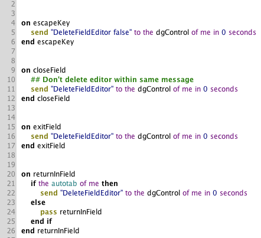

Make any customizations you need to make.

####Assign Your Custom Behavior to Field Editor

Whenever the Data Grid displays the field editor (e.g. the user
double-clicks on a cell in a table) a **preOpenFieldEditor** message is
sent to the Data Grid. The first parameter is a reference to the field
editor control. This is where a behavior script can be assigned to the
field.

## Building Standalones With the Data Grid
 
### What Do I Need to Do to Deploy a Standalone With a Data Grid?
 
A data grid relies on the stack **revDataGridLibrary** in order to function
properly. This lesson will describe how to include this stack in your
standalone applications.

####How The Standalone Builder Adds The Necessary Files
When you add a data grid to a stack, a substack is created whose name begins with 
"Data Grid Templates".

When you build a standalone application LiveCode uses the settings you have set for your 
application. These are on the **General** tab of the **Standalone Applications 
Settings**. By default LiveCode will look for a substack
whose name begins with "Data Grid Templates". If it finds one then the
**revDataGridLibrary** stack is added to your standalone application.

####But What About Launcher Stacks (Splash Stacks)?

Some developers prefer to use a launcher (or splash) stack technique.
This technique builds a standalone using a stack with very little code
in it that in turn opens the main stack that would contain the data grid templates. 
In this case the stack used to build the standalone will not have
a substack whose name begins with "Data Grid Templates" as no data grids
have been added to it.

In this case you will need to tell LiveCode that you require the inclusion of the 
Data Grid Library. As of version LC 8, the DataGrid library **DataGrid** has been 
added to the list of **Script Libraries** in the **Standalone Settings** dialog. 
You can now force the inclusion of the **DataGrid** library, to ensure that any stack 
loaded by the standalone can use Data Grids.

Open the **General** tab of the **Standalone Applications Settings** (1) and select 
**Select inclusions for the standalone application** (2)

 

Now open the **Inclusions** tab (1), locate the **DataGrid** library, and then click the 
checkbox (2) to include it.

 

##Useful Things to Know

### What Sorts of Things Should I Not Do in Order to Avoid Needless
### Suffering?
 
There are some things that you could do that will cause you to scratch
your head when things go wrong. Since knowing is half the battle we will
share the issues we are aware of.

#### Don't Call a Handler That Redraws the Data Grid From Within a
#### Control in the Data Grid
 
This will generate an error since you are deleting a control that is
currently executing code. This is a no-no and the LiveCode engine will
complain and stop executing. You can avoid calling a handler that
refreshes the data grid from within a control by a) using **send** **in time**
or b) placing the code in the data grid script itself.

**Example A**

    ## Script that is in the row behavior for a data grid.
    send "DeleteIndex theIndex" to the dgControl of me in 0 seconds
   
**Example B**

    ## Script that deletes hilited index on mouseUp.
    ## Place in the data grid script.
    on mouseUp pMouseBtnNum
      if pMouseBtnNum is 1 then
        put the dgHilitedIndex of me into theIndex
        DeleteIndex theIndex
      end if
    end mouseUp
    

####Don't try to draw a Data Grid on a card that Is not open

When a Data Grid renders, it dynamically creates fields and accesses
certain properties. Some of these properties can not be properly
reported by the LiveCode engine unless the field is on an open card.

####Do not lock messages when accessing data grid properties.

If messages are **locked** when you try to access a data grid property, for example

    set the dgProps["alternate row color"]** of group "DataGrid

the correct value will not be returned/set. 
A Data Grid relies on getProp/setProp handlers to function. 
When messages are locked these are not triggered.

####Do not password protect the Data Grid Templates Stack

The data grid copies the templates from the **Data Grid Templates xxxx**
stack. If you password protect this stack then the data grid will be
unable to copy the templates.

####Don't Rename the "Data Grid Templates" Stack

If you rename this stack then all of your data grids with templates
stored in the stack will stop working. Since the data grid can no longer
locate the custom templates they will fail to draw properly.

####Don't Try to Search When Data is Being Loaded From an External Source

####Stop Editing the Template Group Before Drawing Your Data Grid

When you **edit** a group in LiveCode the engine no longer knows that the
group exists. If you try to draw a data grid while editing it's template
group then the data grid will fail to draw. Make sure you have selected
**Stop Editing** from the **Object** menu or clicked on the **Stop Editing** 
icon on the **Toolbar.**

## Advanced Options
 
### Displaying Large Amounts of Data
 
Setting the **dgText** property or creating an array and setting the **dgData**
property of a data grid is the easiest way to display your data. But
what about situations where creating an array is too time intensive and
you already have the data in another format? A data grid can handle
these situations for you as well using a feature called callbacks.

Download the attached sample stack and database that shows how to use
the techniques described in this lesson to display data from a SQLite
database.

####Attached Files

[datagrid_databases.zip](http://lessons.livecode.com/s/lessons/files/
1077?lesson_id=7341)

####The dgNumberOfRecords Property

Normally a data grid reports the number of records based on the number
of numeric indexes in the first dimension of the **dgData** array. If you
set the **dgNumberOfRecords** property, however, the data grid stops using
an internal array and issues a callback message whenever it needs to
display data in a line.

>**Important**: When using this technique properties like **dgData**, **dgText**,
>**dgDataOfIndex**, etc. will no longer return values. The data grid is just
>displaying records from your data source. It does not store any of that
>data internally.

####GetDataForLine Callback

This diagram demonstrates how this works. If you were to set the
**dgNumberOfRecords** to 10000 then the data grid would start sending the
**GetDataForLine** message whenever it needed to display a row. Your
responsibility is to fill in the data that the data grid needs by
handling the **GetDataForLine** message. To do that you define
**GetDataForLine** as follows:

    command GetDataForLine pLine, @pDataA
    end GetDataForLine

You can define this handler in the data grid script or anywhere else in
the message path. Just fill in pDataA with the appropriate data and the
data grid will display it.

### Creating a Data Grid by Hand
 
This lesson will show you how to create a data grid through script.

####Copy Data Grid From revDataGridLibrary

The data grid template is stored in the **revDataGridLibrary** stack and can
be copied using some code similar to this:

    copy group "DataGrid" of group "Templates" of stack "revDataGridLibrary" \
     to card "MyCard" of stack "MyStack"
    put it into theDataGridRef

####Set The "style" Property

    set the dgProp["style"] of theDataGridRef to "table" or "form"
   
####Assign a Row Template

    set the dgProp["row template"] of theDataGridRef \
     to the long id of group "MyRowTemplate" of stack "MyStack"
   
You should probably create this ahead of time using the IDE. For
example, you could create a data grid and then delete it while leaving
the row template behind (it will exist on a card in "Data Grid Templates
xxx" stack).

### How Do I Create a Datagrid Dynamically From Tab Delimited Data
 
Most of the lessons show how to use and change previously created data
grids, and assume you want to create them in the IDE. This lesson will
explain how to create a table data grid by script.

#### Prepare Your Data
 
To make sure that the data grid can accept your tabular data, you should
prepare it with these points in mind:

This example works with tab delimited data. The first row of the data
should include the names of the columns (this makes it easier to create
columns later on) each name should be unique, no empty names are allowed.
One way to create tab delimited data is to choose "save as..." in Excel,
and then select "text  file (tab delimited)". It is simple to load data
into Livecode from such a file:

    answer file ""
    put url ("file:" & it) into theData

#### Create a data grid#### 

Each data grid consists of a group with lots of scripts and objects.
Luckily, you do not need to recreate all that from scratch. Instead you
can simply copy a template data grid from the data grid library. Because
this library is neccesary for all data grid functionality, it will be
added to standalones by the IDE automatically. Please also see 
[What Do I Need to Do To Deploy a Standalone With A Data Grid?](#what-do-i-need-to-do-to-deploy-a-standalone-with-a-data-grid) 
for an explanation when and how you need to add the library to
standalones yourself.

The code to copy a datagrid:

    --copy the template group
    copy group "DataGrid" of group "Templates" of stack "revDataGridLibrary" to this card
    set the name of it to "my Datagrid"
    set the dgProp["style"] of group "my Datagrid" to "table"

#### Create the Row template#### 

In theory, your data grid is already ready for use. But for the IDE to
interact correctly with the new data grid, you also need to add a
substack with the row template, just as the IDE would. On the second
card of that stack, you will need to add a group called **Row Template**,
and you need to point your data grid to that group.

Here is how you could do that:

    --create row template
    put the name of this stack into theMainstack
    put "Data Grid Templates" && the seconds into theName
    create invisible stack theName
    set the mainStack of stack theName to theMainstack
    go stack theName
    create card
    create field "label"
    create graphic "Background"
    group field 1 and graphic 1
    set the name of last group to "Row Template"
    go stack theMainstack
    --point datagrid to template
    set the dgProp["Row Template"] of group "my Datagrid" to the \
     long id of group "Row Template" of stack theName

#### Fill in Your Data

As a last step, you will want to insert the prepared data into the data
grid. Again, this assumes that the first row of your data contains an
unique description for each column:

    --add data
    put true into firstLineIsNames
    set the dgText[firstLineIsNames] of group "my DataGrid" to theData
   

#### Prepare the Columns of the Data Grid

Because you are creating the datagrid from arbitrary data, you will also
need to ***dynamically create*** all necessary columns. To do that you
need to set the **dgProp["columns"]**. Note that it accepts the names only
as a return delimited list.

If your data includes the column names in it's first row, you can simply
take this and replace tab with return:

    --create columns
    put line 1 of theData into theColumns
    replace tab with return in theColumns
    set the dgProp["columns"] of group "my DataGrid" to theColumns

#### Everything together#### 

To test out the example scripts, simply copy the following **mouseUp**
handler into a button of an empty stack, and click on it with the
**browse** tool.

    on mouseUp
      answer file "tab delimited" with type "any file" or \
       type "tab file|tab|TEXT" or type "txt file|txt|TEXT"
      --in case the user cancels the file dialogue, the script does not proceed
      if it = "" then
         exit mouseUp
      end if
      put url ("file:" & it) into theData
    
      lock screen --when doing visual stuff, this helps to speed things up
      --make sure the group does not exist already
      if there is a group "my Datagrid" then
           delete group "my Datagrid"
      end if
      --copy the template group
      copy group "DataGrid" of group "Templates" of stack "revDataGridLibrary" \
       to this card
      set the name of it to "my Datagrid"
      set the dgProp["style"] of group "my Datagrid" to "table"
      --position it nicely
      set the rectangle of group "my Datagrid" to 0,the bottom \
       of me + 16,the width of this card, the height of this card
      
      --create row template
      put the name of this stack into theMainstack
      put "Data Grid Templates" && the seconds into theName
      create invisible stack theName
      set the mainStack of stack theName to theMainstack
      go stack theName
      create card
      create field "label"
      create graphic "Background"
      group field 1 and graphic 1
      set the name of last group to "Row Template"
      go stack theMainstack
      --point datagrid to template
      set the dgProp["Row Template"] of group "my Datagrid" to the \
       long id of group "Row Template" of stack theName
    
      --create columns
      put line 1 of theData into theColumns
      --no empty column names are allowed, so insert a space when \
       that happens
      replace tab & tab with tab & " " & tab in theColumns
      replace tab with return in theColumns
      set the dgProp["columns"] of group "my DataGrid" to theColumns
    
      --add data
      put true into firstLineAreNames
      set the dgText[firstLineAreNames] of group "my DataGrid" to theData
    end mouseUp

## Data Grid Tips & Tricks

### How Do I Scroll a Row to the Top of the Data Grid Form?

This lesson will show you how to scroll a particular row to the top of the Data Grid form 
using the **dgRectOfIndex** (or **dgRectOfLine**) property. This technique is useful when your 
rows are not a fixed height.

Here is selected row in a data grid (1). 
The goal is to scroll that row to the top of the data grid (2).

####How To Do It

Here is the code that will scroll the selected line to the top of the data grid.

***Copy & Paste***

    put the dgHilitedIndex of group "DataGrid" into theIndex
    put the dgRectOfIndex [theIndex] of group "DataGrid" into theControlRect
    put the rect of group "DataGrid" into theGridRect
    put item 2 of theGridRect - item 2 of theControlRect into theOffset
    set the dgVScroll of group "DataGrid" to the dgVScroll of group "DataGrid" - theOffset

#### The Result

After executing the code the row will have been moved to the top of the data grid.

### How Do I Find Out Which Line the Mouse Is Over?

Each data grid row has a **dgDataControl** property that returns the **long id** of the 
control. Each control also has a **dgLine** and **dgIndex** property. You can combine 
the two in order to identify the control the mouse is over.

    put the dgDataControl of the mousecontrol into theControl
    if theControl is not empty then
      put the dgLine of theControl into theLineNo 
    end if
   

### Converting a Database Cursor to a Data Grid Array

This lesson demonstrates a handler that will convert a database cursor into an array that 
you can use to set the **dgData** property of a data grid.

####The Handler

    command ConvertSQLCursorToArray pCursor, @pOutArrayA
      local i,j
      local theFields
      local theError
      
        put revDatabaseColumnNames(pCursor) into theFields
        if theFields begins with "revdberr," then
          put item 2 to -1 of theFields into theError
        end if
        
        if theError is empty then
          put 0 into i
          repeat until revQueryIsAtEnd(pCursor)
            add 1 to i
        
            repeat for each item theField in theFields
              put revDatabaseColumnNamed(pCursor, theField) into \
                  pOutArrayA[i][theField]
            end repeat
            
          revMoveToNextRecord pCursor
        end repeat
      end if
      
      return theError
    end ConvertSQLCursorToArray

The Handler first checks that no errors have been returned. If there are any, the 
error data is returned.

The handler then steps through the database cursor restructuring the data into an indexed 
multidimensional array that can be used by the data grid.

####How to use

You can call this command as follows. 

In this example theCursor is a database cursor that you have opened using 
revQueryDatabase.

    local theDataA
    ConvertSQLCursorToArray theCursor, theDataA
    put the result into theError

If theError is empty then dimension 1 of *theDataA* will contain integers from 1 to the 
number of records in the cursor (**revNumberOfRecords**). Each 1st dimension, in turn, 
has a key for each column in the cursor (**revDatabaseColumnNames**).

####Example

Here is what the array might look like if your cursor had 2 columns (id and name) 
and 3 rows.

theDataA [1] ["id"]

theDataA [1] ["name"]

theDataA [2] ["id"]

theDataA [2] ["name"]

theDataA [3]["id"]

theDataA [3] ["name"]

You can use this array to set the ***dgData*** property of a data grid.

    set the dgData of group "DataGrid 1" to theDataA

