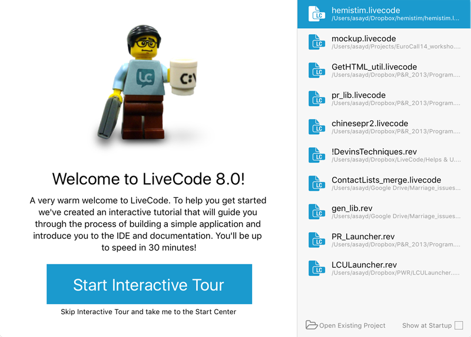
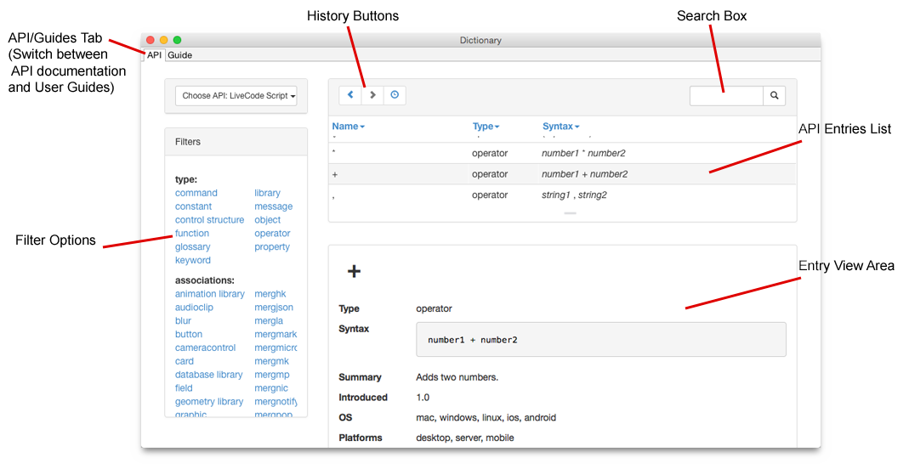

# LiveCode Script

## Introduction

Before getting started with LiveCode, there are a number of things you
may want to know. This guide introduces LiveCode, tells you where to
begin, how to install, register and how to use the documentation.

## Welcome

LiveCode makes it easy to turn your concepts, ideas or designs into
powerful applications. You can create desktop, Internet, database and
network applications. LiveCode includes a complete graphical user
interface builder, as well as the tools you need to produce faceless or
background applications.

LiveCode is easy to learn. If you are a complete beginner to the world
of programming, you will find you can become productive quickly. If you
are an experienced programmer, you will find the environment extremely
powerful and one of the most productive you have used.

LiveCode’s programming language is object-based. This makes it easy to
write modules of code that are attached directly to individual objects.
Unlike other languages, LiveCode lets you both run and edit an
application live. Traditionally the run, edit, compile and debug cycle
in programming takes up a lot of time. In LiveCode all of these
activities can take place together.

If you’re coming from another language, you’ll appreciate that the
LiveCode language is typeless, with data automatically stored in the
most efficient format and converted, so you don’t have to learn how to
deal with different types of data. Memory management is fully automatic.
LiveCode applications are not interpreted in the traditional sense, so
they provide excellent performance. A LiveCode graphical application
will often feel more responsive to use than a Java application, and take
less time to write.

A LiveCode application is completely cross-platform. That means you can
run any application you create on all major modern operating systems,
including Windows, Linux, Unix and Mac OS. Unlike most other
cross-platform frameworks, a LiveCode application will always look and
feel native on each platform that you deliver it on. You can take
advantage of many platform specific features on each platform.

LiveCode removes the need to learn how to access most individual
programming interfaces for each operating system. This saves you the
time and effort of learning thousands of platform-specific interface
calls.

The goal of this manual is to provide the most accessible, comprehensive
and useful guide to LiveCode possible. We aim to provide a level of
depth that covers the advanced feature set, while remaining accessible
to beginners. We hope you find this material useful and enjoy using
LiveCode.

## Where to Begin

We recommend you start by taking a look at [our online
resources](https://livecode.com/resources/). There is a wide variety of
introductory material there, including step-by-step examples and guides
for performing common tasks.

## System Requirements

Memory and disk requirements below are for the *LiveCode development
environment*, not for applications created by LiveCode. Applications
created with LiveCode will require sufficient free system resources to
load, display, process and interact with the content of the application.
Because this will vary considerably depending on the application
created, it is not possible to publish a list of requirements for
applications built with LiveCode. You will need to test your application
to determine the minimum requirements. Many LiveCode applications will
run on a moderately powerful computer and require substantially fewer
resources than those listed for the development environment, others will
require more.

### All Operating Systems

To use LiveCode you will need:

-   1024x768 or larger monitor

-   True color display (16-bit or 32-bit depth)

-   At least 256Mb of memory

-   At least 150Mb of disk space

### Requirements for Windows Systems

LiveCode supports the following versions of Windows:

-   Windows 2000 SP4

-   Windows XP SP2 and above

-   Windows Server 2003

-   Windows Vista SP1 and above (both 32-bit and 64-bit)

-   Windows 7 (both 32-bit and 64-bit)

-   Windows Server 2008

### Requirements for Linux Systems

The minimal requirements for LiveCode to run on Linux are:

- 32-bit installation, or a 64-bit linux distribution that has a 32-bit 
compatibility layer
- 2.4.x or later kernel
- glibc 2.3.2 or later X11R5 capable Xserver running locally on a
24-bit display\*
- compositing window manager (optional - required for alpha-blended
window shapes)
- gtk/gdk/glib (optional - required for native theme support)
- pango/xft (optional - required for pdf printing, anti-aliased text
and unicode font support)
- lcms (optional - required for color profile support in JPEGs and
PNGs)
- gksu (optional - required for elevate process support)
- mplayer (optional - required for video playback)
- esd (optional - required for audio playback)

Although impossible to test every existing Linux distribution, we are
aiming to ensure that LiveCode runs on as wide a variety of systems as
possible. To achieve this, the engine has been implemented to have
minimal direct dependencies on system software, and will gracefully
degrade in feature set if it cannot find the libraries it needs.
Generally any recent linux distribution including Gnome/GTK support will
have the required libraries for full feature support – for example,
Ubuntu 7 supports all these features (although alpha blended window
shape support requires you to be running with 'Advance Desktop Effects'
turned on).

### Requirements for Mac OS X Systems

LiveCode supports the following versions of Mac OS X:

- 10.6.x (Snow Leopard)
- 10.7.x (Lion)
- 10.8.x (Mountain Lion)
- 10.9.x (Mavericks)
- 10.10.x (Yosemite)
- 10.11.x (El Capitan)

## Using the Documentation

### Documentation Conventions

Language Terms

This documentation contains examples of LiveCode language syntax. The
syntax for each language term is provided in **boldface text**.

The syntax description uses the standard conventions to indicate parts
of the syntax: 

- `[]` Square brackets enclose optional portions.
- `{}` Curly braces enclose sets of alternatives from which to choose.
- `|` Vertical bars separate different alternatives.
- `\` Line continuation character – this line continues to the next 
line.
- *Italics* indicate placeholders that you don't enter literally.

Code examples are provided in `typewriter text` or 

	code blocks

#### Menu Reference

When you are told to choose an item from a menu, the menu name is
written, followed by an arrow, followed by the menu item. For example
**File -\> New** means choose "New" from the "File" menu.

#### Keyboard Shortcuts

Many menu items have keyboard equivalents. These items can be accessed
by holding down a modifier key and pressing another key. The modifier
keys used throughout this document are generally the modifier keys used
on Windows, Linux and Unix. If you are using Mac OS, you may need to
substitute modifier keys using the table below. For example, if you are
using a Mac, where we say press **control-x** in this documentation, you
may need to press **command-x**.

| **Windows and Linux keyboard shortcuts** | **Mac equivalent**        |
|------------------------------------------|---------------------------|
| Control                                  | Command                   |
| Alt                                      | Option  

Figure 2– Cross-platform Keyboard Shortcuts

#### Screen Snapshots

Screenshots are used extensively throughout the documentation. Please
remember that LiveCode is a cross-platform application. While many of
the snapshots are taken on the Windows platform, most of the feature set
will work on Linux, Unix and Mac OS. Snapshots of these platforms are
used from time to time and are also used to illustrate platform specific
features.

##### Note Styles

> **Tip:** This style of note tells you about an alternative way to
> do something or describes a shortcut.

> **Important:** This style of note describes an aspect of LiveCode
> that may confuse you if you don't know about it and tells you how to
> avoid unexpected behavior.

> **Note:** This style of note provides some additional information
> that may be useful, or emphasizes a key point.

> **Caution:** This style of note warns you about a potential
> problem that might cause an error or loss of data.

### Navigating the Documentation

The LiveCode documentation is spread across four areas; the Start
Center, the Dictionary (API), the Guides and other resources.

The Start Center is aimed at introducing you to LiveCode, and should be
your first port of call if you have not used LiveCode before. The
dictionary, or API, is a reference resource which you can refer to while
implementing your projects. Guides are online resources at livecode.com. 
Other resources include Sample Stacks, a free, online repository of 
user-contributed stacks, User forums, and the resources page at 
livecode.com/resources/.

You can access the documentation from within LiveCode from the **Help**
menu. Additional resources are available at
[www.livecode.com](http://www.livecode.com).

### Start Center

The purpose of the Start Center is to introduce you to LiveCode and
provide you with enough knowledge to start implementing your own
projects. It can be accessed by choosing **Help -\> Start Center**. 

The first time you open the Start Center you will see an invitation to 
take the Interactive Tour, a step-by-step tutorial that guides you 
through creation of a simple project in LiveCode. If you choose to 
skip the tour you may always enter it later by clicking the Interactive 
Welcome button in the Start Center.

The Start Center itself is split across three sections&mdash;quick links 
to the LiveCode pages on various social media sites; a collection 
of quick link buttons, which take you to various helps and guides; and 
a list of your most recently opened stacks.

#### Social Media Links

LiveCode maintains pages on popular social media sites, such as Facebook, 
YouTube, LinkedIn and Stack Overflow. These can help you keep up to date 
on LiveCode product announcements, professional networking, and help and 
training resources.

#### Recent Stacks

This shows a list of your most recently opened stacks. Double click on a 
stack to open it and close the Start Center window.

#### Quick Links

The quick link buttons let you quickly access tutorials, sample projects, 
guides, LiveCode blog posts, and online user forums. Here is an overview 
of these links:

##### Interactive Welcome

Enter the Interactive Tour, a step-by-step tutorial that guides you 
through creation of a simple project in LiveCode.

##### New

Click this button to create a new stack. You will see a menu of common 
stack types and sizes to choose from. Once you choose your stack size 
or type the new stack will be created and the Start Center menu will close.

##### Sample Projects

The Sample Projects button opens an online repository of sample stacks 
submitted by LiveCode developers. The repository contains dozens of 
stacks that you can download for free and use as you wish.

##### Tutorials

Opens the LiveCode online tutorial web page. From here you can choose 
one of dozens of lessons and how-to tutorials that give you step-by-step 
instructions on how to create things, from a simple "hello world" 
application to simple games to sophisticated graphical effects.

##### In Depth Guides

Opens the LiveCode Dictionary. Here you can choose to enter the API 
documentation, the definitive reference of all of the terms in the 
LiveCode scripting language. Or you can open one of several user 
guides, which describe in detail how to develop and deploy apps in LiveCode. 

##### Forums

LiveCode has a very active and friendly user community. We encourage all
new users to sign up to our mailing list and user forums as they are a
great way to get technical help, meet new people and keep up-to-date
with what is going on in the world of LiveCode. The “User Forums”
section provides a link to our forum registration page as well as a list
of links to the most recent posts which have been made.

##### Blog

This button takes you to LiveCode's online blog, where LiveCode engineers
and developers regularly post updates about what's new in LiveCode, 
how-to tutorials, and announcements of interest to the LiveCode 
developer community.

##### Account

Click this button to log in to your LiveCode online store account. 
There you can see your purchases, as well as look for useful add-ons 
to make LiveCode and even more powerful development tool.

### Dictionary

The LiveCode Dictionary contains detailed reference materials for developing applications with LiveCode. It is divided into two main sections&mdash;the LiveCode API reference and the LiveCode Guides. It can be accessed by choosing **Dictionary (API)** from the **Help** menu, or by clicking the Dictionary icon on the LiveCode Toolbar.

#### LiveCode APIs

The LiveCode Application Programming Interface, or API, reference contains the complete syntax for all LiveCode components, including LiveCode Script, LiveCode Builder, and all installed widgets and libraries. If you are new to LiveCode you will likely spend most of your time in LiveCode Script, the scripting language used in developing LiveCode applications. The examples that follow will be taken from the LiveCode Script API, but the API documentation for all components uses the same format and layout.

To search one of the API lists, click on the API tab at top left, then choose the API you want to search from the option list. For example, to search for a LiveCode Script term, choose LiveCode Script.

**Searching.** If you know what term you want to look up, or if you have a good idea of what it might be, just start typing it into the search box, and a list of terms that match your search term will appear in the entries list. 

**Filtering.** If, on the other hand, you don’t know the name of the term, but have a general idea of what terms you want to look at you can filter the list of terms by clicking on a filter topic. For instance, to see a list of messages that buttons can respond to, click "message" under the **type** category and "button" under **associations**. You can clear a filter by clicking again on the selected filter.

Note that the entries list displays only the entry name, token type, and syntax for the entry. You can view the complete entry by clicking on the desired line in the list. This will show the entry in the area underneath the entries list. Each LiveCode scripting term is thoroughly documented with the proper syntax, detailed examples, a detailed description, related terms, and more.

#### LiveCode User Guides

The User Guides are a complete reference to LiveCode. They detail what the dialogs and windows within the development environment do, and explain the LiveCode language in depth. To open a guide, click on the Guide tab in the Dictionary and choose the desired guide from the list.

### RevOnline

RevOnline gives you the opportunity to upload and share your projects as
well as download those created by other members of the LiveCode online
community. It can be accessed via the Sample Stacks button located in the
menu bar. The main interface can be seen below:

The interface is designed to organise the online content into various
categories to aid you in finding the kind of content you wish to
download. You will find three main types of content in RevOnline, stacks
(LiveCode programs), externals and code snippets. Externals are
libraries that can extend the functionality of the LiveCode language
using a lower level language. A code snippet is a portion of LiveCode
script that you can paste into and incorporate into your own projects.

The results of searching or browsing through the RevOnline content are
displayed in the *search list* area. This is an explanation of the
controls you can use to adjust the parameters of your search:

| &nbsp;| &nbsp;|
|---------------------|-------------------------------------------------------------------------------------------------------------------------------------------------------------------------------------------------------------------------------------------------------------------------------------------------------------------------------|
| **Search field**    | Enter text and press return or click “Go” to search. Matches will be made against the titles of uploaded content, the author’s name and content descriptions.                                                                                                                                                                 |
| **Type list**       | Highlight one of the items in this list filter search to only show results of that type. Selecting “All” will display content of all three types.                                                                                                                                                                             |
| **Tag list**        | Tag your own and others people’s content with a word or phrase. All tags are listed here alphabetically. Selecting a tag will filter the search results for uploads that have been tagged accordingly. Selecting “All” will remove the filtering.                                                                             |
| **Search order**    | Change the order in which the search results are displayed. There are four options. “A to Z” lists content alphabetically by title, “Popularity” by the number of times it has been downloaded, “Rating” by the average user rating (out of five stars) and “Date” by the date on which the content was uploaded to RevOnline |
| **Order direction** | The direction (ascending/descending) of the search order can be changed by clicking on the arrow to the right of the sort control.                                                                                                                                                                                            |
| **View mode**       | The search list area can be viewed in two modes, a vertical scrolling list or a grid. In “list” mode 10 results will be displayed per page, in “grid” mode the number of results displayed will be dependent upon the size of the RevOnline stack. Whilst in “grid” mode the *viewing pane* area will not be visible.         |
| **User filter**     | If you apply user filter to a search, the user’s name will appear above the type and tag lists (see below), subsequently only content by that user will be returned in the search results. Clicking on the button or text of the user filter will remove it.                                                                  |

The *search list* area displays a preview of the results your search has
returned. At the top of this list you will see the *page controls* which
allow you to navigate forwards and backwards through the pages of your
search should it return more results than can be displayed on one page.

An example of the search list previews can be seen below:

At the top of the preview is the content’s name. You can also see its
average user rating out of five stars, the total number of times it has
been downloaded, the authors name and a list of tags applied to this
upload. The “download” button at the bottom will download and launch
this particular stack, it also tells you the size of the download. The
*preview image* can either be a custom screenshot as above or one of
three standard images. These are black for stacks, red for code snippets
and green for externals. The *type icon* in the lower left corner of the
preview image also indicates the type, these are shown below for a
stack, code snippet and external respectively:

  

Clicking on the *preview image* or content title will update the right
hand *viewing pane* with more detailed information about this upload.
Clicking on the authors name will display the author’s user profile in
the *viewing pane* and introduce a *user filter* to the search results.
When the *search list* is in “grid” mode the *viewing pane* will be
hidden, doing either of the above operations will cause the *search
list* to switch back to “list” mode and display the associated content
in the *viewing pane*.

The *viewing pane* displays detailed information on users and uploads.

If you are a viewing stack details as shown above, in addition to the
information provided by the preview you will also see a headline,
description and a revision number which is incremented whenever the
author uploads a new version of their stack, code snippet or external.
Clicking on the author’s name or *user profile image* will display their
profile view. Clicking on the *content type* or any of the tags in the
*list of applied tags* will apply these filters to the search controls.
When viewing an external your will see an additional “Platform:” field
that indicates which platforms the external library is compatible with,
make sure your operating system is supported before downloading and
installing an external. If you are currently logged in to your Rev
Online account you will be able to give the upload a rating by hovering
over the *rating control* and clicking when the rating you wish to
submit is displayed, this can only be done once per upload. You can also
tag the upload by clicking on the *add tag control* which brings up
following dialog:

As you type into the text entry field, tag suggestions will appear in a
drop down menu that can be selected using the arrow keys. Once you have
finished typing press the ok button to submit your tag, you must be
logged in to complete this operation.

The *status bar* at the bottom of the RevOnline interface displays the
number of results your search has returned as well as a progress bar
indicating the progression of searches and downloads. You will also see
text feedback in response to the operations you perform such as
“Retrieving stack details ...” and “Content tagged” etc.

In the top right corner of RevOnline you will find the *login controls*
which will display your current login status as shown below:

In order to upload, rate and tag content in RevOnline you must have an
account, this account is also required for making comments in the wiki
docs detailed elsewhere. To register for an account just click on the
“Sign Up” control and enter your email in the dialog that appears. Your
email address will be used as your username for logging in, a password
will be emailed to you upon signing up. After receiving this email you
must hit the activation link in the email before your account can be
accessed. Once activated, you can login to your account using the “Log
In” control pictured above which will bring up the following dialog:

The “Remember me” check box will cause RevOnline to maintain your
username in the “Email :” field between login attempts. The “Sign in
automatically” check box will mean that you are automatically signed in
upon opening RevOnline, however if you explicitly sign out you will have
to re-enter your password regardless of this preference. If you forget
your password at any time you can use the “Forgot your password?” link
in the login dialog to have a new one emailed to you.

Upon logging in and viewing your profile for the first time you will be
presented with your profile view in edit mode where you have the
opportunity to enter information about into the highlighted fields and
change your profile picture using the *change profile picture* control
as shown below:

Clicking on the *change profile picture* control will bring up the
following dialog:

Use the *Position Controls* to move the centre of the image up, down,
left or right. You can zoom in or out using the *Zoom controls*.
Pressing the *Re-centre image* button will reset the image to its
original position and zoom level. Once you are happy with orientation of
your picture click ok, or cancel to discard your changes. This dialog is
also used to change stack preview pictures.

When you have finished editing your profile you can hit the “save
changes” button to submit your information, a minimum of a first and
last name must be entered before you can save. You can also choose to
display your email or not and change your password to one of your
choosing using the “Change password” control. You can reach this profile
at any time by clicking on the “My Account” control in the *login
controls* which will both display your profile and display all your
uploads in the *search list*. To exit this view simply remove the user
filter or hit the “My Account” control again.

To upload content to RevOnline simply click on the “upload content” in
the *login controls,* you will then be presented with the content
browser view.

Clicking on the tabs at the top of this view will change the content
type. Above you can see the code snippet view, it simply requires you to
paste a section of code into the *code entry field* and press ok, if you
have your code snippet stored in your clipboard you can simply press the
“paste” button. For stacks you can either select a stack from the list
of recently opened stacks or browse to the files location using the
“browse” button. For externals you need to check which platforms your
external will support and then browse to the appropriate file you wish
to upload (shown below). The default file types for extensions on each
platform are; “.dll” for Windows , “.bundle” for Mac OS X and “.so” for
Linux.

When uploading a code snippet or external RevOnline will place the code
or file into an installer stack. The installer stacks give you the
option to “install” or “try” an external file or “copy to clipboard” a
code snippet. When using the try option with an external the file will
be removed from your installation when you next exit LiveCode.

Once you have pressed ok you will be presented with the edit mode view
for the file you are uploading. Here you can enter a name description
and change the preview picture for your upload (note – you cannot edit
the title of an external upload it must be the name of one of the files
you have included). If you attempt to upload a file that has already
been uploaded to RevOnline, you will be taken to the existing version of
that file to edit, this avoids duplicate uploads.

Whenever you are viewing content that you have uploaded or your own
profile whilst logged in the edit controls will appear above the
*viewing pane*, shown below:

By clicking on the “edit profile” or “edit stack” (for stacks etc.)
button you are entering edit mode which allows you to make changes to
the information shown. When editing your profile you can simply save or
discard the changes you have made. When editing an upload you have the
additional options of deleting and updating the uploaded file. The
delete control will permanently remove your upload from RevOnline. The
update control allows you to replace the stack file, code snippet or
external library with a newer version. Clicking on this control will
present you with the content browser view discussed earlier. After you
have chosen a replacement file you need to save your changes in order
for the new file to be submitted.

The list of tags applied to your own uploads can be altered by using the
“Add/Delete tags” control 

which will bring up the following dialog:

This works in a similar way to the previously explained tag dialog
except that you can view the entire list of tags and edit which ones you
wish to be displayed. When hitting return after entering the name for
your tag a new *tag item* will appear in the list (also achieved by
pressing the *add tag* button). Tags can be removed by clicking on the
appropriate *remove tag button*. If your tag list is too large for one
page you can browse through the pages of tags using the *page controls*
at the bottom of the dialog. Once you have finished editing the list you
can submit your changes by clicking the ok button.

Additional options for the RevOnline interface can be set in the
RevOnline tab of the preferences stack. As pictured below:

Here you can set the remember password and user name preferences and
change your password to one of your choosing. The search results in
RevOnline are cached to speed up performance. You can tweak the size and
time for which this cache remains valid using the two slider controls. A
larger cache will give you faster performance but will take longer to
pickup changes made to the online content made by other users. If the
text only searches option is checked RevOnline will only retrieve the
text data for the search list previews which can also improve
performance.

## Additional Resources

If you have a question that isn't answered in this documentation, you
can find additional information to help you on our web site. You can
also connect with the LiveCode developer community, which includes many
experienced developers who offer their expertise for the common good to
answer questions and help their fellow developers. You'll find example
code, information on planned enhancements, and the latest updates.
Visit:

http://www.livecode.com

### Developer Community

There are a number of ways to engage with the LiveCode community:

* The [forums](http://forums.livecode.com/) (section 1.6.3 above), are
available for getting help from other developers, for discussing feature
requests and future directions, and for receiving announcements from
LiveCode.

* Ask a question on
[stackoverflow](http://stackoverflow.com/questions/tagged/livecode).

* Talk about LiveCode on [the LiveCode
subreddit](https://www.reddit.com/r/livecode).

* Join the [LiveCode user
group](https://www.facebook.com/groups/livecodeusers) on Facebook.

* Use the [LiveCode mailing
list](http://lists.runrev.com/mailman/listinfo/use-livecode) is also
available.

> **Tip:** Tip: You can use the Google search engine to search the list
> archives, using [this
link](http://www.google.com/advanced_search?q=site:lists.runrev.com)

### Technical Support

LiveCode offers *up and running* technical support to all users to
assist you in getting the development environment working on your
system.

Many editions include additional technical support for more *advanced*
problems and questions. Where support is not included, a separate
technical support contract for advanced support can be purchased.

Contact us [here](https://livecode.com/about/contact/) or at
<support@livecode.com>.

## Getting Started

Creating a simple *graphical application* in LiveCode can take just
minutes. First you create a user interface, including any windows,
palettes, dialogs you require. Then you populate the user interface with
controls, like push buttons, check boxes, text fields or menus. Finally,
you use LiveCode’s English-like programming language to tell your
application how to behave.

### Prerequisites

Before you get started, you should be familiar with how to use your
computer. You should also be familiar with common applications such as a
web browser, word processor and email client. If you are using Linux or
Unix, you should be familiar with basic use of the command line. If you
are not familiar with using a computer, we recommend you spend some time
getting acquainted before trying to learn LiveCode.

### Event Driven Programming

A LiveCode application is driven by user actions. LiveCode constantly
watches the computer for common actions, such as clicking on a button,
typing into a field, sending data across a network, or quitting an
application.

Whenever an event occurs, LiveCode sends a message. When writing your
program, you decide what messages you want your program to respond to.
LiveCode automatically sends each message to the most relevant object.
For example, if a user clicks on a button, LiveCode sends a message to
the button. You place code within the button that tells it how to
respond to being clicked on.

There are a wide range of possible events. When a user clicks on a
button, a series of events are sent to the button. For example, when the
mouse first moves within the border of the button a **mouseEnter**
message is sent. Then a series of mouseMove messages are sent as the 
mouse moves over the button. When the mouse button is depressed a 
**mouseDown** message is sent. When the mouse is released a **mouseUp**
message is sent. You don’t have to respond to all of these events. You 
simply place code within an object to handle the events you want your 
application to respond to.

Events that are not handled by individual objects can be handled in a
number of ways at different levels of your application, in libraries, or
they can be ignored. The rules that govern what happen to events that
are not processed by an object are described in the section *The Message
Hierarchy*.

We’ll return to Event Driven Programming in more detail in the section
*Coding in LiveCode*.

### Object-Based Programming

Any *graphical application* you build using LiveCode will be based on
objects. With LiveCode you typically create the objects of your
application before writing any code. You can start by drawing the
buttons, text fields, and other controls that make up your application.
LiveCode operates like other layout, drawing or application development
environment. You can select controls by clicking them, move them by
dragging them around, resize them, and change their ‘layer’ to move them
closer or further from the ‘top’ of the interface.

Once you have the objects in place, you can proceed to attach code to
each object to respond to the events you want. LiveCode includes a
complete graphical development environment that makes it easy to create
and edit any kind of user interface. It includes objects for all the
basic operating system elements, including buttons, checkboxes, text
fields, menus, graphics, and many more. In addition you can create and
customize your own objects that look and behave however you want.

If you are writing a non-graphical application, you can choose to create
objects to assist in organizing your code into sections and load these
objects off screen, or you can simply write your code in a text file and
run the text file directly. This method is commonly used to communicate
with Apache and other web browsers when using LiveCode to build
server-side or network applications.

Object-Based programming is covered in more detail in the section
*Building a User Interface*. Non-graphical applications are covered in
more detail in the section *Building a Web Application*.

### The ‘Edit’ and ‘Run’ Mode

> **Important:** In order to enter **run** mode, choose the browse tool
> in the *top left* of the tools palette.

In order to **edit**, choose the pointer tool from the *top right* of
the tools palette.

Unlike most other development systems, a LiveCode application can be
created, edited, debugged and run live.

When in run mode, objects receive all the normal messages that drive a
LiveCode application. For example, clicking on a button in run mode will
cause a **mouseUp** message to be sent to it, causing the button's 
script to run if you've designed it to respond to the **mouseUp** 
message.

When in edit mode, objects do not receive messages when you click on
them, and you can move, resize or edit the properties for objects.

> **Tip:** To temporarily stop all messages being sent to your
> application while editing it, choose *Suppress Messages* from the
> *Development* menu or *Toolbar*.

There few other differences between the two tool modes. You can view and
edit properties and code in either mode. Your application does not stop
running while you make changes to it. Only mouse interaction with
objects is suspended in edit mode to allow you to edit them more easily.

Because LiveCode is constantly live, you can easily make simple changes
and watch each change take effect as you make it. This allows you to
design and experiment using an iterative process, resulting in a more
productive and satisfying development experience.

## Structuring your Application

### Cards, Stacks & Files

The first step in creating a LiveCode application is creating a window,
which in LiveCode is called a stack. Each window you see in LiveCode is
a stack. Palettes, dialog boxes, and standard windows are all stacks.

Each stack contains one or more sets of information called cards. Each
card can have a different appearance or all the cards in a stack can
look the same. By going from card to card in a stack, you change what's
being displayed in that stack's window. You can think of a LiveCode
stack as a stack of playing cards (hence the name), where you can flip
through the cards, but only one card at a time is visible. A stack can
have a single card or many cards. See Figure 3 – Stack file Structure,
below.

All user interface objects (controls) are created by dragging them on to
a card area.

You can also group controls together if you want them to operate as a
set. For example, if you have a set of navigation buttons that go from
card to card in your stack, you can make them into a single group.
Groups can appear on more than one card, so your navigation buttons or
background image can appear on each card of your stack. For more
details, see the section on *Group and Backgrounds*.

A collection of stacks can be saved together in a single file. This file
is known as a stack file. The first stack in the file is called the main
stack and will be loaded automatically when your application is run.

### The Structure of a Stack File

Each LiveCode file contains one or more stacks: either a single main
stack, or a main stack and one or more substacks. Since each stack is a
window (including editable windows, modeless and modal dialog boxes, and
palettes), a single stack file can contain multiple windows.

You can use this capability to bundle several related stacks into a
single file for easy distribution, to organize your stacks into
categories, or to allow several stacks to inherit properties from the
same main stack.

Figure 3 – Stack File Structure

### Opening a Stack File

When you open a stack file, either by using the "Open Stack" menu item
in the File menu or by using one of the navigation commands (see **open,
go**, **modal**, **modeless**, **palette**, or **topLevel** in the
*LiveCode Dictionary*), the stack file's main stack opens automatically
to its first card.

> **Important:** A stack file is saved as a whole. If you save a stack,
> all the other stacks in the same stack file are saved at the same time.

Substacks in the stack file do not open automatically when the stack
file opens. You must open a substack in a handler or the Message Box, or
by using the Application Browser.

### Main Stacks and Substacks

The first stack created in a stack file is called the *mainstack*. Any
other stacks created in the same stack file are called *substacks* of
the mainstack.

The mainstack is part of the object hierarchy of all other stacks in the
same stack file. In other words (for the purposes of inherited
properties and shared behaviors), the mainstack *contains* its
substacks. Events that are not handled by a substack are passed on to
the mainstack's script, color and font properties are inherited from the
mainstack by its substacks. For more details on the object hierarchy and
inheritance in LiveCode in general, see the section on *The Message
Path*.

Dialog boxes and palettes are commonly stored as substacks of the main
application window, which is typically a mainstack. This allows you to
store code and common functions used by all the substacks in the
mainstack's script. Because mainstacks are part of the object hierarchy
of their substacks, the substacks can call this functionality from
scripts within the substack.

### Stacks, Stack Files, and Memory

A stack file can be loaded into memory without actually being open. A
stack whose window is closed (not just hidden) is not listed in the
**openStacks** function. However, it takes up memory, and its objects
are accessible to other stacks. (For example, if a closed stack loaded
into memory contains a certain image, you can use the image as a button
icon in another stack.)

If one stack in a stack file is loaded into memory, so are any other
stacks in the same stack file. You cannot load one stack in a stack file
without loading all the rest at the same time even if you open only one
of the stacks.

A stack can be loaded into memory without being open under the following
conditions:

A piece of code in another stack read or set a property within the
closed stack. This automatically loads the referenced stack into memory.

The stack is in the same stack file as another stack that is open.

The stack was opened and then closed, and its **destroyStack** property
is set to false. If the **destroyStack** property is false, the stack is
closed but not unloaded when its window is closed.

> **Tip:** To manipulate a stack window in an external, use the
> **windowID** property. For more information, see the 
*LiveCode Dictionary*.

### Media & Resources

When planning a project, it is important to consider what types of media
you will need to access and how to structure access to that media.

LiveCode supports a wide range of media formats. Media can be accessed
using the built-in media support, through QuickTime on older Mac OS X 
systems or via an external library. The advantage of using the built-in 
support is that you can consistently display or play back the media on 
all platforms without having to check that any 3rd party 
component has been installed. Other 3rd party libraries may 
allow a greater range of media access.

Since each loaded stack file takes up as much memory as the size of all
its stacks, it is often advisable to place large, seldom-used objects
(such as color pictures, sound, and video) in external files, which can
be bundled with your application and loaded into memory only when you
need them.

The built-in media support allows you to embed media directly within
your stack file, or to reference it externally, storing it in a data
folder, online or on a CD.

| **Embedding Media within your project**  | **Referencing Media externally** |
|---------------------------------------------------------------------------------------------------------------------------|-----------------------------------------------------------------------------------------------------|
| Allows distribution of a single-file application for easy, reliable distribution                                          | Requires you to distribute the media files separately                                               |
| Requires importing media whenever it is updated                                                                           | Allows you to edit media files directly, they update automatically                                  |
| Requires enough memory to load all the media                                                                              | Makes it easy to load and unload media if you need to reduce memory requirements                    |
| Allows you to use the built-in editing capabilities directly                                                              | Requires you to import and export the media to use the built-in editing capabilities                |
| Is less practical for creating large themed or localized applications where one set of media is replaced with another set | Makes it easy to create themed or localized applications by simply linking to a different directory |

> **Tip:** When importing images, use the Image Library, or create a
> ‘library’ card that contains all the originals, then reference those
> objects throughout your project. For more details on referencing
> images, see the section on the *button* object.

For details of the image formats supported natively, see the section on
the *Image* object. For details of the audio formats supported natively,
see the section on the *audioClip* object. For details on how to control
a movie, see the section on the *Player* object.

### How to Use External Files

There are three main ways to use external files:

Keep media such as images, sounds, and video in external files, in the
appropriate format, and use referenced controls to display the contents
of the files. When you use a referenced control, the image, sound, or
video file is loaded into memory only when a card that contains the
referenced control is being displayed. The memory needed for the image,
sound, or video is therefore only used when actually needed. By using
*relative file paths*, you can move the application and its data files
to any other system. For more details on using file paths, see the
section on *File Name Specifications and File Paths*.

> **Note:** To create a referenced control, use the "New Referenced
> Control" submenu in the File menu, or create an empty image or player
> object, then set the object's **fileName** property to a file path for
> the file you want to reference. For more details, see the section on
> *Building a User Interface*.

Keep portions of your application in a separate stack file, and refer to
the stacks in that stack file as necessary. The **stackFiles** property
simplifies referring to external stack files. When you set a stack's
**stackFiles** property to include one or more file paths, the stacks at
those locations become available to your stack by simply referring to
the stacks by name.

Keep portions of your application on a server, and download them using
the built in URL commands. For more details on the URL commands, see the
section on *Working with Files, URLs & Sockets*.

### When to use a Database

You don't need to use an external database to store information for your
application. You can store information in stacks, in text files, and in
a variety of other files, read it into your application as needed, and
modify it. However, as a rule of thumb, we recommend that when you have
over two thousand records of information, or you want to allow multiple
users to access information at the same time, you consider using a
database.

In these circumstances an external database offers many advantages. A
database located on your local machine will be fast and efficient at
accessing and searching records. A database located on a server can be
accessed by more than one user. Depending on the particular
implementation, a database may be suitable for constant access by
hundreds of users, each receiving and updating data continually. SQL
databases have built-in record-locking capabilities, preventing one
user's changes from wiping out another's— a necessity for reliable
multi-user databases. Other built-in features work behind the scenes to
ensure the data in the database is not corrupted by interference between
different users.

SQL databases are also built for speed. When searching tens or hundreds
of megabytes or more, the performance of an optimized database will
generally be much better than that of a stack doing the same search.
Moreover, stacks must be loaded into memory to be searched, and
therefore the whole collection of data must fit into local memory.

Finally, if you use an external database, you can put the heavy-duty
processing on a server designed for the purpose, while using LiveCode's
flexibility to give the user options for selecting data, then presenting
it in a usable form.

With LiveCode’s built in *Database Library*, your application can
communicate with external SQL databases. You can get data from
single-user and multi-user databases, update data in them, get
information about the database structure, and display data from the
database in your stack. 

For more details on working with databases, see the 
*Working with Databases* guide.

### LiveCode Memory Limits

The following table details the memory limits for different types of
LiveCode components. Please note that these limits refer to the maximums
that may be in use at any one time. You can store additional information
on disk or in a database and load it when it is required.

#### A note about entries designated as "Unlimited":

Since each open stack file resides completely in memory, LiveCode stacks
(and all structures within a stack) are effectively limited by available
memory and by LiveCode's total address space of 4G (4,294,967,296 bytes)
on 32-bit systems

| &nbsp;| &nbsp;|
|---------------------------------------------|---------------------------------------------|
| Total addressable space                     | 4 GB (on 32-bit systems)                    |
| Maximum length of a line in a field         | 65,536 characters storage   No more than 32,786 pixels wide for display  |
| Maximum size of an object                   | Unlimited                                   |
| Maximum number of objects in a group        | Unlimited                                   |
| Maximum number of objects on a card         | Unlimited                                   |
| Maximum number of cards in a stack          | Unlimited                                   |
| Maximum number of objects in a stack        | Unlimited                                   |
| Maximum length of object names              | 65,536 characters                           |
| Maximum length of custom property names     | 255 characters                              |
| Maximum length of command or function names | 65,536 characters                           |
| Maximum size of custom properties           | Unlimited                                   |
| Maximum number of custom properties         | Unlimited                                   |
| Maximum size of a script                    | Unlimited                                   |
| Maximum size of other properties            | 64K                                         |
| Maximum nesting level in control structures | Unlimited                                   |
| Maximum level of recursion                  | Unlimited                                   |

## Building a User Interface

The user interface for your application is often one of its most
important features. Building a clear, logical and aesthetically pleasing
user interface will make all the difference to the success of your
application. This chapter discusses how to build a user interface using
LiveCode. It tells you how to create and lay out controls, which objects
to use and even how to build your own custom objects. We then touch
briefly on some tips for good user interface design.

### Creating and Organizing Objects

#### Creating Controls with the Tools Palette

The main tools palette allows you to change between Edit and Run mode, 
create objects, and edit bitmap images with the paint tools.

Figure 13 - The Main Tools Palette

| &nbsp;| &nbsp;|
|-----------------------|----------------------------------------------------------------------------------------------------------------------------------------------------------------------------------------------------------------------------------------------------------------------------------------------------------------------------------------------------------------------------------------------------------------------------------------------------------------------------|
| **Run mode**          | Click to enter run mode. When in run mode, objects receive all the normal messages that drive a LiveCode application. For example, clicking on a button in run mode will cause a **mouseUp** message to be sent to it and the script will run.                                                                                                                                                                                                                             |
| **Edit mode**         | Click to enter edit mode. When in edit mode, objects do not receive messages when you click on them, and you can move, resize or edit the properties for objects. For more details about the run and Edit mode, see the section *The ‘Edit’ and ‘Run’ Mode*.                                                                                                                                                                                                               |                                                                                       
| **Widget objects** **Button objects** **Field objects** **Scrollbar objects** **Image & Player**     | Drag any object within these areas onto an editable stack to create a new object. Double-click an object to create a object of that type in the center of the front most editable stack. For more details on all of these objects, see the section about each object type later in this chapter.																		     |
| **Vector Graphics**   | Press the grey triangle at the bottom right of the Image & Player area to hide and show this section. Click to choose the type of new graphic you want to create. Use the fill bucket to choose the fill color, the fill pencil to choose the line color, the line thickness menu to choose the line thickness, and the optional shape menu to choose preferences specific to the type of graphic selected. Click and drag in an editable stack to create the new graphic. |
| **Bitmap graphics** | The paint tools allow you to edit bitmap graphics that have been imported into LiveCode or create your own. To use them, create an image object and paint within that area, or modify an existing image. You cannot use the paint tools to edit an image that has its filename property set, as that image data is stored outside LiveCode. For more details on working with images, see the section on *Images* later in this chapter and the chapter on *Working with Media*. |

> **Tip:** You can also create objects using the **New Control**
> sub-menu in the Object menu, or by typing **create [object type]** in
> the Message box. For more information on creating objects using the
> Message Box, see the section on *Building Interfaces Using Scripts*,
> later in this chapter.

To open a system-standard color chooser, double-click on color chooser
popup menus at the bottom of the Vector Graphics or Bitmap Graphics
sections of the tools palette.

#### Alignment & Layering

Figure 14 – Size & Position Inspector

| &nbsp;| &nbsp;|
|-------------------------------|--------------------------------------------------------------------------------------------------------------------------------------------------------------------------------------------------------------------------------------------------------------------------------------------------------------------------------------------------------------------------------------------------------------------------------------------------------------------------------------------------------------------------------------------------------------------------------------------------------------------------|
| **Lock size and position**    | Locks the object so that its size and position cannot be adjusted interactively with the mouse when in edit mode. This also prevents images, groups and players from automatically resizing to display their entire content whenever the card that they are on is reopened. For more details see the entry for *lockLocation* in the LiveCode Dictionary.                                                                                                                                                                                                                                                                |
| **Width & Height**            | Allows you to set the width and height of the object(s) currently being operated on by the Property Inspector. Objects are resized from their center. For more details, see the *width* and *height* properties in the LiveCode Dictionary.                                                                                                                                                                                                                                                                                                                                                                              |
| **Fit Content**               | Automatically sizes the object large enough to display its content. In the case of buttons, the content is the text and any icon. For images, this is the native width and height of the original image before any scaling. For more details, see the entry for *formattedWidth* and *formattedHeight* in the LiveCode Dictionary.                                                                                                                                                                                                                                                                                       |
| **Location**                  | Sets the objects position (the center of the object) relative to the top left of the card.                                                                                                                                                                                                                                                                                                                                                                                                                                                                                                                               |
| **Left, Top, Right & Bottom** | Sets the position of one of the object’s edges.                                                                                                                                                                                                                                                                                                                                                                                                                                                                                                                                                                          |
| **Layer**                     | Sets the layer of the object. The buttons with arrows allow you to send an object to the back, move an object back one layer, bring an object forward one layer and bring an object to the front. Layer determines which objects are displayed in front or behind others, as well as the object’s number and tabbing order. Note that you cannot relayer objects that are grouped unless you are in edit background mode, or have the *relayerGroupedControls* set to true. For more details, see the section on *Group & Backgrounds*. For more details on tabbing order see the section on *The Keyboard Focus* below. |

Use the Align Objects Inspector to resize objects relative to other
objects, to reposition objects and/or to relayer objects.

Figure 15 – Align Objects Inspector

To open the Align Objects Inspector, select multiple objects, then open
the Inspector and choose Align Objects from the menu at the top of the
Inspector. The Align Objects pane will automatically be displayed if you
select multiple objects of different types.

> **Important:** The Align Objects Inspector resizes objects relative to
> each other. Always select the object you want to use as a reference
> first, then select other objects that you want to make the same as
> that object next. If you want to distribute objects, select them in
> the order that you would like them to be distributed.

| &nbsp;| &nbsp;|
|----------------|-------------------------------------------------------------------------------------------------------------------------------------------------------------------------------------------------------------------------------------------------------------------------------------------------------------------------------------------------------------------------------------------|
| **Equalize**   | Make objects the same width, height, or have exactly the same rectangle.                                                                                                                                                                                                                                                                                                                  |
| **Align**      | Aligns the objects by their left, right, top or bottom edges, or by their horizontal center or vertical center, using the first object selected as a reference.                                                                                                                                                                                                                           |
| **Distribute** | Distributes the objects with an equal difference between them, using the order they were selected. ‘First to last’ selected will distribute objects evenly between the edges of the first and last objects selected. ‘Edge to edge’ will distribute the objects so that their edges touch each other exactly. ‘Across card’ will distribute the objects evenly over the entire card area. |
| **Nudge**      | Nudge the selected object the number of pixels specified in the center of the arrows. To change the number of pixels, click on the number.                                                                                                                                                                                                                                                |
| **Relayer**    | ‘First to last selected’ will relayer the objects in the selection in the order they were selected. 'Last to first" will relayer the objects in reverse order. Use these buttons to set the tab order of a set of objects. For more information on the tabbing order, see the section on *The Keyboard Focus* below.                                                                      |

#### The Keyboard Focus

The focus is an indication to the user of which control will receive a
keystroke. Exactly which objects are capable of receiving the keyboard
focus depend on the current operating system, and the properties applied
to the control. Edit fields can receive the focus, as can all other
objects on Windows and Linux, and many objects on Mac OS.

The order in which the user moves through controls that can receive the
keyboard focus is determined by the object’s layer. When a card is
opened, LiveCode automatically focuses the first object on the card that
is capable of receiving the keyboard focus.

You can turn on the ability of an object to get the keyboard focus by
checking the *Focus with Keyboard* option in the object’s Inspector, or
by setting its *traversalOn* property by script.

On some platforms objects give an indication that they have the focus by
displaying a border. You can specify whether a border should be
displayed by setting an object’s Show Focus Border option in the
Inspector, or setting its *showFocusBorder* property by script.

### Object & Control Types

#### Stacks – for displaying windows, palettes and dialog boxes

In LiveCode, each window is a stack. This includes editable windows,
modeless and modal dialog boxes, and palettes, as well as sub-windows
available on some operating systems, such as sheets and drawers.

> **Tip:** If you want to make controls within a stack scale and
> position automatically when you resize the stack, see the section on
> the *Geometry Manager*.

This topic discusses the way windows are implemented in LiveCode
applications; how to change window appearance; and how to control the
behavior of the various window types. This topic does not cover the
organization of stacks within a stack file, which is covered in detail
in the section *Structuring Your Application*.

> **Caution:** Do not start your stack name with "rev". Stacks with
> names starting with "rev" are reserved by the LiveCode development
> environment.

You create a new stack – which can then be displayed in any number of
modes (as described below) – by choosing **File -\> New Mainstack**. You
can edit stack properties by choosing **Object -\> Stack Inspector**.

#### Window Types and the Mode of a Stack

The nature of a stack's window depends on the stack's **style** property
and on what command was used to open the stack. You can either specify
the window type when opening the stack, or allow the stack's **style**
property to determine the type of window it is displayed in.

> **Note:** We recommend you specify the mode you want a stack to be
> opened in as part of the command you use to open the stack, rather
> than using the style property. This makes it easy to switch a stack
> between editable mode in the development environment, and for example,
> a dialog in the runtime environment.

#### The Standard Window Types

LiveCode windows are usually one of four types: editable or **topLevel**
windows, **modal** or **modeless** dialog boxes, or **palette** windows.

> **Important:** You will normally create a new stack and edit it while
> it is in editable mode. If you want to create a dialog, create the
> stack like any other stack. Then when opening it, specify in the
> script that it should be displayed as a dialog, or a palette, etc. The
> appropriate commands for doing this are detailed with each type of
> window below.

You can test out these commands as you work on your window layout and
scripts, using the *Message Box* (see section of the same name), or
using the *window context menu* (see *Modal Dialog Boxes*, below). For
more details on wr`it`ing scripts in general, see the section on *Coding
in LiveCode*.

Most windows are editable or **topLevel** windows, and this is the
default mode for LiveCode stacks. If you open a stack using the **go**
command (without specifying a mode), or using the Open Stack menu item,
then the stack is displayed as an editable window unless its **style**
property specifies another window type.

#### Editable Windows – for documents

An editable window has the appearance and behavior of a standard
document window. It can be interleaved with other windows, and you can
use any of LiveCode's tools to create, select, move, or delete objects
in the stack.

| &nbsp;| &nbsp;| &nbsp;|
|----------------|-------------------------------------------------------------------------------------------------------------------------------------------------------------------------------------------------------------------------------------------------------------------------------------------------------------------------------------------------------------------------------------------|
|  |   |  |
| Mac | Windows | Linux |

Figure 16 – Editable Document Windows on Multiple Platforms

To display a stack in an editable window, you use the **topLevel** or
**go** commands:

	topLevel stack "My Stack"
	go stack "My Stack" – "topLevel" is the default mode
	go stack "My Stack" as topLevel

Stacks whose **style** property is set to "topLevel" always open as
editable windows, regardless of what command you use to open them.

> **Note:** If the stack's **cantModify** property is set to true, the
> window retains its standard appearance, but tools other than the
> Browse tool can no longer be used in it. In other words, every tool
> behaves like the Browse tool when clicking in an unmodifiable stack's
> window.

#### Modeless Dialog Boxes – for alerts and settings

Modeless dialog boxes are similar to editable windows. Like editable
windows, they can be interleaved with other windows in the application.
Their appearance may differ slightly from the appearance of editable
windows, depending on the platform.

| &nbsp;| &nbsp;| &nbsp;|
|----------------|-------------------------------------------------------------------------------------------------------------------------------------------------------------------------------------------------------------------------------------------------------------------------------------------------------------------------------------------------------------------------------------------|
|  |   |  |
| Mac | Windows | Linux |

Figure 17 – Modeless Dialog Boxes on Multiple Platforms

Like unmodifiable stacks, modeless dialog boxes do not allow use of
tools other than the Browse tool. Use modeless dialog boxes in your
application for windows such as a Preferences or Find dialog box, that
do not require the user to dismiss them before doing another task.

To display a stack in a modeless dialog box, you use the **modeless** or
**go** commands:

	modeless stack "My Stack"
	go stack "My Stack" as modeless

Stacks whose **style** property is set to "modeless" always open as
modeless dialog boxes, regardless of what command you use to open them.

#### Modal Dialog Boxes – for alerts and settings

A modal dialog box is a window that blocks other actions while the
window is displayed. You cannot bring another window in the application
to the front until the dialog box is closed, nor can you edit the stack
using the tools in the Tools palette. While a modal dialog box is being
displayed, the handler that displayed it pauses until the dialog box is
closed.

| &nbsp;| &nbsp;| &nbsp;|
|----------------|-------------------------------------------------------------------------------------------------------------------------------------------------------------------------------------------------------------------------------------------------------------------------------------------------------------------------------------------------------------------------------------------|
|  |   |  |
| Mac | Windows | Linux |

Figure 18 – Modal Dialog Boxes on Multiple Platforms

Modal dialog boxes do not have a close box. Usually, they contain one or
more buttons that close the window when clicked.

> **Important:** If you mistakenly open a modal dialog box without
> having included a button to close the window, use the contextual-menu
> shortcut (Control-Shift-Right-click for Unix or Windows,
> Command-Control-Shift-click for Mac OS) to display a context menu.
> Choose *toplevel* to make the stack editable.

To display a stack in a modal dialog box, you use the **modal** command 
or **go** commands:

	modal stack "My Stack"
	go stack "My Stack" as modal

Stacks whose **style** property is set to "modal" always open as modal 
dialog boxes, regardless of what command you use to open them.

#### Palettes – for accessory and tool windows

A palette has a slightly different appearance, with a narrower title bar
than an editable window. Like dialog box windows, a palette does not
allow use of tools other than the Browse tool.

| &nbsp;| &nbsp;| &nbsp;|
|----------------|-------------------------------------------------------------------------------------------------------------------------------------------------------------------------------------------------------------------------------------------------------------------------------------------------------------------------------------------------------------------------------------------|
|  |   |  |
| Mac | Windows | Linux |

Figure 19 – Palette Windows on Multiple Platforms

A palette floats in front of any editable windows or modeless dialog
boxes that are in the same application. Even when you bring another
window to the front, it does not cover any palettes.

> **Note:** On some Linux systems, palettes have the same appearance and
> behavior as ordinary windows and do not float. On Mac OS X systems,
> palette windows disappear when their application is in the background
> and another application is in front.

To display a stack in a palette, you use the **palette** command or 
**go** commands:

	palette stack "My Stack"
	go stack "My Stack" as palette

Stacks whose **style** property is set to "palette" always open as 
palettes, regardless of what command you use to open them.

#### Ask Question Dialog – for asking a question

The ask question dialog is a special type of window that is designed to
make it easy to ask the user a question. It includes special syntax for
opening the dialog with question text and returning any answer to the
script that called it. You can also specify the window title, as well as
an icon to be displayed in the window. The font, object positions,
button order and icon will *automatically change* to reflect the
operating system. However, if you do require more flexibility than is
provided in this dialog, you should create your own modal dialog box
instead (see above).

| &nbsp;| &nbsp;| &nbsp;|
|----------------|-------------------------------------------------------------------------------------------------------------------------------------------------------------------------------------------------------------------------------------------------------------------------------------------------------------------------------------------------------------------------------------------|
|  |   |  |
| Mac | Windows | Linux |

Figure 20 – Ask Question Dialog Boxes on Multiple Platforms

To display the ask dialog, use the following commands:

	ask "What is your name?"
	ask question "What is the answer?" titled "Question"

> **Tip:** You can try this example out right now by coping and pasting 
it into **Tools -\> Message Box**, then pressing return.

The word question specifies the icon, and may be any of question |
information | error warning.

To change the miniature application icon shown in the Mac OS X platform
picture above, see the entry for gREVAppIcon in the 
*LiveCode Dictionary*.

The result is returned in the *special variable* it.

	if it is "Joe" then doSomeThing

For complete details on the syntax, see the ask command in the 
*LiveCode Dictionary*.

Figure 21 – Icons for Ask and Answer Dialogs on Multiple Platforms

#### Answer Alert Dialog – for displaying a dialog

Like the ask dialog box above, the answer dialog is a special dialog
that has been designed to make it easy to display information in a
dialog on screen and optionally allow the user to make a choice from a
list of up to seven choices. The answer command opens the dialog, lets
you specify the text and the button choices, and returns the button
click to the script that called it. You can also specify the window
title, as well as an icon to be displayed in the window. As with the ask
dialog, the font, object positions, button order and icon will
*automatically change* to reflect the operating system. However, if you
do require more flexibility than is provided in this dialog, you should
create your own modal dialog box instead (see above).

| &nbsp;| &nbsp;| &nbsp;|
|----------------|-------------------------------------------------------------------------------------------------------------------------------------------------------------------------------------------------------------------------------------------------------------------------------------------------------------------------------------------------------------------------------------------|
|  |   |  |
| Mac | Windows | Linux |

Figure 22 – Answer Dialogs on Multiple Platforms

	answer "Hello World!"

	answer question "What city is the capital of Italy?" with \
		 "Paris" or "London" or "Rome" titled "Multiple Choice"

The result is returned in the *special variable* it.

	if it is "Rome" then 
		answer information "That was the correct answer."
	end if

For complete details on the syntax, see the answer command in the 
*LiveCode Dictionary.*

The answer dialog is implemented internally as a stack attached to the
LiveCode IDE. For details on customizing the IDE, see the section on
*Editing the LiveCode User Interface*.

> **Tip:** If you're not sure what a stack's name is, you can use the
> **mouseStack** function to find out. Enter the following in the
> Message Box (Tools -\> Message Box), then move the mouse pointer over
> the stack window and press Return: `put the mouseStack`

#### File Selector Dialogs

The file selector dialogs allow you to display the system standard
dialogs. These dialogs allow the user to select a file or a set of
files, select a directory, or specify a name and location to save a
file.

The syntax for bringing up the file selector dialogs mirrors the syntax
for the alert and question dialogs detailed above. However, unlike these
dialogs, the file selector dialogs are displayed using the system
standard dialogs where available. The notable exception at the time of
this writing is Linux platform, where a built-in dialog is used instead
due to more limited OS support. (You can force the other platforms to
use this built-in stack based file selector by setting the
*systemFileSelector* global property.)

Figure 23 – Answer File dialog for selecting a file

	answer file "Select a file:"

	answer file "Select an image file:" \
		 with type "Movies|avi" or type "All Files|"

The file path to the file selected by the user is returned in the
*special variable* it. If the user cancelled the dialog, the special
variable **it** will be empty and "cancel" will be returned by 
*the result* function.

For complete details on the syntax, see the **answer file with type** 
command in the *LiveCode Dictionary.*

Figure 24 – Ask File dialog for saving a file

	ask file "Save this document as:" with "Untitled.txt" 
	answer file "Select an image file:" \
		 with type "Text Files|txt" or type "All Files|"

The file path to the file to be saved is returned in the special
variable **it**. If the user cancelled the dialog, the it variable will 
be empty and cancel will be returned by *the result* function.

For complete details on the syntax, see the ask file with type in the
*LiveCode Dictionary.*

Figure 25 – Answer folder dialog for choosing a directory

	answer folder "Please choose a folder:"

	answer folder "Please choose a folder:" with "/root/default folder"

The file path to the folder selected by the user is returned in the
special variable **it**. If the user cancelled the dialog, the **it**
variable will be empty and "cancel" information will be returned by 
*the result* function.

For complete details on the syntax, see answer folder in the 
*LiveCode Dictionary*.

#### Color Chooser Dialog

The **answer color** dialog allows you to display the operating system’s
standard color picker dialog.

Figure 26 – Answer color dialog for choosing a color 

	answer color

The color chosen is returned in the special variable **it**. If the
user cancelled the dialog, it will be empty and "cancel" will be
returned by *the result* function.

For complete details on the syntax, see answer color in the 
*LiveCode Dictionary.*

#### Printer Dialogs

The printer dialogs allow you to display the standard printer and page 
setup dialogs.

Figure 27 – Answer printer for standard printer dialog

Use the **answer printer** command to display a standard printer dialog 
prior to printing. If the user cancels the dialog, "cancel" will be 
returned by *the result* function.

#### Alpha Blend Windows – for Enhanced Tooltips and Multimedia

Use the *Shape* option in the *Stack Inspector* to set a stack’s
**windowShape** property to the transparent, or *alpha channel* of an
image that has been imported together with its alpha channel (i.e. in
either PNG or GIF format). This allows you to create a window with
"holes" or a window with variable translucency. You can apply a shape to
any type of stack, regardless of the mode it is opened, allowing such a
window to block as a dialog, float as a palette, etc.

> **Important:** The border and title bar of a stack are not shown if
> the stack's **windowShape** is set. This means you will need to provide
> methods of dragging and closing the window if you want the user to be
> able to do these tasks.

Figure 29 – Window with alpha mask applied

You can change the **windowShape** property dynamically by script to a
series of images to create an animated translucent window.

#### System Palettes – for utilities floating above applications

A system palette is like a palette, except that it floats in front of
all windows on the screen, not just the windows in its application. Use
system palettes for utilities that you want the user to be able to see
and access in every application.

Figure 30 – System Window floating above other applications

To display a stack in a system palette, you turn on the check box in the
Stack Inspector "Float Above Everything". For more details on this
feature, see the entry for systemWindow in the *LiveCode Dictionary*.

Using this feature overrides the stack's **style** or **mode**.

The system palette style is currently not supported on Linux & Unix.

#### Stack menus – for displaying non-standard menus

> **Note:** Usually a menu in a LiveCode application is implemented as a
> button. We recommend that menus are implemented using buttons, as
> these will automatically be drawn with the native theme on each
> platform. For more details, see the section on Menus below

It is also possible to display a stack as a *pulldown*, *popup*, or
*option* menu. Stack menus are used when a menu needs to contain
something other than just text. For example, a popup menu containing a
slider, or an option menu consisting of icons instead of text, can be
implemented as a stack menu.

To display the stack menu, you create a button and set its **menuName**
property to the stack's name. When the user clicks the button, the stack
is displayed with the behavior of a menu. Internally, the menu is
implemented as a window, and you can use the **popup**, **pulldown**, or
**option** command to display any stack as one of these menu types.

#### Stack Decorations – for Window Appearance

Stack decorations allow you to specify how the title bar and border of a
window will be drawn. You can access the stack decorations options in
**Object -\> Stack Inspector**.

Apart from the differences in appearance between different window modes,
the appearance and functionality of a window can vary depending on the
stack's properties and the platform it is being displayed on.A window's
title bar displays the window's title, as well as a close box, minimize
box or collapse box, and maximize box or zoom box.

Figure 31 – Window Decorations on Windows and Mac OS X

> **Note:** On Mac OS X, a stack's **shadow** property controls whether
> the stack window has a drop shadow. On OS X systems, you can set this
> property to false to create a window with no shadow.

The properties above can also be set by script, for more details see the
**decorations** property in the *LiveCode Dictionary*.

While the stack's mode is separate from its **decorations**, the mode
may affect whether these properties have an effect. If the
**decorations** property is set to "default", it displays the
appropriate decorations *for the current window type* on the current
platform.

#### Button Controls – for performing actions

A button is a clickable object that is typically for allowing a user to
perform an action by clicking.

| &nbsp;| &nbsp;| &nbsp;|
|----------------|-------------------------------------------------------------------------------------------------------------------------------------------------------------------------------------------------------------------------------------------------------------------------------------------------------------------------------------------------------------------------------------------|
|  |   |  |
|  |   |  |
|  |   |  |
| Mac | Windows | Linux |

Figure 32 – Button Objects on Multiple Platforms

Check boxes and radio buttons are used to allow the user to make
choices. Radio buttons are used when only one option for a set of
options may be selected at any time. Check boxes are used where some
options may be turned on and others may be off.

> **Note:** LiveCode will automatically enforce the rule of highlighting
> one radio button at a time if you place the radio buttons together in
> a group. For more details on groups, see the section on 
> *Groups and Backgrounds*.

| &nbsp;| &nbsp;| &nbsp;|
|----------------|-------------------------------------------------------------------------------------------------------------------------------------------------------------------------------------------------------------------------------------------------------------------------------------------------------------------------------------------------------------------------------------------|
|  |   |  |
|  |   |  |
| Mac | Windows | Linux |

Figure 33 – Check Boxes and Radio Buttons on Multiple Platforms

All button objects in LiveCode are highly flexible and customizable.
Common settings include the ability to show and hide the border or fill,
and to display an icon.

Icons allow you to provide a wide range of functionality. For example
you can create a roll over effect by setting a hover icon. Or you can
create a custom check box by setting an icon and a highlight icon –
doing so will replace the system standard check box and display your
icon in each state depending on whether the button has been pressed or
depressed.

Figure 34 – Custom Buttons for Multimedia

> **Important:** Button icons are not limited in width or height. They
> can be animated by using an animated GIF. In fact, an icon can
> reference **any** image contained within your LiveCode stack file.
> Referencing an image in this way saves disk space and allows you to
> update all icons in your stack by updating a single image. See the
> chapter *Working with Media* for more information.

#### Text Field Controls – for displaying or entering text

Fields allow you to display text. Fields can optionally allow the user
to edit the text. Fields support multiple fonts, styles and colors,
images and a subset of basic HTML tags. Fields can be linked to a
database using the Database Query Builder or by directly accessing a
database with the database library. They can display and render XML
using the XML library. List fields allow the user to select one or a set
of choices. Table fields allow display of data similar to a spreadsheet.
Other types of field can easily be created, including tree views, or any
hybrid between these types, with a little scripting. At the time of this
writing there is also a 3rd party library available that
allows you to host a web browser within an object and control it by
script.

Figure 35 – Field Controls

#### List and Table Field Controls

List fields allow you to display a set of choices. Users cannot edit
list fields. You can specify whether the user is allowed to make a
single selection or multiple selections.

Figure 36 – List Fields

#### Table Field Control – for displaying a table

Table fields allow you to display data in cells, and optionally allow
the user to edit the cells. Table fields are ideal for displaying basic
tabular data. For more complex data display requirements we recommend
you use the Data Grid control.

Figure 37 – Table Field

#### Data Grid Control – for presenting data

Data Grids allow you to display data in both grid and form modes. You
can customize a data grid to include custom layouts that include any
other LiveCode object. Data grids can provide a view into a data source,
allowing you to display large data sets. For full documentation on using
data grids, see the [online
documentation](http://lessons.runrev.com/spaces/lessons/manuals/datagrid)

Figure 38 – Data Grid

#### Cards

Each stack contains one or more separate screens of controls. Each
screen is known as a card. Each card can have an entirely different
appearance, or all the cards in a stack can share some or all elements,
by using *shared groups*, known as *backgrounds* (see below).

Choosing **Object -\> New Card** will create a new card within the
current stack. The new card will either be completely blank, or will
contain any shared groups from the previous card.

#### Groups & Backgrounds – for organizing, and sharing controls

Groups, LiveCode's most versatile object type, are used for several
purposes: radio button clusters; menu bars; for creating scrollable
object areas within cards; and as backgrounds for displaying sets of
objects that are shared between cards. Groups can also be used for
creating a simple card and stack database, by holding fields that
contain a different record on each card.

##### What Is a Group?

A group is a single object that holds a set of objects. Objects are
grouped by selecting the controls you want to include in the group, then
using the **group** command or choosing **Object –\> Group Selected**.

Once you've created the group, it becomes an object in its own right.
You can select, copy, move, and resize the group, and all the objects in
the group come with it. The objects in the group maintain their own
identities, and you can add objects to the group or delete them, but the
objects are owned by the group instead of the card.

A group has its own properties and its own script. Groups can be any
size, can be shown or hidden, and can be moved to any location in the
stack window, just like any other control. Like other controls, groups
can be layered in any order with the other controls on the card. Groups
can also display a border around a set of objects.

Figure 39 – Group of radio buttons with group title and border

Unlike other controls, however, groups can appear on more than one card.
You place a group on a card using the **place** command or the 
**Place Group** submenu in the **Object menu**.

> **Important:** A group that is shared between cards appears at the
> same location on each card. A change made to the position of a shared
> group on one card is reflected on all the other cards that share the
> group.

##### Groups and Backgrounds

Both the term **group** and the term **background** can be used to refer
to groups. The terms are interchangeable in some circumstances and mean
different things in others. The differences are explained in more detail
below.

In general, the term **group** refers to groups that are placed on a
card, while the term **background** refers to all the groups in a stack
that are available for use as *backgrounds* (see below). The expression

	the number of groups 

evaluates to the number of groups on the current card. The expression
the number of backgrounds evaluates to the number of background groups
in the current stack, including groups that are not placed on the
current card.

> **Tip:** When you refer to a group by number, if you use the word
> **group**, the number is interpreted as referring to the groups on the
> referenced card, in order by layer. If you use the word
> **background**, the number is interpreted as referring to the groups
> in the stack, in the order of their creation.

For example, the expression the name of group 1 evaluates to the
**name** of the lowest-layered group on the current card, while the
expression the name of background 1 evaluates to the **name** of the
first group that was created in the stack--whether or not that
particular group is placed on the current card, or appears on any card
at all.

The term **background** can be also used to refer to the set of cards
that share a particular group. The following statement goes to the third
card on which the group named "Navigation" is placed:

	go card 3 of background "Navigation"

##### Nested Groups

LiveCode supports nested groups (one group containing another). Since a
group is itself a control, it can be contained in another group.

Creating a nested group is just like creating a group: select the
controls you want to group (including the existing group), then choose
**Object -\> Group Selected**. The existing group is now a member of the
new group.

##### Selecting and Editing Groups

To select a group, simply click on one of the objects that is contained
within it. This will select the group.

If you want to select an object within the group, instead of the group
itself, there are two ways to do so. You can turn on the 
**Select Grouped** option on the toolbar or in 
**Edit -\> Select Grouped Controls**. This causes groups to be ignored
when selecting objects, allowing you to select objects inside a group as
if the group didn’t exist. You can enter this mode by script by toggling
the **selectGroupedControls** global property.

Alternatively you can go into edit group mode, a special mode that only
displays the objects within that group. Select the group, then press
**Edit Group** on the toolbar or choose **Object -\> Edit Group**. When
you have finished, choose **Object -\> Stop Editing Group**. You can
toggle this mode programmatically by using the commands 
**start editing** and **stop editing**.

> **Tip:** If a group's border has been set, an outline appears at the
> group's edges. However, clicking within or on the border does not
> select the group. To select the group, you must click one of its
> controls.

##### Placing and Removing Backgrounds

Once you create a group, you can display it on any or all cards in the
stack. First, ensure that the group’s Behave as Background option has
been set in the Inspector. Then navigate to the card you want to place
the group on and choose **Object -\> Place Group** to place an instance
of a particular group on the current card. You can control these
features from script by using the **backgroundBehavior** property and
**place** command.

> **Note:** When you create a new card, if there are any groups on the
> current card whose Behave as Background has been set, they are
> automatically placed on the new card. To make it easy for all
> the cards in a stack to share a single group, create the group on the
> first card and set this property to true, before you create any other
> cards.

To remove a group from the current card without deleting it from the
stack select the group and choose **Object -\> Remove Group**. The group
disappears from the current card, but it's still placed on any other
cards that share the group. You can remove a group by script using the
**remove** command.

> **Tip:** You can use the **start editing** command from the Message
> Box to edit a group that has not been placed on any card. Since the
> group is not on any card, you must refer to it using the term
> "background" instead of the term "group".

You can completely delete a group in the same way as you delete any
other object, by selecting the group and choose **Edit -\> Clear** or
pressing backspace.

> **Important:** Deleting a background group removes it from all the
> cards it appears on, and from the stack itself.

To dissolve a group back into its component controls, select the group
and choose **Object -\> Ungroup**. You can ungroup a group by script
using the **ungroup** command. Ungrouping deletes the group object and
its properties (including its script) from the stack, but does not
delete the controls in it. Instead, they become card controls of the
current card. The controls disappear from all other cards the group is
on.

> **Note:** If you ungroup a group, then select the controls and regroup
> them before leaving the current card, the group is restored as it was.
> However, leaving the current card makes the ungrouping permanent and
> deletes the group from all other cards it was on.

##### Groups and the Message Path

For details on how groups and backgrounds fit into the Message Path, see
the section on *Groups, Backgrounds & The Message Path*, below.

#### Graphics, Images, Players, Audio & Video Clip Objects – for multimedia

LiveCode supports a wide range of media formats, allowing you to produce
rich media applications. The image object allows you to import or
reference images, manipulate images by script or interactively with the
paint tools, and save them out in different formats with variable
compression options. Support extends to alpha channeled PNG images and
animated GIF images. Images can be imported and reused within a stack to
create custom or interactive interface elements. To learn how to work
with these objects in a script, see the section on *Working with Media*.

Image formats supported include GIF, JPEG, PNG, BMP, XWD, XBM, XPM, or
PBM, PGM, or PPM files. On Mac OS systems, PICT files can also be
imported (but they cannot be displayed on Unix or Windows systems). For
full details on each of these formats, see the section on 
*Working with Media*.

You can import images using **File -\> Import as Control -\> Image
File**. You can reference an image using 
**File -\> New Referenced Control -\> Image file**.

Paint tools can only be used on images that have been imported as a
control. See the section on *Using the Paint Tools* for details on how
to use the paint tools.

Figure 40 – Image, Graphic and Player objects

Vector graphics can also be created and manipulated with the graphic
tools and by script. LiveCode supports paths with variable fills,
gradients, blended and antialiased graphics. At time of this writing
there is also a 3rd party library that allows the import and
export of SVG format graphics. Use graphic objects to create interactive
interfaces, graphs, charts or games.

Use the player object to display and interact with any media formats
supported by AVFoundation on Mac OS X and DirectShow on Windows. 
LiveCode allows you to turn on and off tracks within a movie and set 
callback messages that trigger scripts at specific points in the movie,
and stream movies from a server. At time of this writing there is also a
3rd party library that allows you to edit and save movies by
script.

The Audio Clip & Video Clip objects allow you to embed audio or video
clip data within a stack. They do not have any visual
representation and can be accessed by script or in the Application
Browser. Players, Audio & Video clips are covered in their respective
sections within the chapter on *Working with Media*.

#### Menu Controls – for displaying choices

Menus are used to display a list of choices. The *pulldown* menu
displays a standard *pulldown* menu, and can be automatically inserted
into the main menu bar on Mac OS systems. The *option* menu allows a
choice from a list. The combobox allows the user to type an *option* or
choose from a list. Popup menus can be displayed underneath the cursor
and used to provide context sensitive options anywhere in your
application. For more information on working with *pulldown* menus
within the main menu bar, see the section on the *Menu Builder* below.

Menu contents can be defined using a list of item names and special
characters to indicate where shortcuts and checkmarks should be placed.
This is the most common type of menu and is known as a *contents menu*.
LiveCode will automatically draw menus defined as *contents* menus using
the native system look on each platform. When you choose an item from a
contents menu, LiveCode will send a **menuPick** message along with the
name of the item chosen.

Alternatively, menus may be constructed from a *stack panel*, giving you
complete control over the menu contents and allowing the display of any
object type of functionality. When you choose an item from a 
*stack panel* menu, the individual object within the menu will receive a
**mouseUp** message. Note that panel menus cannot be displayed within 
the main menu bar on Mac OS systems.

For more details on working with and scripting menus in general, see the
section *Working with Menus* in the *Programming a User Interface* 
guide.

| &nbsp;| &nbsp;| &nbsp;|
|----------------|-------------------------------------------------------------------------------------------------------------------------------------------------------------------------------------------------------------------------------------------------------------------------------------------------------------------------------------------------------------------------------------------|
|  |   |  |
|  |   |  |
|  |   |  |
|  |   |  |
| Mac | Windows | Linux |

Figure 41 – Menu Controls

The cascade menu is a special type of control that is only used when
building a stack panel menu. Sub-menu items can be created in list-based
content menus without using this object.

Figure 42 – Tab Menu on Windows

The tabbed panel is a type of menu in LiveCode. You can specify a list
of tabs to be displayed and receive a `menuPick`message when the user
clicks on a tab in the same way as other menus. There are two common
techniques for implementing a tabbed interface: group the objects for
each tab together and show or hide the appropriate group when you change
tab; or place the tab object into a group which is then placed as a
background on multiple cards.

#### Other Controls

Scroll bars can be used as a *progress* bar to display a value, a
*slider* to allow the user to choose a value, or to scroll objects.
(Note that you don’t need to use a scrollbar object with fields or
groups as these can display a built-in scroll bar.) Sliders and
scrollbars can be displayed both horizontally and vertically – to
display vertically, resize so that the height is greater than the width.

| &nbsp;| &nbsp;| &nbsp;|
|----------------|-------------------------------------------------------------------------------------------------------------------------------------------------------------------------------------------------------------------------------------------------------------------------------------------------------------------------------------------------------------------------------------------|
|  |   |  |
|  |   |  |
|  |   |  |

Figure 43 – Scrollbars

### Using the Menu Builder

The menu builder allows you to create and edit a standard menu bar that
will work correctly regardless of the platform you intend to deploy on.
On Windows and Unix, menus built with the Menu Builder will appear in
the top of the window. On Mac OS they will be displayed in the main menu
bar. It is also possible to generate a menu bar by script. For more
details, see the section on *Programming a User Interface*.

Choose **Tools -\> Menu Builder** to open the Menu Builder.

Figure 44 – Menu Builder

| &nbsp;| &nbsp;|
|-------------|------------------------------------------------------------------------------------------------------------------------------------------------------------------------|
| **Preview** | This option allows you to preview your menu bar in the main menu bar. It only applies on Mac OS systems where the option Set as Menu Bar on Mac OS has been turned on.   > **Important:** To bring back the LiveCode development menu bar when working with a stack that has this option turned on, click on a LiveCode IDE window such as the Tool bar. |
| **Menu bar settings** | This area specifies the main settings for your menu bar. Use the *New* button to create a new menu bar in the current top most editable stack. Enter the name for your menu bar in the text area. *Delete* will permanently delete your menu bar. Use the *Edit* button to load an existing menu bar from the top most editable stack to edit in the area below.                                                                                                                                                                                                                                                                                                                                                                                                                                                                                                                                                                                                                                                                                                                                                                                                                                                                                         |
| **Menu edit area**    | Select a menu to work on from the scrolling list. At a minimum your application should have a File, Edit and Help menu. These menus are created for you automatically when you create a new menu bar. To create a new menu, move the orange *divider bar* to the position in the menu bar you want to create the new menu, and press *New Menu*. Disable the currently selected menu by checking *Disabled*. Choose the keyboard shortcut (the portion of the name that is underlined), using the *Mnemonic* popup menu (Windows, Linux & Unix only). To move a menu in the list, select it then press the *up or down arrows* (to the right of the name area).                                                                                                                                                                                                                                                                                                                                                                                                                                                                                                                                                                                          |
| **Menu content area** | Select a menu item to work on from the scrolling list. To create a new menu item, move the orange *divider bar* to the position in the menu bar you want to create the new menu, and press *New Item*. Disable the currently selected item checking *Disabled*. Choose the keyboard shortcut (the portion of the name that is underlined, for use when the menu is open), using the *Mnemonic* popup menu (Windows, Linux & Unix only). To move a menu item up or down the list, select it then click the *up or down arrows* (to the right of the name area). To move items into a *submenu*, click the *Right* arrow, or click the *Left* arrow to move a submenu item back into the main menu bar. To insert a *divider*, position the orange divider bar where you want the divider, the click the blue divider button (top right). To make the menu item a *Checkbox* or *Diamond* option, choose the appropriate option from the *Mark* popup menu. To create a control key *shortcut* for the item, click the Shortcut check box and enter the letter you want to use for the shortcut. To understand the *symbols* that are created next to the menu items, see the section on *Menu Bars* within the chapter on *Programming a User Interface*. |
| **Scripting**         | *Edit Script* opens the Code Editor for the currently selected menu. *Auto Script* places a blank script within the currently selected button with spaces to insert actions for each of the menu items within that item. We recommend you press Auto Script before pressing Edit Script when you create a menu.                                                                                                                                                                                                                                                                                                                                                                                                                                                                                                                                                                                                                                                                                                                                                                                                                                                                                                                                          |

### Using the Geometry Manager

Use the Geometry Manager to specify how objects should be scaled and 
positioned when the user resizes the window.

Figure 45 – The Geometry Manager

| &nbsp;| &nbsp;|
|--------------------------------|----------|
| **Scale or Position Selector** | Choose whether you want the control to be *scaled* or *positioned* when the stack is resized. Scaling will change the dimensions of the control as the stack resizes. Positioning will move the control, it does not change its dimensions. Note that it is possible to scale an object in the horizontal plane and have it position in the vertical. Select Scale then set the options for one axis in the Linking area. Then select Position and set the options for the other axis. If you set options in both the Scale and Position modes for both axis, the Scaling options will be ignored.                                                                                                                                                                                                                                                                                                                                                                                          |
| **Linking area**               | Use the linking area to specify the *relationship* between the control and the window, or other controls as the stack is resized. In Scaling mode you can link each edge of the object to the window or another object. In positioning mode, you can only link the X and Y axis of an object. Click the gray bars to create a link. A single click results in an absolute link, a second click will create a relative link. An absolute link will keep the object the current number of pixels away from what it is being linked to. For example, if you link the right edge to the edge of the window and the edge is currently 10 pixels away from the edge of the window, whenever the stack is resized the edge will remain exactly 10 pixels away. However if you use a relative link the distance will be calculated as a percentage of the total width of the card. The object will remain the same percentage away from the edge of the card, the exact number of pixels will vary.  When linking to another control, be sure to link to a control that is moved relative to the window, or by a script (e.g. in a `resizeStack`handler).  When using the Geometry Manager with an existing `resizeStack`handler, be sure to pass the `resizeStack`message, otherwise the Geometry Manager will not be able to take effect.  To force the Geometry to manually update, call **revUpdateGeometry**.   > **Tip:** You can use the Geometry Manager to scale objects with a "divider" bar. Create and script the bar to move, then link the edges of the controls to it, then call revUpdateGeometry each time it moves to have the objects scale automatically.|
| **Clipping settings** | Turn on Prevent Object Clipping Text to prevent the control getting too small to display its label when the window is resized. If the control is a field, you can also turn on the option to display scroll bars if the text within the field does not fit. |
| **Limit settings**    | Allows you to set the minimum and maximum possible widths and heights for the object.                                                                                                                                                                       |
| **Remove All**        | Removes all Geometry settings from the control. Use this option if the settings you have applied do not give the desired effect and you want to start over.                                                                                                 |

### 10 Tips for Good User Interface Design

If you are creating a simple utility for yourself, a handful of other
people, or as a research project, the design of the interface is less
important. However, if you are creating software for a wide group of end
users, you should take time to carefully design the user interface. As
computer software has become more mature over the past couple of
decades, user expectations of what their software experience should be
have increased. Increasingly, users expect clear, uncluttered interfaces
which are visually appealing. Getting this right is part art and part
science. It is beyond the scope of this manual to give detailed
instruction on this topic. There are many good books and resources
devoted to this evolving area. However we thought it would be useful to
give you our top 10 tips for good user interface design.

- Less is more

Don't use three buttons where one would do. The fewer choices a user has
to make the easier your software will be to learn.

- Design to communicate

Good design supports whatever you are trying to communicate.

- Get the defaults right

Providing preferences is great for power users. Just remember that the
majority of your users will never adjust the defaults. So focus on
getting the default behaviors right before you start to add preferences.

- Layout

A clean consistent layout helps to convey a feeling of professionalism
and make your software useable. If you have used a button that is 20
pixels wide in one part of your interface then use the same size of
button elsewhere. Line your objects up carefully.

- Screen resolution

Consider what screen resolution you are designing for and whether or not
you want your interface to be resizable early on. This decision will
have a big impact on your design.

- Consider the program flow

If you program performs a complex task with many options, consider
creating a wizard style interface which guides the user step by step
through the task. That way they are never faced with a screen covered
with dozens of options and no idea what to do next.

- Test it on real users

Bring in a group of people and watch them use the program. Don't
interfere or help them out, just get them going and take notes. If you
don't have a budget for expensive user testing labs, this process can be
as simple as gathering a group of students and offering them free pizza.
You'll get a ton of useful feedback that will really help make your
program easy to use.

- Don't use square wheels

The various types of widget and control type available have built up a
meaning for users over years of use. Don't use something that has a well
understood function to perform a different sort of task. If you need a
widget that does something new, build something new.

- Skinning

If you're producing a custom skin for your application, a good rule of
thumb is either make it entirely custom or use standard OS widgets. An
OS native button can look very out of place in the middle of a carefully
designed custom skin.

- HCI guidelines for the three main platforms

Each of the platforms that LiveCode supports has its own set of User
Interface Guidelines. We recommend you take time to familiarize yourself
with them.

Apple Human Interface Guidelines:

<http://developer.apple.com/documentation/UserExperience/Conceptual/
OSXHIGuidelines/XHIGIntro/chapter_1_section_1.html>

Windows Vista User Experience Guidelines:

<http://msdn2.microsoft.com/en-us/library/aa511258.aspx>

GNOME Human Interface Guidelines 2.0:

<http://library.gnome.org/devel/hig-book/stable/>

KDE Human Interface Guidelines:

<http://wiki.openusability.org/guidelines/index.php/Main_Page>

## Coding in LiveCode

Writing code is how you give your application functionality. Writing the
right code means your application will do what you want it to do.
Fortunately, LiveCode’s built in high level language, makes this task
easy. The English-like syntax is easy to read and write. This chapter
walks you through writing LiveCode.

### The Structure of a Script

### What is a Script

Every object in LiveCode can contain a script, which tells it what to
do. You edit the script of an object using the Code Editor (see *The
Code Editor*). A script is organized into a set of individual *message
handlers*, each one of which can respond to a different event (see
*Messages*) or contain a specific piece of functionality. Scripts can
send messages to each other. In a well organized application, a script
will regularly pass data between different types of message handlers
which have been grouped and organized to deliver functionality, with a
minimum amount of duplication. A script can contain sections of code
that is commented – remarks that are intended for a human to read and
are not executed. Technically a script is simply another object
property, so one script can set another – within certain limits.

### The Types of Handler

A *handler* is a complete section of code. Each handler can be executed
independently. There are four types of handler: commands (message
handlers), functions, getProp handlers and setProp handlers.

### Message Handlers

Each *message* handler begins with the **on** control structure followed
by the name of the message that this handler responds to. The handler
ends with the **end** control structure and the name of the message.
Message handlers look like this:

	on mouseUp
		beep
	end mouseUp

A message handler is executed when the object whose script contains the
handler receives the message. This example handler responds to the
**mouseUp** message (see *Messages*).

### Function Handlers

Each function handler begins with the **function** control structure
followed by the name of the function that this handler computes. The
handler ends with the **end** control structure and the name of the
function. Function handlers are typically called by another handler and
return a value using the **return** control structure. Function handlers
look like this:

	function currentDay
		return item 1 of the long date
	end currentDay

A function handler is executed when a handler in the same script (or one
in an object lower in the *message hierarchy*) calls the function. This
example handler returns today's name.

### GetProp Handlers

Each **getProp** handler begins with the **getProp** control structure
followed by the name of the custom property that this handler
corresponds to. The handler ends with the **end** control structure and
the name of the property. **getProp** handlers look like this:

	getProp myCustomProperty
		return the scroll of me + 20
	end myCustomProperty

A **getProp** handler is executed whenever the value of the
corresponding custom property is requested by a LiveCode statement. You
can write a `getProp`handler for any custom property of the object or
another object lower in the message hierarchy. For more information, see
the section on *Custom Properties*.

### SetProp Handlers

Each setProp handler begins with the **setProp** control structure
followed by the name of the custom property that this handler
corresponds to. The handler ends with the **end** control structure and
the name of the property. setProp handlers look like this:

	setProp myCustomProperty newSetting
		set the hilite of me to true
		pass myCustomProperty
	end myCustomProperty

A setProp handler is executed whenever the value of the corresponding
custom property is changed by the **set** command. You can write a
setProp handler for any custom property of the object or another object
lower in the object hierarchy. For more information, see the section on
*Custom Properties*.

### Comments

Comments are remarks that are intended for a human to read and are not
executed. For some recommendations on what sort of comments to include
and when, see the section on *Good Design Recommendations*.Comments can
be placed either in a handler, or outside any handler.

Any line (or portion of a line) that starts with two dashes (**--**) or
a hash mark (**\#**) is a comment. Placing these characters at the
beginning of a line is called "commenting out" the line.

	on mouseUp -- this part is a comment
		beep
		-- and this is a comment too
	end mouseUp

You can temporarily remove a statement, or even an entire handler, by
commenting it out. To comment out several lines at once, select them and
choose **Script -\> Comment**.

Since comments are not executed, you can place them anywhere in a
script--inside a handler or outside all handlers.

Comments that start with **--** or \## only extend to the end of the
line. To create a multiple-line comment, or *block comment*, surround it
with **/\*** and **\*/** instead:

	on openCard
		/* This is a multiple-line comment that might
		contain extensive information about this handler,
		such as the author's name, a description, or the
		date the handler was last changed. */
		show image "My Image"
		pass openCard /* You can also make one-line comments */
	end openCard
	
Block comments are handy when you want to temporarily remove a section
of code while debugging a handler. You can place the characters "/\*" at
the start of the section, and "\*/" at the end, to prevent the section
from being executed.

### Compiling a Script

A script is compiled when you change the script either by clicking Apply
in the Code Editor (or, if altering a script from another script, using
the **set** command). During compilation, the entire script is analyzed.

If a compile error is found when a script is being compiled, the entire
script is unavailable for execution until the error is corrected and the
script is re-compiled. This applies only to compile errors. If an
execution error occurs during the execution of a handler, it does not
affect the ability to use other handlers in the same script. For more
information on dealing with errors, see the section on *Debugging*.

You cannot change a script while a handler in it is executing, because
what is executed is the compiled version, not the text in the **script**
property.

### Summary

Each object has a script, which can be empty or can contain one or more
LiveCode handlers. You change a script using the Code Editor, or by
setting the object's **script** property.

A script can contain four kinds of handlers: commands, function
handlers, setProp handlers, and getProp handlers.

A comment is a part of the script that is not executed. Comments start
with **--** or **\#**.

If a script contains a compile error, none of its handlers can be used
until the error is fixed.

## Events

LiveCode is based upon events. Every action a script takes is triggered
by an event, which is sent in the form of a message.

### What Causes Messages to be Sent

Messages are sent by *events*. Events include user actions (such as
typing a key or clicking the mouse button) and program actions (such as
completing a file download or quitting the application). LiveCode
watches for events and sends a message to the appropriate object when an
event occurs.

> **Note:** When a tool other than the Browse tool is active, the
> development environment traps the built-in messages that are normally
> sent when clicking (such as **mouseDown** and **mouseUp**). This is so
> that, for example, you can use the Pointer tool to select and move a
> button without triggering its **mouseUp** handler.

These messages are referred to as built-in messages, and include
**mouseDown**, **mouseUp**, **keyDown**, **openCard**, and all the other
messages described in the LiveCode Dictionary.

LiveCode also sends a message whenever a handler executes a *custom*
command (see *Sending Messages*). However, *built-in* commands are
executed directly by the engine and don't result in sending a message.
Similarly, LiveCode sends a function call whenever a handler calls a
*custom* function, a **setProp** trigger whenever a handler sets a
*custom* property, and a **getProp** call whenever a handler gets the
value of a custom property.

### Responding to Events

To respond to a message, you write a message handler with the same name
as the message. For example, to respond to a **keyDown** message sent to
a field (which is sent when the user presses a key while the insertion
point is in the field), place a **keyDown** handler in the field's
script:

	on keyDown theKey -- responds to keyDown message
		if theKey is a number then beep
	end keyDown

## The Message Path

The *message path* is the set of rules that determine which objects, in
which order, have the opportunity to respond to a message. The message
path is based on the *object hierarchy*.

### The Object Hierarchy

Each LiveCode object is part of another object, of a different object
type. For example, each card is part of a stack, each grouped control is
part of a group, and so on. This *object hierarchy* defines the
ownership and inheritance relationship between objects.

Font, color and pattern properties are *inherited* from the object’s
owner if they are not set. This means that if you set the **textFont**
of a stack, all the objects within that stack that do not have their
**textFont** property set will use that text font.

### The Message Path

When a message is sent to an object, it is often handled directly by a
message handler in that object. However if no handler is present, the
message will continue along a path until it finds a message handler that
can respond to it. This makes it possible to group similar functionality
together at different levels within your application. This behavior
applies both to event messages sent as a result of a user action, and
custom messages sent by script. It is therefore possible to write
libraries of common functions.

The object hierarchy is closely related to the *path* that a message
travels on. In most cases, when an object passes a message on, the
message goes to the object's owner in the object hierarchy.

The Message Path is detailed in the figure below.

Figure 48 – The Message Path

For example, suppose the user clicks a button in a main stack, causing
LiveCode to send a **mouseUp** message to the button. If the button's
script does not contain a handler for the **mouseUp** message, the
message is passed along to the card the button is on. If the card's
script contains a **mouseUp** handler, the handler is executed. But if
the card does not handle the **mouseUp** message, it is passed on to the
card's stack. If the stack script contains a **mouseUp** handler, the
handler is executed. But if the stack does not handle the **mouseUp**
message, it is passed on to the engine.

The engine is the end of the message path, and if a message reaches it,
the engine takes any default action (e.g. inserting a character into a
field or highlighting a button), then throws the message away.

If a message corresponding to a *custom* command or a *custom* function
call reaches the end of the message path without finding a handler,
instead of being thrown away, it causes an execution error.

> **Note:** In order to be considered a background (as per the Message
> Path diagram above), a group must have its **backgroundBehavior**
> property is set to true.

If a stack's **dynamicPaths** property is set to true, message handlers
in that stack use HyperCard's dynamic path behavior: if a handler uses
the **go** or **find** command to go to a card other than the original
card, that destination card's message path is inserted into the message
path as long as the handler is on that card. The **dynamicPaths**
property is provided for compatibility with imported HyperCard stacks,
and is normally set to false, but you may encounter this behavior when
working with a stack that was originally created in HyperCard.

### The Message Target

The object that a message *was originally sent* to is called the
message's target. You can get the target from within any handler in the
message path by using the **target** function.

> **Tip:** To get the name of the object whose script is currently
> executing, use the **me** keyword.

For example, if you click a button (causing a **mouseUp** message to be
sent), and the button's script contains a **mouseUp** handler, then the
**target** function returns the button's name. However, if the button
doesn't handle the **mouseUp** message, it's passed to the card, and if
the card has a **mouseUp** handler, it is executed in response to the
message. In this case, the card's script is executing, but the
**target** is not the card--it's the button that was originally clicked,
because LiveCode sent the **mouseUp**message to the button.

### Handlers with the Same Name

If two different objects in the message path each have a handler with
the same name, the message is handled by the first object that receives
it and has a handler for it.

For example, suppose that a button's script includes a **mouseUp**
handler, and so does the stack script. If you click the button, a
**mouseUp** message is sent to the button. Because the button's script
has a **mouseUp** handler, the button handles the message, and it isn't
passed any further. The message is never sent to the stack script, so
for this click event, the stack script's **mouseUp** handler is not
executed.

> **Note:** If an object's script has more than one handler with the
> same name, the first one is executed when the object receives the
> corresponding message. Other handlers in the same object's script with
> the same name are never executed.

### Trapping Messages

When an object receives a message and a handler for that message is
found, the handler is executed. Normally, a message that's been handled
does not go any further along the message path. Its purpose having been
served, it disappears. Such a message is said to have been *trapped* by
the handler.

If you want to prevent a message from being passed further along the
message path, but don't want to do anything with it, an empty handler
for the message will block it from being passed on. This example
prevents the **mouseDown** message from being acted on by the object the
empty handler is in, as well as any objects below it in the object
hierarchy:

	on mouseDown
	end mouseDown

You can use the same technique to block custom function calls,
**setProp** triggers, and **getProp** calls.

### Blocking System Messages

You can block system messages – for example those sent when you navigate
to another card – from being sent while a handler is executing by
setting the **lockMessages** property to true.

For example, if the handler opens another stack, LiveCode normally sends
**openCard** and **openStack** messages to the stack. If the stack
contains handlers for these messages that would cause unwanted behavior
during this operation, you can use the **lockmessages** command before
going to the stack in order to temporarily block these messages. When
the handler finishes executing, the **lockMessages** property is
automatically reset to its default value of false, and normal sending of
messages resumes.

> **Tip:** To block navigation messages while testing or debugging a
> stack, press Suppress Messages on the toolbar or choose 
> **Development -\> Suppress Messages**.

### Passing a Message to the Next Object

To let a message pass further along the message path, use the **pass**
control structure. The **pass** control structure stops the current
handler and sends the message on to the next object in the message path,
just as though the object hadn't contained a handler for the message:

	on openCard
		doSpecialSetupForThisCard
		pass openCard -- let stack get the message too
	end openCard

### Selectively Trapping or Passing Messages

Some built-in messages, such as **keyDown**, trigger an action, so
trapping the message prevents the action from being performed at all.
The following example passes the **keyDown** message only if the
character typed is a number:

	on keyDown theKey
		if theKey is a number then pass keyDown
	end keyDown

If you place this handler in a field's script, it allows the user to
enter numbers, but any other keystrokes are trapped by the **keyDown**
handler and not allowed to pass.

A similar principle applies to **setProp** triggers. If a **setProp**
handler does not pass the **setProp** trigger, the custom property is
not set.

### Groups, Backgrounds & The Message Path

As you can see from the diagram above a group's position in the message
path depends on whether the "Behave as Background" check box has been
set (by script or using the **backgroundBehavior** property).

If background behavior is false, the group is in the message path for
all controls it owns, but is not in the message path of any other
object.

If the background behavior is true, the group is *also* in the message
path for any cards it is placed on. If you send a message to a card
control, the message passes through the control, then the card, then any
background groups on the card in order of **number**, then the stack.

Since a group owns any controls that are part of the group, if you send
a message to a control within a group, the group is in the message path
for its own controls, regardless of whether it’s background behavior is
true or false. If a group has already received a message because it was
originally sent to one of the controls in the group, the message is not
sent through the group again after the card has handled it.

> **Tip:** If you want a handler in a group's script to affect only the
> objects in the group, place the following statement at the beginning
> of the handler:
>
>	if the owner of the target is not me then pass *message*.
>
> This filters out any objects that are not part of the group.

## Commands and Functions

You use commands and functions to perform the actions of your
application. Commands instruct the application to do something – such as
play a movie, display a window, or change a property. Functions compute
a value – different functions might add a column of numbers, or get the
fifteenth line of a certain file, or find out whether a key is being
pressed.

### Using Built-in Commands and functions

LiveCode has over one hundred and fifty built-in commands, and over two
hundred built-in functions, all of which are documented in the LiveCode
Dictionary.

#### Commands

A command is an instruction to LiveCode to do something. A command is
placed at the start of a statement (either the start of a line or after
a control structure such as "then"). The command is followed by any
parameters that specify the details of what the command is to do.

Here are some examples of how built-in commands are used in statements:

	go next card -- go command
	beep --beep command
	set the hilite of me to true-- set command

#### Functions

A function call is a request to LiveCode for information. A function is
stated using the name of the function, followed by opening and closing
brackets that may contain any parameters that specify the details of
what the function is to act on.

When you use a function in a statement, LiveCode calls the function to
compute the specified information, then substitutes that information in
the script as if the script had originally written that information in
place of the function call. The information returned can therefore be
*put* into a *variable* or other *container* by using the put command in
front of a function.

Here's an example of how a function is used:

	put round(22.3) into field "Number"

When this statement is executed, LiveCode calls the **round** function.
When you round off 22.3, the resulting number is 22, so the statement
puts the number 22 into the field.

The number you're rounding off is placed in parentheses after the
**round** function's name. This number is called the function's
parameter. A function can have one parameter, or none, or several. The
parameters are enclosed in parentheses and, if there's more than one,
they're separated with commas. Here are some examples:

	put date() into myVariable -- date function, no parameters
	put length("hello") into me -- length function, 1 parameter
	get average(10,2,4) -- average function, 3 parameters
	
> **Important:** A function call, by itself, is not a complete
> statement. You need to use a function call in conjunction with a
> command or control structure. (In the first example above, the
> **round** function is used with the **put** command.)

#### Writing function calls with the "the" form

If a built-in function has no parameters or one parameter, it can be
written in a different form, with no parentheses:

	put the date into myVariable -- date function
	put the length of "hello" into me -- length function

If the function has no parameters, this form is written as the
*functionName*. If it has one parameter, this form is written as the
*functionName* of parameter.

The "the" form works the same way as the "()" form shown above, and you
can use the two forms interchangeably for *built-in functions* with
fewer than two parameters. The LiveCode Dictionary entry for each
built-in function shows how to write both forms.

You can use the "the" form for built-in functions, but not for custom
functions that you write. Writing custom functions is discussed later.

### Custom Commands and Functions

You use custom commands and custom functions the same way as any other
command or function.

#### Using custom commands

You can execute a custom command simply by typing the name of the
command you want to send.

	myCommand

You respond to a custom command's message in the same way, by writing a
message handler with the name of the command:

	on myCommand -- a custom command
		beep 3
		go next card
		add 1 to field "Card Number"
	end myCommand

If you don't specify an object, the message is sent to the object whose
script is being executed, and then passes up the message hierarchy as
normal.

Like a built-in command, a custom command is an instruction to LiveCode
to do something. You can include parameters with a custom command by
passing them after the name:

	checkForConnection "ftp://ftp.example.org"

	makePrefsFile fileLoc,field "Preferences"

Built-in commands can have very flexible syntax:

	go to card 3 of stack "Dialogs" as modal

	group image "Help Icon" and field "Help Text"

	hide button ID 22 with visual effect dissolve very fast

However, the syntax of custom commands is more limited. A custom command
can have several parameters, and if there is more than one, they are
separated by commas:

	libURLDownloadToFile myFile,newPath,"downloadComplete"

	revExecuteSQL myDatabaseID,field "Query","\*b" & "myvar"

But custom commands cannot use words like "and" and "to" to join parts
of the command together, the way built-in commands can. Because of this,
custom commands cannot be as English-like as built-in commands can be.

#### Using custom functions

When you use the custom function "fileHeader" in a statement, the
function handler is executed, and the function call is replaced by the
value in the **return** statement. This example shows how the function
can be used:

	put fileHeader(it) into myFileHeaderVar

And the corresponding custom function:

	function fileHeader theFile
		put char 1 to 8 of URL ("file:" & theFile) into tempVar
		put binaryDecode("h\*",tempVar) into tempVar
		return tempVar
	end fileHeader

Like a built-in function or library function, a custom function call is
a request for information. Here are a few examples showing the use of
made-up custom functions:

	get formattedPath("/Disk/Folder/File.txt")
	put summaryText(field "Input") into field "Summary"
	if handlerNames(myScript, "getProp") is empty then beep

Custom functions don't have a "the" form, and are always written with
parentheses following the function name. If the function has parameters,
they are placed inside the parentheses, separated by commas. If the
function doesn't have parameters, the parentheses are empty.

### Passing Parameters

A value that you pass from one handler to another is called a parameter.

In the example below, the following statement sends the "alertUser"
message with a parameter:

	alertUser "You clicked a button!"

The parameter "You clicked a button!" is passed to the "alertUser"
handler, which accepts the parameter and places it in a parameter
variable called "theMessage". The "alertUser" handler can then use the
parameter in its statements:

	on alertUser theMessage
		beep
		answer theMessage -- uses the parameter "theMessage"
	end alertUser

### Passing Multiple Parameters

If a statement passes more than one parameter, the parameters are
separated by commas. The following example has two parameters,
"theMessage" and "numberOfBeeps":

	on seriouslyBugUser theMessage,numberOfBeeps
		beep numberOfBeeps
		answer theMessage
	end seriouslyBugUser

To use this custom command, you call it like this:

	seriouslyBugUser "Hello",5

When the "seriouslyBugUser" handler is executed with the statement
above, the *theMessage* parameter is "Hello", and the *numberOfBeeps*
parameter is 5.

### Parameter Variables

In the example above, "theMessage" and "numberOfBeeps" are the parameter
variables. You declare parameter variables in the first line of a
handler. When the handler begins executing, the values you passed are
placed in the parameter variables. You can use parameter variables the
same way as ordinary variables: you can put data into them, use them in
expressions, and so on.

Parameter variables are local variables, so they go out of existence as
soon as the handler stops executing.

#### Parameter variable names

You can give a parameter any name that's a legal variable name. The
names of variables must consist of a single word and may contain any
combination of letters, digits, and underscores (\_). The first
character must be either a letter or an underscore.

It is not the name, but the order of parameters that is significant.

#### Empty parameters

A handler can have any number of parameter variables regardless of the
number of parameters passed to it. If there are more parameter variables
than there are values to put in them, the remaining parameter variables
are left empty. Consider the following handler, which has three
parameter variables:

	on processOrder itemName,itemSize,numberOfItems
		put itemName into field "Name"
		put itemSize into field "Size"
		if numberOfItems is empty then put 1 into field "Number"
		else put numberOfItems into field "Number"
	end processOrder

The following statement places an order for one sweater:

	processOrder "sweater","large"

The statement only passes two parameters, while the "processOrder"
handler has three parameter variables, so the third parameter variable,
"numberOfItems", is empty. Because the handler provides for the
possibility that "numberOfItems" is empty, you can pass either two or
three parameters to this handler.

#### Setting a default value for a parameter

To use a default value for a parameter, you check whether the parameter
is empty. If it is, then no value has been passed, and you can simply
put the desired default into the parameter, as in the following example:

	logData theData,theFilePath
		if theFilePath is empty then
			put "logfile" into theFilePath
		end if
		put theData into URL ("file:" & theFilePath)
	end logData

The "logData" handler puts data into a file, whose name and location you
specify in the second parameter. If you only provide one parameter, the
handler uses the filename "logfile" as the default value, and logs the
data to that file:

	logData field 1,"/Disk/Folder/data.txt" *-- specifies a file*
	logData myVariable-- doesn't specify a file, uses "logfile"

The first statement above specifies the second parameter, so it doesn't
use the default value. The second statement only specifies one
parameter, so the data will be placed in "logfile" by default.

### Implicit Parameters

If a statement passes more parameters than the receiving handler has
parameter variables to hold them, the receiving handler can access the
extra parameters with the **param** function:

	function product firstFactor,secondFactor
		put firstFactor \* secondFactor into theProduct

		if the paramCount \> 2 then

		repeat with x = 3 to the paramCount
			multiply theProduct by param(x)
		end repeat
		end if
		return theProduct
	end product

The function above assumes that two parameters will be passed to be
multiplied, but can multiply more numbers by using the **param**
function to access parameters beyond the first two. The following
statement uses the "product" custom function above to multiply four
numbers together:

	answer product(22,10,3,7)

When the "product" handler executes, the first two parameters – 22 and
10 – are placed in the parameter variables "firstFactor" and
"secondFactor". The third parameter, 3, is accessed with the expression
`param(3)`, and the fourth parameter, 7, is accessed with the expression
`param(4)`.

### Passing Parameters by Reference

Normally, if you pass a variable name as a parameter, that variable is
not changed by anything the called handler does. This is because the
variable itself is not passed, only its contents. Passing parameters in
this way is called "passing by value" because the variable's value--not
the variable itself--is what is passed.

If the name of a parameter variable is preceded with the **@**
character, that parameter's value is a variable name, rather than the
value in the variable. Changing the parameter variable in the called
handler changes the value of the variable in the calling handler. This
way of passing parameters is called "passing by reference", because you
pass a reference to the variable itself instead of just its value.

For example, the following handler takes a parameter and adds 1 to it:

	on setVariable @incomingVar
		add 1 to incomingVar
	end setVariable

The following handler calls the "setVariable" handler above:

	on mouseUp
		put 8 into someVariable
		setVariable someVariable*-- call by reference*
		answer "someVariable is now:" && someVariable
	end mouseUp

Executing this **mouseUp** handler displays a dialog box that says
"someVariable is now: 9". This is because, since "someVariable" was
passed by reference to the "setVariable" handler, its value was changed
when "setVariable" added 1 to the corresponding parameter variable.

You can pass parameters by reference to any custom function or custom
command, simply by preceding the parameter name with the **@** character
in the first line of the handler, as in the "setVariable" example
handler above. Do not use the **@** character when referring to the
parameter elsewhere in the handler.

> **Note:** If a parameter is passed by reference, you can pass only
> variable names for that parameter. You cannot pass string literals or
> expressions using other containers such as fields. Trying to use the
> "setVariable" command described above using the following parameters
> will cause an execution error:

#### Empty parameters

If a handler defines a parameter as being passed by reference, you must
include that parameter when calling the handler. Omitting it will cause
an execution error.

### Returning Values

Once a function handler has calculated a value, it needs a way to send
the result back to the handler that called the function. And if an error
occurs during a message handler, it needs a way to send an error message
back to the calling handler.

The **return** control structure is used within a function handler to
pass the resulting value back to the calling handler. The returned value
is substituted for the function call in the calling statement, just like
the value of a built-in function. Take another look at the example from
above:

	function expanded theString
		repeat for each character nextChar in theString
			put nextChar & space after expandedString
		end repeat
		return char 1 to -2 of expandedString
	end expanded

In the custom function example above, the**return** control structure
sends the spaced-out string back to the **mouseUp** handler that called
the "expanded" function.

> **Note:** The **return** control structure stops the handler, so it's
> usually the last line in the handler.

### Returning an Error from a Message Handler

When used in a message handler, the **return** control structure serves
a slightly different purpose: it returns an error message to the calling
handler.

When used in a message handler, the **return** control structure sets
the **result** function for the calling handler. If you want to return
an error message to the calling handler, use the **return** control
structure within the message handler.

Here's an example of a message handler that displays a dialog box:

	on echoAMessage
		ask "What do you want to show?"
		if it is empty then return "No message!"	
		else answer it
	end echoAMessage

This handler asks the user to enter a message, then displays that
message in a dialog box. If the user doesn't enter anything (or clicks
Cancel), the handler sends an error message back to the calling handler.
A handler that uses the "echoAMessage" custom command can check the
**result** function to see whether the command successfully displayed a
message:

	on mouseUp
		echoAMessage
		if the result is empty then beep
	end mouseUp

The **result** function is also set by many built-in commands in case of
an error. If you check the **result** in a handler, the value belongs to
whatever command – built-in or custom – that set it last, so if you're
going to check the **result**, be sure to do so right after the command
whose success you want to check.

### Summary

In this topic, you have learned that:

A command instructs the application to do something, while a function
requests the application to compute a value.

You create a custom command or custom function by writing a handler for
it.

Values that you pass to a handler are called parameters.

To pass a parameter by reference, you precede its name with an **@**
sign in the first line of the handler.

When used in a function handler, the **return** control structure
returns a value.

When used in a message handler, the **return** control structure returns
an error message that can be accessed with the **result** function.

## Variables

A variable is a place to store data that you create, which has no
on-screen representation. Variables can hold any data you want to put
into them. One way to think of a variable is as a box with a name on it.
You can put anything you want into the box, and take it out later, by
simply providing the variable's name:

	put 1 into thisThing -- a variable named "thisThing"
	put thisThing into field ID 234
	put "Hello Again!" into line 2 of thisThing

But unlike some other types of *containers*, variables are non-permanent
and aren't saved with the stack. Instead, variables are automatically
deleted either when their handler is finished running or when you quit
the application (depending on the variable's *scope*). You can also use
the **delete variable** command to delete a variable. When a variable is
deleted, not only the content of the variable disappears, but also the
variable itself--the "box".

> **Tip:** To save a variable's value, set a custom property of the
> stack to the value of the variable in your applications
> **closeStackRequest** or **shutDown** handler. To restore the
> variable, put the custom property into a variable in the application's
> **startUp** or **openStack** handler.

### Variable Scope

The *scope* of a variable is the part of the application where the
variable can be used. If you refer to a variable in a handler that's
outside the variable's scope, you'll get either an execution error or an
unexpected result.

There are three levels of variable scope: **local**, **scriptlocal**,
and **global**. Every variable is one of these three types. The
difference between these scopes is in where they can be used and how
long their value lasts.

### Local Variables

A local variable can be used only in the handler that creates it. Once
the handler finishes executing, the variable is deleted. The next time
you execute the handler, the variable starts from scratch: it does not
retain what you put into it the last time the handler was executed.

To create a local variable, you simply put something into it. If you use
the **put** command with a variable name that does not yet exist, the
variable is automatically created as a local variable:

	put true into myNewVar -- creates variable named "myNewVar"

> **Tip:** While you can use almost any word that isn’t a LiveCode
> language word – also known as a *reserved word* – for a variable name,
> it will help you greatly if you get into the habit of naming variables
> logically and consistently. For details of what names are allowed for
> variables, see the section on *Variable Names* below. For some
> recommendations on naming variables, see the section on 
> *Tips for Writing Good Code*, below.

Alternatively, you can create a local variable explicitly by declaring
it using the **local** command inside a handler:

> **Important:** If you use a local variable in one handler, and that
> handler calls another handler, you can't use the local variable in the
> second handler. If you use a variable with the same name, LiveCode
> creates a second variable that is local to the second handler. But the
> two local variables don't affect each other, because they're in
> different handlers.

	local myNewVar -- creates variable named "myNewVar"
	put true into myNewVar -- puts a value into "myNewVar".

One common source of bugs involves misspelling a local variable name.
Normally, doing so doesn't produce an execution error, because if you
use a variable that doesn't exist, LiveCode creates it automatically.
This means that if you misspell a variable name, LiveCode creates a new
variable with the mispelled name. Such a bug may be difficult to track
down because it can result in a variable having the wrong value without
causing an error message.

To prevent this problem, you can require all local variables to be
declared with the **local** command. You do this by turning on 
**Script -\> Variable Checking** in the Code Editor menu bar. 
If this option is on, trying to use a local variable that doesn't exist
will cause an execution error, instead of automatically creating it. Any
misspelled variable names will therefore cause an obvious execution
error when their handler is executed, making them easy to find.

Local variables are deleted when the handler that they're used in
finishes executing. You can also use the **delete variable** command to
delete a local variable.

### Script Local Variables

A script local variable can be used in *any handler* in an object's
script. You cannot use a script local variable in handlers in other
objects' scripts. Unlike a local variable, a script local variable
retains its value even after a handler finishes executing.

To create a script local variable, you must use the **local** command in
the script, but outside any handler. We recommend you always declare
script local variables at the top of a script so they in one place and
easy to find:

	local mySharedVariable
	on mouseDown
		put 2 into mySharedVariable
	end mouseDown

	on mouseUp
		answer mySharedVariable *-- displays "2"*
	end mouseUp

> **Note:** If you put the **local** command in a handler, instead of
> outside any handler, it creates a local variable instead. The command
> creates a script local variable only if you put it in the script but
> not within a handler.

You can also use the **delete variable** command to delete a script
local variable.

### Global Variables

A global variable can be used in any handler, *anywhere* in the
application. Unlike a *local* variable, a global variable retains its
value even after the handler that created it finishes executing. Unlike
a *script local* variable, a global variable can be used by any handler
in any object's script.

The same global variable can be used by any stack during a session. You
can declare a global variable in one stack, and use it in others.

To create a global variable, you must declare it using the **global**
command:

	global someGlobalSetting

You must also use the **global** command at the start of a handler to
make an existing global variable *available* to a handler. While a
global variable can be used by any handler, you must do this in any
handler you are going to use it in. If you don't declare a global
variable before using it, the handler will not take the global
variable's existence into account, and will simply create a local
variable with the same name.

You can use the **global** command either inside a handler, or outside
any handler at the top of a script (like a script local). If you use the
command in a handler, the global variable can be used by any statement
in that handler. If you use the command in a script but outside any
handler, the global variable is available to every handler in that
script.

The following example shows the use of a global variable in a button
script. In this example, the variable is declared outside any handler,
so the individual handlers don't need to declare it again:

	global myGlobal -- declares global for the whole script
	on mouseDown -- can use "myGlobal"
		put 1 into myGlobal
	end mouseDown

	on mouseUp -- can use "myGlobal"
		add 2 to myGlobal
		answer myGlobal-- displays "3"
	end mouseUp

To use the same global variable in a handler where the variable isn't
declared in the script, you must place the **global** declaration in the
handler:

	on mouseUp -- in another button's script
		global myGlobal
		add 5 to myGlobal
		answer myGlobal
	end mouseUp

If you click the first button, then the secoond, the second button
displays the number 8.

As with script local variables, we recommend you place all **global**
declarations in scripts at the top of the script, making the
declarations easy for you to find later.

> **Tip:** You can get a list of existing global variables with the
> **globalNames** function. You can also choose 
> **Development \> Variable Watcher** to see a list of global variables
> and change their values. Or you can get the value using the Message 
> Box.

Global variables are automatically deleted when you quit the
application. You can also use the **delete variable** command to delete
a global variable.

### Variable Names

The names of variables must consist of a single word and may contain any
combination of letters, digits, and underscores (\_). The first
character must be either a letter or an underscore. You cannot use any
LiveCode language word as a name of a variable.

Here are some examples of **legal** variable names:

	someVariable
	picture3
	my\_new\_file
	_output

Here are some names that **cannot** be used as variable names:

	3rdRock -- illegal as starts with a digit
	this&That -- illegal as "&" cannot be used
	My Variable –- illegal as it is more than one word

Avoid giving a variable the same name as a custom property. If you refer
to a custom property, and there is a variable by the same name, LiveCode
uses the contents of the variable as the name of the custom property.
Generally this will produce unexpected results.

Global variables whose names begin with "gRev" are reserved by the
LiveCode development environment.

See the section on *Tips for Writing Good Code* below for advice on 
choosing variable names.

### Special Variable Types

Most of the time, you use variables that you create yourself, using the
**local** or **global** commands, or simply by putting a value into a
new variable in order to create it.

LiveCode also creates certain types of variables automatically:
*parameter* variables, *command-line* variables, *environment*
variables, and the special variable **it**.

#### Parameter variables

In a handler for a custom command or custom function, you can define
parameters on the first line of the handler. For example, the following
handler defines two parameters named "thisThing" and "thatThing":

	on myHandler thisThing,thatThing
		add thisThing to thatThing
		subtract thatThing from field 2
	end myHandler

When you use the custom command or custom function, you can pass values 
to it using the parameters:

	myHandler 15,4+1
	-- puts "15" into the parameter "thisThing",
	-- and puts "5" into the parameter "thatThing"

When named parameters are used in a handler, they are called parameter
variables. Within the handler, the parameters can be used in the same
way as local variables: you can get their value, use them in
expressions, and put data into them.

Like local variables, parameter variables persist only as long as the
handler is executing.

#### Environment variables

Most operating systems that LiveCode supports provide information about
the operating environment in *environment* variables.

You can access environment variables by prepending the **$** character
to the variable's name. For example, the following statement gets the
contents of the LOGNAME environment variable, which holds the current
user's login name:

	get $LOGNAME

See your operating system's technical documentation to find out what
environment variables are available.

You can also create your own environment variables by prepending the
**$** character to the new environment variable's name:

	put field 3 into $MYENVVAR

> **Note:** Environment variables behave like global variables and can
> be used in any handler. However, you do not need to use the **global**
> command to declare them before using them.

The environment variables that you create this way are available to the
application, and are also exported to processes started up by the
**shell** function or the **open process** command.

#### Command-line argument variables

If you start up the application from a command line, the command name is
stored in the variable `$0`and any arguments passed on the command line
are stored in numbered variables starting with the **$** character.

For example, if you start the application by typing the following shell
command:

	myrevapp -h name

then the variable `$0`contains "myrevapp" (the name of the application),
$1 contains "-h", and `$2`contains "name".

> **Note:** Command-line argument variables behave like global variables
> and can be used in any handler. However, you do not need to use the
> **global** command to declare them before using them.

#### The special variable "it"

The **it** variable is a special local variable used by LiveCode to
store certain results.

Certain commands--such as **get**, **convert**, **read from file**,
**ask**, and **answer**--put their results in this special variable. For
a complete list of commands that use the **it** variable, see the entry
for **it** in the LiveCode Dictionary. The following example shows how
the **answer** command uses the **it** variable:

	on mouseUp 
		answer "Go where?" with "Backward" or "Forward" 
		-- the answer command puts the button the user clicked 
		-- into the it variable:
		if it is "Backward" then 
			go back 
		else 
			go next 
		end if
	end mouseUp

You can use the **it** variable in the same way as any other local
variable, using the **put** command to put things into it and using the
variable in expressions to work with the contents.

### Array Variables

A variable can hold more than a single value. A variable that holds more
than one value is called an array, and each of the values it holds is
called an element. Each element has its own name (called the element's
key).

If you think of a variable as a box with a name, you can think of an
array as a box with compartments inside it. Each compartment is an
*element*, and each compartment has a name, or *key*, of its own.

You specify an element of an array variable by using the variable name
along with the element's key. You enclose the key in square brackets.
The key may be a name, number or variable. Here's an example that shows
how to put data into one element of an array:

	put "ABC" into myVariable["myKeyName"]

> **Note:** If you use a key that's not a number or variable, you should
> enclose the key's name in double quotes whenever you refer to it. This
> prevents problems in case there is a variable or reserved word with
> the same name.

You can use any element of an array variable in the same way you use the
whole variable: put data into the element (or before or after it) and
find out what data it contains. In this way, any element of a variable
is like a variable in and of itself.

Array elements may contain nested or sub-elements, making them
multi-dimensional. This type of array is ideal for processing
hierarchical data structures such as trees or XML. To access a
sub-element, simply declare it using an additional set of square
brackets.

	put "ABC" into myVariable["myKeyName"][“aChildElement”]

You may nest elements within themselves to any number of levels.

#### Deleting Elements of an Array

You use the **delete variable** command to remove one element from an
array variable, in the same way you delete a variable. To delete an
element, you specify both the variable and the element's key:

	delete variable myVar["myElement"] delete variable
	myVar[“myElement”][“child1”]

This statement removes the element named "myElement" from the variable
"myVar", but does not delete the other elements in the array.

#### Listing the Elements in an Array

> **Tip:** To delete the contents of an element without deleting the
> element itself, put **empty** into the element:

	put empty into myVar["myElement"]

You use the **keys** function to list the elements in an array variable.
The **keys** function returns a list of elements, one per line:
	
	put the keys of myArray into listOfElements

#### Listing Nested Elements within an Element

You use the **keys** function to list the child elements of an element
withn an array variable. The **keys** function returns a list of
elements, one per line:

	put the keys of myArray[“node25”] into listOfElements

#### Transforming a List of Data into an Array

The **split** command separates the parts of a variable into elements of
an array. You can specify what character in the list you want the data
to be split by. The data will be converted into a set of elements named
according to where it is split. For example:

	put "A apple,B bottle,C cradle" into myVariable
	split myVariable by comma and space

Will result in the following:

| KEY | VALUE  |
|-----|--------|
| A   | apple  |
| B   | bottle |
| C   | cradle |

For more details, see the **split** command in the LiveCode Dictionary.

#### Combining the Elements of an Array into a List

The **combine** command combines the elements of the *array* into a 
single variable. After the command is finished executing, the variable 
specified by *array* is no longer an array.

For example:

	combine myArray using return

Will combine the contents of the each element of the original *array* so 
that they appear on a separate line.

For more information, see the **combine** command in the LiveCode 
Dictionary.

#### Nesting an Array

You may place an entire array as a child of an element by putting an 
array variable into an element of another array. For example:

	put tMyArray into tBigArray[“node50”]

Will result in the entire array being placed as a child of `node50` 
within tBigArray.

#### More Information

For more information about using array variables, see the guide on 
*Processing Text and Data*.

### Constants

A constant is a value that has a name. Like a variable, a constant is
set in your script. Unlike variables, constants cannot be changed.

When you use a constant, LiveCode substitutes the value of the constant
for its name. The following example uses a constant named "slash":

	put slash after field "Expressions" *-- displays "/"*

You create a new constant using the **constant** command.

You cannot put anything into a constant once it's been created.

#### Built-in constants

The LiveCode language defines several constants, such as **return**,
**space**, and **comma**, for characters that have special meaning in
scripts and therefore can't be entered literally into an expression.

> **Tip:** To see a list of all built-in constants, open the
> Documentation window, click LiveCode Dictionary, and choose
> "Constants" from the menu at the top of the window.

#### User-defined constants

You can also define your own constants using the **constant** command:

	constant myName="Joe Smith"

Like variables, constants can have different scope depending on how they
are created. A constant can be defined as either a local constant or a
script local constant:

If you place the **constant** command in a handler, the constant can be
used only in that handler.

If you place the **constant** command in a script, but outside any
handler, the constant can be used in any handler in the script.

## Containers, Operators & Sources of Value

### What is a Container?

Containers are sources of information that can be edited using chunk
expressions. In addition to variables, LiveCode has six other container
types: fields, buttons, images, URLs, the selection, and the message box.

Fields, buttons, and imported images are all LiveCode objects. All
display their content on the screen, in different ways, and the contents
of all three are saved when you save the stack they are in. URLs refer
to external resources (either files on the system, or items on an
Internet server). The Message Box is a special container that's part of
the development environment. All of these containers are covered in more
detail in their respective sections.

### Setting and Retrieving Data from Containers

You use the **put** command to place data into a container, or to place
data from a container into another container or variable. Containers
support the use of chunk expressions, the ability to specify a portion
of a container by referring to it in English. For more details, see the
section on *Chunk Expressions*.

### What are Sources of Value?

Sources of value are like containers. They can be retrieved using the
**get** command. However unlike containers, they cannot be set using the
**put** command. Sources of value include properties, function calls,
literal strings, and constants.

### Getting and Setting Properties

You can use the **get** command to retrieve data from properties.
Properties may be set using the **set** command. When retrieving data
you may use chunk expressions. However you must set a property in its
entirety, using the set command. Properties are covered in more detail
in the section on *Properties*. Examples of retrieving and setting
properties are to be found throughout this *User’s Guide*.

### What are Literal Strings?

A literal string is a string of characters whose value is itself. If the 
string is a number, the value is that number.

### Using Literal Strings

When you use a literal string in an expression, LiveCode simply 
substitutes the string for itself:

	put "Hello World!" into field 1
	get 1 + 2 + it
	put 1 - 4.234 into field "Result"

#### Quoting strings

Literal strings that consist of more than one word or are reserved words
in the LiveCode language must be enclosed in double quotes:

	put "This is a test" into myVar -- works
	put This is a test into myVar -- **DOESN'T WORK - not quoted**
	put That into myVar -- works
	put This into myVar -- **DOESN'T WORK - reserved word**

In some contexts, you can use an unquoted one-word literal string
without causing a script error. However, you should make a practice of
always quoting literal strings (other than numbers), because it ensures
that the statement will continue to work properly even if the string
becomes a reserved LiveCode word in the future.

If the **Script -\> Variable Checking** option is set to true, compiling
a script that contains an unquoted literal string causes a script error.

### What are Operators?

Use operators to put together, compare or perform an operation on data.
Use a *String Operator* to combine data. Use a *Numeric Operator* to
perform a calculation. Finally, use a *Logical Operator* to return true
or false.

### Numeric Operators

Numeric operators produce a number as their result. Numeric operators
include the arithmetic operators (**+**, **-**, **\***, **/**, **mod**,
**div**, and **^**) and the bitwise operators (**bitAnd**, **bitOr**,
**bitXOr**, and **bitNot**). For individual usage instructions, look up
the operator you wish to use in the LiveCode Dictionary.

For example:

	put "1+2 =" && 1+2 into field "Eq" -- displays "1+2 = 3"

#### String operators

String operators produce a string of characters as their result. String 
operators are the concatenation operators (**&**, **&&**, and **,**).

	put "1+2 =" && 1+2 into field "Eq" -- displays "1+2 = 3"

### Logical Operators

Logical operators produce either "true" or "false" as their result.

Logical operators include the comparison operators (**=**, **\<\>**,
**\<**, **\>**, **\<=**, **\>=**), existence operators (**there is a**,
**there is no**, **is in**, **is not in**, **is among**, 
**is not among**, **contains**), data type operators (**is a**, 
**is not a**), geometry operators (**is within**, **is not within**), 
and basic logical operators (**and**, **or**, **not**).

	if the platform is "MacOS" and field "Time" < zero then ...

### Binary versus Unary Operators

Operators can use either one argument (a unary operator) or two
arguments (a binary operator):

	"a" & "b" -- & is binary 
	there is a field "c" -- **there is a** is unary

The **bitNot**, **there is a**, **there is no**, **is a**, **is not a**,
and **not** operators are unary operators. All other operators are
binary operators.

### Conversion of Values

LiveCode converts values in expressions to whatever type of data is
needed for the operation. This conversion happens automatically, so you
don't need to know what type of data you are dealing with in advance
(something that in other languages is called "type casting").

For example, suppose you have the following statement:

	put char 2 of "123" + char 3 of "456" into field 3

Character 2 of the literal string "123" is the single-character string
"2", and character 3 of the literal string "456" is the single-character
string "6". When LiveCode uses the **+** operator, it automatically
converts these strings to numbers so that they can be added together.
Then it converts the resulting number back to a string so that it can be
placed in a field as text.

### Operator Precedence

When you combine sources of value using operators, LiveCode evaluates
each source of value in the expression. Next, it applies any operators
to arrive at a final value for the expression. LiveCode does not
necessarily apply all the operators in right-to-left order.

Instead, it uses the operator precedence order to determine how to
compute expressions that include more than one operator. Precedence
determines the order in which LiveCode carries out calculations in
expressions. If an expression contains more than one operator, the
operators with higher precedence are calculated before operators with
lower precedence.

Figure 49 – Operator Precedence

| &nbsp;| &nbsp;| &nbsp;|
|----------------|--------------------------|------------------------------------------------------------------------------------------------------------------------------------|
| Grouping       | **() **                                                             | Any part of the expression in parentheses is evaluated first. If parentheses are nested, the innermost values are evaluated first. |
| Unary          | **-** **not** **bitNot** **there is a** **there is no** | Next, unary operations (that act on only one operand) are done. This includes unary minus (which makes a number negative).         |                          
| Exponentiation | **^**                                                               | Next, exponentiation operations are done.                                                                                          |
| Multiplication | **\*** **/** **div** **mod**                               | Multiplication and division are done next. These are numeric operators and result in a number.                                     |
| Addition       | **+** **-**                                                      | Addition and subtraction are done next. These are numeric operators and result in a number.                                        |
| Concatenation  | **&** **&&** **,**                                            | Operations that join two strings are done next. These are string operators and result in a string.                                 |
| Comparison     | **\<** **\<=** **\>** **\>=** **contains** **is among** **is not among** **is in** **is not in** **is within** **is not within** **is a** **is not a **  | Operations that compare two values are done next. These are logical operators and result in either true or false.                  |
| Equality       | **=, is** **\<\>, !=, ?, is not**  							   | Operations that compare two values for equality are done next. These are logical operators and result in either true or false.     |
| bitAnd         | **bitAnd**                                                          | bitAnd operations are done next.                                                                                                   |
| bitXOr         | **bitXOr**                                                          | bitXOr operations are done next.                                                                                                   |
| bitOr          | **bitOr**                                                           | bitOr operations are done next.                                                                                                    |
| and            | **and**                                                             | and operations are done next.                                                                                                      |
| or             | **or**                                                              | or operations are done last.                                                                                                       |
| function calls |                                                                     | Functions are evaluated after all possible operators in the function’s parameters are evaluated.                                   |

### Using the Grouping Operator *()*

Suppose you want to change the precedence used in an expression. The
grouping operator () has higher precedence than all other operators, so
you can use it to change the order in which operators are evaluated. In
other words, if you enclose part of an expression in parentheses, any
operations inside the parentheses are evaluated before anything else
happens.

For example, function calls have higher precedence than division, so the
expression the sin of 1/4 means "get the sine of 1, then divide it by
4":

	get the sin of 1/4 -- does the sin function first

If you want the sine of 1/4, you need to change the order of evaluation
so that the division is done first. You do this by surrounding the part
you want evaluated first with parentheses:

	get the sin of (1/4) -- does the division first

If parentheses are nested, the expression within the innermost set of
parentheses is evaluated first.

### Factors and Expressions

An expression is any source of value, or combination of sources of
value. Any of the sources of value discussed above – containers,
properties, function calls, literal strings, and constants – are simple
expressions. You use operators to combine sources of value to produce
more complex expressions.

### Defining Factors

A factor is the first fully resolvable portion of an expression. (All
factors are expressions, but not all expressions are factors.) A factor
can be either a source of value, or an expression that combines sources
of value but doesn't include any binary operators outside parentheses.
Enclosing an expression in parentheses turns it into a factor.

These examples show some expressions, along with the first factor in
each expression, to help you see the distinction:

| Expression             | First factor   |
|------------------------|----------------|
| 3 + 4                  | 3              |
| (3 + 4)                | (3 + 4)        |
| (3 + 4)/field 4        | (3 + 4)        |
| field 6 \* pi          | field 6        |
| sin of pi/4            | sin of pi      |
| sin(pi/4)              | sin(pi/4)      |
| sin(pi/4) \* exp2(12)  | sin(pi/4)      |
| whole world            | whole          |
| "whole world"          | "whole world"  |

#### When it matters

The distinction between factors and expressions matters when you're 
using the **the** form of built-in functions, when you use **URL**, and 
when you refer to objects.

If you use the **the** form of a built-in function that has a parameter, 
the parameter must be a factor, not an expression:

	get the sqrt of 4 + 5 -- yields 7
	get sqrt(4+5) -- yields 3
	get the sqrt of (4 + 5) -- yields 3

In the first example above, although we intended to get the square root
of 9, we actually ended up with the square root of 4. This is because
the expression `4 + 5` is not a factor (because it contains a binary
operator that's not inside parentheses). The first factor in the
expression `4 + 5` is 4, so the first example gets the square root of 4
(which is 2), then adds 5 to that result.

The second example avoids this problem because it doesn't use the "the"
form of the function. Since the parameter is enclosed in parentheses,
you can use either a factor or an expression, and obtain the intended
result, the square root of 9.

In the third example, we turn the expression `4 + 5` into a factor by
surrounding it with parentheses. Since the parameter is now a factor, we
can get the correct result, even using the **the** form of the function.

When referring to URLs, the URL is a factor:

	get URL "file:myfile.txt" -- works
	get URL "file:" & "myfile.txt" -- **DOESN'T WORK**
	get URL ("file:" & "myfile.txt") -- works

In the first example, the URL specified is a factor because it is a 
simple string with no operators.

The **URL** in the second example is not a factor, because it includes 
the binary operator **&**, so the **get** command tries to get the URL 
"file:" – which is nonexistent--and concatenate the content of that 
**URL** with the string "myfile.txt".

In the third example, we turn the **URL** into a factor by surrounding 
it with parentheses, providing the expected result.

When referring to **cards** or **backgrounds**, the **name**, **number** 
or **ID** of the object is an expression:

	go card 1 + 1 -- goes to card 2
	go card 3 of background "Data" && "Cards"
	-- goes to first card with the group "Data Cards"

However, when referring to controls (including groups) or stacks, the 
**name**, **number**, or **ID** of the object is a factor:

	answer field 1 + 10 -- displays field 1 content + 10
	answer field (1 + 10) -- displays field 11 content
	select button "My" && "Button" -- **DOESN'T WORK**
	select button ("My" && "Button") – works

## Making Decisions

You make decisions using the **if … then … else** control structure or, 
if you want to choose from a list of options, use the **switch** 
control structure.

### If … then … else

Use the **if** control structure to execute a statement or list of
statements under certain circumstances. For example, you may want your
application to respond differently depending on a user action.

The **if** control structure always begins with the word **if**. There 
are four forms of the **if** control structure:

	if condition then statement [else elseStatement]

This form may have a line break before the words `then` or `else` or 
both.

	if condition then 
		statementList 
	[else 
		elseStatementList] 
	end if

	if condition 
	then statement 
	[else 
		elseStatementList 
	end if]

	if condition then 
		statementList 
	else elseStatement

The *condition* is any expression that evaluates to true or false. The
*statementList* or *elseStatementList* consists of one or more LiveCode
statements, and can also include if, switch, try, or repeat control
structures. The *statement* or *elseStatement* consists of a single
LiveCode statement.

If the *condition* evaluates to true, the *statement* or *statementList*
is executed; if the *condition* evaluates to false, the *statement* or
*statementList* is skipped. If the if control structure contains an else
clause, the *elseStatement* or *elseStatementList* is executed if the
*condition* is false.

If one if control structure is nested inside another, use of the second
form described above is recommended, since the other forms may cause
ambiguities in interpreting which else clause belongs with which if
statement.

The if control structure is most suitable when you want to check a
single *condition*. If you need to check for multiple possibilities,
doing something different for each one, use a switch control structure
instead.

### Switch

Use the **switch** control structure when you want to choose among 
several possible values for an expression and then execute a set of 
statements that depends on the value.

	switch [switchExpression] 
	case {caseValue | caseCondition}
		[statementList] 
	[default defaultStatementList] 
	end switch

The **switch** control structure begins with the word switch on a single
line, with an optional *switchExpression*. The **switch** line is
followed by one or more case sections. Each case section begins with the
case keyword, followed by either a *caseValue* (if a *switchExpression*
was included on the **switch** line) or a *caseCondition* (if no
*switchExpression* was included). If the *caseValue* is equal to the
*switchExpression*, or the *caseCondition* evaluates to true, LiveCode
begins executing the following statements.

The **case** sections may be followed by an optional default section. If
no **break** statement has been encountered yet in the switch control
structure, the statements in the default section are executed. The
**switch** structure ends with an end switch statement.

The *switchExpression* is any expression. The *caseValue* is any
expression. If the *caseValue* evaluates to the same value as the
*switchExpression*, the condition is matched for that case section. The
*caseCondition* is any expression that evaluates to true or false. (If
the *caseCondition* evaluates to true, the condition is matched for that
case section. Each *statementList* consists of one or more LiveCode
statements, and can also include if, switch, try, or repeat control
structures. The *defaultStatementList* consists of one or more LiveCode
statements.

Flow of control in a **switch** structure is less complicated than it
looks. In general, when LiveCode enters a **switch** control structure,
it looks for the first case section whose *caseValue* is equal to the
*switchExpression*, or whose *caseCondition* is true. When a matching
condition is found, all statements following it are executed--even
statements in another case section--until either a break statement is
encountered or the **switch** control structure ends.

This means that if you do not end a **case** section's *statementList*
with a break statement, the statements in all the following case
sections (and the default section) are executed even if those case
sections don't have a matching *caseValue* or a true *caseCondition*.
Occasionally, this behavior is useful. However, in most cases, you
should place a break statement at the end of each *statementList*. This
ensures that only one *statementList* is executed, and the rest are
skipped.

This also means that you can attach more than one *caseValue* or
*caseCondition* to the same *statementList*, simply by placing one case
line above the next. The following example beeps if the current card is
either the last or first card, and goes to the next card otherwise:

	switch (the number of this card) 
	case 1 
	case (the number of cards)
		-- either of the above conditions execute the following 
		-- statement:
		beep 
		break 
	default 
		go next card 
	end switch

There is no limit to the number of **case** sections you can include in
a **switch** control structure, although the more case sections there
are, the more expressions LiveCode must evaluate and the more slowly the
**switch** structure executes.

## Extending the Message Path

This section deals with how to extend the message path, either by adding
code libraries to the message path, or by sending messages directly to
objects that are not currently in the message path.

### Creating a Code Library

A library is a set of custom commands and custom functions for a
specific application or a specific area of functionality. You can create
a library for any purpose you want, and put any custom commands and
functions into it that you need. Libraries are typically used to store
routines that are common across your application. You can also exchange
useful libraries with other developers.

To create a code library, place the handlers you want to use in any
object that's available in your stack. This object is now a code
library. Then use the **insert script** command to add that object to
the message path. To insert the script of a stack into the message path,
use the **start using** command. Typically you would run one of these
commands as your application is starting up, so that all the scripts can
access the libraries you require. Libraries do not need to be in the
same stack or even stack file, you can load any stack on disk and then
load the libraries within it to make them available to all running
stacks. This makes it easy to design your application in modules, share
code with other developers or update your application libraries without
modifying your application. You can design your standalone application
to work in the same way, making it easy to update it using a small patch
utility, i.e. without having to reinstall the entire application.

### Using backScripts

To make the script of an object available to any other handler in
LiveCode:

	insert script of card "Library" into back

The script of an object that's been inserted into the back, as in the
above example, is called a **backScript**. Such an object is placed last
in the message path of all objects. It receives messages after any other
object, and just before the engine receives the message. The
**backScript** object remains in the message path until the end of the
session (or until you remove it with the **remove script** command.)

Because a **backScript** receives messages after all other objects in
the message path, if you place a handler in the **backScript**, it
eventually gets all the corresponding messages, no matter what object
sent them, unless another object handles them first.

### Using frontScripts

You can also extend the message path by placing objects into the front
of the message path, before any other object. The script of such an
object is called a frontscript, and you use the **insert script**
command to place the object in the front:

	insert script of button "Interceptor" into front

Because the object is in the front of the message path, it receives
messages even before the target of the message. For example, if you
click a button, any objects in the front of the message path receive the
**mouseUp** message first, before the button. If you place a handler in
a frontscript, it receives all the corresponding messages before any
other object can handle them.

Use a frontscript when you want to be able to handle a message even if
the target object has a handler for it. For example, the LiveCode
development environment displays a contextual menu when you
**Control-Shift-right-click** an object. It does this with a
**mouseDown** handler in a frontscript. Whenever you click an object,
the frontscript receives the **mouseDown** message first, and checks
whether the needed keys are being pressed. If they are, the handler
displays the contextual menu; the **mouseDown** message is trapped and
goes no further. Otherwise, the handler passes the message to the next
object in the message path, which is the object you clicked.

### Using a Stack's Script with *start using*

The **start using** command is similar to the **insert script** command,
but can be used only to place stacks, not other object types, in the
message path.

The **start using** command inserts the stack at the end of the message
path, *after* the object's stack and main stack, but *before* objects
that have been inserted into the back with **insert script**.

### Sending Messages Directly to Objects

If the handler you want to use is not in the message path, instead of
inserting it into the path to make it a code library, you can use the
**send** command to directly **send** a message to the object whose
script contains the handler.

> **Tip:** You can use this technique to skip a portion of the message
> path, by sending the message directly to an object further up the
> hierarchy.

	on mouseUp 
		-- in button script 
		send "mouseUp" to this stack 
	end mouseUp

For example, suppose you have a handler for a custom command called
*myCommand* in the script of a button, and you want to execute that
handler from a card script. Since the button is not in the card's
message path, you can't simply use the command in the script, because if
the *myCommand* message goes through the card's message path, it won't
find the handler. The following statement sends the message directly to
the button whose script includes the handler:

	send "myCommand" to button "Stuff" of card "Stuff Card"

> **Important:** When you send a message to an object, the message path
> for that message starts with the target object. For example, if a
> stack script contains a **send** command that sends a message to a
> button, the message moves through the button's message path, not the
> stack's.

If you want to use a custom function whose function handler is not in
the message path, you can use the **value** function to specify the
object. The **value** function can be thought of as an equivalent of the
**send** command for function calls.

For example, if card 1 of a stack contains a function handler called
"myFunction" you can use the function from within the script of card 3
with the following statement:

	get value("myFunction(1,2,3)",card 1)

### The *send* Command versus the *call* Command

The **call** command is similar to the **send** command. Like the
**send** command, the **call** command sends a message to the specified
object, allowing you to use handlers that aren't in the message path.

The difference between **send** and **call** is how they handle object
references in the handler that is triggered by the sent message. If the
message is sent by the **send** command, object references in the
handler are treated relative to the object you sent the message to.

For example, suppose card 1 of a stack contains the following handler:

	on showCard 
		answer the number of this card 
	end showCard

If a handler in the script of card 3 uses the **send** command to send a
"showCard" message to card 1, the dialog box displays "1", the number of
the card the handler is on. However, if the same handler uses the
**call** command instead, the dialog box displays "3", the number of the
card that used the **call** command. In other words, handlers that are
triggered by the **send** command use the context of the object the
handler is in, while handlers that are triggered by the **call** command
use the context of the object that triggered the handler.

### Writing reusable code using behaviors

Behaviors are a method to create common functionality between objects
without duplicating the scripts.

An object with a **behavior** set will act as though its script was set
to the script of the **behavior** button. If multiple objects share the
same behavior, each will have its own set of script local variables. Any
references to **me**, the **owner of me**, etc will resolve to the child
object currently executing.

Behavior scripts must be stored in button objects. To set an object’s
behavior, refer to the long id of the button containing the behavior
script.

## Timer Based Messaging

Timers allow you to schedule events to happen in the future. Use timers
for updating the display at regular intervals, processing data in
chunks, playing animations, displaying status bars, or anywhere where
you need to schedule events. Messages can be scheduled with millisecond
precision and fire many times a second to create an animation, or can be
scheduled to arrive hours later. When you schedule an event to be
delivered in the future, LiveCode continues to respond to user events as
normal. This makes timer based messaging ideal where you want your user
interface to remain responsive while doing data processing or updating
the display.

### Delivering a Message in the Future

To deliver a message after a specified time period, use the *in time* 
form of the send command.

	send "updateStatus" to me in 20 seconds
	send "updateAnimation" to me in 33 milliseconds

### Repeating a Timer Message

If you want to send a message repeatedly, for example to continuously
draw frames in an animation, simply send the same message again at the
end of the message handler. The following example starts an animation
when the button is clicked on, then updates the frame at 30 frames per
second (every 33 milliseconds).

	on mouseUp 
		updateAnimation 
	end mouseUp
	
	on updateAnimation 
		-- insert code to update animation here 
		send updateAnimation to me in 33 milliseconds 
	end updateAnimation

The result will be that the *updateAnimation* message is sent, it will
update the screen then send itself to itself in a 33 milliseconds. The
message will continue to be delivered indefinitely. Therefore it is
important that you ensure there is an condition in the message handler
that will exit when the task is done, without sending the message again.
Alternatively you can directly cancel any message to stop the loop (see
the section *Canceling a Timer Message* below for more details).

To create a *smooth script driven animation*, you should allow for the
time it takes to redraw the display and for any interruptions (e.g.
another intensive process causing your message to be delivered late).
Thus it is best to send the message a little more frequently than you
need to redraw the screen, and to check each time the message is
activated what frame you should currently be on.

	-– variables will be available to all script handlers
	local sTotalFrames, sStart

	on mouseUp
		-- store the current start time
		put the milliseconds into sStart
		-- put the number of frames in your animation here
		put 100 into sTotalFrames updateAnimation
	end mouseUp
	
	on updateAnimation
		-- calculate milliseconds since start
		put the milliseconds – sStart into tElapsedTime
		put round(tElapsedTime / 33) into tFrameNumber
		-- calculate current frame number
		if tFrameNumber > sTotalFrames then
			-- if we have reached the end
			set the currentFrame of image 1 to sTotalFrames
			-- draw the last frame
			exit updateAnimation
			-- exit without sending updateAnimation again
		end if
	
		-- insert code for drawing the screen here
		-- in this example we assume the animation is a simple
		-- animated GIF
		-- but you could have any type of operation here, e.g.
	 	-- setting the transform of a vector
 		set the currentFrame of image 1 to tFrameNumber
	 	-- send another updateAnimation message
		 send updateAnimation to me in 22 milliseconds
	end updateAnimation

For more example scripts involving timers and animation, see the 
*Sample Scripts* section of the online documentation.

### Canceling a Timer Message

When a timer message is sent, **the result** function contains the ID of
the message generated. Use the **cancel** command to cancel that
message, preventing it from being delivered. In the following example, a
dialog will be displayed 20 seconds after the user moves the mouse over
a button. If the mouse moves out of the button before the 20 seconds has
elapsed, the dialog will not be displayed.

	local LTimerID
	on mouseEnter
		send "displayDialog" to me in 20 seconds
		put the result into lTimerID
	end mouseEnter
	
	on mouseLeave
		cancel lTimerID
	end mouseLeave
	
	on displayDialog
		answer "The mouse was over this button for 20 seconds."
	end displayDialog

> **Important:** Ensure you have a way to cancel any pending timer
> messages. Typically you may want to ensure that a timer is cancelled
> when the card is closed. For example a timer message that draws an
> animation on the current card will generate a script error if the card
> is changed and the message is still sent, as the script will no longer
> be able to find the objects.

### Displaying a List of Pending Timer Messages

You can get a list of all the currently pending timer based messages
using the **pendingMessages** function.

	put the pendingMessages into tMessagesList

*tMessagesList* will now contain a list of messages, one per line. Each
line consists of four items, separated by commas:*the message ID, *the
time the message is scheduled for, *the message name, *the long ID
property of the object that the message will be sent to

> **Tip:** You can see a list of all pending messages using the 
*Message Box* pending messages tab – the fifth icon along. For more 
details, see the section on the *Message Box*.

For more details, see the pendingMessages entry in the 
*LiveCode Dictionary*.

> **Tip:** To cancel all currently pending messages indiscriminately,
> use the following repeat loop:

	repeat for each line l in the pendingMessages
		cancel (item 1 of l)`
	end repeat

## Tips for Writing Good Code

Its worth taking time to establish some conventions in how you write
code. There are many benefits to making your coding practices
consistent. Consistently named variables are easier to debug during
development because you will always know the scope of a particular
variable (whether it's a global, or applies only to the current handler,
etc.). It makes it easier to understand the code you have written when
you come to read it 6 months later. By making appropriate use of
functions and libraries, you make your program more modular and
therefore easier to modify and add features to in the future. A
comprehensive guide to writing good code is beyond the scope of this
manual. But we thought it would be helpful to give you some hints and
tips

#### Variable naming

Use consistent variable names to make your code easier to understand. It
may not seem important now, but when you have forgotten how it works 6
months later it will help to make it readable. It also makes it easier
to exchange you code with other members of the LiveCode community, when
you need to get help with something.

| Character | Example | Usage                   |
|-----------|---------|-------------------------|
| g         | gVar    | Global variables        | 
| t         | tVar    | Handler-local variables |
| s         | sVar    | Script-local variables  |
| p         | pVar    | Parameters              | 
| k         | kVar    | Constants               | 
| c         | cVar    | Custom properties       | 
#### Variable scope

As a general rule of thumb, use a variable with just enough scope and no
more for the task at hand. In other words, if a handler local variable
is all you need for a calculation, don't use a script local. If a script
local would do, don't use a global. This makes it less likely that you
will introduce unexpected errors into your code by using the same
variable name for different purposes. A handler local variable only has
meaning within that handler so you can safely use the same variable name
in other handlers.

#### Use of comments

Comment your code as you go. Don't write comments where the meaning is
obvious. But even a sentence next to a complex routine will help you or
others to quickly understand it later.

#### Use of functions

If you're writing a lot of code, consider whether it can be written as a
series of functions instead of as a single monolithic handler. This
makes it much easier to understand the function of each discrete section
of code. The more you can make these functions "black boxes", that take
input and produce output without dependences, the easier it will be if
you later want to change how that aspect of the code works.

#### Explicit Variables

If you're working on a larger code base you may want to turn on the
Variable Checking option in the Script menu of the Code Editor. This
makes LiveCode require that you declare all variables (even script
locals) before you can compile your script. It also requires you to
place all literal strings in quotes. This method of coding can help you
to quickly track down errors as you go by making you think a little
about what variables you are going to use at an early stage, and
pointing out spelling mistakes.

What's most important is that you develop your own consistent style and
then stick to it. Once you have been applying some of these techniques
for a short time, they will become second nature.

For a more in-depth look at this subject, we recommend [Fourth World's
Scripting Style Guide](http://www.fourthworld.com/embassy/articles/scriptstyle.html)
