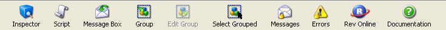
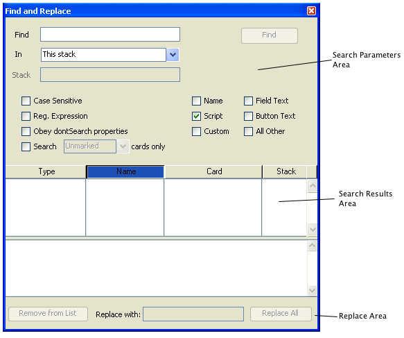

# The LiveCode IDE

## Introduction

This guide details the main components within LiveCodes Integrated
Development Environment (IDE). The development environment contains all
the features you need to quickly create a professional application. The
Application Browser allows you to find your way around your application
as you develop it. The Properties Inspector allows you to set appearance
and basic behaviors. The Script Editor allows you to add code to each
object in your application. In addition to these standard tools, the
Message Box provides a mini command-line that allows you to develop
aspects of your application automatically or to test out your
application’s code and functionality.

## The Menu Bar

### The File Menu

The File menu contains commands to open, close and save files; print;
and incorporate files into your stack.

| Menu Item | Action |
|----------------------------------------|-----------------------------------------------------------------------------------------------------------------------------------------------------------------------------------------------------------------------------------------------------------|
| **New Stack**                          | Opens a cascading menu you can use to choose a stack type to create. When you save the stack, LiveCode asks for a file name and location.                                                                                                                 |
| **Default Size**	 					 | Creates a stack at the default size (400x400)																																																			 |
| **Predefined Size**					 | Creates a stack at the predefined size specified																																																		     |
| **Script only Stack**					 | Creates a stack to be used for script only. You will be prompted for a stack name, and the script editor for the new stack will launch automatically																										 |
| **New Substack of (main stack name)**  | Creates a new untitled stack in the same file as the active main stack. When you save the substack, it is saved in the main stack’s file. This item is disabled if the active window is not a main stack.                                                 |
| **Open Stack...**                      | Opens the main stack whose file you select. If you select a HyperCard file, it is automatically converted into a LiveCode main stack.                                                                                                                     |
| **Open Recent Stack**                  | Opens a cascading menu containing the names of the 30 main stacks you have most recently closed. Choose a name to open the stack. You can change the number of items displayed using Preferences.                                                         |
| **Close**                              | Closes the active window. This item is disabled if no window is open.                                                                                                                                                                                     |
| **Close and Remove from Memory...**    | Closes the current stack and all stacks in the same stack file as the current stack, and removes all stacks in the file from memory. This item is disabled if the active window is not a user stack.                                                      |
| **Import as Control**                  | Opens a cascading menu you can use to choose a file and place its contents in a new control of the appropriate type. This item is disabled if the active window is not a stack.                                                                           |
| **Image File...**                      | Imports the picture file you choose as a new image on the current card. You can import GIF, JPEG, PNG, BMP, XWD, XBM, XPM, or PBM, PGM, or PBM files (and PICT files on Mac OS and OS X systems). For more details see the section on the *image* object. |
| **Audio File...**                      | Imports the sound file you choose as a new audio clip in the current stack. You can import WAV, AIFF, or AU files. For more details, see the section on the *audioClip* object.                                                                           |
| **Video File...**                      | Imports the video file you choose as a new video clip in the current stack. You can import AVI, or MPEG files. For more details, see the section on the *videoClip* object.                                                                    |
| **Text File...**                       | Imports the text file you choose as a new field on the current card.                                                                                                                                                                                      |
| **Snapshot**                           | Displays a crosshairs cursor for you to select an area of the screen, and imports a screen shot of that area as a new image on the current card.                                                                                                          |
| **All Images in Folder...**            | Imports all the picture files in the folder you choose, and places them in new images on the current card. Subfolders, and other types of files, are ignored. For more details see the section on the *image* object.                                     |
| **All Audio Files in Folder...**       | Imports all the sound files in the folder you choose, and places them in new audioClips in the current stack. Subfolders, and other types of files, are ignored. For more details, see the section on the *audioClip* object.                             |
| **All Video Files in Folder...**       | Imports all the video files in the folder you choose, and places them in new videoClips in the current stack. Subfolders, and other types of files, are ignored. For more details, see the section on the *videoClip* object.                             |
| **All Text Files in Folder...**        | Imports all the text files in the folder you choose, and places them in new fields in the current stack. Subfolders, and other types of files, are ignored.																                                 |
| **New Referenced Control**             | Opens a cascading menu you can use to select a file to reference (i.e. link) to a new control of the appropriate type. This item is disabled if the active window is not a stack.                                                                         |
| **Image File...**                      | Creates a new image on the current card and links to the picture file you select in the new image object. For more details see the section on the *image* object.                                                                                         |
| **Video File...**                      | Creates a new player on the current card and links to the video file you select in the new player object. For more details see the section on the *player* object.                                                                                        |
| **All Images in Folder...**            | For each picture file in the folder you select, creates a new image on the current card and links it with one of the files. Subfolders, and other types of files, are ignored. For more details see the section on the *image* object.                    |
| **All Videos in Folder...**            | For each video file in the folder you select, creates a new player on the current card and links it with one of the files. Subfolders, and other types of files, are ignored. For more details see the section on the *player* object.                    |
| **Save**                               | Saves changes to the current stack and to any other stacks that reside in the same stack file. If the file has not yet been saved, you specify the new file’s name and location. This item is disabled if the active window is not a stack.               |
| **Save As...**                         | Saves the current stack, along with any other stacks that reside in the same file, to a new file with a name and location you specify. The new file becomes the current working copy.                                                                     |
| **Move Substack to File...**           | Saves the front most substack as a main stack in a file of its own, with a name and location you specify. The substack is removed from its previous stack file. This item is disabled if the active window is not a substack.                             |
| **Revert to Saved...**                 | Throws away any changes to the current stack, along with any other stacks that reside in the same stack file. The entire stack file is then reloaded.                                                                                                     |
| **Standalone Application Settings...** | Settings for packaging the current stack for distribution as a standalone application. This item is disabled if the active window is not a stack. For more details, see the section on*Deploying your Application*.                                       |
| **Save As Standalone Application...**  | Packages the current stack into a standalone application for distribution using the settings set using the Standalone Application Settings window.                                                                                                        |
| **Page Setup...**                      | Opens the Page Setup dialog box for the currently selected printer.                                                                                                                                                                                       |
| **Print Card...**                      | Prints the current card.                                                                                                                                                                                                                                  |
| **Print Field...**                     | Prints the currently selected field using the revPrintField command. For more details, see the section on *Printing*.                                                                                                                                     |
| **Exit**                               | Closes all open stacks and quits LiveCode.                                                                                                                                                                                                                |

### The Edit Menu

The Edit menu contains commands to select, cut, copy, and paste text and 
objects.

| Menu Item | Action |
|----------------------|---------------------------------------------------------------------------------------------------------------------------------------------------------------------------------------------------------------------------------------------------------------------------------------|
| **Undo**             | Reverses the most recent text change, paint action, movement or deletion of an object.                                                                                                                                                                                                |
| **Cut, Copy, Paste** | Cuts, copies or pastes the selected text or object. Text and images can be exchanged with other programs in this manner. Objects are only available within the currently running instance of LiveCode.                                                                                |
| **Clear**            | Deletes the selected text or objects, without placing it on the clipboard.                                                                                                                                                                                                            |
| **Duplicate**        | Makes a copy of the selected object or objects. If the object is a card, the copy is added after the current card. If the object is a control, the copy is placed on the current card, below and to the right of the original object. This item is disabled if no object is selected. |
| **Select All**              | Selects all the text in the current field or all the controls on the current card.                                                                                                                                                        |
| **Deselect All**            | Deselects any selected objects, or removes the insertion point from a field.                                                                                                                                                              |
| **Invert Selection**        | Selects all the unselected objects and unselects all the selected ones. This item does not work on text selections.                                                                                                                       |
| **Select Grouped Controls** | If this item is checked, clicking a control that's part of a group selects only that control. If unchecked, clicking a control that's part of a group selects the group.                                                                  |
| **Intersected Selections**  | If this item is checked, dragging with the Pointer tool selects each object that intersects the dragged rectangle. If unchecked, dragging with the Pointer tool selects only objects that are entirely enclosed by the dragged rectangle. |
| **Find and Replace...**     | Searches for and optionally replaces text in fields, properties, scripts, global variables, or button contents. For more details, see the section on *Find and Replace*.                                                                  |

### The Tools Menu

The Tools menu contains commands to work with LiveCode's tool palettes 
and to use stack development tools.

| Menu Item | Action |
|----------------------------|---------------------------------------------------------------------------------------------------------------------------------------------------------------------------------------------------------------------------------------------------------------------|
| **Browse Tool**            | Chooses the Browse tool for running a project. Allows you to perform user actions such as running scripts by clicking buttons, or entering text in a field.                                                                                                         |
| **Pointer Tool**           | Chooses the Pointer tool for editing a project. Allows you to select, move, and resize objects.                                                                                                                                                                     |
| **Tools Palette**          | Shows or hides the Tools palette for choosing tools for object creation.                                                                                                                                                                                            |
| **Paint and Draw Tools**   | Shows or hides the paint and draw tools in the Tools palette. 																																																	   |
| **Project Browser**        | Opens the Project Browser window, which lists all open stacks, the cards in each stack, and the controls on each card. For more details, see the section on the *Project Browser*.                                                                                  |
| **Message Box**            | Shows or hides the Message Box. The Message Box is a command line tool that allows you to run scripts or perform automated editing operations. For more details, see the section on *The Message Box*.                                                              |
| **Extension Manager**      | Shows or hides the Extension Manager. The Extension Manager is a stack which shows what widget and library extensions are currently installed.																													   |
| **Extension Builder**      | Shows or hides the Extension Builder. The Extension Builder is a stack which aids in the creation of widget and library extensions to LiveCode. For more information on creating extensions using the Extension Builder, please see the *Extending LiveCode* guide. |
| **Menu Builder**           | Creates or changes the menu bar in the currently active stack. For more details, see the section on the *Working with Menus*.                                                                                                                                       |

### The Object Menu

The Object menu contains commands to change the properties of the 
selected object or objects, to create new objects, and to work with 
groups.

| Menu Item | Action |
|-----------------------------|------------------------------------------------------------------------------------------------------------------------------------------------------------------------------------------------------------------------------------------------------------------------------------------------------------------------------------------------------------------------------------------------------|
| **Object Inspector**        | Opens the Inspector for the currently selected object, allowing you to view and set object properties. If more than one object is selected, changes made to the properties are applied to each of the selected objects. This item is disabled if no object is selected. For more details, see the section on *The Properties Inspector*.                                                             |
| **Card Inspector**          | Opens the Inspector for the current card, allowing you to view and set card properties.                                                                                                                                                                                                                                                                                                              |
| **Stack Inspector**         | Opens the Inspector for the current stack, allowing you to view and set stack properties.                                                                                                                                                                                                                                                                                                            |
| **Object Script**           | Opens the Script Editor for the selected objects. If more than one object is selected, a script editor window opens for each one. For more details, see the section on *The Script Editor*.                                                                                                                                                                                                              |
| **Card Script**             | Opens the Script Editor for the current card.                                                                                                                                                                                                                                                                                                                                                          |
| **Stack Script**            | Opens the Script Editor for the current stack.                                                                                                                                                                                                                                                                                                                                                         |
| **Group Selected**          | Makes the selected objects into a group. This item changes to "Ungroup Selected" if the only selected object is a group. For more details, see the section on *Groups and Backgrounds*.                                                                                                                                                                                                              |
| **Ungroup Selected**        | Makes the selected group into individual objects. This removes the group permanently if you visit another card before grouping the objects again. This item changes to "Group Selected" if more than one object is selected.                                                                                                                                                                         |
| **Edit Group**              | Enters group-editing mode to make changes to the objects in the selected group. This item changes to "Stop Editing Group" while in group-editing mode. This item is disabled if no object is selected, if more than one object is selected, or if the selected object is not a group.                                                                                                                |
| **Stop Editing Group**      | Leaves group-editing mode. This item changes to "Edit Group" if the stack is not already in group-editing mode.                                                                                                                                                                                                                                                                                      |
| **Remove Group**            | Removes the selected group from the current card, without deleting it from the stack.                                                                                                                                                                                                                                                                                                                |
| **Place Group**             | Opens a cascading menu containing the names of groups that are in the stack but not on the current card. Choose a group to add it to the current card. This item is disabled if all the groups in the stack already appear on the current card, or if there are no groups. Note: Only the names of top-level groups are listed; groups that are a part of another group are not listed in this menu. |
| **New Card**                | Creates a new card following the current card. Note: If there are any shared groups on the current card when you choose this menu item, they are automatically placed on the new card. If a group's backgroundBehavior is false, they are not placed automatically on new cards.                                                                                                                     |
| **Delete Card**             | Deletes the current card from the front most stack.                                                                                                                                                                                                                                                                                                                                                  |
| **New Control**             | Opens a cascading menu you can use to create a new control. For more details, see the section on *Control Types*.                                                                                                                                                                                                                                                                                    |
| **New Widget**              | Opens a cascading menu you can use to create a new widget control. For more details, see the section on *Control Types*.                                                                                                                                                                                                                                                                             |
| **Flip**                    | Opens a cascading menu you can use to change the orientation of the selected image or graphic. This item is disabled if any object other than an image or graphic is selected.                                                                                                                                                                                                                       |
| **Horizontal**              | Swaps the left and right edges of the selected image or graphic, flipping it around an imaginary line drawn from top to bottom of the object.                                                                                                                                                                                                                                                        |
| **Vertical**                | Swaps the top and bottom edges of the selected image or graphic, flipping it around an imaginary line drawn from left to right of the object.                                                                                                                                                                                                                                                        |
| **Rotate**                  | Opens a cascading menu you can use to rotate the selected image or graphic.                                                                                                                                                                                                                                                                                                                          |
| **By...**                   | Rotates the selected image or graphic by the number of degrees you specify.                                                                                                                                                                                                                                                                                                                          |
| **90° Right**               | Rotates the selected image or graphic 90 degrees to the right (clockwise).                                                                                                                                                                                                                                                                                                                           |
| **90° Left**                | Rotates the selected image or graphic 90 degrees to the left (counterclockwise).                                                                                                                                                                                                                                                                                                                     |
| **180°**                    | Rotates the selected image or graphic 180 degrees (halfway around).                                                                                                                                                                                                                                                                                                                                  |
| **Reshape Graphic**         | Allows you to interactively reshape currently selected polygon or curve graphics.                                                                                                                                                                                                                                                                                                                    |
| **Align Selected Controls** | Opens a cascading menu you can use to line up objects. This item is disabled if no object or only one object is selected.                                                                                                                                                                                                                                                                            |
| **Left**                    | Moves the selected controls so their left edges are lined up with the left edge of the first control selected.                                                                                                                                                                                                                                                                                       |
| **Right**                   | Moves the selected controls so their right edges are lined up with the right edge of the first control selected.                                                                                                                                                                                                                                                                                     |
| **Top**                     | Moves the selected controls so their top edges are lined up with the top edge of the first control selected.                                                                                                                                                                                                                                                                                         |
| **Bottom**                  | Moves the selected controls so their bottom edges are lined up with the bottom edge of the first control selected.                                                                                                                                                                                                                                                                                   |
| **Make Widths Equal**       | Resizes the selected controls so that the width of each one is equal to the width of the first control selected.                                                                                                                                                                                                                                                                                     |
| **Make Heights Equal**      | Resizes the selected controls so that the height of each one is equal to the height of the first control selected.                                                                                                                                                                                                                                                                                   |
| **Send to Back**            | Moves the selected objects behind all other objects on the card. This item is disabled if no object is selected.                                                                                                                                                                                                                                                                                     |
| **Move Backward**           | Moves the selected objects back one layer.                                                                                                                                                                                                                                                                                                                                                           |
| **Move Forward**            | Moves the selected objects forward one layer.                                                                                                                                                                                                                                                                                                                                                        |
| **Bring to Front**          | Moves the selected objects in front of all other objects on the card.                                                                                                                                                                                                                                                                                                                                |

### The Text Menu

The Text menu contains commands to change the appearance of text.

| Menu Item | Action |
|------------------------|-----------------------------------------------------------------------------------------------------------------------------------------------------------------------------------------------------------------------------------------------------------------------------------------------|
| **Text Style Options** | Applies or removes the selected style from the selected text or the selected object. These items are disabled if nothing is selected.                                                                                                                                                         |
| **Link**               | Makes the selected text, or all text in the selected object into a link. Linked text has special properties in LiveCode, for example linked text will receive a linkClicked message when clicked on. For more details, see the section on the *Field* object.                                 |
| **Subscript**          | Moves the selected text below the baseline and makes it smaller.                                                                                                                                                                                                                              |
| **Superscript**        | Moves the selected text above the baseline and makes it smaller.                                                                                                                                                                                                                              |
| **Font**               | Opens a cascading menu you can use to change the font face used for the selected text or objects.                                                                                                                                                                                             |
| **Use Owner's Font**   | Causes the font face of the object's owner (if an object is selected) or the object the text is in (if text is selected) to be used, removing any font face specific to the selected text or objects. For more information on font inheritance, see the section on the *Message Hierarchy*.   |
| **Size**               | Opens a cascading menu you can use to change the font size used for the selected text or objects.                                                                                                                                                                                             |
| **Use Owner's Size**   | Causes the font size of the object's owner (if an object is selected) or the object the text is in (if text is selected) to be used, removing any font size specific to the selected text or objects. For more information on font inheritance, see the section on the *Message Hierarchy*.   |
| **Color**              | Opens a cascading menu you can use to change the font color used for the selected text or objects. (This item is disabled if nothing is selected.)                                                                                                                                            |
| **Use Owner's Color**  | Causes the font color of the object's owner (if an object is selected) or the object the text is in (if text is selected) to be used, removing any font color specific to the selected text or objects. For more information on font inheritance, see the section on the *Message Hierarchy*. |
| **Pen Color**          | Changes the selected text, or text used in any selected objects, to use the current ‘pen color’ setting (used to draw graphics from the main tool palette).                                                                                                                                   |
| **Align**              | Opens a cascading menu you can use to change the text alignment (justification) used for the text in the selected objects.                                                                                                                                                                    |

### The Development Menu

The Development menu contains commands for debugging and for using 
custom tool stacks.

| Menu Item | Action |
|---------------------------|----------------------------------------------------------------------------------------------------------------------------------------------------------------------------------------------------------------------------------------------------------------------------------------------------------------------------------------------------------------|
| **Plugins**               | Opens a cascading menu you can use to open custom tool stacks stored in the Plugins folder.                                                                                                                                                                                                                                                                    |
| **Plugin Settings**       | Customizes which messages are handled by the custom tool stacks stored in the Plugins folder.                                                                                                                                                                                                                                                                  |
| **Test**                  | Simulates deployment to the selected test target.                                                                                                                                                                                                                                                                                                              |
| **Test Target**           | Opens a cascading menu you can use to select what device or simulator to use when simulating deployment.                                                                                                                                                                                                                                                       |
| **Script Debug Mode**     | If this item is checked, the debugger is enabled: the debugger window appears when a breakpoint is encountered during script execution, and you can enter the debugger when an execution error occurs. If unchecked, the debugger is disabled. For more details, see the section on *Debugging*.                                                               |
| **Clear All Breakpoints** | Removes all breakpoints that you've used the Script Editor to mark, in all open stacks. Note: This menu item does not affect breakpoints set with the *breakpoint* command.                                                                                                                                                                                      |
| **Message Watcher**       | Opens the Message Watcher window, used to view and track messages, function calls, getProp calls, and setProp triggers as they are sent to objects.                                                                                                                                                                                                            |
| **Suppress Errors**       | Prevents display of the error window when LiveCode encounters a script error. |
| **Suppress Messages**     | Prevents system messages (such as openCard and closeCard) from being sent during normal navigation. This option will also cancel any currently *pending* messages. |
| **Suspend Development Tools** | Hides LiveCode's menus, palettes, and other parts of the development environment, so that you can preview how your application will look and behave as a standalone, outside the development environment. |

> **Caution:** Suppressing errors will cause your scripts to fail 
silently instead of giving an error message in the event LiveCode 
encounters an error.

> **Tip:** To also suspend LiveCode libraries, hold down the Shift key 
while choosing the **Suspend Development Tools** menu item.

### The View Menu

The View menu contains commands to move around the current stack and to 
show or hide development tools.

| Menu Item | Action |
|-----------------------------------|----------------------------------------------------------------------------------------------------------------------------------------------------------------------------------------------------------------------------------------------------------------------------------------------------------------------------------------------------------------------|
| **Go First**                      | Goes to the first card in the current stack.                                                                                                                                                                                                                                                                                                                         |
| **Go Prev**                       | Goes back to the previous card in the current stack.                                                                                                                                                                                                                                                                                                                 |
| **Go Next**                       | Goes forward to the next card in the current stack.                                                                                                                                                                                                                                                                                                                  |
| **Go Last**                       | Goes to the last card of the current stack.                                                                                                                                                                                                                                                                                                                          |
| **Go Recent**                     | Goes back to the card you were on before navigating to the current card.                                                                                                                                                                                                                                                                                             |
| **Toolbar Text**                  | Shows or hides the text labels in the Toolbar at the top of the screen. To hide the Toolbar completely, uncheck both this item and "Toolbar Icons".                                                                                                                                                                                                                  |
| **Toolbar Icons**                 | Shows or hides the icons in the Toolbar at the top of the screen.                                                                                                                                                                                                                                                                                                    |
| **Palettes**                      | Shows or hides all open LiveCode palettes.                                                                                                                                                                                                                                                                                                                           |
| **Rulers**                        | Shows or hides a ruler at the left and bottom edges of each open stack.                                                                                                                                                                                                                                                                                              |
| **Grid**                          | If this item is checked, dragging and resizing objects is constrained by a pixel grid. If unchecked, you can drag and resize objects to any location. You can alter the grid spacing in Preferences.                                                                                                                                                                 |
| **Backdrop**                      | Shows or hides a solid or patterned backdrop behind LiveCode's windows.                                                                                                                                                                                                                                                                                              |
| **Show IDE Stacks in Lists**      | If this item is checked, elements of the LiveCode development environment appear in lists: for example, development environment stacks appear in the Application Browser, and LiveCode custom properties appear in the Custom Properties pane of the property inspector. If unchecked, elements of the LiveCode development environment do not appear in such lists. |
| **Show Invisible Objects**        | If this item is checked, objects whose visible property is set to false are shown. If unchecked, objects whose visible property is set to false remain hidden.                                                                                                                                                                                                       |

### The Window menu

The Window menu contains the names of open stack windows.

| Menu Item | Action |
|-------------------------|-----------------------------------------------------------------------------------------------------------------------------------------------------------------------------------|
| **Send Window To Back** | Shuffles the frontmost stack window to the back and brings the second window to the front. (This item is disabled if only one stack is open or the active window is not a stack.) |

### The Help Menu

The Help menu contains commands which allow you to find out more about 
using LiveCode, license your copy of LiveCode, get technical support via 
email, and check the LiveCode site for software updates. For more 
information, see the section on *Using the Documentation*.

| Menu Item | Action |
|-------------------------|----------------------------------------------------------------------------------------------------------------------------------------------------------------------------------------------------------------------------------------------------------------|
| **Dictionary (API)**    | Opens the main LiveCode documentation window, where you can get information about all aspects of developing in LiveCode.                                                                                                                                       |
| **Start Center**        | Opens the Start Center.                                                      																																										           |
| **Sample Stacks**       | Launches revOnline in an external browser                                                     																																								   |
| **Sample Scripts**      | Opens the Resource Center, which contains many sample scripts, including tutorials on text processing and using databases.                                                      																			   |
| **Beginner's Guide**    | Opens the beginner's guide in an external browser                                                                    	                                                      	    																		   |
| **All Guides**          | Opens the main LiveCode documentation window, which contains all of the user guides	                                                         																												   |
| **Tutorials**           | Launches the online LiveCode lessons portal in an external browser                                                      																																	   |
| **User Guide**          | Opens the old user guide in an external PDF viewer                                                   																			                                                         					   |
| **Forums**              | Navigates to the LiveCode discussion forums in an external browser                                                  																			                                                         	   |
| **Technical Questions** | Navigates to questions tagged LiveCode on StackOverflow in an external browser                                                 																			                                                       |
| **Discussion List**     | Navigates to the LiveCode discussion list in an external browser                                                  																			                                                         		   |
| **Newsletters**         | Navigates to LiveCode news letters and blogs in an external browser                                                  																			                                                         	   |
| **Release Notes**       | Opens the release notes in an external PDF viewer                                                   																			                                                         					   |
| **License Agreement**   | Opens the license agreement in an external text editor                                                   																			                                                         				   |
| **User Guide**          | Opens the old user guide as a PDF document                                                   																			                                                         							   |
| **Support…**            | Loads the support section of the LiveCode web site in your web browser.                                                                                                                                                                                        |
| **Buy a license…**      | Loads the LiveCode store in your web browser.                                                                                                                                                                                                                  |
| **Check for Updates…**  | Checks online to see if an update to LiveCode is available.                                                                                                                                                                                                    |
| **Re-license LiveCode** | Deletes your LiveCode licensing information and restarts LiveCode allowing you to enter a new license key.                                                                                                                                                     |

## The Property Inspector

The Property Inspector allows you to view and edit the properties for
any selected object. Properties control how an object looks and some
aspects of an object’s behavior. The Inspector can be accessed by double
clicking on a selected object, from the toolbar, from the *Object* menu
and from context sensitive menus.

Figure 9 - Properties Inspector

| &nbsp;| &nbsp;|
|-------|-------|
| **Lock icon**     		| The lock icon locks the Inspector to the object currently being inspected. Once locked, the Inspector will not update when you change selection or switch to *Run* mode by choosing the *Browse tool*. This allows you to used a locked Inspector to change an object’s properties while interacting with your project. Selecting another object and choosing Inspect will create another Inspector to inspect the new object. You can use this facility to compare the properties of two objects. |
| **Pane Selector** 		| This menu allows you to access each of the different panes within the inspector for a given object.                                                                                                                                                                                                                                                                                                                                                                                                |
| **Action menu** 			| Use the action menu to select another object, edit the script of the current object or send a message to current object.                                                                                                                                                                                                                                                                                                                           												 |
| **Settings menu**  		| Use the settings menu to configure the settings of the property inspector.																																																															 |
| **Property text** 		| Edit the contents of a property by typing into the text area within the Inspector. Press return to set the property and leave the current option selected. Press tab to set the property and move on to the next editable text property.                                                                                                                                                                                                                                                           |
| **Property description** 	| This text describes the object property. By default this text is an English-like description of the property. However you can change this to contain the name of the LiveCode property in the Preferences or the settings menu. You may prefer to view the LiveCode property names if you are writing scripts that set object properties.                                                                                                                                                          |

> **Important:** For documentation on what each individual object
> property does, hover the mouse over the object until you see the
> script property equivalent. Then look that term up in the LiveCode
> Dictionary.

### Property Inspector settings

| &nbsp;| &nbsp;|
|-------|-------|
| **Tab display style**  | Controls whether to use icons or text for the pane selections. |
| **Header/Footer size**  | Controls how large the pane selector icons are. 																																																			 |
| **Property labels**  | Controls whether to use the LiveCode script tokens for property labels or not. |

## The Script Editor

The Script Editor within LiveCode has been designed specifically for
LiveCode coding. It includes features to help make code more
understandable. These include code indentation and color coded syntax
highlighting, as well as other integrated tools such as a Debugger and
syntax Dictionary. You can access the Script Editor for an object by
selecting the object then choosing Script from the Tool bar. The Script
Editor is also available from the Object menu, and from a number of
other context sensitive menus detailed elsewhere in this guide. Each of
the Script Editor's components are outlined below.

### Main Script Area

Display and edit scripts in this area. For more details on how to write
a script, see the section on Coding in LiveCode. The Script Editor will
colorize and format scripts automatically. When typing press tab to
manually format the script. Press Enter (on the numeric keypad) to
compile the script. Press Enter again to close the Script Editor.

> **Note:** It is not necessary to close the Script Editor to run a
> script, all that is required is that the script is applied using the
> Apply button.

### Breakpoints Area

Click next to a line of script to set or remove a breakpoint. A
breakpoint specifies a point at which script execution should pause and
the debugger be loaded. For more details, see the section on Debugging.

### Apply Button

Compiles the script instantly. Any syntax errors will appear in the
Error Display and the script will not compile. A compiled script is not
saved until the stack that contains it is saved.

Press *Enter* (on the numeric keypad) to activate the Compile button.
Press *Enter* again to close the Script Editor.

Note that *none* of the message handlers within the script will be
available if there is a Script Error during compilation, as none of the
script will have compiled.

### Errors Pane

Compile and execution errors will appear here. Double click the icon
next to the error details to highlight the line the error occurred on in
the script (if applicable).

### Handler List

The handler list displays all the functions, commands and handlers which
are part of the current script. When a handler name is clicked, the
script will jump to that handler.

The currently displayed list of handlers can be filtered by typing in 
the filter box below it.

### Documentation Pane

The Script Editor also has a built-in syntax dictionary. When this tab 
is active a summary of the dictionary entry for the keyword which you 
are currently typing will be displayed. The full dictionary entry can be
viewed by clicking Launch Documentation. Alternatively you can choose to
view the entire entry in place by toggling the Full Document check box
at the bottom of the documentation pane.

### Search Results Pane

When you perform a 'find all' operation the results will be displayed 
under this tab.

### Script Tabs

When multiple scripts are open they will appear as tabs in the Script
Editor. Right clicking on the tabs brings up a menu which allows a tab
to be moved to a new window, closed, or kept while closing all other
tabs. Clicking a tab will bring up the script it represents.

## The Debugger

The Debugger helps you track bugs and understand code, by allowing you
to pause the execution of your programs or step through them line by
line. You cause execution to pause by setting breakpoints. When you run
your script, execution will pause at a breakpoint and you will be able
to observe or edit variable values, continue execution or set another
breakpoint later in the code. Each debugger feature is outlined below:

### Continue

When in debug mode, the Continue button will start running the code from
the current position. The program will run until the end is reached or
another breakpoint is found.

When you are not in debug mode, the continue button can be used to
execute a handler. When you press it, a dialog will appear asking which
handler you would like to call and, if applicable, which parameters
you'd like to pass. On clicking OK the Script Editor will call the handler
you specified. It will also remember the handler for next time. To
change the handler called later, choose Entry Point… from the Debug menu.

### Stop Debugging

Will halt execution at the current point and stop debugging. You will
then be able to edit the script.

### Show Next Statement

The Show Next statement option will return the debugger to the currently
executing statement. This is useful if you have switched tabs or
scrolled during debugging.

### Step Into Next Statement

Use Step Into to execute the next statement. If the next statement is a
command or function ‘Step Into’ will jump to that function or command
allowing you to execute it line by line.

### Step Over Next Statement

Use Step Over to execute a command or function call without stepping
through it line by line. The code within the handler will run at full
speed and execution will pause on the line after the handler call.

### Step Out

The Step Out function allows you to exit a command or function that you
have previously ‘stepped into’. When selected, the rest of the current
handler will run and execution will pause on the line after the handler
call. This is useful to avoid stepping through a long command or
function line by line when you have identified that the error you are
looking for is not within that command or function.

### Debug Context

The Debug Context shows you the path of execution up to the current
statement you are paused on in the debugger. This allows you to identify
where you are in your program and which handlers called the current
handler you are in. Changing the debug context allows you to view
variables from different parts of the program. Use this feature to find
an erroneous command call or a call where wrong parameters were used.

### Variable Watcher

The Variable Watcher tab allows you to examine the value of variables
within your program while it is executing. As you step through your code
these values will be updated. The variable name is shown in the left
column and its value adjacent on the right. If a variable's value is too
large to be displayed in the pane it will have a magnifying glass next
to it. Clicking this will bring up a watch window which allows the
variable's value to be changed. Variables can also be edited by double
clicking on their value in the variable watcher.

> **Tip:** You can see the value of a variable by moving the mouse over
> the variables’ name in the script field while debugging.

### Breakpoint Management

Use breakpoints to specify where to pause execution in the debugger. You
set breakpoints by clicking in the gutter, or by right clicking in the
Breakpoint Manager at the bottom of the Script Editor and selecting “New
Breakpoint”. Each breakpoint is associated with a line of code and
execution is paused when that line is reached. Alternatively, a
condition can be assigned to the breakpoint. In this case, execution
will only pause if the condition is true when the line is reached.

> **Tip:** To see a list of all the breakpoints within a stack,
> including the script they are in, which line they are on, and whether
> there is a condition attached, click the Breakpoints Manager at the
> bottom of the Script Editor. The check box to the left of each
> breakpoint can be used to enable or disable the breakpoint. Double
> click a breakpoint to go to that line in the associated object's
> script. To edit a breakpoint, including adding a condition or changing
> the line number, click the pencil icon. This can also be done by
> right-clicking on the breakpoint, either in the Breakpoints Manager,
> or the Script Editor's gutter.

The Breakpoint Manager also allows you to set watches. These are
associated with variables rather than lines of code and will pause
execution when the value of the variable you are watching changes.
Alternatively, if the watch has a condition attached, execution will
only pause if, when the variable's value is changed, the condition is
true. To add a watch, right click in the Breakpoint Manager and choose
“New Breakpoint”.

## The Script Editor Menubar

The Script Editor menubar contains commands to help you edit scripts.

### The File Menu

The File menu contains commands to print a script or close the Script
Editor, with or without saving changes to the script.

| &nbsp;| &nbsp;|
|-------------|------------------------------------------------------------------|
| **Compile** | Compiles the current script.                                     |
| **Save**    | Saves the current stack.                                         |
| **Close**   | Closes the current script.                                       |
| **Print**   | Prints the current script.                                       |
| **Quit**    | Exits LiveCode. Will prompt you to save your work if applicable. |

### The Edit Menu

In addition to the standard commands to select, cut, copy and paste
text, the Edit menu contains the following, script-specific commands:

| &nbsp;| &nbsp;|
|-----------------------|--------------------------------------------------------------------------------------------------------------------------------------------------------------------------------------------------------------------------------------------------------------------------------------------------------------------------|
| **Revert**            | Takes any changes which haven't been compiled, and removes them from the current script.                                                                                                                                                                                                                                 |
| **Comment**           | Places a comment character at the beginning of the selected text. If more than one line is selected a comment character is placed at the beginning of each line.                                                                                                                                                         |
| **Uncomment**         | Removes comment characters from the selected text.                                                                                                                                                                                                                                                                       |
| **Quick Find**        | Opens the “find” field within the Script Editor.                                                                                                                                                                                                                                                                         |
| **Find and Replace…** | Brings up the Script Editor's find and replace dialog.                                                                                                                                                                                                                                                                   |
| **Go**                | Brings up a dialog box which lets you enter a line number to jump to in the script.                                                                                                                                                                                                                                      |
| **Variable Checking** | Variable checking causes LiveCode to perform a stricter check of your scripts. Using any variable without declaring it first, or using a literal string without encloning it in quotes causes a compile error. This behavior can be useful in tracking down certain subtle problems such as misspelling a variable name. |

### The Debug Menu

The Debug menu contains commands to aid in debugging scripts:

| &nbsp;| &nbsp;|
|---------------|-----------------------------------------------------------------------------------------------------------------------------------|
| **Show Next** | Highlights the next line of code to be executed. This is useful if you have changed tab or scrolled your script during debbuging. |

| &nbsp;| &nbsp;|
|---------------|--|
| **Step Into** | Executes the next line of the handler being debugged. If the next line is a call to another handler, this command steps into that handler. This menu item is disabled if the debugger is not running. |

> **Tip:** Press F11 to step into the next line.

| &nbsp;| &nbsp;|
|---------------|---------------------------------------------------------------------------------------------------------------------------------------------------------------------------------------------|
| **Step Over** | Executes the next line of the handler being debugged. If the next line is a call to another handler, this command steps over that call, skipping it and staying within the current handler. |

> **Tip:** Press F10 to step over the next line.

| &nbsp;| &nbsp;|
|---------|----------------------------------------------------------------------------------------|
| **Run** | Resumes normally executing the handler being debugged, starting from the current line. |

> **Tip:** Press F5 to activate the Run button.

| &nbsp;| &nbsp;|
|-----------|-------|
| **Abort** | Stops running the handler being debugged. |

> **Tip:** Press control-period (or command-period) to activate the
> Abort button.

| &nbsp;| &nbsp;|
|-----------------------|-----------------------------------------------------------------------------------------------------------------------------------------------------------------------------------------------------------------------------------------------------------------------------------------------------------|
| **Toggle Breakpoint** | Adds/removes a breakpoint from/to the currently selected line.                                                                                                                                                                                                                                            |
| **Variables**         | Changes the tab view at the bottom of the Script Editor to the Variable Watcher tab.                                                                                                                                                                                                                        |
| **Breakpoints**       | Changes the tab view at the bottom of the Script Editor to the Breakpoint Manager.                                                                                                                                                                                                                          |
| **Entry Point**       | Lets you define which handler execution should begin at when debugging a script.                                                                                                                                                                                                                          |
| **Script Debug Mode** | If this item is checked, the debugger is enabled: the execution of the program will pause when a breakpoint is encountered during script execution, and you can enter the debugger when an execution error occurs. If unchecked the debugger is disabled. For more details, see the section on Debugging. |

### The Handler Menu

The Handler menu contains a list of all handlers in the current script.
Choose a handler to go to that handler in the script.

### The Window Menu

The Window menu contains the names of open script editor windows.

### Autocomplete

> **Note:** Autocomplete is available in LiveCode CommunityPlus and above

#### Using Autocomplete

While typing in the script editor a filtered list of available completions
will appear below the selection. Use the following keys to navigate the
completion list:

- right arrow - apply the completion or enter group of completions
- left arrow - leave group of completions
- up arrow - move up the list
- down arrow - move down the list

Moving the mouse will hide the completion list to avoid it remaining in
place over an area you would like to select. Completions include
placeholder fields which you can navigate with the tab key. Some
completions may have multiple placeholders with the same name which
will be edited together. Clicking within a placeholder will select it.

#### Autocomplete Pro

> **Note:** Autocomplete Pro is available in LiveCode Indy and above

Autocomplete Pro provides the following additional features:

- Completions generated dynamically by introspecting
the object being edited and its message path
- An Autocomplete Snippet Manager dialog is accessible from the script
editor menubar to manage a custom set of completions.

#### Autocomplete Snippet Manager

An autocomplete snippet provides the information required to match and
complete some code in the script editor. The Autocomplete Snippet Manager
allows the user to manage a custom set of completion snippets.

Create a new completion snippet by clicking the **+** icon and delete the
currently selected snippet by clicking the **-** icon.

The dialog allows entry of the following:

**Display Name** - choose a completion snippet to edit or change the
display name of the current snippet.

**Priority** - A value between 1 and 100 indicating the order the
completions should be matched in. Higher priorities will be listed
before lower priorities.

**Match Scope** - Choose whether the completion should try and match when
the selection is outside a handler, inside a handler or anywhere. A
comment completion might be anywhere, a statement completion (unless
local, global or constant) would be only inside a handler and a handler
completion would be outside a handler.

**Match Words** - Choose whether to match only all the words of a line,
just the word being written or either. A statement would be all the words
on a line, an expression would be just the current word and a comment
would be either.

**Alternate Match String** - When matching completion snippets the text
of the completion is matched first but in some cases that is not suitable
or another string would be better to match. Enter a string to try matching
if the completion fails to match.

**Summary** - This field is optional and provides some detail below the
completion in the script editor.

**Completion** - This is the string to be used when replacing the
selection after choosing a completion. The completion may be any script
and any length. Add placeholders to the completion in the following form:

    ${<name>:<type>}

Where:

- name - is the text seen in the script editor
- type - is used to filter the completions presented for the placeholder
one of:

  - statement - any LiveCode command
  - expression - any LiveCode expression
  - identifier - a variable or handler name

Additionally, it is possible to include multiple placeholders with the
same name. When a multiple placeholder is selected they are edited
at the same time. In this example completion as the user enters the
condition a comment is appended to the `end if` with the condition text.
Once the condition is complete the user may tab to the `-- code` line
and enter a statement. The tab order is always top to bottom and left to
right:

    if ${condition:expression} then
        ${-- code:statement}
    end if # ${condition}

## The Message Box

The Message Box is a command line tool that allows you to run scripts or
perform automated editing operations. It allows you to try out short
scripts, test parts of your program, provides a convenient output window
for debugging and can be used for editing and setting properties.

> **Tip:** The Message Box is one of the more useful components in
> LiveCode when you are starting out and wanting to try out simple
> scripts. You will find you can try out many of the script examples in
> this User's Guide or in the getting started materials on our website
> simply by copy-pasting them into the Message Box.

The message box has the following modes:

**Single Line** – execute single line and short scripts

**Multiple Lines** – execute multiple line scripts

**Global Properties** – view and edit global properties

**Global Variables** – view and edit global variables

**Pending Messages** – view, cancel and edit pending messages

**Front Scripts** – view and edit frontScripts

**Back Scripts** – view and edit backScripts

Figure 10 – The Message Box in Single Line Mode

| &nbsp;| &nbsp;|
|--------------------|-------------------------------------------------------------------------------------------------------------------------------------------------------------------------------------------------------------------------------------------------------------------------------------------------------------------------------------------------------------------------------------------------------------------------------------------------------|
| **Command area**   | Type valid LiveCode code into this area. In *Single Line* mode, separate multiple lines with **;** (semi-colon) and press *Return* to execute. In *Multiple Line* mode, press return to separate lines, and press *Enter* to execute.  For example, in Single Line mode, to move all controls on the current card 10 pixels to the left you would run:                                                                                                                                                                                                                                                                                                                                        `repeat with i = 1 to the number of controls`;` move control i relative –10,0`;`end repeat`  In Multiple Line Mode:`repeat with i = 1 to the number of controls`  `move control i relative –10,0`                                                                                                                                                                                                                                                                                                                                                                                                                          `end repeat`  Type **control-m** to focus the command area and start typing, whenever the Message Box does not have the focus. Press **control-u** when typing to clear the command area.  In *Single Line* mode press the **Up Arrow** key to cycle backwards through the history of previously entered and executed scripts. Press the **Down Arrow** key to cycle forwards. In *Multiple Line* mode, press **alt-up arrow** or **alt-down arrow** to cycle forwards or backwards, respectively. Press **control-u** to clear the current command area.  Typing the name of a global variable or property on its own will result in the line being auto-completed to include **put** in front of the global variable or property, thus the contents of that global will be placed into the results area. For example typing:  `time`  Will be auto completed to:                                                                                                                                                                                                                                                                                                                                                                                                                               `put the time`  The current time will be placed in the results area.                                                                                                                                                                                                                                                                                                                                                                                                   |
| **Results area**   | Displays:  The *result* function after running code in the *command area*.                                                                                                                                                                                                                                                                                                                                                                                          Any script that uses the **put** command without a destination container.  Any script compile error created as a result of attempting to run code placed in the command area.  Any execution error created as a result of attempting to run code placed in the command area.  The **msg** special global will be updated whenever anything is placed in the results area, either by script or by directly editing the content of the results area. You can set or retrieve the content of this variable in any script. For example, try running the following in the command area:  `put the clipBoardData; replace return with return & return in msg`  The result placed into the results area will contain the current contents of the clipboard, with every return character replaced with a second return character.                                                                                                                                                                                                                                                                                       |
| **Stack selector** | Select a stack to work on. Prior to executing any script the *defaultStack* will be set to the stack displayed in this menu. By default the Message Box will choose the front most editable stack. The menu is updated whenever you change the front most stack or click on the Message Box. You can use this menu to choose an alternative open stack. For example, running the following script in the command area of the single line message box:  `put the number of controls`  Would place the number of controls in the current card of the *stack displayed in the menu*, into the results area.                                                                                                                                                                                                                                                                                                                                    |
| **Lock icon**      | This option prevents the Stack selector from updating automatically when you change stacks. Use this option if you want to run a number of commands on a specific stack regardless of which stack is currently in front.                                                                                                                                                                                                                              |
| **Settings menu**  | Use the settings menu to configure the settings of the message box. 																																																			 |
| **Target action**  | Click the target icon to navigate to the last line of script that executed a **put** command with the message box as its target.                                                                                                                                                                                                                            |

### Message Box settings

| &nbsp;| &nbsp;|
|--------------------|--------|
| **Tab display style**  | Controls whether to use icons or text for the mode selections. |
| **Header/Footer size**  | Controls how large the mode selector icons and footer action icons are. 																																																			 |
| **Auto update pending messages**  | Toggles whether the pending messages as displayed in message box in pending messages mode are updated automatically or manually. 																																																			 |
| **Select intelligence object**  | The Message Box will attempt to auto complete the typing of a name of an object property, resulting in putting the contents of that property into the results area. You can choose whether the auto-complete should attempt to use the currently selected object, or the object directly underneath the mouse. For example, with an object selected, entering:  `width`  Will result in:  `put the width of the selObj`  The width of the currently selected object will be placed in the results area. The `selObj`will be substituted with the `mouseControl`if you choose this option. In the example above, that would result in the width of the object underneath the mouse being placed in the results area instead. For more details on the `selObj`function or the `mouseControl`functions, see the LiveCode Dictionary.                                                   |

### Single and Multiple Line Modes

Use the Single and Multi-Line modes to execute short scripts.

### Global Properties

The Global Properties mode allows you to view and edit all global
properties. Scroll to select a property from the list on the left and
select it to view or edit it. Typing a portion of the property name into
the Filter field at the top will filter the list of properties. Changes
to global properties take effect immediately. If a property is ‘read
only’ this will be indicated when you select it and editing it will have
no effect. For more details on Global Properties, see the section on
*Global Properties.*

### Global Variables

The Global Variables mode allows you to view and edit all global
variables. Environment variables are shown first, followed by other
variables. Scroll to find a variable from the list on the left and
select it to view or edit it. Typing a portion of the variable name into
the Filter field at the top will filter the list of variables. Changes
to global properties take effect immediately. The Show LiveCode UI
Variables is an advanced option, discussed in the section on Editing the
LiveCode User Interface. For more details on Global Variables, see the
section on *Global Variables*.

### Pending Messages

The Pending Messages mode allows you to view all the current timer based
messages that are pending. This is the same as the global property the
**pendingMessages**. You can select a pending message to edit its script
or cancel it.

> **Tip:** You can cancel all current pending messages using the
> **Suppress Messages** button on the toolbar.

Pressing update refreshes the list with the current list of pending
messages. The Auto Update mode refreshes the list continuously. Note
that the Auto Update takes place every 200 milliseconds. If your
messages fire more quickly they may not be displayed. For more details
on Pending Messages, see the section on *Timer Based Messaging*. The
Show LiveCode UI Messages is an advanced option, discussed in the
section on *Editing the LiveCode User Interface*.

### Front Scripts & Back Scripts

These modes list all the scripts currently available as libraries at the
front or back of the message path. This is the same as the global
properties the **frontScripts** and the **backScripts**. Select a front
or back script to remove it or edit its script. For more details on
library scripts, see the section on *Extending the Message Path*. The
Show LiveCode UI Scripts is an advanced option that displays all of the
libraries used by the LiveCode IDE. This is discussed in the section on
*Editing the LiveCode User Interface*.

### Stacks In Use

This mode is the same as the Front and Back scripts mode, except that it
displays the **stacksInUse** global property. You can also add a stack
directly using the Add button.

## The Toolbar

The main toolbar provides easy access to commonly used functions.

Figure 11 – The Main Toolbar

For details on what each toolbar icon does, see the section on the Menu
Bar (above).

To hide and show the text or icons on the tool bar, use 
**View -\> Toolbar Text** and **View -\> Toolbar Icons**. To hide the 
Toolbar completely, uncheck both options.

## Find and Replace

The Find and Replace dialog allows you to search your entire
application, a portion of the application, multiple files in a
directory, or stacks specified in your application’s **stackFiles**
property. You can search for object names, scripts, field & button text,
custom properties, and other properties. After performing a search you
can replace the search term with a replacement term, either in all of
the results or on a selection of the results.

Figure 12 – Find and Replace

| &nbsp;| &nbsp;|
|--------------------|--------------------------------------------------------------------------------------------------------------------------------------------------------------------------------------------------------------|
| **Find field**     | Enter a search term.                                                                                                                                                                                         |
| **Search In menu** | A menu with the following options:  **The current selection** – Searches the currently selected objects  **This card** – Searches the current card of the front most editable stack  **This stack** – Searches the front-most editable stack  **This stack File** – Searches the mainStack and all of the subStacks within the stack file associated with the current front most editable stack  **This stack file and its stack files** – Includes the stacks referenced in this stacks stackFiles property. For more details on the stackFiles property, see the section on *Structuring Your Application*.   > **Important:** StackFiles are normally set on the mainStack of your application. Ensure that you bring the mainStack to the front before searching its stackFiles. If you search using this option when a subStack is in front, your search will not include any stackFiles.  **All open stacks** – Searches all open stack files that are currently on screen  **All open stack files** – Searches all open stacks, including all mainStacks and subStacks in each file  **Specific open stack file** – Allows you to select a specific open stack file to search  **All stack files in a folder** – Searches all the stacks in a folder you specify  **Global variable contents** – Searches the contents of currently declared global variables |
| **Find button**    | Performs the search |
| **Case Sensitive** | Specifies that the search should be case sensitive (e.g. "a" and "A" are treated as different characters) |
| **Regular Expression**                   | Specifies that the Find Field contains a regular expression instead of plain text. A regular expression allows you to describe a pattern of text to match. For more details on using regular expressions, see the section on *Using Regular Expressions* below. |
| **Obey dontSearch properties**           | Specifies that fields, cards or groups with their dontSearch property set to true should be excluded from the search. For more details on the *dontSearch* property, see the LiveCode Dictionary.                                                               |
| **Search marked or unmarked cards only** | Specified that the search should be restricted to either marked or unmarked cards. For more details on marked and unmarked cards, see *mark* in the LiveCode Dictionary.                                                                                        |
| **Search in…**                           | Allows you to specific which object properties to search:                                                                                                                                                                                                       |
| **Name**                                 | Searches an object’s *short name* property.                                                                                                                                                                                                                     |
| **Script**                               | Searches an object’s *script* property.                                                                                                                                                                                                                         |
| **Custom**                               | Searches and objects custom properties and custom property sets. For more details on Custom properties, see the section on *Custom Properties*.                                                                                                                 |
| **Field Text**                           | Searches within field text.                                                                                                                                                                                                                                     |
| **Button Text**                          | Searches button text. This includes text in menus. For more information on buttons and menus, see the section on *Control Types*.                                                                                                                               |
| **All Other**                            | Searches all other commonly used object properties. For more details on exactly what is included, see the *properties* entry in the LiveCode Dictionary.                                                                                                        |
| **Results column header**                | Allows you to sort search results by clicking. Drag between the column headers to change column widths.                                                                                                                                                         |
| **Search Results Area**                  | Displays a list of objects that match the search parameters.                                                                                                                                                                                                    |
| **Remove from List**                     | Removes the currently selected search result in the Search Results area from the list. Once removed, the object will no longer be included in any replace operation.                                                                                            |
| **Replace With**                         | Specifies a term to use to replace the search term with.                                                                                                                                                                                                        |
| **Replace in All**                       | Replaces the Find Field with the Replace With field in all objects currently listed in the Search Results Area.                                                                                                                                                 |

## Keyboard Shortcuts

| **The Development Environment**  | **Windows / Linux** | **Mac OS X**|
|------|--------|-------|
| Choose run (browse) tool                       | Control-9                               | Command-9                               |
| Choose edit (pointer) tool                     | Conttrol-0                              | Command-0                               |
| Toogle between run and edit tools              | Control-alt-tab                         | Command-option-tab                      |
| Hide or show palettes                          | Control-tab                             | Command-control-tab                     |
| Display context menus when running             | Control-shift-right click               | Command-control-shift-click             |
| Save all open stacks                           | Control-alt-s                           | Command-option-s                        |
| Apply default button in Save dialog            | Return                                  | Return                                  |
| Apply non-default button in save dialog        | Control-1st letter of button | Command-1st letter of button |

| **Navigation** | **Windows / Linux** | **Mac OS X**|
|------|--------|-------|
| Go to the first card                           | Control-1                               | Command-1                               |
| Go to the previous card                        | Control-2                               | Command-2                               |
| Go to the next card                            | Control-3                               | Command-3                               |
| Go to the last card                            | Control-4                               | Command-4                               |
| Go to the recent card                          | Control-5                               | Command-5                               |
| Go to the top or bottom of a field             | Control-up/down arrow                   | Command-up/down arrow                   |

| **Objects**  | **Windows / Linux** | **Mac OS X**|
|------|--------|-------|
| Select all                                     | Control-a                               | Command-a                               |
| Duplicate                                      | Control-d                               | Command-d                               |
| Create card                                    | Control-n                               | Command-n                               |
| Nudge control                                  | Arrow keys                              | Arrow keys                              |
| Nudge control by 10 pixels                     | Shift-arrow-keys                        | Shift-arrow-keys                        |
| Open object inspector for selection            | Return                                  | Return                                  |
| Open stack inspector                           | Control-K                               | Command-K                               |
| Remove styles from selected text               | Control-;                               | Command-;                               |
| Equalize heights of selected controls          | Control-shift-=                         | Command-shift-=                         |
| Equalize width of selected controls            | Control-=                               | Command-=                               |
| Magnify image with paint tool                  | Control-right-click                     | Command-click                           |
| Apply transparency with paint tool             | Control-click                           | Control-click                           |
| Constrain paint tool selection to a square     | Shift                                   | Shift                                   |
| Constrain object aspect ratio                  | Shift                                   | Shift                                   |

| **The Code Editor**  | **Windows / Linux** | **Mac OS X**|
|------|--------|-------|
| Edit script of selected object                 | Control-e                               | Command-e                               |
| Edit card script                               | Control-shift-c                         | Command-shift-c                         |
| Edit stack script                              | Control-shift-s                         | Command-shift-s                         |
| Edit script of object under mouse              | Control-alt-click                       | Command-option-click                    |
| Apply changes                                  | Enter                                   | Enter                                   |
| Apply changes and close                        | Enter twice                             | Enter twice                             |
| Apply changes and save stack                   | Control-s                               | Command-s                               |
| Comment out selected lines                     | Control-hyphen                          | Command-hyphen                          |
| Remove comments                                | Control-shift-hyphen                    | Command-shift-hyphen                    |
| Switch to find mode                            | Control-f                               | Command-f                               |
| Find next                                      | Control-g                               | Command-g                               |
| Find selected text                             | Control-Option-f                        | Command-Option-f                        |
| Format handler or move to next placeholder     | Tab                                     | Tab                                     |
| Next tab in Editor                             | Control-tab                             | Control-tab                             |
| Previous tab in Editor                         | Control-shift-tab                       | Control-shift-tab                       |
| Show completions palette                       | F1                                      | F1                                      |

| **The Message Box** |  **Windows / Linux** | **Mac OS X**|
|------|--------|-------|
| Open/close message box                         | Control-m                               | Command-m                               |
| Switch to first tab in message box             | Control-m                               | Command-m                               |
| Clear message field                            | Control-u                               | Command-u                               |
| Scroll through recent messages (single line)   | Up/down arrow                           | Up/down arrow                           |
| Scroll through recent messages (multiple line) | Alt-up/down arrow                       | Option-up/down arrow                    |
| Execute message (single line)                  | Return                                  | Return                                  |
| Execute message (multiple line)                | Enter Control-Return                 | Enter Control-Return                 |

| **The Debugger** |  **Windows / Linux** | **Mac OS X**|
|------|--------|-------|
| Step Into                                      | F11                                     | F11                                     |
| Step Over                                      | F10                                     | F10                                     |
| Step Out                                       | Shift-F11                               | Shift-F11                               |
| Run                                            | F5                                      | F5                                      |
| Stop                                           | Shift-F5                                | Shift-F5                                |
| Abort                                          | Control-.                               | Command-.                               |

| **The Project Browser** |  **Windows / Linux** | **Mac OS X**|
|------|--------|-------|
| Scroll through objects                         | Up/down arrow                           | Up/down arrow                           |
| Expand/contract child objects                  | Right/left arrow                        | Right/left arrow                        |
| Open object                                    | Return                                  | Return                                  |
| Edit script of object                          | Shift-Return                            | Shift+Return                            |
| Edit behavior script of object                 | Shift-Alt-Return                        | Shift-Alt-Return                        |
| Inspect object                                 | Control-Return                          | Command-Return                          |
